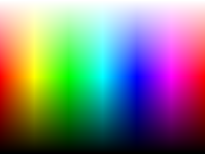
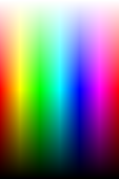
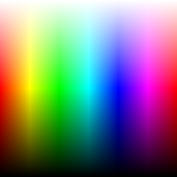

## Heading 2

### Heading 3

#### Heading 4

##### Heading 5

###### Heading 6

## Text Formatting

This is a regular paragraph with **bold text**, _italic text_, ~~strikethrough~~, and `inline code`.

This is another paragraph. It has a [link to example](https://example.com) and an **[bold link](https://example.com)**.

## Lists

### Unordered List

- Item 1
- Item 2
  - Nested item 2-1
  - Nested item 2-2
    - Deep nested item
- Item 3

### Ordered List

1. First item
2. Second item
   1. Nested first
   2. Nested second
3. Third item

### Task List

- [x] Completed task
- [ ] Incomplete task
- [ ] Another incomplete task

## Blockquote

> This is a blockquote.
>
> It can span multiple paragraphs.

> Nested blockquote:
>
> > This is nested inside.

## Code Blocks

```typescript
interface User {
  id: number;
  name: string;
  email: string;
}

function greet(user: User): string {
  return `Hello, ${user.name}!`;
}
```

```python
def fibonacci(n: int) -> list[int]:
    if n <= 0:
        return []
    fib = [0, 1]
    for i in range(2, n):
        fib.append(fib[i - 1] + fib[i - 2])
    return fib[:n]

print(fibonacci(10))
```

```rust
fn main() {
    let numbers: Vec<i32> = (1..=10).collect();
    let sum: i32 = numbers.iter().sum();
    println!("Sum: {}", sum);
}
```

```bash
#!/bin/bash
for file in *.md; do
  echo "Processing: $file"
  wc -w "$file"
done
```

and a code block without language:

```
.container {
  display: grid;
  grid-template-columns: repeat(auto-fit, minmax(200px, 1fr));
  gap: 1rem;
}
```

## Table

| Language   | Typing  | Year |
| ---------- | ------- | ---- |
| TypeScript | Static  | 2012 |
| Python     | Dynamic | 1991 |
| Rust       | Static  | 2015 |
| Go         | Static  | 2009 |

## Horizontal Rule

---

## Image








## Footnotes

This sentence has a footnote[^1].

Another footnote reference[^2].

[^1]: This is the first footnote content.

[^2]: This is the second footnote content.
