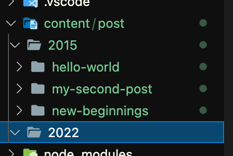

<span style="font-size: 200%; color: red;">ここのやり方は悪いやり方です。</span>

<span style="font-size: 200%; color: red;">より良い方法は[8.tag 個別ページ作成](../gatsby-site-create-log8/)の前半で行ってます。</span>

> このサイトを作るまでの記録。(時系列順)  
> 実際に作業を行なったメモに追記、編集して投稿してるので投稿日と作業日は一致しない。
>
> スターターを `gatsby new` したのは 2022 年の 3 月上旬。
> `gatsby` のバージョンは 4.9
>
> [一覧はここ](../gatsby-site-create-log0/)

## ブログ記事を `/blog` 下の URL に変更

`gatsby-node.js` を編集。

```jsx
exports.createPages = async ({ graphql, actions, reporter }) => {
  ...
    posts.forEach((post, index) => {
      const previousPostId = index === 0 ? null : posts[index - 1].id
      const nextPostId = index === posts.length - 1 ? null : posts[index + 1].id

      createPage({
        path: `/blog${post.fields.slug}`,
        component: blogPost,
        context: {
          id: post.id,
          previousPostId,
          nextPostId,
        },
      })
    })
  ...
}
```

これでブログ記事は/blog 下になったんだけど、index.js からのリンクが変わってないから index のページからリンクで飛べない。  
`pages/index.js` を編集してリンクも /blog/... に変える。

```jsx
...
const BlogIndex = ({ data, location }) => {
...
  return (
     ...
                <header>
                  <h2>
                    // ↓ここ
                    <Link to={`/blog${post.fields.slug}`} itemProp="url">
                      <span itemProp="headline">{title}</span>
                    </Link>
                  </h2>
                  <small>{post.frontmatter.date}</small>
                </header>

...
```

個別ページにおいても前後の記事に移動できないので `templates/blog-post.js` を編集。

```jsx
...
  return (
    ...
          <li>
            {previous && (
             // ↓ここ
              <Link to={`/blog${previous.fields.slug}`} rel="prev">
                ← {previous.frontmatter.title}
              </Link>
            )}
          </li>
          <li>
            {next && (
              // ↓ここ
              <Link to={`/blog${next.fields.slug}`} rel="next">
                {next.frontmatter.title} →
              </Link>
            )}
          </li>
...
```

## `content/post/YYYY` にブログ記事データを置きたい

`content/blog` を `content/post` に変更。  
初期で入ってるサンプルデータは 2015 だったので `content/post/2015` に入れとく。  
ついでに `content/post/2021` も作っておく。



こうすると URL も /blog/YYYY 下になる。

ブログのファイルのパスが変わったので `gatsby-config.js` も変更しておく。

```jsx
plugins: [
...
    {
      resolve: `gatsby-source-filesystem`,
      options: {
        path: `${__dirname}/content/post`, // <- 変更
        name: `blog`,
      },
    },
...
```

YYYY を消したければ index.js と gatsby-node.js をいじればいいいのかな?わからん。
