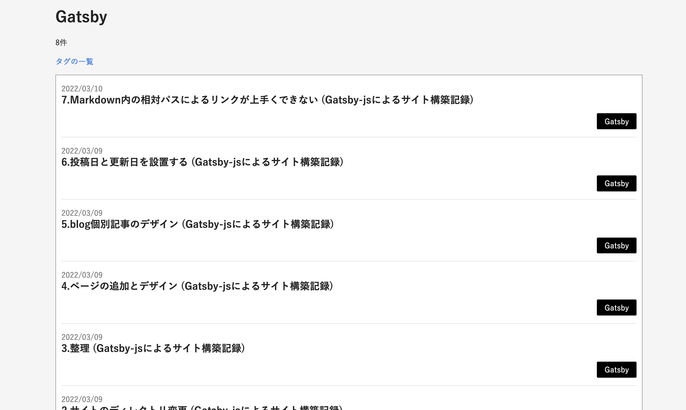
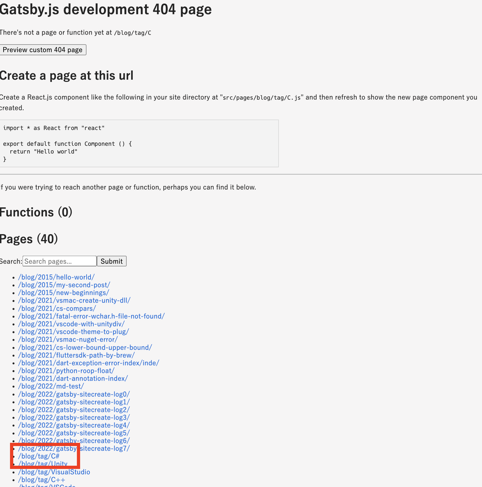

> このサイトを作るまでの記録。(時系列順)  
> 実際に作業を行なったメモに追記、編集して投稿してるので投稿日と作業日は一致しない。
>
> スターターを `gatsby new` したのは 2022 年の 3 月上旬。
> `gatsby` のバージョンは 4.9
>
> [一覧はここ](../gatsby-site-create-log0/)

## gatsby-node.js の整理

ローカル変数の削除とインライン化、関数化、コメントの追加を行なった。

<details>
  <summary>gatsby-node.js</summary>

```jsx
const path = require(`path`);
const { createFilePath } = require(`gatsby-source-filesystem`);

exports.createPages = async ({ graphql, actions, reporter }) => {
  const createBlogPostPage = (posts) => {
    posts?.forEach((post, index) => {
      actions.createPage({
        path: post.fields.slug,
        component: path.resolve(`./src/templates/blog-post.js`),
        context: {
          id: post.id,
          previousPostId: index === 0 ? null : posts[index - 1].id,
          nextPostId: index === posts.length - 1 ? null : posts[index + 1].id,
        },
      });
    });
  };

  const result = await graphql(`
    {
      allMarkdownRemark(
        sort: { fields: [frontmatter___postdate], order: ASC }
        limit: 1000
      ) {
        nodes {
          id
          fields {
            slug
          }
        }
      }
    }
  `);

  if (result.errors) {
    reporter.panicOnBuild(
      `There was an error loading your blog posts`,
      result.errors,
    );
    return;
  }

  createBlogPostPage(result.data.allMarkdownRemark.nodes);
};

exports.onCreateNode = ({ node, actions, getNode }) => {
  if (node.internal.type === `MarkdownRemark`) {
    // ファイルパスからurlを生成
    // https://www.gatsbyjs.com/plugins/gatsby-source-filesystem/#createfilepath
    const value = createFilePath({ node, getNode });

    // nodeに
    // "fields": {
    //   "slug": `"${value}"
    // `}
    // を追加する。
    // https://www.gatsbyjs.com/docs/reference/config-files/actions/#createNodeField
    actions.createNodeField({
      node,
      name: `slug`,
      value,
    });
  }
};

exports.createSchemaCustomization = ({ actions }) => {
  // siteMetadata {} オブジェクトを明示的に定義します。
  // こうすることで、gatsby-config.jsから削除されても、常に定義されるようになります。

  // Markdown のフロントマターも明示的に定義します。
  // この方法により、"content/blog" 内にブログ記事が格納されていない場合でも、
  // "MarkdownRemark" クエリはエラーを返すのではなく、`null` を返すようになります。
  actions.createTypes(`
    type SiteSiteMetadata {
      author: Author
      siteUrl: String
      social: Social
    }

    type Author {
      name: String
      summary: String
    }

    type Social {
      twitter: String
      github: String
      unityroom: String
    }

    type MarkdownRemark implements Node {
      frontmatter: Frontmatter
      fields: Fields
    }

    type Frontmatter {
      title: String
      description: String
      postdate: Date @dateformat
      update: Date @dateformat
      tags: [String]
    }

    type Fields {
      slug: String
    }
  `);
};
```

</details>

## URL リンクの修正

`gatsby-node.js` を整理してわかったのだけど、`exports.onCreateNode` で各ブログ記事の url を生成しているみたい。

現在、ブログ記事の url は `/blog/YYYY/hoge-fuga` って感じで先頭に `blog` とつけている。  
そのためいろいろなところで、

```jsx
<Link to={`/blog${node.fields.slug}`>...
```

というようにめんどくさいことをしている。  
このことは [2.サイトのディレクトリ変更](../gatsby-site-create-log2/) を見るとよくわかると思う。

url の生成方法がわかったのでいい感じに修正する。

### URL 生成部分の修正

`gatsby-node.js` にて次のようにする。

```jsx
...
exports.onCreateNode = ({ node, actions, getNode }) => {
...
    actions.createNodeField({
      node,
      name: `slug`,
      value: `/blog${value}`, // ← /blogを追加
    })
  }
}
```

これで、

```txt
前
 node.fields.slug -> YYYY/hoge-fuga
後
 node.fields.slug -> blog/YYYY/hoge-fuga
```

というようになった。

### リンクの修正

今、ブログ記事にアクセスすると `/blog/blog/YYYY/hoge-fuga` のように blog が 2 回続いた形になっている。  
まず、`gatsby-node.js` で生成される URL を正しいものにする。

```jsx
...
exports.createPages = async ({ graphql, actions, reporter }) => {
...
  posts.forEach((post, index) => {
    actions.createPage({
      path: post.fields.slug, // 'blog'を取り除く
...
}
```

続いて、`components/blogCard.js` と `templates/blog-post.js` を修正する。  
Link の to パラメータを直す。

```jsx
// components/blogCard.js
...
  const Card = ({ post, style }) => {
...
    const Title = () => (
      <h3 style={{ margin: '0' }}>
        <Link to={post.fields.slug} itemProp="url" style={{ color: '#242424' }}>
          <span itemProp="headline">{ post.frontmatter.title || post.fields.slug }</span>
        </Link>
      </h3>
    )
```

```jsx
// templates/blog-post.js
...
  const BlogNav = ({ previous, next }) => (
    <nav>
...
        <li>
          {previous && (
            <Link to={previous.fields.slug} rel="prev">
              ← {previous.frontmatter.title}
            </Link>
          )}
        </li>
        <li>
          {next && (
            <Link to={next.fields.slug} rel="next">
              {next.frontmatter.title} →
            </Link>
          )}
        </li>
...
```

以上で期待通りのものになった。

## tag 個別ページの作成

本題。

まず、`templates/tagPage.js` を作る。

`pageContext` プロパティについては[ここの公式リファレンス](https://www.gatsbyjs.com/docs/reference/config-files/actions/#createPage)に書いてあった。

```jsx
import * as React from "react";
import { graphql, Link } from "gatsby";

import Layout from "../components/layout";
import Seo from "../components/seo";

const TagsTemplate = ({ data, location, pageContext }) => {
  return (
    <Layout location={location}>
      <Seo title={`tag: ${pageContext.tag}`} />
      <h1>{pageContext.tag}</h1>
      <p>{data.allMarkdownRemark.totalCount}件</p>
      {data.allMarkdownRemark.nodes.map((post) => (
        <p>
          <Link to={post.fields.slug}>{post.frontmatter.title}</Link>
        </p>
      ))}
    </Layout>
  );
};

export default TagsTemplate;

export const pageQuery = graphql`
  query BlogPostByTag($tag: String!) {
    allMarkdownRemark(
      filter: { frontmatter: { tags: { eq: $tag } } }
      sort: { order: DESC, fields: frontmatter___postdate }
    ) {
      totalCount
      nodes {
        frontmatter {
          title
          postdate(formatString: "YYYY/MM/DD")
          tags
        }
        fields {
          slug
        }
      }
    }
  }
`;
```

次に、`gatsby-node.js` で tag ページを生成する。  
set 使って全てのブログ記事の frontmatter から tag を収集してる。

```jsx
exports.createPages = async ({ graphql, actions, reporter }) => {
  const createBlogPostPage = (posts) => {
...
  }

  const createTagPage = (tags) => {
    tags?.forEach(tag => {
      actions.createPage({
        path: `blog/tag/${tag}`,
        component: path.resolve(`./src/templates/tagPage.js`),
        context: {
          tag: tag
        }
      })
    })
  }
...
  createBlogPostPage(result.data.allMarkdownRemark.nodes)

  // タグの一覧をsetに取得する
  const set = new Set()
  result.data.allMarkdownRemark.nodes?.forEach(node => {
    node.frontmatter.tags?.forEach(tag => set.add(tag))
  })
  createTagPage(set)
}
```

こんな感じになった。


### 整える

BlogCards コンポーネントをパクってきた感じ。

Tag 一覧ページに表示したいブログ記事のリストのための処理と、BlogCards の行ってる処理が微妙に違うし、共通化部分を切り出すのも面倒だったのでコピペしていじった。

<details>

<summary>templates/tagPage.js</summary>

```jsx
import * as React from "react";
import { graphql, Link } from "gatsby";

import Layout from "../components/layout";
import Seo from "../components/seo";

const TagsTemplate = ({ data, location, pageContext }) => {
  const Card = ({ post, style }) => {
    const Date = () => (
      <p style={{ color: "#747474", marginBottom: "0" }}>
        {post.frontmatter.postdate}
      </p>
    );
    const Title = () => (
      <h3 style={{ margin: "0" }}>
        <Link to={post.fields.slug} itemProp="url" style={{ color: "#242424" }}>
          <span itemProp="headline">
            {post.frontmatter.title || post.fields.slug}
          </span>
        </Link>
      </h3>
    );
    const Tag = () => (
      <p style={{ display: "flex", justifyContent: "flex-end" }}>
        {post.frontmatter.tags &&
          post.frontmatter.tags.map((tag, i) => (
            <span
              style={{
                backgroundColor: "#000000",
                borderRadius: "2px",
                padding: "0.3rem 1rem",
                marginLeft: "0.3rem",
              }}
              key={i}
            >
              <Link to={`/blog/tag/${tag}`} style={{ color: "#ffffff" }}>
                {" "}
                {tag}{" "}
              </Link>
            </span>
          ))}
      </p>
    );
    return (
      <div itemScope itemType="http://schema.org/Article" style={style}>
        <Date />
        <Title />
        <Tag />
      </div>
    );
  };

  return (
    <Layout location={location}>
      <Seo title={`Tag: ${pageContext.tag}`} />
      <h1>{pageContext.tag}</h1>
      <p>{data.allMarkdownRemark.totalCount}件</p>
      <p>
        <Link to="/blog/tag">タグの一覧</Link>
      </p>
      {
        <div
          style={{
            display: "flex",
            flexFlow: "column",
            backgroundColor: "#ffffff",
            border: "solid 1px #999999",
            padding: "0 10px",
          }}
        >
          {data.allMarkdownRemark.nodes.map((post, i) => {
            // 最後の一個以外ボーダーで区切り線を入れる
            if (i >= data.allMarkdownRemark.nodes.length - 1)
              return <Card post={post} key={i} />;
            return (
              <Card
                post={post}
                style={{ borderBottom: "solid 1px #E3E3E3" }}
                key={i}
              />
            );
          })}
        </div>
      }
    </Layout>
  );
};

export default TagsTemplate;

export const pageQuery = graphql`
  query BlogPostByTag($tag: String!) {
    allMarkdownRemark(
      filter: { frontmatter: { tags: { eq: $tag } } }
      sort: { order: DESC, fields: frontmatter___postdate }
    ) {
      totalCount
      nodes {
        frontmatter {
          title
          postdate(formatString: "YYYY/MM/DD")
          tags
        }
        fields {
          slug
        }
      }
    }
  }
`;
```

</details>



ちなみに、ここで `C#` タグが問題となった。

`http://localhost:8000/blog/tag/C#` とアクセスすると 404 になる。  
Pages にはちゃんとあるのに...



まあ、それはそうなんだけど。

エスケープとか面倒なので frontmatter の tags の `C#` を無くして `CSharp` にした。  
ついでにタグの名前が他は全て UpperCamel なので `gatsby` を `Gatsby` にしておいた。

## タグの一覧ページの作成

`src/pages/blog/tag.js` を作成。  
かなりハードコーディングだけどまあいいや。

<details>
<summary>src/pages/blog/tag.js</summary>

```jsx
import * as React from "react";
import { graphql, Link } from "gatsby";

import Layout from "../../components/layout";
import Seo from "../../components/seo";

const Tag = ({ data, location }) => {
  const counter = new Counter();
  data.allMarkdownRemark.nodes?.forEach((node) => {
    node.frontmatter.tags?.forEach((tag) => counter.increment(tag));
  });
  return (
    <Layout location={location}>
      <Seo title="Tag List" />
      <h1>Tag</h1>
      <ul>
        {counter.keys
          .sort() // 文字列ソート(アルファベット, 50音)
          .sort((a, b) => counter.get(b) - counter.get(a)) // 数が多い順のソート
          .map((key) => (
            <li style={{ margin: "1rem 0" }}>
              <Link
                to={`/blog/tag/${key}`}
                style={{
                  fontSize: "1.1rem",
                }}
              >
                {key}
              </Link>
              {` : ${counter.get(key)}`}
            </li>
          ))}
      </ul>
    </Layout>
  );
};

export const pageQuery = graphql`
  query TagOnlyQuery {
    allMarkdownRemark {
      nodes {
        frontmatter {
          tags
        }
      }
    }
  }
`;

class Counter {
  constructor() {
    this.map = {};
  }

  increment(key) {
    if (this.map.hasOwnProperty(key)) this.map[key] += 1;
    else this.map[key] = 1;
  }

  get keys() {
    return Object.keys(this.map);
  }

  get(key) {
    if (this.map.hasOwnProperty(key)) return this.map[key];
    else return 0;
  }
}

export default Tag;
```

</details>


## 細かな修正

```jsx {diff}
// templates/blog-post.js
const BlogPostTemplate = ({ data, location }) => {
...
    const Tags = () => (
...
        return (
-          <Link to="/" style={{
+          <Link to={`/blog/tag/${tag}`} style={{
            color: '#505050',
            marginRight: '5px'
          }}>{t}</Link>
        )
...
```

```jsx {diff}
// pages/blog.js
import * as React from "react"
+import { Link } from "gatsby"
...
const Blog = ({ location }) => {
  return (
    <Layout location={location}>
      <Seo title="Blog List" />
      <h1>Blog</h1>
+      <p><Link to="/blog/tag">タグの一覧</Link></p>
      <BlogCards count={1000} />
    </Layout>
  )
}
```

```jsx {diff}
// components/blogCards.js
const BlogCards = ({ count }) => {
...
    const Tag = () => (
      <p style={{ display: 'flex', justifyContent: 'flex-end' }}>
        {post.frontmatter.tags && (post.frontmatter.tags.map((tag, i)=> (
          <span style={{
            backgroundColor: '#000000',
            borderRadius: '2px',
            padding: '0.3rem 1rem',
            marginLeft: '0.3rem'
          }} key={i}>
-            <Link to="/" style={{ color: '#ffffff' }}>{ tag }</Link>
+            <Link to={`/blog/tag/${tag}`} style={{ color: '#ffffff' }}>{ tag }</Link>
          </span>
        )))}
      </p>
    )
```
