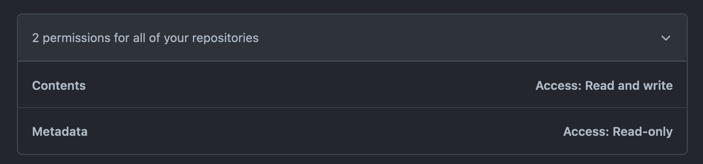
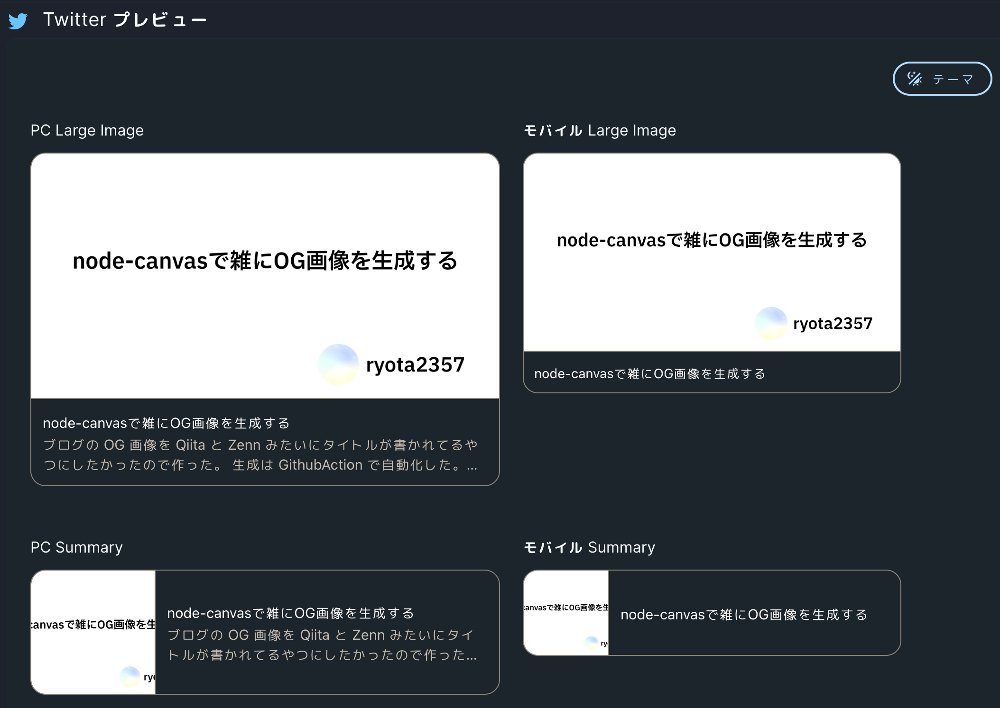
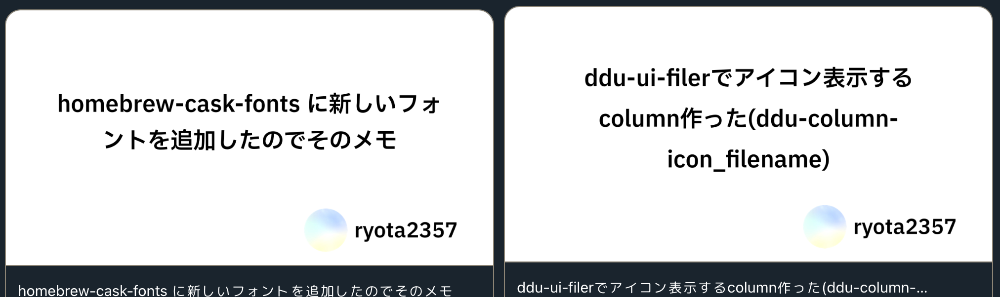

ブログの OG 画像を Qiita と Zenn みたいにタイトルが書かれてるやつにしたかったので作った。  
生成は GithubAction で自動化した。

## npm プロジェクトの作成

Node18 と TypeScript を使って行う。  
適当に Node プロジェクト作って、TypeScript 有効にしておく。

```sh
$ npm i canvas
```

で [node-canvas](https://github.com/Automattic/node-canvas/) を install する。

## 画像生成処理を書く

`generateImage()` を作る。

先に実装全体を載せる。  
タイトルの通り色々雑に作っているので、汚いところは目を瞑ってほしい。

<details>
<summary>実装全体</summary>

```typescript
import {
  type CanvasRenderingContext2D,
  createCanvas,
  loadImage,
  registerFont,
} from "canvas";
import * as fs from "fs";
import { parse as parsePath } from "path";

type Px = number;
type Em = number;

export type Params = {
  image: {
    path: string;
    width: Px;
    height: Px;
  };
  text: {
    text: string;
    font: {
      path: string;
      family: string;
      size: Px;
    };
    style: {
      lineHeight: Em;
      padding: {
        top: Px;
        left: Px;
        bottom: Px;
        right: Px;
      };
    };
  };
};

const setupCanvas = async ({
  font,
  image,
}: {
  font: Params["text"]["font"];
  image: Params["image"];
}) => {
  registerFont(font.path, { family: font.family });
  const img = await loadImage(fs.readFileSync(image.path));
  const canvas = createCanvas(image.width, image.height);
  const context = canvas.getContext("2d");
  context.drawImage(img, 0, 0, image.width, image.height);
  context.textAlign = "center";
  context.textBaseline = "middle";
  context.font = `${font.size}px ${font.family}`;
  return canvas;
};

const textSize = (context: CanvasRenderingContext2D, text: string) => {
  const measure = context.measureText(text);
  const width = measure.width;
  const height =
    measure.actualBoundingBoxAscent + measure.actualBoundingBoxDescent;
  return { width, height };
};

const splitLine = ({
  context,
  maxWidth,
  text,
}: {
  context: CanvasRenderingContext2D;
  maxWidth: number;
  text: string;
}) => {
  const splitWord = (text: string) => {
    const isEnChar = (char: string) => {
      if (char.length != 1) {
        throw Error(`char length must be 1. length is ${char}`);
      }
      return /[A-z]|_|\$|<|>/.test(char);
    };

    const ret = [""];
    for (const now of text) {
      const prev = ret[ret.length - 1].slice(-1);
      if (prev == "" || (isEnChar(prev) && isEnChar(now))) {
        ret[ret.length - 1] += now;
        continue;
      }
      ret.push(now);
    }
    return ret;
  };

  const ret = [""];
  for (const now of splitWord(text)) {
    const next = ret[ret.length - 1] + now;
    if (textSize(context, next).width > maxWidth) {
      ret.push(now);
    } else {
      ret[ret.length - 1] += now;
    }
  }
  return ret;
};

const writeText = ({
  context,
  text,
  width,
  height,
  style,
}: {
  context: CanvasRenderingContext2D;
  text: string;
  width: Px;
  height: Px;
  style: Params["text"]["style"];
}) => {
  const maxWidth = width - (style.padding.left + style.padding.right);
  const textHight = textSize(context, text).height * style.lineHeight;
  const lines = splitLine({
    context: context,
    maxWidth: maxWidth,
    text: text,
  });

  let x = style.padding.left + maxWidth / 2;
  let y = (() => {
    const area = height - (style.padding.top + style.padding.bottom);
    const use = lines.length * textHight;
    if (area - use < 0) {
      throw Error("Threr are not enough area to draw text");
    }
    const offset = (textHight / 2) * (lines.length - 1);
    return style.padding.top + area / 2 - offset;
  })();

  for (const line of lines) {
    context.fillText(line, x, y);
    y += textHight;
  }
};

export const generateImage = async (params: Params) => {
  const canvas = await setupCanvas({
    image: params.image,
    font: params.text.font,
  });

  writeText({
    context: canvas.getContext("2d"),
    text: params.text.text,
    width: params.image.width,
    height: params.image.height,
    style: params.text.style,
  });

  return canvas.toBuffer("image/png");
};
```

</details>

`generateImage()` は次のようになっている。

```typescript
export const generateImage = async (params: Params) => {
  const canvas = await setupCanvas({
    image: params.image,
    font: params.text.font,
  });

  writeText({
    context: canvas.getContext("2d"),
    text: params.text.text,
    width: params.image.width,
    height: params.image.height,
    style: params.text.style,
  });

  return canvas.toBuffer("image/png");
};
```

`setupCanvas()` で Canvas 型の `canvas` を生成、`writeText()` で Canvas の Context に色々テキスト描画、Canvas を png 画像用の Image オブジェクトにして return している。

また、引数(`Params` 型)で生成する画像をどのようにするのかを制御できるようにしてある。

```typescript
type Px = number;
type Em = number;

export type Params = {
  image: {
    path: string;
    width: Px;
    height: Px;
  };
  text: {
    text: string;
    font: {
      path: string;
      family: string;
      size: Px;
    };
    style: {
      lineHeight: Em;
      padding: {
        top: Px;
        left: Px;
        bottom: Px;
        right: Px;
      };
    };
  };
};
```

<br/>

<details>
<summary>使用例</summary>

```typescript
const image = await generateImage({
  image: {
    width: 1200,
    height: 630,
    path: resolve("./assets/base.png"),
  },
  text: {
    text: title,
    font: {
      path: resolve("./assets/IBMPlexSansJP-SemiBold.otf"),
      family: "IBMPlexSansJP",
      size: 56,
    },
    style: {
      lineHeight: 1.7,
      padding: {
        top: 60,
        left: 100,
        bottom: 140,
        right: 100,
      },
    },
  },
});
```

</details>

以下、`generateImage()` 内で使用している `setupCanvas()` と、`writeText()` を説明する。

### `setupCanvas()` の作成

この関数がやることはフォント、背景画像、スタイルが設定された Canvas オブジェクトを返すことである。  
実装は以下である。

```typescript
const setupCanvas = async ({
  font,
  image,
}: {
  font: Params["text"]["font"];
  image: Params["image"];
}) => {
  registerFont(font.path, { family: font.family });
  const img = await loadImage(fs.readFileSync(image.path));
  const canvas = createCanvas(image.width, image.height);
  const context = canvas.getContext("2d");
  context.drawImage(img, 0, 0, image.width, image.height);
  context.textAlign = "center";
  context.textBaseline = "middle";
  context.font = `${font.size}px ${font.family}`;
  return canvas;
};
```

`createCanvas()` をする前に `registerFont()` をしなきゃいけない、みたいなことを何処かで読んだ。順番を逆にするとどうなるかは試してない。

OG 画像ということで、文字列は画像の中央に配置したい。そこで `context.textAlign` に center を指定している。また、この後の複数行の文字列を配置する時に計算をしやすくするために `context.textBaseline` を middle にしておくと良いであろう。

### `writeText()` の作成

canvas に文字を描く関数である。  
この関数を実装するためにいくつかの関数を実装する。

1 つ目は `textSize()`。これは与えられた文字列のサイズ(幅と高さ)を返す関数である。Canvas の Context を用いて計算できる。

```typescript
const textSize = (context: CanvasRenderingContext2D, text: string) => {
  const measure = context.measureText(text);
  const width = measure.width;
  const height =
    measure.actualBoundingBoxAscent + measure.actualBoundingBoxDescent;
  return { width, height };
};
```

2 つ目は `splitLine()` である。これは与えられた文字列をいい感じに改行する（string[]にする）関数である。具体的には指定した文字幅(`maxWidth`)以内に 1 行が収まるように文字列を区切る。

上に書いた `textSize()` を利用している。

```typescript
const splitLine = ({
  context,
  maxWidth,
  text,
}: {
  context: CanvasRenderingContext2D;
  maxWidth: number;
  text: string;
}) => {
  const splitWord = (text: string) => {
    const isEnChar = (char: string) => {
      if (char.length != 1) {
        throw Error(`char length must be 1. length is ${char.length}(${char})`);
      }
      return /[A-z]|_|\$|<|>/.test(char);
    };

    const ret = [""];
    for (const now of text) {
      const prev = ret[ret.length - 1].slice(-1);
      if (prev == "" || (isEnChar(prev) && isEnChar(now))) {
        ret[ret.length - 1] += now;
        continue;
      }
      ret.push(now);
    }
    return ret;
  };

  const ret = [""];
  for (const now of splitWord(text)) {
    const next = ret[ret.length - 1] + now;
    if (textSize(context, next).width > maxWidth) {
      ret.push(now);
    } else {
      ret[ret.length - 1] += now;
    }
  }
  return ret;
};
```

複雑な処理はしていないので読めばわかると思うが大まかに説明をする。

1. 与えられた文字列(text)を単語に分解する(`splitWord`)。このとき、英字と一部記号の連続を 1 単語として数え(`isEnChar`、記号は今後増やすかもしれない)、日本語は 1 文字 1 単語とした。
2. 分解された単語をそれぞれ `textSize()` に渡して横幅を取得する。
3. maxWidth を超えないように「1 行」を作っていく。

これらを用いて `writeText()` を実装している。

```typescript
const writeText = ({
  context,
  text,
  width,
  height,
  style,
}: {
  context: CanvasRenderingContext2D;
  text: string;
  width: Px;
  height: Px;
  style: Params["text"]["style"];
}) => {
  const maxWidth = width - (style.padding.left + style.padding.right);
  const textHight = textSize(context, text).height * style.lineHeight;
  const lines = splitLine({
    context: context,
    maxWidth: maxWidth,
    text: text,
  });

  let x = style.padding.left + maxWidth / 2;
  let y = (() => {
    const area = height - (style.padding.top + style.padding.bottom);
    const use = lines.length * textHight;
    if (area - use < 0) {
      throw Error("Threr are not enough area to draw text");
    }
    const offset = (textHight / 2) * (lines.length - 1);
    return style.padding.top + area / 2 - offset;
  })();

  for (const line of lines) {
    context.fillText(line, x, y);
    y += textHight;
  }
};
```

ごちゃごちゃしているけど、その理由は `style.padding` で配置する文字列のパディングを設定できるようにしたり、`style.lineHeight` で文字の高さ(em)を設定できるようにしているので、それらを考慮した文字列を配置する座標を計算しているからである。

文字列は Canvas の context に対して、`context.fillText(文字、x座標, y座標)` で配置できる。

## Github Action で自動生成

実際に `generateImage()` を利用して画像を生成しているプログラムは[ryota2357.com-images/src/main.ts](https://github.com/ryota2357/ryota2357.com-images/blob/main/src/main.ts)に置いてある。  
このプログラムを適当なタイミングで走らせたい。  
僕はブログのデプロイを Github Action で行っているので、そのデプロイ時の Github Action からこのプログラムを動作させるようにした。

まずは画像生成プロラムを走らせる Github Action を作る。生成した画像は別ブランチに配置したいので[s0/git-publish-subdir-action](https://github.com/s0/git-publish-subdir-action)を使う。

```yaml
name: Generate OG-Image

on:
  repository_dispatch:
    types: [gen-og-image]
  workflow_dispatch:

jobs:
  generate-og-image:
    runs-on: ubuntu-latest
    steps:
      - uses: actions/checkout@v3

      - name: Setup Node
        uses: actions/setup-node@v3
        with:
          node-version: 18
          cache: "npm"

      - name: Cache dependencies
        uses: actions/cache@v3
        with:
          path: ~/.npm
          key: ${{ runner.os }}-node-${{ hashFiles('**/package-lock.json') }}
          restore-keys: |
            ${{ runner.os }}-node-

      - run: npm ... (スクリプト実行)

      - name: Push to og-image branch
        uses: s0/git-publish-subdir-action@develop
        env:
          REPO: self
          BRANCH: og-image
          FOLDER: (生成した画像を出力したディレクトリ)
          SKIP_EMPTY_COMMITS: true
          GITHUB_TOKEN: ${{ secrets.GITHUB_TOKEN }}
```

ここで重要なのは 4 行目の `repository_dispatch` である。これを使うとこの Github Action を別の Github Action から呼び出すことが可能になる。

次に、これを呼び出す側を作る。こんな感じで呼び出せば良い。[GitHub Docs: create-a-repository-dispatch-event](https://docs.github.com/ja/rest/repos/repos?apiVersion=2022-11-28#create-a-repository-dispatch-event)

```yaml
- name: Generate OG-Image
  run: |
    TOKEN=${{ secrets.REPOSITORY_DISPATCH_KEY }}
    curl \
      -X POST \
      -H "Accept: application/vnd.github+json" \
      -H "Authorization: Bearer $TOKEN"\
      -H "X-GitHub-Api-Version: 2022-11-28" \
      https://api.github.com/repos/OWNER/REPO/dispatches \
      -d '{"event_type":"gen-og-image"}'
```

ここで `REPOSITORY_DISPATCH_KEY` というシークレットキーを使っている。repository dispatch を実行するにはパーソナルアクセストークンが必要となる。  
Fine-grained personal access tokens を使うなら permission を次のように設定すると実行できた。



## 完成品

生成した画像のリンクを適当に配置すると次のように OG 画像が設定できていることが確認できる。



複数行のものはこんな感じ。


