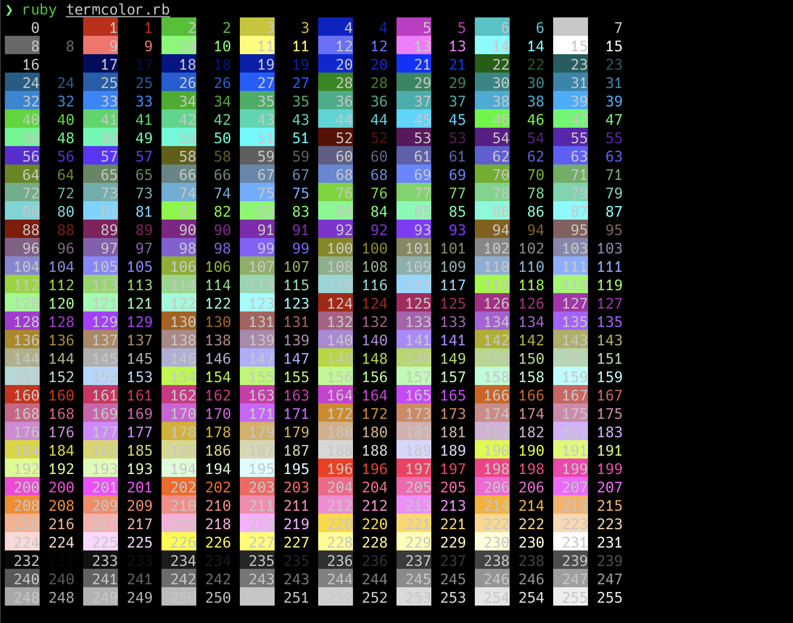

プラグインを入れずにカスタマイズをする。

## 基本

まず、プロンプトのカスタマイズは `.zshrc` などで `PROMPT` などに値を代入することで行える。

試しに、

```bash
# .zshrc
PROMPT="$"
```

とすると、


のようになり、またさらに以下のようにすると、

```bash
# .zshrc
PROMPT="$"
RPROMPT="///"
```


となる(右に `///` が追加された)。

### 僕のプロンプト

僕はできる限りシンプルにしたかったので、以下のような見た目になっている。  
(普段はこれに tmux を起動して、その他の情報を載せてたりする)


これの設定ファイルは下に折りたたんだ。この説明は最後で行う。

<details>
  <summary>設定ファイル</summary>

```bash
left-prompt() {
  local dir="%F{11}%~%f"
  local next="%F{47}❯%f "
  echo -e "\n${user}${dir}\n${next}"
}
right-prompt() {
  local time="%F{242}%T%f"
  echo "${time}"
}

PROMPT=`left-prompt`
RPROMPT=`right-prompt`

unset -f left-prompt
unset -f right-prompt
```

</details>

## 情報の追加

現在のディレクトリと時間を表示するためには `%~` と `%T` を用いると表示できる。

例えば、

```bash
PROMPT="%~ > "
RPROMPT="%T"
```

とすると、


のようになる。

下の表は[https://tegetegekibaru.blogspot.com/2012/08/zsh_2.html](https://tegetegekibaru.blogspot.com/2012/08/zsh_2.html)より、そのままコピペさせていただいた。上の例のようにパラメータを `PROMPT` などに渡せば良い。

| パラメータ | 出力内容                      | 例                                  |
| ---------- | ----------------------------- | ----------------------------------- |
| %M         | ホスト名                      | localhost.localdomain               |
| %m         | ホスト名                      | localhost                           |
| %n         | ユーザ名                      | root                                |
| %#         | ユーザ種別                    | #（root の場合） %（root 以外）     |
| %y         | ログイン端末名                | pts/0                               |
| %l         | ログイン端末名                | pst/0（tty\*の場合は tty を省略）   |
| %?         | 直前のコマンドの戻り値        | 0                                   |
| %h %!      | コマンド実行数 （history 数） | 1                                   |
| %d %/      | カレントディレクトリ          | /root/currentdir                    |
| %~         | カレントディレクトリ          | ~/currentdir                        |
| %C         | カレントディレクトリ          | currentdir                          |
| %c %.      | カレントディレクトリ          | currentdir （$PWD=$HOME の場合は~） |
| %D         | 日付                          | 12-07-31 (yy-mm-dd)                 |
| %W         | 日付                          | 07/31/12 (mm/dd/yy)                 |
| %w         | 日付                          | Sun 31 (day dd)                     |
| %\*        | 時間                          | 15:50:30 (hh:mm:ss)                 |
| %T         | 時間                          | 15:50 (hh:mm)                       |
| %t %@      | 時間                          | 03:50PM (hh:mm(am/pm format))       |

## 装飾

ただの白文字ではつまらないので装飾したい。

### 色

```bash
%F{色番号}色をつける内容%f
```

とすると色がつけられる。
つまり `%F` と `%f` で囲われたところに色がつく。色はターミナルの 256 色(0~255)で指定する。

例えば、

```bash
PROMPT="%F{45}%~%f > "
```

とすると、


色番号の一覧は次の Ruby スクリプトを実行することで見ることができる。(このスクリプトは数年前にどこかで拾った)

```ruby
# -*- coding: utf-8 -*-

@fg = "\x1b[38;5;"
@bg = "\x1b[48;5;"
@rs = "\x1b[0m"

def color(code)
  number = '%3d' % code
  "#{@bg}#{code}m #{number}#{@rs}#{@fg}#{code}m #{number}#{@rs} "
end

256.times do |n|
  print color(n)
  print "\n" if (n + 1).modulo(8).zero?
end
print "\n"
```



### 太文字

`%B` と `%b` で囲う。


### 下線

`%U` と `%u` で囲う。


### 背景色

`%S%F` と `%f%s` で囲う。(`%S` と `%s` をつける)


## わかりやすく設定する

エスケープ文字を使って PROMPT を設定するのは読みにくい。  
変数や関数を用いてわかりやすくすると良いと思う。

僕の設定を再掲する。


`local` をつけると変数のスコープを制限できるので zsh が汚れず良い。  
`left-prompt()` と `right-prompt()` の関数を用いることで `PROMPT`, `RPROMPT` の意味がわかりやすくなる。  
関数の返り値の扱いは `echo` と `` `function` `` を使っている人がいたので真似した(あってるの?)

```bash
left-prompt() {
  local dir="%F{11}%~%f"
  local next="%F{47}❯%f "
  echo -e "\n${user}${dir}\n${next}"
}
right-prompt() {
  local time="%F{242}%T%f"
  echo "${time}"
}

PROMPT=`left-prompt`
RPROMPT=`right-prompt`

unset -f left-prompt
unset -f right-prompt
```

関数の宣言もスクリプトローカルにしたかったのだけど、やり方がわからなかった。  
ひとまず最後に `unset` することで同じ結果は得られるのでそうした。

## 参考

- [zsh 設定 - プロンプト -](https://tegetegekibaru.blogspot.com/2012/08/zsh_2.html)
- [macOS ターミナルで zsh プロンプトをカスタマイズする方法](https://chirashi.twittospia.com/%E6%8A%80%E8%A1%93/macos%E3%82%BF%E3%83%BC%E3%83%9F%E3%83%8A%E3%83%AB%E3%81%A7zsh%E3%83%97%E3%83%AD%E3%83%B3%E3%83%97%E3%83%88%E3%82%92%E3%82%AB%E3%82%B9%E3%82%BF%E3%83%9E%E3%82%A4%E3%82%BA%E3%81%99%E3%82%8B%E6%96%B9/2021-02-13/)
- [zsh プロンプトをカスタマイズ、色と改行と git 対応で見やすくする【Mac】](https://dev.macha795.com/zsh-prompt-customize/)
