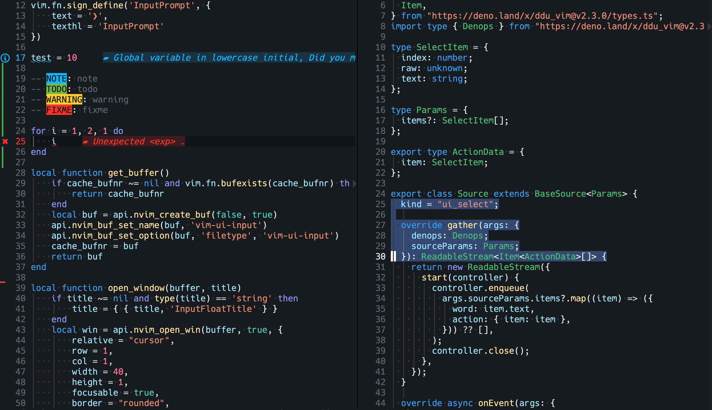
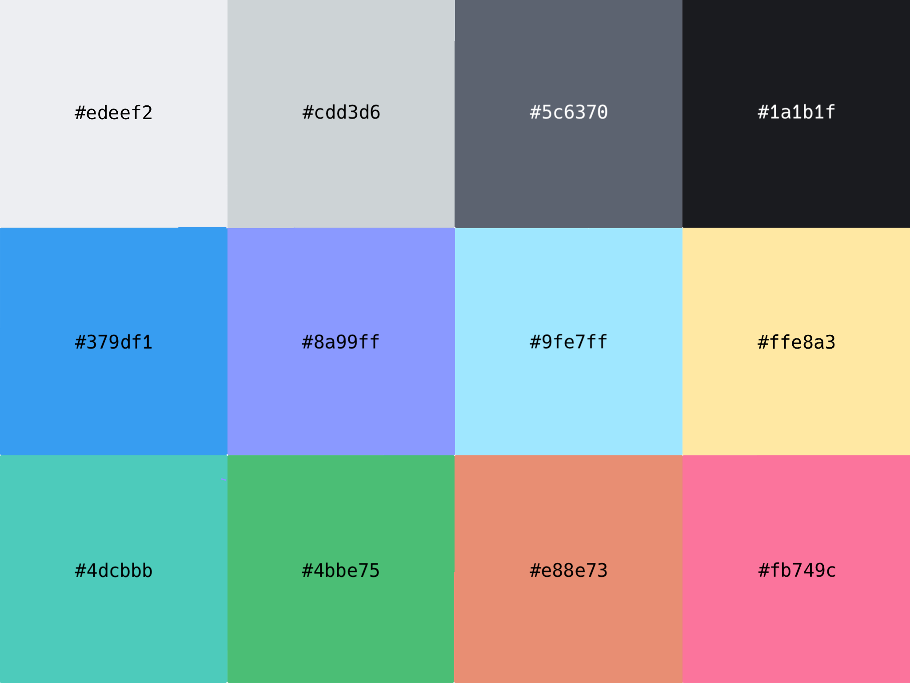
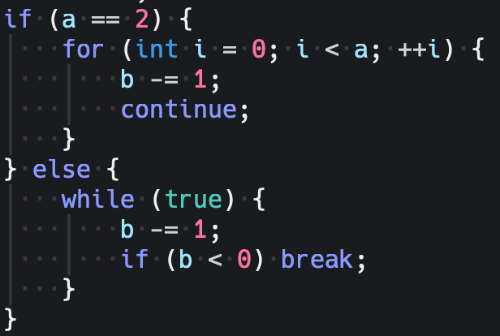
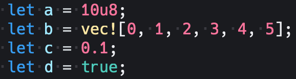
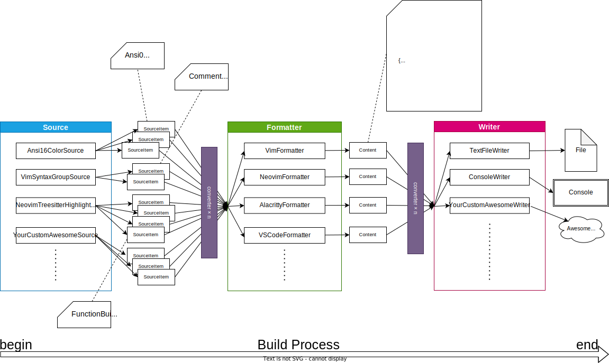
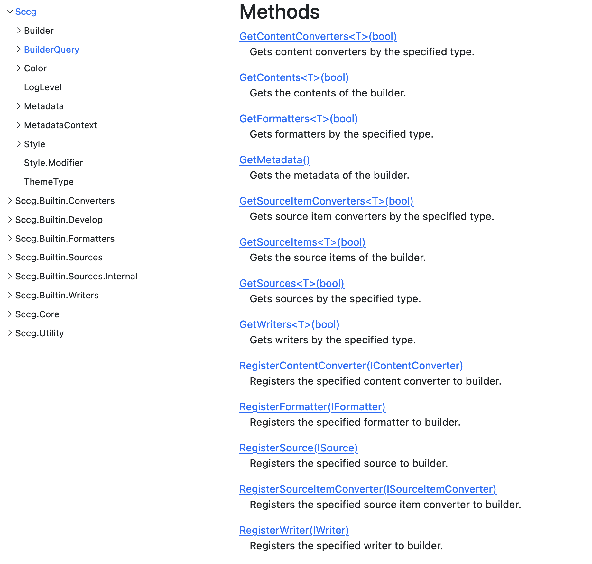

> これは MMA 部誌 2023 春 に投稿した内容です。
>
> MMA の部誌は[ここ](https://www.mma.club.uec.ac.jp/chofu-festa/index.html)で読めます。

> 1. [necodark](#1-necodark)
>    1. [necodark の目的と特徴](#11-necodark-の目的と特徴)
> 1. [Sccg](#2-sccg)
>    1. [Sccg の目的と特徴](#21-sccg-の目的と特徴)
>    1. [Program.cs](#22-programcs)
>    1. [Source](#23-source)
>    1. [Formatter](#24-formatter)
>    1. [Converter](#25-converter)
>    1. [Writer](#26-writer)
>    1. [interface](#27-interface)
> 1. [補足](#3-補足)
>    1. [なぜ C# で作ったのか](#31-なぜ-c-で作ったのか)
>    1. [Converter の説明で出てきた `Name` と `Priority` プロパティは何をしているか](#32-converter-の説明で出てきたnameとpriorityプロパティは何をしているか)
>    1. [コード例で出てきてた `BuilderQuery` とは](#33-コード例で出てきてたbuilderqueryとは)
> 1. [最後に](#4-最後に)

こんにちは。2 年の ryota2357 です。

先日、「necodark」というカラーテーマをリリースしました。このカラーテーマは「Sccg」というカラーテーマジェネレータ(私が開発し、先日 v0.2.1 をリリースしました)を用いて作成しました。

本投稿では「necodark」と「Sccg」について書いていきます。

- [necodark (GitHub)](https://github.com/ryota2357/necodark)
- [Sccg (GitHub)](https://github.com/ryota2357/Sccg)
- [Sccg document](https://sccg.ryota2357.com/index.html)

## 1. necodark

次のスクリーンショットは Neovim にて necodark を利用した際の画像です。



現在 (2023/04/04) Vim、Neovim にて利用できます。現在 VS Code 対応の作業中です。今後 CotEditor や IntelJ IDE、ターミナルミュレータ(iTerm2 や Alacritty)でも利用できるようにしていきます。
4 月中には VS Code と CotEditor でも利用できるようになる予定です。

このテーマは Visual Studio Dark (以下 vsdark)や Visual Studio Code Dark(以下 codedark)の配色を参考にして作成しました。(vsdark や codedark にて使用されている色を使ったわけではありません)

青・緑を中心に構成し、boolean 値には青緑(Teal)を、数値にはピンクを採用しました。全体的にはっきりとした色(彩度が高めの色、ビビット/ブライトあたりのトーン)を使っています。

カラーパレットは[https://github.com/ryota2357/necodark/blob/main/src/Necodark/Palette.cs](https://github.com/ryota2357/necodark/blob/main/src/Necodark/Palette.cs)にて確認できます。
使用している主な色は次の通りです。



### 1.1 necodark の目的と特徴

necodark を作成した目的は主に次の 2 点です。

- 長時間のコーディングによる目の疲れがあってもしっかりコードを読める
- 馴染みのある配色である

1 つ目の目的のために、背景には少し暗めの黒(#1a1b1f)を使い文字色の彩度・コントラスト比を上げました。2 つ目の目的のためベースに vsdark や codedark を採用しました。

necodark は「制御 (if や for)」「リテラル (boolean, 数値)」に特徴的な配色をしました。

「制御」に充てている色はインディゴ(#8a99ff) です。この色はキーワード色として使っている青(#379df1)に近い色を持ちます。



vsdark では「制御」と「キーワード」には同じ色が当てられています。necodark ではこれらの色を分けました。
一般にキーワードはコード内で重要なマーカーとなります。そして「制御」もコードのロジックを示すのに重要なマーカーとなります。
重要なマーカーとしての意味であれば同じ色を当てても良さそうです。
しかし necodark では上に挙げた目的の 1 つ目「長時間のコーディングによる目の疲れがあってもしっかりコードを読める」を達成するため色を分けました。

「制御」と「キーワード」はコード中で頻繁に登場します。そのため、もしこれらの色を同じにしてしまうと同じ色がコード内に比較的多く登場することとなります。
通常時はとても良いマーカーになるかもしれませんが、疲労時には同じ色が多いと感じて目が滑ってしまうかもしれません。これを解決するため necodark では「制御」にインディゴを当てました。

necodark で使用したインディゴと青は近い色のため、このインディゴは青よりは目立たないでしょう。 先ほど「制御」は重要なマーカーと言ったのにキーワードのようには目立っていません。
しかしこれで良いのです。「制御」となる文字は `if` や `for`、`loop`、`raise`、`break` などが挙げられます。これらの文字はコード内でインデントや `}` などの付近で使用されています。
そのため文字色で目出させずにも識別することは十分可能だと考えました。
また、特に `if` や `for` ではリテラルと共に使用されることも多いです。necodark ではリテラルにも目立つ特徴的な配色がされています。
このことからも「制御」にはキーワードよりは目立たないインディゴを割り当てるのが適当だと考えました。

「リテラル」に当てている色は、真偽値には青緑(#4dcbbb)を、数値にはピンク(#fb749c)です。



コード内に登場する数値リテラルは基本的に何かの固定値であり、変更する時には注意を払う必要があります。そのため数値には他のところでは使用していない色であり、赤系に近いながらも警告の意味を持たないような色を当てました。

真偽値リテラルも分岐を決定する重要なものですが、分岐の決定には文学的な方法(メソッド名や変数名を用いて真偽を抽象化し意味を持たせて分岐する)が多いでしょう。そのため重要度はそこまで高くないかもしれません。しかしリテラルであることには変わりはなく、重要ではあるので通常の文字色を当てることはできません。そこで青・緑と白の中間的な色を使おうと考えました。水色は「パラメータ」などの色に当てられているので緑と白の中間の色を採用しました。

## 2. Sccg

ここまで necodark の「見た目」について説明しました。ここからは necodark の「実装」について書いていきます。

necodark は C# 製のカラーテーマジェネレータ、Sccg を用いて作成されています。Sccg は v0.2.1 であり、今後も開発は進められていく予定です。v0.2.1 ですが十分に実用に耐えられるものだと思ってます。

### 2.1 Sccg の目的と特徴

Sccg の README からそのまま引用しましょう。

```txt
> **S**criptable **C**olor **C**onfiguration **G**enerator.

Sccg is a tool to generate color schemes for your terminal, editor, etc.

## Goals and Features

- Fully scriptable
  - Separate the each generation logic, `Source`, `Formatter`, `Converter` and `Writer`.
  - You can write your own `Source`, `Formatter`, `Converter` and `Writer` with C#.
- Unified API and Cross-platform
  - Each platform has its own color scheme format.
  - Sccg provides a unified API to generate color schemes for each platform.
  - You can set the color with `Set` and can link to other color with `Link`.
- Foolproof
  - There are may color groups, such as 'Comment', '@type.builtin', 'Ansi 0 Color', etc.
  - All color groups are defined in the `Source`, so you get completion, type check and so on.
  - Cycle reference will be detected by `Source`, then Sccg warn you or failed to build.
```

まとめると Sccg は C# でカスタマイズ可能であり、多くのプラットフォームに統一された方法でカラーテーマを作成でき、typo や色の循環 link を抑制できることで、安全かつ効率的にオリジナルのカラーテーマを作成することを可能にするカラーテーマジェネレータです。(このことを目標に開発してます)

続いて Sccg にて採用した概念である、`Source`、`Formatter`、`Converter`、`Writer` の説明と関係を説明します。README にもあるように、これらを用いてカラーテーマの生成ロジックをスクリプト可能なものに分割しました。次にこれらの関係を図示します(README からの引用)。



`Source` から `SourceItem` というものが生成され、それが `Formatter` によって `Content` に加工され `Writer` によって何かしらの形をとって出力されます。
途中 `Converter` が `SourceItem` や `Content` を加工できます。

ここからは necodark の実装と合わせて、それぞれの概念がどのように使われ、働くことでカラーテーマが生成されるのかを見ていきましょう。個々の概念の説明も書いていきます。

### 2.2 Program.cs

necodark のメインスクリプト部分は次のようになっています。

```cs
using Sccg;
using Sccg.Builtin.Formatters;
using Sccg.Builtin.Writers;

var builder = new Builder
{
    Metadata = Metadata.Default with
    {
        ThemeName = "necodark",
        Author = "ryota2357"
    },
};

// source
builder.Use<Ansi16>();
builder.Use<VimSyntaxHighlight>();
builder.Use<VimEditorHighlight>();
builder.Use<VimFiletypeHighlight>();
builder.Use<NeovimEditorHighlight>();
builder.Use<NeovimTreesitterHighlight>();
builder.Use<NeovimLspDiagnosticHighlight>();
builder.Use<NeovimPluginHighlight>();

// formatter
builder.Use<VimFormatter>();
builder.Use<NeovimFormatter>();

// converter
builder.Use<FilenameConverter>();

// writer
builder.Use<TextFileWriter>();

builder.Build();
```

1 行目から読んでいきます。using 部分を説明するために、Sccg が 2 つの部分に分けられていることを先に説明します。
Sccg はコアな部分(Sccg の核となる部分)とそれの付属部分(標準ライブラリ的な部分)の 2 つに別れています。コアな部分を単に Sccg といい、付属部分を Sccg.Builtin と呼びます。
`using` にてコア部分といくつかの付属部分をインポートしています。

`using` の次では `Builder` クラスのインスタンス builder を生成しています(`Builder` クラスは Sccg に定義されています)。`Builder` クラスは登録された `Source` や `Formatter` などを適切に利用し、カラーテーマを生成するロジックをもったクラスです。
インスタンスの生成時にメタデータを記述しています。これにより、いつくかの `Source` や `Formatter` にメタデータを注入できます。

続いて、builder に Source を登録しています。 `Use<T>()` メソッドを用いて `T` クラスを builder に登録できます。
上記スクリプトでは Vim・Neovim 用のさまざまな Source を登録しています。

`Source` の登録の次に `Formatter` を登録しています。Vim と Neovim 用のテーマを作っているので `VimFormatter` と `NeovimFormatter` を登録しています。
`Formatter` の次は `Converter` 、そして最後に `Writer` を登録しています。必要なものが全て登録しおわったら builder の `Build()` メソッドを呼び出すことでカラーテーマが生成されます。

`Source`、`Formatter`、`Converter`、`Writer` は 0 個以上の任意の個数登録できます。上のコードでは順番に登録してますが順番に登録する必要はありません。

ちなみに、Sccg は `Source` や `Formatter` などは 1 つも定義していません。Sccg.Builtin にて定義されています。
`Source` や `Formatter`、`Writer` はただのクラスなので継承によってカスタマイズ・拡張することできます。もちろん自分で 1 から作成もでき、さほど難しくはありません。

### 2.3 Source

1 つの `Source` は 0 個以上のカラーグループ(トークン)と、各カラーグループの設定(色やフォントスタイル)を持っています。
私たちはカラーテーマを作成するために `Source` を作る必要があります。1 から Source を作るのは大変なので基本的には Sccg.Builtin から提供される Source を用いると良いでしょう。

Sccg.Builtin が提供する Source はカラーグループを持っていますが、各カラーグループの設定は持っていません。
私たちはそのカラーグループに色やフォントスタイルを設定できます。私たちは色・フォントスタイルを 0 個以上設定したものを `Builder` に登録します。
登録された `Source` は私たちの設定に基づき、0 個以上の `SourceItem` と呼ばれるものを生成します。

実際にコードを掲載します。例えば Neovim の Editor ハイライトを設定したい場合は次のようにします。

```cs
class EditorHighlight : NeovimEditorHighlightSource
{
    protected override void Custom()
    {
        Set(Group.lCursor, fg: "aaff00", bold: true);
        Set(Group.Title, bg: "000000");
        Set(Group.Menu, none: true);
        Set(Group.ColorColumn, underline: true, bold: true);
        Link(Group.Conceal, Group.ColorColumn);
    }
}
```

<!-- textlint-disable ja-technical-writing/sentence-length -->

この例は Sccg のテストで使っているコードです。`NeovimEditorHighlightSource` を継承した `EditorHighlight` クラスの `Custom()` メソッド内で `Set()` 関数や `Link()` 関数を用いて設定を書くことができます(`NeovimEditorHighlightSource` は Sccg.Builtin から提供される `Source` です)。lCursor というグループに前景色を#aaff00、スタイルを bold に設定したり、Title グループの背景色を #000000 に設定したり、Conceal グループを ColorColumn グループにリンクさせている、などがわかると思います。

<!-- textlint-enable ja-technical-writing/sentence-length -->

次に necodark にて実際に使用しているコードを載せました(同じく Neovim の Editor ハイライトを設定しているところです)。

```cs
public class NeovimEditorHighlight : NeovimEditorHighlightSource
{
    protected override void Custom()
    {
        Set(Group.ColorColumn, bg: S.HideText.Foreground);

        Set(Group.Conceal, S.HideText);

        Set(Group.CurSearch, fg: S.NormalText.Background, bg: S.BooleanLiteralTeal.Foreground);
        Link(Group.IncSearch, Group.CurSearch);
        Set(Group.Search, S.SelectRangeBlue);

        Set(Group.Cursor, fg: S.NormalText.Background, bg: S.NormalText.Foreground);
        Link(Group.lCursor, Group.Cursor);
        Link(Group.CursorIM, Group.Cursor);
 ……
```

先ほどのように `Set()` で直接色・フォントスタイルを設定するのではなく、`S.*` というように、スタイル設定をまとめた変数を用意して `Set()` の第二引数で指定しています。

### 2.4 Formatter

1 つの `Formatter` は `Source` により生成された 0 個以上の `SourceItem` を受け取り、`Content`1 つだけを生成するものです。`SourceItem` を参照するだけで消費はしません(できません)。

実装は普通 `Formatter` が最も複雑になり、異なる `Formatter` 間で共通する操作も少ないです。
基本的には 1 つの `Formatter` がカラーテーマの 1 つのターゲットプラットフォームに対応する形を取ります。Vim に対してビルドしたければ `VimFormatter` を、VS Code ならば `VSCodeFormatter`(現在開発中)を `Builder` に登録することで、適切な `Content` が生成されます。

`Formatter` は受け取った `SourceItem` のうち 0 個以上を処理して(参照して)`Content` を生成します。
ある `Formatter` にて処理してほしい場合はその `Formatter` が処理可能な `SourceItem` を `Source` にて生成するようにしなければなりません。
具体的には適切な interface を実装する必要があります。
Sccg.Builtin の `Source` の中には複数の `Formatter` で処理可能にした `SourceItem` を生成する `Source` があります。
例えば `Ansi16ColorSource` は `VimFormatter`, `NeovimFormatter`, `Iterm2Formatter`, `AlactirryFormatter` で処理可能な `SourceItem` を生成する `Source` です。
処理してほしくない場合は `ItemTarget` プロパティをオーバーロードすることで無効化できます。
他にも `VimSyntaxGroupSource` は `VimFormatter` と `NeovimFormatter` で処理可能な `SourceItem` を生成します。このようにすることで設定を複数プラットフォームで使い回すことを可能にしています。

実装コードを載せようと思ったのですが、どの `Formatter` も長かったので省略します。

### 2.5 Converter

`Converter` には 2 つの種類が存在します、`SourceItemConverter` と `ContentConverter` です。それぞれ `SourceItem`、`Content` を加工する、という役割を持ちます。

`SourceItemConverter` は n 個（n は 0 以上の整数）の `SourceItem` を受け取り m 個(m は 0 以上の整数)の `SourceItem` を返します。
この時 `Formatter` とは異なり `SourceItem` を消費します。そのため加工したくないものに関しては受け取ったものをそのまま返す必要があります。`ContentConverter` も同様です。`Content` を消費します。

現在 Sccg.Builtin からは `Converter` は 1 つも提供していません。(VS Code 対応において `MultiTextContentSplitter` という `ContentConverter` が追加される予定です)

necodark では複数プラットフォームにビルドする際、ビルドディレクトリ整理のための `ContentConverter` を作成し利用しています。

```cs
public class FilenameConverter : IContentConverter
{
    public string Name => "Filename";
    public int Priority => 10;

    public IEnumerable<IContent> Convert(List<IContent> contents, BuilderQuery query)
    {
        foreach (var content in contents)
        {
            if (content is SingleTextContent singleTextContent)
            {
                yield return Path.GetExtension(singleTextContent.Filename) switch
                {
                    ".lua" => new SingleTextContent(Path.Join("nvim", singleTextContent.Filename), singleTextContent.Text),
                    ".vim" => new SingleTextContent(Path.Join("vim", singleTextContent.Filename), singleTextContent.Text),
                    _ => new SingleTextContent(Path.Join("other", singleTextContent.Filename), singleTextContent.Text)

                };
            }
            else
            {
                yield return content;
            }
        }
    }
}
```

`Name` と `Priority` というプロパティはここでは無視してください。`Builder` が適切に動作するために必要なものであって `Converter` の説明には関係しません。
また、`SingleTextContent` というクラスが登場してますが、これは Sccg.Builtin にて定義されている `Content` の 1 つです。
`Filename` と `Text` という 2 つのメンバを持つクラスで、単一のテキストファイルを表すためのクラスです。

`FilenameConverter` ではファイルパス(Filename)を見てディレクトリ構造を追加しています。
lua ファイルの場合は nvim/下に配置するように、vim ファイルの場合は vim/以下に配置するようにファイル名を変更したものを返しています。

### 2.6 Writer

`Writer` は 0 個以上の `Content` をファイルや標準出力など、何らかの形に出力するものです。
necodark では Sccg.Builtin が提供する `TextFileWriter` を利用して `SingleTextContent` という `Content` をファイルに出力しています。
`Formatter` と同様、`Content` は消費されません(できません)。

`Writer` の実装は非常にシンプルなものになります。`TextFileWriter` の実装は次のとおりです。

```cs
public class TextFileWriter : Writer<SingleTextContent>
{
    public override string Name => "TextFile";

    protected override void Write(IEnumerable<SingleTextContent> contents, BuilderQuery query)
    {
        var outputDirectory = query.GetMetadata().Context.Get("OutputDirectory", "build");
        foreach (var content in contents)
        {
            var path = Path.Combine(outputDirectory, content.Filename);
            var directory = Path.GetDirectoryName(path);
            if (directory is not null && Directory.Exists(directory) == false)
            {
                Directory.CreateDirectory(directory);
            }
            File.WriteAllText(path, content.Text);
            Log.Info($"Wrote {path}");
        }
    }
}
```

### 2.7 interface

個々の概念を実際のコードにする際、次に示す interface を Sccg にて定義してあります。(名前空間は `Sccg.Core` です)

- `Source` を表す `ISource`
- `SourceItem` を表す `ISourceItem`
- `Formatter` を表す `IFormatter`
- `Content` を表す `IContent`
- `Converter` を表す `ISourceItemConverter` と `IContentConverter`
- `Writer` を表す `IWriter`

さらに、これら interface を実装し、基本的な実装を加えた抽象 class も定義してあります。

- `ISource` を実装した `Source<TGroup, TItem> where TItem : ISourceItem`
- `IFormatter` を実装した `Formatter<TSourceItem, TContent> where TSourceItem : ISourceItem where TContent : IContent`
- `IWriter` を実装した `Writer<TContent> where TContent : IContent`

Sccg.Builtin ではこれら抽象 class と interface を実装した class, interface を作成し、`Builder` にて目的とするカラーテーマが作成できるようにしています。
詳しくはソースコードを読んでください。一応ドキュメントコメントも書いてあります。

## 3. 補足

### 3.1 なぜ C# で作ったのか

型が厳格であり、かつ柔軟性がある程度あり、リフレクションが使える言語で僕が扱えるの言語が C#だけだったから。

TypeScript とか Dart とか Rust も考えたけど、どれも条件に当てはまらなかった。

### 3.2 Converter の説明で出てきた `Name` と `Priority` プロパティは何をしているか

`Name`、`Priority` プロパティは `ISource`、 `IFormatter`、 `ISourceItemConverter`、 `IContentConverter`、 `IWriter` 全てに実装されているプロパティです。
これらのプロパティは `Builder` クラスにて使われます。

`Name` プロパティは `Builder::Use<T>()` で利用され、重複したものが登録されていないことを確認します。重複したものが登録された時には例外(`ArgumentException`)が投げられます。

`Priority` プロパティは `Builder::Build()` で利用され、例えば、登録された複数の `Source` の `Source` 内での処理順番を決定します。小さい方が先に処理されます。

次にドキュメントコメント付きの `ISource` の実装を載せておきます。

```cs
/// <summary>
/// Represents a source that provides  source items.
/// </summary>
public interface ISource
{
    /// <summary>
    /// Gets the source name.
    /// </summary>
    /// <remarks>
    /// <see cref="Builder"/> cannot have more than one <see cref="ISource"/> with the same <see cref="Name"/> to avoid
    /// creating duplicate <see cref="ISourceItem"/>.
    /// </remarks>
    public string Name { get; }

    /// <summary>
    /// Gets the order in which the source is applied. The lower the number, the earlier the source is applied.
    /// </summary>
    public int Priority { get; }

    /// <summary>
    /// Collects source items from the source.
    /// </summary>
    /// <returns>It is passed to <see cref="IFormatter"/> to format.</returns>
    public IEnumerable<ISourceItem> CollectItems();

    /// <summary>
    /// Starts the source customization.
    /// </summary>
    /// <param name="query">The means of accessing other sources, etc.</param>
    public void Custom(BuilderQuery query);
}
```

### 3.3 コード例で出てきてた `BuilderQuery` とは

上の `ISource` のドキュメントコメントにも書いてありますが、他の `Source` や `Formatter`, `SourceItem` などにアクセスするための手段です。
necodark でもいくつかの場所で利用しています。
例えば `Source` は 1 つ 1 つが独立して存在しているので別の `Source` に連動したことをしたい、だとか、`Formatter` にて暗黙的に `ContentConverter` を追加したい、など色々 1 つのクラスを飛び越えた連携をするのに使うものです。

次にドキュメントからメソッド一覧を載せました。



## 4. 最後に

個人的にとても満足できるカラーテーマを作成できました。また、カラーテーマジェネレータも良いものができていると感じています。
今後もカラーテーマ、ジェネレータともに開発を進め、さらに強力なものにしていきます。
