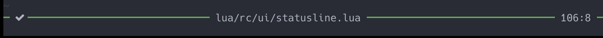
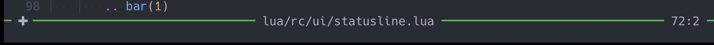
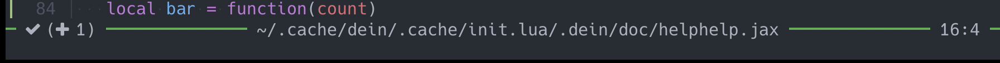
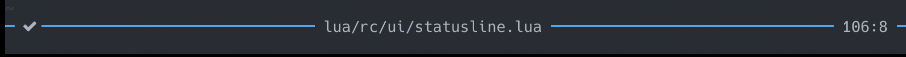
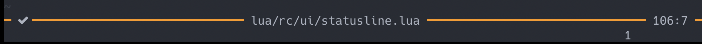
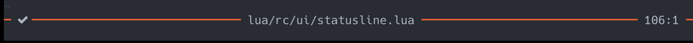
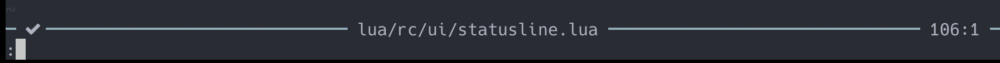
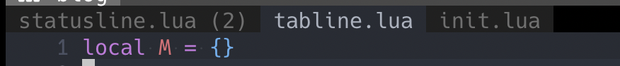

statusline と tabline を自作した。僕の作ったやつの紹介。

実際に statusline・tabline を作ったのは 5 ヶ月ほど前なのだが、それから少しずつ修正を入れていって、現在も使っていて不満点は特にない。

statusline・tabline 関連のオプションは次のようにしてる。

```vim
set laststatus=3
set cmdheight=1
set showtabline=1
```

## 作ったもの

### statusline

表示される要素は 3 つのみに絞ったシンプルなものを作った。左から「保存したかどうか」「ファイル名」「現在の行:列」

保存されてる時はチェックマークになる。



保存してない時はプラスマークになる。



現在バッファ以外が保存されてない時も、その事が分かるようにカッコで表示される。



また、現在のモードによって色が変わるようになっている。上の 3 つの画像はノーマルモードの時の色である。

Insert:



Visual:



Replace:



Command:



### tabline

ファイル名のみを表示するシンプルなものにした。

アクティブなタブは、現在フォーカスが当たっているウィンドウの名前(ファイル名)が表示される。アクティブでないタブで、複数のウィンドウがある場合はその数をカッコで表示している。



## statusline の実装

以降、次の 2 つが定義されているとして書いていく。

```lua
local M = {}
local fn = vim.fn
```

ファイルは `lua/rc/statusline.lua` に書いていく。

### Highlight グループ定義

色をつけるためにいくつかのハイライトグループを定義しておく。僕はハイライトを定義するためのヘルパー関数として次のようなものを用意して、`require(rc.util)` で使えるようにしている。

```lua
---@param hls table
---@return nil
function M.highlight.set(hls)
    for group, value in pairs(hls) do
        vim.api.nvim_set_hl(0, group, value)
    end
end

---@param links table
---@return nil
function M.highlight.link(links)
    for from, to in pairs(links) do
        vim.api.nvim_set_hl(0, from, {
            link = to,
        })
    end
end
```

これを使って次のように statusline 用のグループを作っておく。(`bg = 'NONE'` は `nvim_set_hl()` の仕様上、不要だと思うけど、一応)

```lua
local highlight = require('rc.util').highlight

highlight.link { StatusLine = 'Normal' }
highlight.set {
    StatusLineNormal = { fg = '#4caf50', bg = 'NONE' },
    StatusLineInsert = { fg = '#03a9f4', bg = 'NONE' },
    StatusLineVisual = { fg = '#ff9800', bg = 'NONE' },
    StatusLineReplace = { fg = '#ff5722', bg = 'NONE' },
    StatusLineCommand = { fg = '#8eacbb', bg = 'NONE' },
}
```

### mode()

現在のモードは `vim.fn.mode()` を使うと取得できるが、これによって取得できる文字(引数なしだと最初の 1 文字だけ返される)は少しわかりにくいので、ラッパーを書く。

なお、`^V` は `<C-v><C-v>` で入力できる文字である。

```lua
---@return string
local function mode()
    local m = string.lower(vim.fn.mode())
    if m == 'n' then
        return 'normal'
    elseif m == 'i' then
        return 'insert'
    elseif m == 'c' then
        return 'command'
    elseif m == 'v' or m == '^V' or m == 's' then
        return 'visual'
    elseif m == 'r' then
        return 'replace'
    end
    return 'other'
end
```

### modified_bg_bufs_count()

アクティブでないバッファのうち、保存されていないものの数を取得する関数。vim-jp の slack で紹介されていたものをちょっといじっただけ、ちゃんとは理解してない。

```lua
---@return number
local function modified_bg_bufs_count()
    local cnt = 0
    for i = 1, fn.bufnr('$') do
        if fn.bufexists(i) == 1 and fn.buflisted(i) == 1 and fn.getbufvar(i, 'buftype') == '' and
            fn.filereadable(fn.expand('#' .. i .. ':p')) and i ~= fn.bufnr('%') and
            fn.getbufvar(i, '&modified') == 1 then
            cnt = cnt + 1
        end
    end
    return cnt
end
```

### component

僕の statusline には「ファイル名」「保存したかどうか」「現在の行:列」が表示される。それぞれ「filePath」「modified」「position」として実装する。

ここで `%#StatusLine#` などの `%#...#` という文字列がある。`h: statusline` の一部(vimdoc-ja)を引用する。

> \# -
> ハイライトグループを設定する。
> この後に名前を書き、その後にまた # を書く。つまり、%#HLname# と書くと、ハイライトグループ HLname になる。
> カレントウィンドウ以外のステータスラインに対しても同じ強調が施される。

```lua
local component = {
    filePath = function()
        local path = fn.fnamemodify(fn.expand("%"), ":~:.")
        if path == '' then
            return '', 0
        end
        path = ' ' .. path .. ' '
        return '%#StatusLine#' .. path, fn.strdisplaywidth(path)
    end,
    modified = function()
        local mark = vim.o.modified and '' or ''
        local count = modified_bg_bufs_count()
        if count ~= 0 then
            mark = mark .. ' ( ' .. tostring(count) .. ')'
        end
        mark = ' ' .. mark .. ' '
        return '%#StatusLine#' .. mark, fn.strdisplaywidth(mark)
    end,
    position = function()
        local l = tostring(vim.fn.line('.'))
        local c = tostring(vim.fn.col('.'))
        local pos = ' ' .. l .. ':' .. c .. ' '
        return '%#StatusLine#' .. pos, fn.strdisplaywidth(pos)
    end
}
```

僕は `laststatus = 3` なので、文字の切り詰めはやってない。

### M.statusline()

component 組み合わせて statusline を作る。

```lua
---@return string
function M.statusline()
    local hl = (function()
            local match = {
                normal = '%#StatusLineNormal#',
                visual = '%#StatusLineVisual#',
                insert = '%#StatusLineInsert#',
                replace = '%#StatusLineReplace#',
                command = '%#StatusLineCommand#'
            }
            return match[mode()] or '%#StatusLine#'
        end)()
    local bar = function(count)
        return hl .. string.rep('━', count)
    end

    local columnWidth = vim.o.columns
    local file, fileWidth = component.filePath()
    local modified, modifiedWidth = component.modified()
    local pos, posWidth = component.position()
    return bar(1)
        .. modified
        .. bar(math.floor((columnWidth - modifiedWidth - fileWidth - posWidth - 2) / 2))
        .. file
        .. bar(math.ceil((columnWidth - modifiedWidth - fileWidth - posWidth - 2) / 2))
        .. pos
        .. bar(1)
end
```

### statusline の設定

`require('rc.ui.statusline').statusline()` と呼び出すのは面倒なので、`require('rc.ui.statusline')()` で呼び出せるようにしておく。

```lua
setmetatable(M, {
    __call = function()
        return M.statusline()
    end
})
```

init.lua にて `nvim_set_option()` で statusline を設定する。

```lua
Tabline = require('rc.ui.tabline')
vim.api.nvim_set_option('tabline', '%!v:lua.Tabline()')
```

次に `rc/ui/statusline.lua` の実装全体を折りたたんでおく。

<details>
<summary>実装全体</summary>

```lua
local M = {}

local fn = vim.fn
local highlight = require('rc.util').highlight

highlight.link { StatusLine = 'Normal' }
highlight.set {
    StatusLineNormal = { fg = '#4caf50', bg = 'NONE' },
    StatusLineInsert = { fg = '#03a9f4', bg = 'NONE' },
    StatusLineVisual = { fg = '#ff9800', bg = 'NONE' },
    StatusLineReplace = { fg = '#ff5722', bg = 'NONE' },
    StatusLineCommand = { fg = '#8eacbb', bg = 'NONE' },
}

---@return string
local function mode()
    local m = string.lower(vim.fn.mode())
    if m == 'n' then
        return 'normal'
    elseif m == 'i' then
        return 'insert'
    elseif m == 'c' then
        return 'command'
    elseif m == 'v' or m == '^V' or m == 's' then
        return 'visual'
    elseif m == 'r' then
        return 'replace'
    end
    return 'other'
end

---@return number
local function modified_bg_bufs_count()
    local cnt = 0
    for i = 1, fn.bufnr('$') do
        if fn.bufexists(i) == 1 and fn.buflisted(i) == 1 and fn.getbufvar(i, 'buftype') == '' and
            fn.filereadable(fn.expand('#' .. i .. ':p')) and i ~= fn.bufnr('%') and
            fn.getbufvar(i, '&modified') == 1 then
            cnt = cnt + 1
        end
    end
    return cnt
end

local component = {
    filePath = function()
        local path = fn.fnamemodify(fn.expand("%"), ":~:.")
        if path == '' then
            return '', 0
        end
        path = ' ' .. path .. ' '
        return '%#StatusLine#' .. path, fn.strdisplaywidth(path)
    end,
    modified = function()
        local mark = vim.o.modified and '' or ''
        local count = modified_bg_bufs_count()
        if count ~= 0 then
            mark = mark .. ' ( ' .. tostring(count) .. ')'
        end
        mark = ' ' .. mark .. ' '
        return '%#StatusLine#' .. mark, fn.strdisplaywidth(mark)
    end,
    position = function()
        local l = tostring(vim.fn.line('.'))
        local c = tostring(vim.fn.col('.'))
        local pos = ' ' .. l .. ':' .. c .. ' '
        return '%#StatusLine#' .. pos, fn.strdisplaywidth(pos)
    end
}

---@return string
function M.statusline()
    local hl = (function()
            local match = {
                normal = '%#StatusLineNormal#',
                visual = '%#StatusLineVisual#',
                insert = '%#StatusLineInsert#',
                replace = '%#StatusLineReplace#',
                command = '%#StatusLineCommand#'
            }
            return match[mode()] or '%#StatusLine#'
        end)()
    local bar = function(count)
        return hl .. string.rep('━', count)
    end

    local columnWidth = vim.o.columns
    local file, fileWidth = component.filePath()
    local modified, modifiedWidth = component.modified()
    local pos, posWidth = component.position()
    return bar(1)
        .. modified
        .. bar(math.floor((columnWidth - modifiedWidth - fileWidth - posWidth - 2) / 2))
        .. file
        .. bar(math.ceil((columnWidth - modifiedWidth - fileWidth - posWidth - 2) / 2))
        .. pos
        .. bar(1)
end

setmetatable(M, {
    __call = function()
        return M.statusline()
    end
})

return M
```

</details>

## tabline の実装

tabline は statusline よりもずっと簡単に実装されている。

`rc/ui/tabline.lua` に実装していく。

### Highlight グループ定義

tabline で利用するハイライトグループを定義する。

```lua
highlight.link { TabLineSel = 'Normal' }
highlight.set {
    TabLine = { fg = '#707070', bg = '#202020' },
    TabLineFill = { fg = 'NONE', bg = '#000000' },
}
```

### M.tabline()

ハイライトは statusline の時と同様 `%#TabLine#%` のように設定できる。

`h: tabline` より引用する。

> このオプションの値は 'statusline' と同じように評価される。(略) 1 番目のラベルには "%1T"、2 番目のラベルには "%2T" など。 閉じラベルにはアイテム "%X" を使う。

`:h setting-tabline` に書いてあるのだが、`%1T` のように追加することでマウスクリックができるようになる。最後に `#%T` でリセットする必要がある。

ちなみに `:h setting-tabline` には VimScript だが、簡単な tabline のサンプルがある。そのサンプルを参考に作っている。

```lua
---@return string
function M.tabline()
    local s = ''
    for i = 1, fn.tabpagenr('$') do
        local current = i == fn.tabpagenr()
        local hl = current and '%#TabLineSel#' or '%#TabLine#'
        local id = '%' .. tostring(i) .. 'T'
        local label = (function()
                local buflist = fn.tabpagebuflist(i)
                local winnr = fn.tabpagewinnr(i)
                local name = fn.bufname(buflist[winnr])
                local count = ''
                if not current then
                    count = #buflist == 1 and '' or ' (' .. #buflist .. ')'
                end
                return ' ' .. fn.fnamemodify(name, ':t') .. count .. ' '
            end)()
        s = s .. hl .. id .. label
    end
    return s .. '%#TabLineFill#%T'
end
```

### tabline の設定

statusline の時と同様、`require('rc.ui.tabline')()` で呼び出せるようにする。

```lua
setmetatable(M, {
    __call = function()
        return M.tabline()
    end
})
```

init.lua にて `nvim_set_option()` で tabline を設定する。

```lua
Tabline = require('rc.ui.tabline')
vim.api.nvim_set_option('tabline', '%!v:lua.Tabline()')
```

次に `rc/ui/tabline.lua` の実装全体を折りたたんでおく。

<details>
<summary>実装全体</summary>

```lua
local M = {}

local fn = vim.fn
local highlight = require('rc.util').highlight

highlight.link { TabLineSel = 'Normal' }
highlight.set {
    TabLine = { fg = '#707070', bg = '#202020' },
    TabLineFill = { fg = 'NONE', bg = '#000000' },
}

---@return string
function M.tabline()
    local s = ''
    for i = 1, fn.tabpagenr('$') do
        local current = i == fn.tabpagenr()
        local hl = current and '%#TabLineSel#' or '%#TabLine#'
        local id = '%' .. tostring(i) .. 'T'
        local label = (function()
                local buflist = fn.tabpagebuflist(i)
                local winnr = fn.tabpagewinnr(i)
                local name = fn.bufname(buflist[winnr])
                local count = ''
                if not current then
                    count = #buflist == 1 and '' or ' (' .. #buflist .. ')'
                end
                return ' ' .. fn.fnamemodify(name, ':t') .. count .. ' '
            end)()
        s = s .. hl .. id .. label
    end
    return s .. '%#TabLineFill#%T'
end

setmetatable(M, {
    __call = function()
        return M.tabline()
    end
})

return M
```

</details>

## 参考

- [Custom Neovim Statusline](https://nuxsh.is-a.dev/blog/custom-nvim-statusline.html)
