「IBM Plex Sans JP」と「Hack」を合成したプログラミング用合成フォント「PleckJP」を作成した。
本稿ではその合成スクリプト(Python)について解説する。

[**https://github.com/ryota2357/PleckJP**](https://github.com/ryota2357/PleckJP)

なお、解説するスクリプトは [PleckJP v1.1.0](https://github.com/ryota2357/PleckJP/tree/v1.1.0) 現在のものである。

## 参考

PleckJP の合成フォントは次の合成フォントスクリプトを参考にして作成された。

- SFMono Square
  - リポジトリ: [delphinus/homebrew-sfmono-square](https://github.com/delphinus/homebrew-sfmono-square)
  - 解説記事: [SF Mono を使って最高のプログラミング用フォントを作った話](https://qiita.com/delphinus/items/f472eb04ff91daf44274)
- Juisee
  - リポジトリ: [yuru7/juisee](https://github.com/yuru7/juisee)
- NerdFonts の[font-patcher](https://github.com/ryanoasis/nerd-fonts/blob/5d85a45a9324084808c30515d851e638ac4cd237/font-patcher)

SFMono Square の解説記事は特に参考にした。ありがとうございます。

## 注意

- v1.1.0 現在の生成スクリプトについての説明である。
- 間違いがあるかもしれない。
- PleckJP のバージョンアップによって今後全く異なる処理になるかもしれない。

他の資料や実装をみて確認を行なってください。僕はフォント初心者です。

## 概要

PleckJP の合成にはいくつかの Python スクリプトを組み合わせることで実装されている。各スクリプトは [Makefile](https://github.com/ryota2357/PleckJP/blob/v1.1.0/Makefile) に指定された手順で実行され、[build/PleckJP-\*.ttf](https://github.com/ryota2357/PleckJP/tree/v1.1.0/build)（\*は Regular, Bold などのスタイル名）に生成される。

ビルドは `make` を実行すると行われる。この時、PHONY なターゲット `all` が実行される。

```makefile
.PHONY: all
all:
	@docker-compose up fontforge
	@docker-compose up fonttools
```

全てのスクリプトは docker コンテナ内で実行される。なので fontforge や各種 python ライブラリをローカルにインストールする必要はない。

しかし、fontforge の GUI はローカルにインストールしておくのをお勧めする。
フォントのグリフやメタデータの確認が非常にわかりやすく、簡単に行えるため、開発が楽になる。

### ディレクトリ構造

ざっくりと説明を入れた。

```txt
.
├── Makefile
├── docker-compose.yaml
├── images/                       README用の画像を置いておくところ
├── build/                        生成物
├── resources/
│   ├── glyphs/                   合成元のフォントファイル
│   └── zip/                      合成元のフォントファイルをダウンロードした時のzipファイル
└── src
    ├── fontforge.dockerfile      FontForgeを使った編集をする環境の記述
    ├── fonttools.dockerfile      FontToolsを使った編集をする環境の記述
    ├── fontforge_/
    │   ├── properties.py         PleckJPの定数値
    │   ├── util.py               ユーティリティ、使うところで適宜解説を入れる
    │   └── ...
    └── fonttools_
        └── main.py
```

## スクリプトの全体像

[src/](https://github.com/ryota2357/PleckJP/tree/v1.1.0/src) 下の Python スクリプトがそれぞれどのような役割を持っているか説明するため、まず、PleckJP の生成がどのような過程を経て行われるかを説明する。

PleckJP は Hack、IBM Plex Sans JP、Nerd Fonts を合成したフォントであることは README などにも書いてあるが、実はもう 1 つ、8 点点字グリフをスクリプトで生成し、合成している（Braille.ttf）。

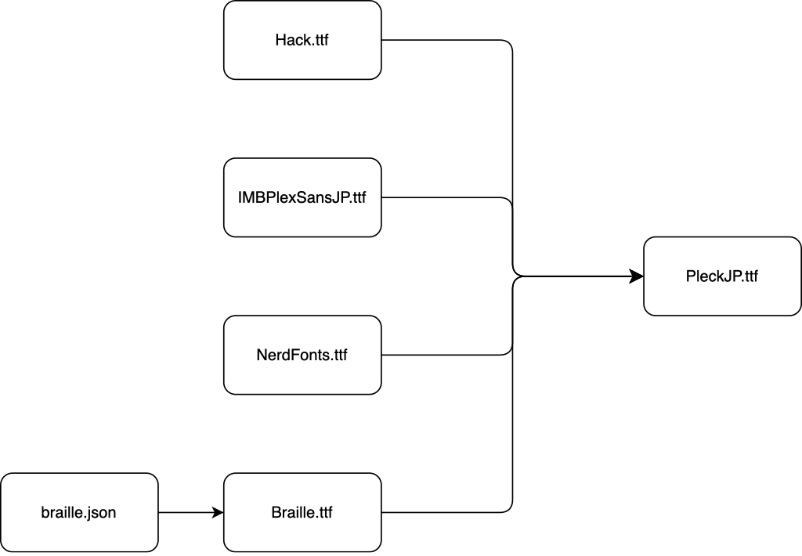

しかし実際は上図のように単純な合成をすれば良いという訳ではない。
Hack と IBM Plex Sans JP ではグリフの大きさが異なっていたり、不要・必要なグリフの削除・追加など、合成前に編集する必要がある。

また、Nerd Fonts とは devicon や Font Awesome、Powerline Symbol といった 10 種類程度のフォントの集まりのことを指しており、NerdFonts.ttf というようなファイルが存在する訳ではない。
なので 10 個ほどの ttf ファイルを調整・合成して NerdFonts.ttf を生成する必要がある。
（これが大変なので NerdFonts 公式が FontPatcher というスクリプトを公開している。FontPatcher は、あるフォントに対して NerdFonts のパッチを自動調整して当ててくれる。しかし僕はそれを使用せず、独自の調整・合成を行なっている。）

従って、先ほどの図は次のようになる。

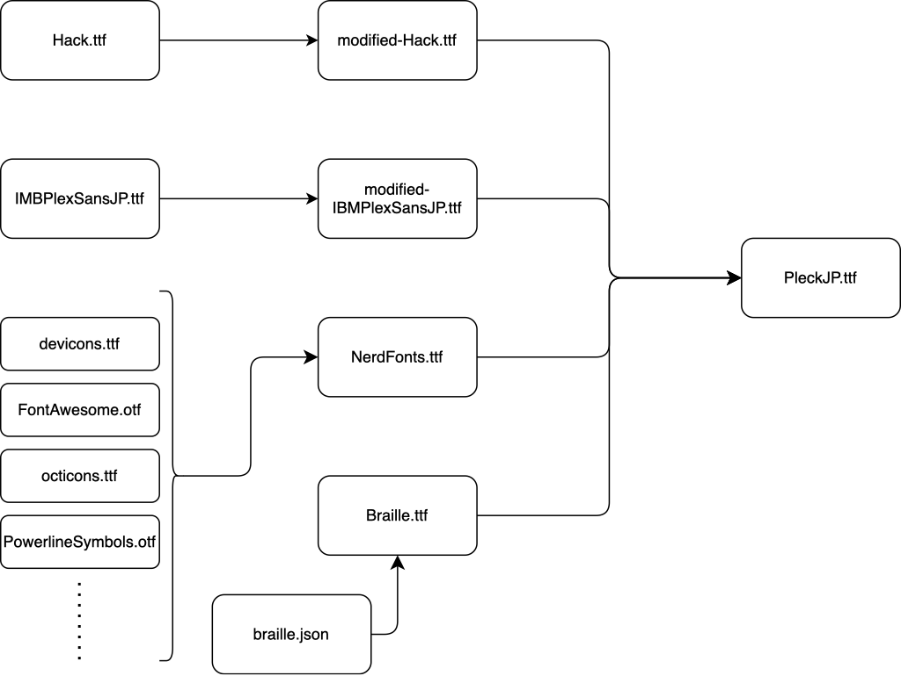

上図の手順でも問題はないのだが、デバッグやビルド速度の都合上、modified-Hack.ttf と modified-IBMPlexSansJP を先に合成し(merged-PeckJP.ttf)、その後に NerdFonts と点字グリフを合成する。

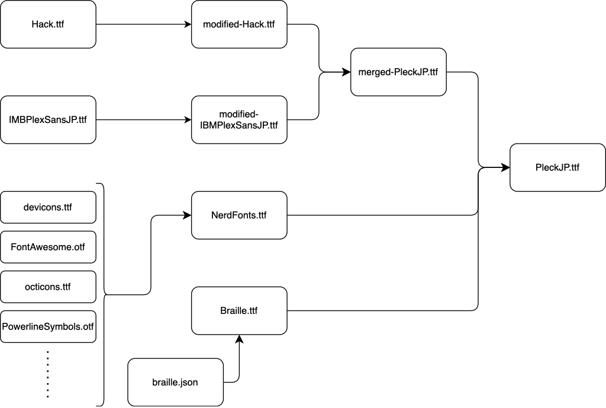

以上の手順は [src/fontforge\_/](https://github.com/ryota2357/PleckJP/tree/v1.1.0/src/fontforge_) 下の Python スクリプトを用いて行う。
これで PleckJP の合成は終了なのだが、最後に FontForge からいじれなかったメタデータの修正を FontTools を用いて行う。

以上より、スクリプトの全体像は次のようになる。

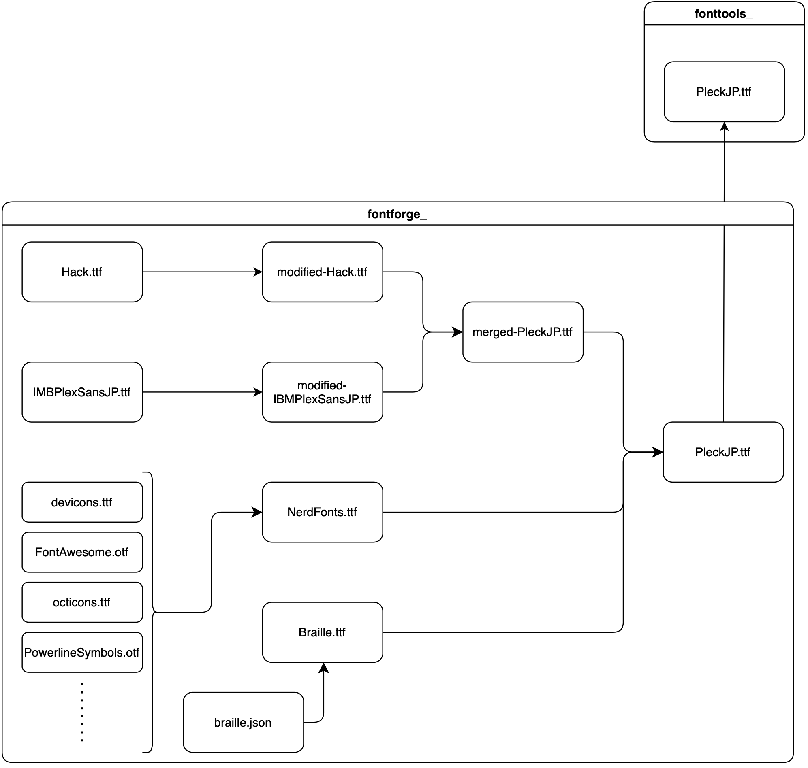

この手順を [Makefile](https://github.com/ryota2357/PleckJP/blob/v1.1.0/Makefile) に記述してある。

なお、上記手順は 1 つのフォントスタイルを生成する手順である。
PleckJP は Regular、Bold、Italic、BoldItalic と 4 つのフォントスタイルがある。
つまり、上記手順を 4 回行なっている。

## 各スクリプトの説明

前項で示した手順を実現するスクリプトについてそれぞれ説明する。

### Hack の調整 ([fontforge\_/modify_hack.py](https://github.com/ryota2357/PleckJP/blob/v1.1.0/src/fontforge_/modify_hack.py))

以降、↑のようにスクリプトへのリンク(GitHub)を載せる。
スクリプト全体を本稿に載せることはしないので、リンク先から全体を参照してほしい。

modify_hack.py では Hack フォントのグリフの調整をする。

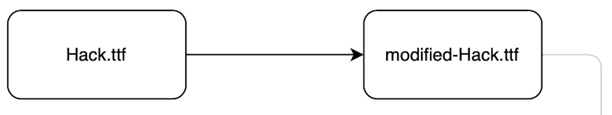

まず、コマンドライン引数にて Hack フォントの ttf ファイルへのパス(`FONT_FILE`)と調整後の ttf ファイルの出力パス(`BUILD_FILE`)を受け取る。

```python
FONT_FILE = sys.argv[1]
BUILD_FILE = sys.argv[2]
```

`main()` を見る。コメントで解説を入れた。

```python
import util

def main() -> None:
    font = fontforge.open(FONT_FILE)

    # 使用しないグリフの削除を行う。
    util.font_clear_glyph(font, 0x2003)
    util.font_clear_glyph(font, 0x266a)
    util.font_clear_glyph(font, 0xe0a0, 0xe0b3)

    # EM 値の設定 (後で説明)
    util.font_set_em(font, const.ASCENT, const.DESCENT, const.EM)

    # 全てのグリフを半角 (EM // 2) に統一する。(後で説明)
    util.font_resize_all_width(font, const.EM // 2)

    # ゴニョゴニョ編集 (説明しない、実装読んで...)
    fix_subscript_numbers(font)
    create_up_tack(font)
    modify_0(font)
    modify_m(font)

    # グリフ座標修正 (後で説明)
    util.fix_all_glyph_points(font, round=True)

    # ファイルへ保存
    util.font_into_file(font, BUILD_FILE)

    # ログを出す。(print(..., flash=True)してるだけ)
    util.log("Modified:", FONT_FILE, "->", BUILD_FILE)
```

font を開き、ゴニョゴニョ編集して、ファイルへ保存している。

`modify_0(font)` と `modify_m(font)` については、[FontForgeとPythonでGlyph (Contour) の編集(追加・削除)方法](../fontforge-add-erase-glyph-with-python/)で説明している。

使用した util.py の関数の説明をする。

<!-- prettier-ignore -->
### util.font_set_em ([fontforge\_/util.py#L21-L28](https://github.com/ryota2357/PleckJP/blob/v1.1.0/src/fontforge_/util.py#L21-L28))

```python
def font_set_em(font, ascent: int, descent: int, em: int) -> None:
    old_em = font.em
    font.selection.all()
    font.unlinkReferences()
    font.ascent = round(float(ascent) / em * old_em)
    font.descent = round(float(descent) / em * old_em)
    font.em = em
    font.selection.none()
```

ascent と descent に値をセットした後、em に値をセットすると em プロパティに値をセットするとグリフが自動的に拡大縮小されて調整が行われる。
(ref: [1.Ascent/Descent（フォントの高さ）の調整](https://qiita.com/delphinus/items/f472eb04ff91daf44274#1-ascentdescent%E3%83%95%E3%82%A9%E3%83%B3%E3%83%88%E3%81%AE%E9%AB%98%E3%81%95%E3%81%AE%E8%AA%BF%E6%95%B4))

`unlinkReferences()` は必要ないかもしれないけど、一応やってる。

> **font.unlinkReferences()**  
> Unlinks all references in all selected glyphs and replaces them with splines.
> [https://fontforge.org/docs/scripting/python/fontforge.html#fontforge.font.unlinkReferences](https://fontforge.org/docs/scripting/python/fontforge.html#fontforge.font.unlinkReferences)

<!-- prettier-ignore -->
#### util.font_resize_all_width ([fontforge\_/util.py#L31-L38](https://github.com/ryota2357/PleckJP/blob/v1.1.0/src/fontforge_/util.py#L31-L38))

拡大と移動の行列を使ってスケーリングを行う。

```python
def font_resize_all_width(font, new_width: int) -> None:
    for glyph in font.glyphs():
        if glyph.width == new_width:
            continue
        if glyph.width != 0:
            fix_scale_mat = psMat.scale(float(new_width) / glyph.width)
            glyph.transform(fix_scale_mat)
        glyph.width = new_width
```

`glyph.width` が 0 であるグリフが存在することに注意すること。分岐してあげないとゼロ割り算をすることになる。

width が 0 のグリフは `new_width` にせず、0 のままにしておいた方がいいのかもしれないが、今のところ問題は起きてないので、全部 `new_width` にする実装となっている。
ちゃんと確認した方がいいかもしれない。(面倒...)

<!-- prettier-ignore -->
#### util.fix_all_glyph_points ([fontforge\_/util.py#L41-L46](https://github.com/ryota2357/PleckJP/blob/v1.1.0/src/fontforge_/util.py#L41-L46))

グリフを編集する過程でグリフの座標が良くない座標になることがある。（例えばグリフの拡大縮小で各点の座標が整数ではなく小数となる）
この関数はグリフの各点の座標を修正する。

```python
def fix_all_glyph_points(font, round: bool = False, addExtrema: bool = False) -> None:
    for glyph in font.glyphs():
        if round:
            glyph.round()
        if addExtrema:
            glyph.addExtrema("all")
```

FontForge の Python API ドキュメントを読んだことがあるならば、`font.round()` などの特定の glyph に対してではなく font 全体に対して `round()` や `addExtrema()` を行えることを知っているかもしれない。

僕が `fix_all_glyph_points()` 内で `glyph.round()` などを使用した理由は `font` に対してではなぜか round や addExtrema されないグリフを発見したからだ。
原因はよくわかっていない（おそらく複数または 0 個のコードポイントをもつグリフの存在が原因だと思うのだが...）。

> **glyph.round([factor])**  
> Rounds the x and y coordinates of each point in the glyph. If factor is specified then `new-coord = round(factor\*old-coord)/factor`  
> [https://fontforge.org/docs/scripting/python/fontforge.html#fontforge.glyph.round](https://fontforge.org/docs/scripting/python/fontforge.html#fontforge.glyph.round)

> **glyph.addExtrema([flags, emsize])**  
> Extrema should be marked by on-curve points. If a curve lacks a point at an extrema this command will add one.
> (all: Add all missing extrema)  
> [https://fontforge.org/docs/scripting/python/fontforge.html#fontforge.glyph.addExtrema](https://fontforge.org/docs/scripting/python/fontforge.html#fontforge.glyph.addExtrema)

### IBM Plex Sans JP の調整 ([fontforge\_/modify_ibm_plex_sans_jp.py](https://github.com/ryota2357/PleckJP/blob/v1.1.0/src/fontforge_/modify_ibm_plex_sans_jp.py))

modify_ibm_plex_sans_jp.py では IBM Plex Sans JP フォントのグリフの調整をする。

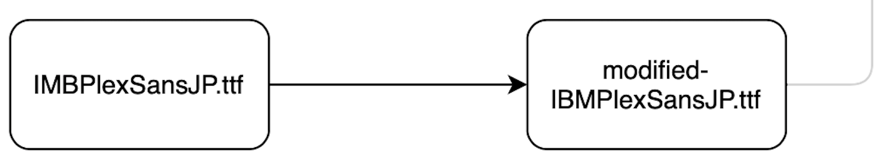

1 つ前の modify_hack.py で説明したこと以外を説明する。

```python
def main() -> None:
    font = fontforge.open(FONT_FILE)

    # カーニング情報を削除する。
    # グリフの編集をする場合はカーニング情報を消したほうがいいっぽい。
    for lookup in font.gpos_lookups:
        if lookup.startswith("'halt'") or \
           lookup.startswith("'vhal'") or \
           lookup.startswith("'palt'") or \
           lookup.startswith("'vpal'") or \
           lookup.startswith("'kern'") or \
           lookup.startswith("'vkrn'"):
            font.removeLookup(lookup)

    # 縦書きグリフは使わないので削除する。
    # グリフの削除だけでなく、lookup テーブルの削除もした方がいい。
    #     lookupテーブルの名前は FontForge の GUI で確認。
    #     縦書きグリフかどうかは、IMB Plex Sans JP では endswith(".rotat") で判定できた。
    font.removeLookup("'vert' Vertical Alternates lookup 18")
    font.removeLookup("'vrt2' Vertical Rotation & Alternates lookup 19")
    for glyph in font.glyphs():
        if glyph.unicode != -1:
            continue
        name = glyph.glyphname
        if name.endswith(".rotat"):
            util.font_clear_glyph(font, name)

    # 使用しないグリフの削除
    util.font_clear_glyph(font, 0x20, 0x2002)
        # (中略)
    util.font_clear_glyph(font, 0x25a0, 0x25ef)

    # EM 設定
    util.font_set_em(font, const.ASCENT, const.DESCENT, const.EM)

    # 多くのグリフが↑の EM 設定で 半角 or 全角の幅になるのだが、
    # 一部のグリフはどちらでもない幅になるので修正する。
    util.glyph_riseze_width(font[0x2103], const.EM // 2)  # ℃
        # (中略)
    for name in ("perthousand.full", "uni51F0"):
        util.glyph_riseze_width(font[name], const.EM)

    # ゴニョゴニョ編集
    modify_whitespace(font)
    resize_all_scale(font)

    # 保存、ログ
    util.fix_all_glyph_points(font, round=True)
    util.font_into_file(font, BUILD_FILE)
    util.log("Modified:", FONT_FILE, "->", BUILD_FILE)
```

modify_hack.py で util 周りは説明したので、[FontForge の Python API ドキュメント](https://fontforge.org/docs/scripting/python.html)に書いてあること以上に追加で説明することは特にない。

### 調整した Hack と IBM Plex Sans JP の合成 ([fontforge\_/merge.py](https://github.com/ryota2357/PleckJP/blob/v1.1.0/src/fontforge_/merge.py))

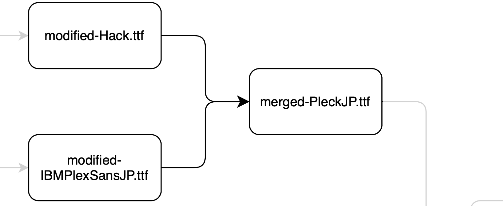

コマンドライン引数受け取りが少しごちゃっとしてる。

```python
def is_font_style(style: str) -> TypeGuard[Literal["Regular", "Bold", "Italic", "BoldItalic"]]:
    return style in ["Regular", "Bold", "Italic", "BoldItalic"]

FONT_EN_TTF = sys.argv[1]
FONT_JP_TTF = sys.argv[2]
if not is_font_style(sys.argv[3]):
    raise ValueError("Invalid font style")
else:
    FONT_STYLE = sys.argv[3]
BUILD_FILE = sys.argv[4]
```

型を付けるためこうなっているが、次と同じである。

```python
FONT_EN_TTF = sys.argv[1]
FONT_JP_TTF = sys.argv[2]
FONT_STYLE = sys.argv[3]
BUILD_FILE = sys.argv[4]
```

`main()` は結構シンプルである。

```python
def main() -> None:
    font = new_font()

    # 合成
    merge_en(font)
    merge_jp(font)

    # Italic と BoldItalic の場合はグリフを傾ける
    if "Italic" in FONT_STYLE:
        make_italic(font)
        util.fix_all_glyph_points(font, round=True, addExtrema=True)
    else:
        util.fix_all_glyph_points(font, addExtrema=True)

    # 適当に情報を付加する
    font.selection.all()
    font.autoHint()
    font.autoInstr()
    font.selection.none()

    # 保存、ログ
    util.font_into_file(font, BUILD_FILE)
    util.log("Generated:", BUILD_FILE)
```

`new_font()` ではフォントのメタデータを頑張って 1 つずつ設定している。
他のフォントのメタデータ見て適当に設定していく。

`merge_jp(font)` は少し説明する。

<!-- prettier-ignore -->
#### merge_jp(font) ([fontforge\_/merge.py#L55-L66](https://github.com/ryota2357/PleckJP/blob/v1.1.0/src/fontforge_/merge.py#L55-L66))

名前の通り引数の `font` に日本語グリフ (`FONT_JP_TTF`) を合成する関数である。

```python
def merge_jp(font) -> None:
    jp_font = fontforge.open(FONT_JP_TTF)
    font.mergeFonts(jp_font)
    for glyph in jp_font.glyphs():
        unicode = glyph.unicode
        if unicode == -1:
            continue
        if glyph.altuni is not None:
            font[unicode].altuni = glyph.altuni
        font[unicode].unicode = unicode
    jp_font.close()
    util.log("Merged:", FONT_JP_TTF, "->", BUILD_FILE)
```

ここで注意するのは、`glyph.altuni` である。
これは `mergeFonts()` でマージされない。

`glyph.altuni` がマージ(コピー)されないと、1 部グリフが欠けるという現象が発生する。
PleckJP では、altuni がマージされていなかった時(v0.1.0)、かなりの数の漢字グリフが欠けていた。(多分 100 以上はあったと思う)

余談だが、この 1 部の漢字グリフが欠ける問題の原因が当初(v0.1.0 の時)全くわからず、altuni が原因だとわかったのは v0.2.2 の時 (5 回目のリリース) であった。

### NerdFonts の生成 ([fontforge\_/bundle_nf.py](https://github.com/ryota2357/PleckJP/blob/v1.1.0/src/fontforge_/bundle_nf.py))

気合い。

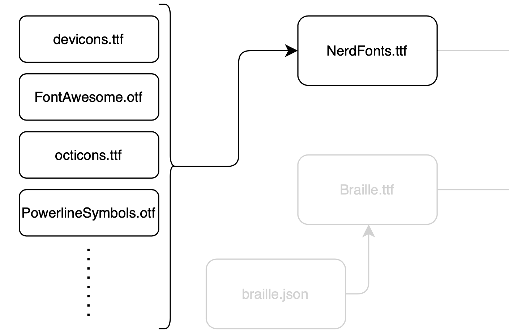

1 つ説明しておくと、NerdFonts の生成では `font.mergeFonts()` は使わないほうがいい。
[bundle_nf.py#L238-L242](https://github.com/ryota2357/PleckJP/blob/v1.1.0/src/fontforge_/bundle_nf.py#L238-L242) のようにグリフを copy して paste して複数のフォントを 1 つのフォントにまとめる。

```python
while to_codepoint and from_codepoint:
    font.selection.select(from_codepoint)
    font.copy()
    font.selection.select(to_codepoint)
    font.paste()
```

これは FontPatcher も同様のことを行なっている。おそらく、真にグリフのみをマージしたいから（lookup などをマージしたくないから）だと思われる。

### 8点点字の生成 ([fontforge\_/braille_gen.py](https://github.com/ryota2357/PleckJP/blob/v1.1.0/src/fontforge_/braille_gen.py))

8 点点字のデータ([fontforge\_/braille.json](https://github.com/ryota2357/PleckJP/blob/v1.1.0/src/fontforge_/braille.json))は [SFMono Square](https://github.com/delphinus/homebrew-sfmono-square) のリポジトリから持ってきて、少し編集を加えた。

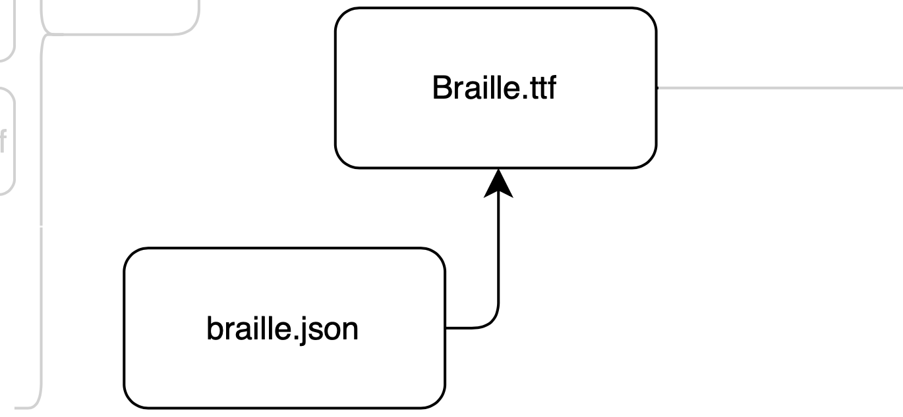

`draw_circle()` がこのスクリプトの重要なところである。コメントで説明を入れた。

```python
def draw_circle(pen, center_pos: NDArray, radius: int) -> None:
    # 角度 rad の単位ベクトルを作成
    def vector_from_rad(rad: float) -> NDArray:
        return np.array([cos(rad), sin(rad)])

    # 二つの直線の交点の座標を求める。
    # 1つの直線は (1つの方向ベクトル) + (通る点) で表す。
    #   引数の normal_vec1 と pos1 で1つの直線を表している。
    def intersection(normal_vec1: NDArray, pos1: NDArray, normal_vec2: NDArray, pos2: NDArray) -> tuple[int, int]:
        # 実装省略

    # 必ず時計回りで描くこと。
    # Contour は線の方向で内側を塗りつぶすか、切り抜く(透明にするか) が決まる。
    for i in range(4):
        vec1 = vector_from_rad(-1 * i * PI / 2)
        vec2 = vector_from_rad(-1 * (i + 1) * PI / 2)
        vec3 = vector_from_rad(-1 * (2 * i + 1) * PI / 4)
        pos1 = center_pos + (vec1 * radius)
        pos2 = center_pos + (vec2 * radius)
        pos3 = center_pos + (vec3 * radius * 1.1)  # 真円になるように適当な数をかける。

        curve_point1 = intersection(vec1, pos1, vec3, pos3)
        curve_point2 = intersection(vec2, pos2, vec3, pos3)
        if i == 0:
            pen.moveTo(pos1)
        pen.curveTo(curve_point1, curve_point2, pos2)
    pen.closePath()
```

3 時 → 6 時、6 時 → 9 時、9 時 → 12 時、12 時 → 3 時、という順番で `pen.curveTo()` で線を描いていく。

もっと簡単に円を書く方法があるかもしれないが僕には思いつかなかった。

### PleckJP へ合成 ([fontforge\_/patch.py](https://github.com/ryota2357/PleckJP/blob/v1.1.0/src/fontforge_/patch.py))

これに関しては、ただ `font.mergeFonts()` してるだけなので、特に説明はない。

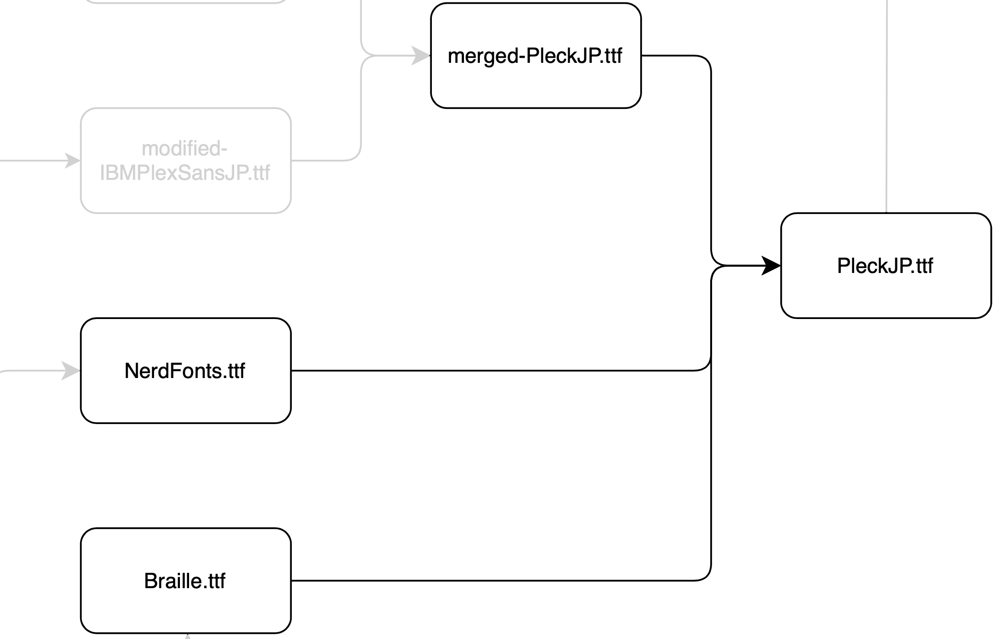

### FontTools での修正 ([fonttools\_/main.pyt](https://github.com/ryota2357/PleckJP/blob/v1.1.0/src/fonttools_/main.py))

FontForge でいじれなかったフォントデータを編集する。

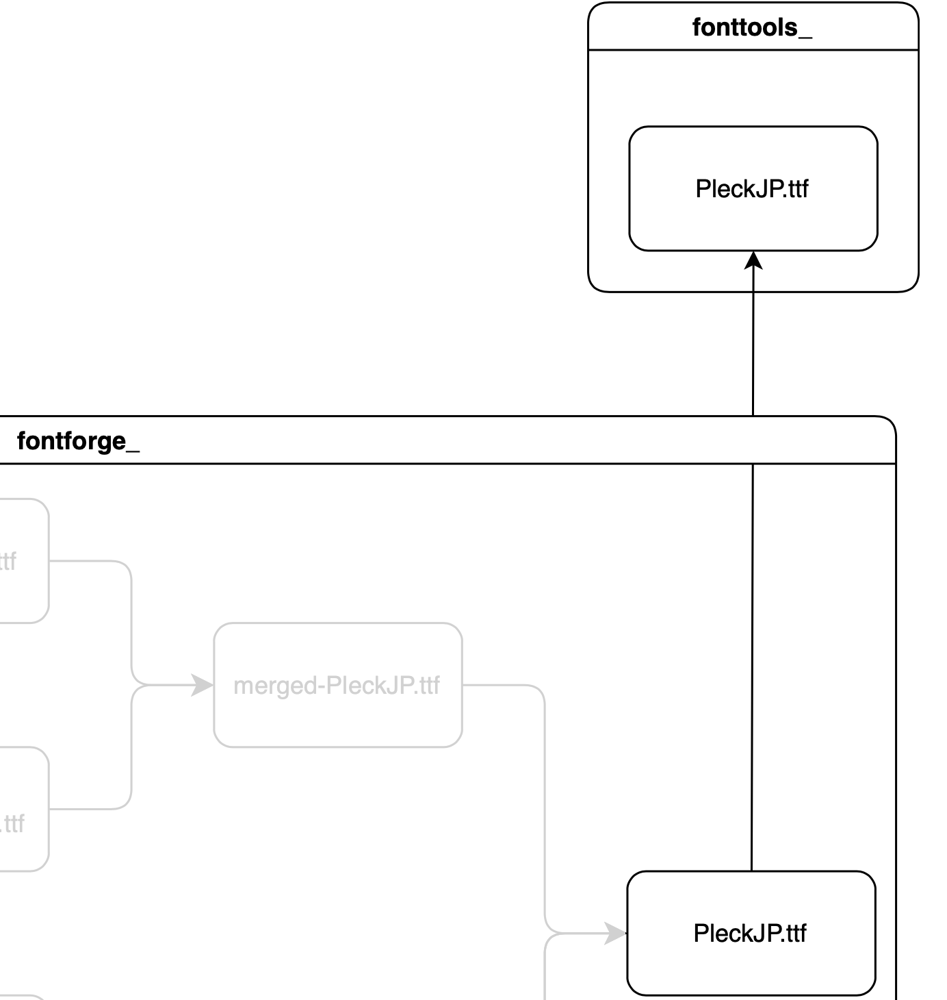

[macOSで等幅フォントとして分類されない](https://github.com/ryota2357/PleckJP/issues/1) という問題を解決するためには FontTools を使う方法しかわからなかった。

[juisee の fonttools_script.py](https://github.com/yuru7/juisee/blob/8438ed4f5d80218f5459e491ead42fc62cfd931f/fonttools_script.py) を参考に (というかほぼコピペ) している。

## 最後に

合成フォントの作り方について情報が少なくて、結構試行錯誤しながらやっとできたという感じである。
けど、そんなに難しいことはやってない。知識・情報不足でつまずいた。

もっといろんな人が合成フォント作って情報増えると良いなと思っている。
