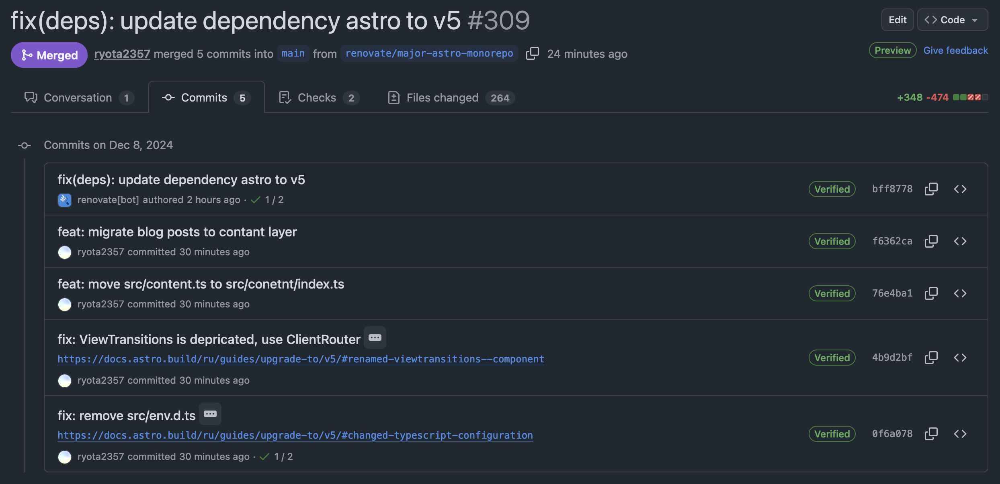

> この記事は [ryota2357 Advent Calendar 2024](https://adventar.org/calendars/10716) の 8 日目の記事です。

5 日ほど前の 12/3 に [Astro.js v5 がリリース](https://astro.build/blog/astro-5/)された。
この v5 の一番の注目点は Content Layer であろう。

このサイト現在は Astro.js で構築されている。
今回 v5 がリリースされたので Content Collection で管理・生成されていた各記事を Content Layer に移行した。
また、`ViewTransitions` コンポーネントの名前変更と、TypeScript 型ファイルの移動の対応も行った。
これら v4 から v5 への移行で行ったことを書いていく。

## コミット (PR)

変更は [ryota2357/ryota2357.com#309](https://github.com/ryota2357/ryota2357.com/pull/309) にて行われた。
Renovate のバージョンアップ PR にコミットを繋げている。



## Content Layer

Experimental の時に Content Layer を使用した日本語記事があったので、これを参考に導入した。コミットは [f6362ca](https://github.com/ryota2357/ryota2357.com/commit/f6362ca3a8719c6b4d86d9b72326fe9825438d6e)。

[Astro4.14 Content Layer API - 趣味のNote](https://ubanis.com/note/astro414_content/)

### 記事(markdown)の移動

Content Collection の時は Content を置けるのが src/content 以下に制限されていたが、Content Layer ではそれがなくなった。
これまでブログ記事は src/content/blog においていたのを content/blog に移動した。

なお、Content Layer の設定は Content Collection の時と同様、src/content/config.ts で行うので、これは動かしてはいけない。

また、僕は Content Collection で記事以外に src/content/works/ 以下で yaml ファイルを管理している。
今回これらの Content Layer への移行は行わなかった。
このことから、Astro.js v5 では Content Collection と Content Layer の共存可能であることがわかった。

### src/content/config.ts の修正

記事を Content Layer に移行するため該当部分を修正する。
Content Layer に移行せず、Content Collection を引き続き使用するものに関しては修正する必要はない。

```diff
 import { defineCollection, z } from "astro:content";
+import { glob } from "astro/loaders";

 const blogCollection = defineCollection({
-  type: "content",
+  loader: glob({ pattern: "**/*.md", base: "./content/blog" }),
   schema: z.object({
     title: z.string(),
     postdate: z.coerce.date(),
     update: z.coerce.date(),
     tags: z.array(z.string()),
     draft: z.boolean().optional().default(false),
   }),
 });
```

### `CollectionEntry<C>["slug"]` を `CollectionEntry<C>["id"]` にする

Content Layer にすると、`getCollection` で取得できていたオブジェクトから `slug` フィールドがなくなる。
おそらく型エラーがでているはず (もしくは astro check とかででるはず) なので、それらを `id` フィールドに書き換える。

```diff
src/pages/blog/[year]/[slug].astro
        <ul class="mx-0 my-4 grid grid-flow-col justify-between gap-3">
          <li>
            {prevPost && (
-             <a href={path.join("/blog", prevPost.slug, "/")} rel="prev">
+             <a href={path.join("/blog", prevPost.id, "/")} rel="prev">
                ← {prevPost.data.title}
              </a>
            )}
          </li>
          <li>
            {nextPost && (
-             <a href={path.join("/blog", nextPost.slug, "/")} rel="next">
+             <a href={path.join("/blog", nextPost.id, "/")} rel="next">
                {nextPost.data.title} →
              </a>
            )}
```

先ほどあげた[参考記事](https://ubanis.com/note/astro414_content/)では \[...slug\].astro のファイル名を \[...id\].astro に変えていたが、僕は変えず、\[...slug\].astro のままにした。
フィールド名は確かに `id` に変わったが、`slug` の方が具体的なので、コード・ファイルの意味がわかりやすいと思ったからだ。

### render の変更

`getCollection` で取得できたオブジェクトから `render` フィールドがなくなった。
`astro:content` から `render` 関数を import してそれを利用するようだ。

```diff
src/pages/blog/[year]/[slug].astro
 import path from "node:path";
 import { Image } from "astro:assets";
+import { render } from "astro:content";
 import { util, allBlogCollection } from "@/content";

 ...省略

 type Props = InferGetStaticPropsType<typeof getStaticPaths>;
 const { post, prevPost, nextPost } = Astro.props;
-const { Content } = await post.render();
+const { Content } = await render(post);
 const formatTime = (time: Date) => dayjs(time).format("YYYY/MM/DD (HH:mm)");
 ---
```

## ViewTransitions コンポーネントの名前変更

v5 での Breaking Changes のうちの 1 つである。
コミットは [4b9d2bf](https://github.com/ryota2357/ryota2357.com/commit/4b9d2bfe5971641451ad656e1b5b5a34e67c6f7f#diff-7f2bb650ebd4f62eed5e3c6f8b11553b541064b5a9ef01c815cb148e716090beR7)。

Upgrade ガイド ([Renamed: `<ViewTransitions />` component](https://docs.astro.build/ru/guides/upgrade-to/v5/#renamed-viewtransitions--component)) に書いてある通りだが、ただ名前を変えればいいだけである。

```diff
 import "destyle.css";
-import { ViewTransitions } from "astro:transitions";
+import { ClientRouter } from "astro:transitions";
 import Footer from "@/components/Footer.astro";
 import HeadSEO from "@/components/HeadSEO.astro";
         }
       }
     </style>
-    <ViewTransitions />
+    <ClientRouter />
   </head>
   <body>
```

## TypeScript 型ファイルの移動

src/env.d.ts から .astro/types.d.ts に移動された。コミットは [0f6a078](https://github.com/ryota2357/ryota2357.com/commit/0f6a078b3cfba8fa0c3a6aa8db58bc5c92565765)。

これも Upgrade ガイド ([Changed: TypeScript configuration](https://docs.astro.build/ru/guides/upgrade-to/v5/#changed-typescript-configuration)) の通りに修正すれば良い。

## 最後に

Astro.js は v3 の頃に [Gatsby.js から移行](../../2023/migrate-to-astro-from-gatsby)したので、今回でメジャーバージョンアップは 2 回目だった。
v3 -> v4 は `get` を `GET` に変えるくらいの小さなものだったと記憶しているが、今回 v4 -> v5 は Content Layer への移行もありコードをいくつか書き換えた。
しかしその作業は[参考記事](https://ubanis.com/note/astro414_content/)の存在もありスムーズに行えた。
