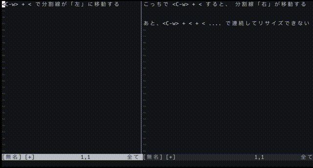
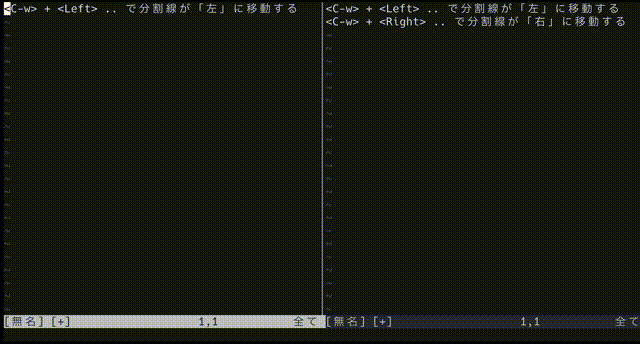
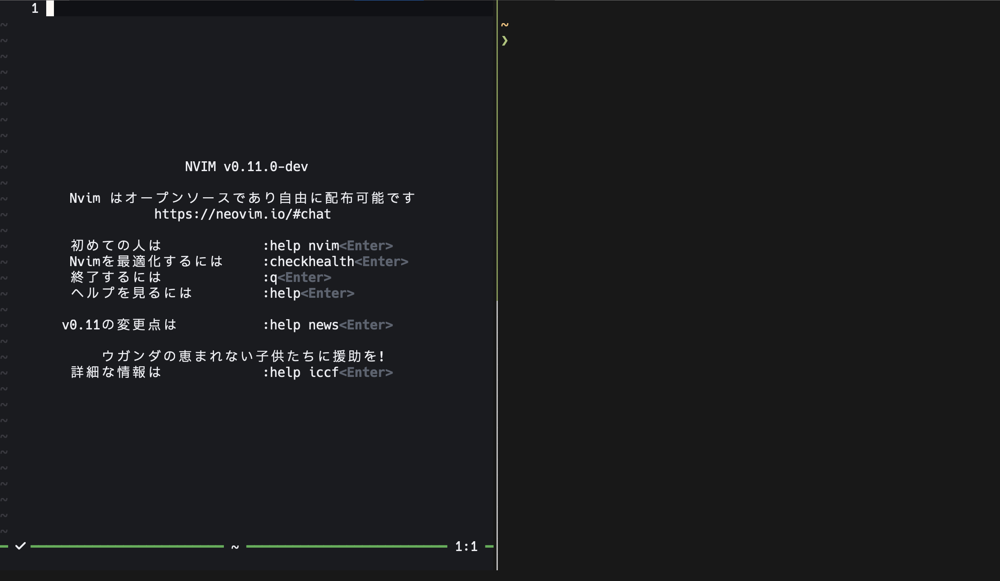

> この記事は [Vim Advent Calender 2024](https://qiita.com/advent-calendar/2024/vim) の 11 日目の記事です。

既存の Vim / Neovim (以下 Vim に統一) のウィンドウのリサイズは、`<C-w>`+`>`, `<C-w>`+`<`, `<C-w>`+`+`, `<C-w>`+`-` でできる。

しかし、次の GIF も見てもらうとわかりやすいのだが、これらキーでは少しずつしかリサイズできない上に、分割線の移動方向に注目したリサイズではない。



これは少しやりづらいので次のように `<C-w>` + 矢印キーで連続リサイズ・分割線の移動をできるようにした。
(僕は矢印キーを使ったが、`H`, `J`, `K`, `L` などにもできる。)



## スクリプト

Vim script で書いている。Vim / Neovim の両方で動作する (と思う)。

```vim
" `<Cmd>` などのキーコードをマッピングできるようにエスケーブを行う
function! s:keycode(keys) abort
  return substitute(a:keys, '<[^>]*>', '\=eval(''"\'' .. submatch(0) .. ''"'')', 'g')
endfunction

" `direct` 方向に隣接するウィンドウが存在するかをチェックする
function! s:has_edge(direct) abort
  if a:direct ==# 'left'
    return winnr('h') != winnr()
  elseif a:direct ==# 'down'
    return winnr('j') != winnr()
  elseif a:direct ==# 'up'
    return winnr('k') != winnr()
  elseif a:direct ==# 'right'
    return winnr('l') != winnr()
  endif
  echoerr 'invalid direct'
  return false
endfunction

" `s:win_resize_cmd_dict` を更新する
" `direct` の方向にウィンドウ分割線を移動させるマッピング文字列を返す
function! s:win_resize_count_cmd_with_update(direct, count1) abort
  let l:signs = #{ left: '-', down: '+', up: '-', right: '+' }
  if s:has_edge('left') && !s:has_edge('right')
    let l:signs['left'] = '+'
    let l:signs['right'] = '-'
  endif
  if s:has_edge('up') && !s:has_edge('down')
    let l:signs['up'] = '+'
    let l:signs['down'] = '-'
  endif
  let s:win_resize_cmd_dict = #{
      \ left:  s:keycode('<Cmd>vertical resize ' .. l:signs['left'] .. '1<CR>'),
      \ right: s:keycode('<Cmd>vertical resize ' .. l:signs['right'] .. '1<CR>'),
      \ down:  s:keycode('<Cmd>resize ' .. l:signs['down'] .. '1<CR>'),
      \ up:    s:keycode('<Cmd>resize ' .. l:signs['up'] .. '1<CR>'),
      \ }
  if a:direct ==# 'left' || a:direct ==# 'right'
    return s:keycode('<Cmd>vertical resize ' .. l:signs[a:direct] .. a:count1 .. '<CR>')
  else
    return s:keycode('<Cmd>resize ' .. l:signs[a:direct] .. a:count1 .. '<CR>')
  endif
endfunction

function! s:win_resize_cmd(direct) abort
  return get(s:win_resize_cmd_dict, a:direct, '')
endfunction

nmap <Plug>(window-resize-mode) <Nop>

nnoremap <expr> <C-w><Down>  <SID>win_resize_count_cmd_with_update('down', v:count1)  .. '<Plug>(window-resize-mode)'
nnoremap <expr> <C-w><Up>    <SID>win_resize_count_cmd_with_update('up', v:count1)    .. '<Plug>(window-resize-mode)'
nnoremap <expr> <C-w><Right> <SID>win_resize_count_cmd_with_update('right', v:count1) .. '<Plug>(window-resize-mode)'
nnoremap <expr> <C-w><Left>  <SID>win_resize_count_cmd_with_update('left', v:count1)  .. '<Plug>(window-resize-mode)'
nnoremap <expr> <Plug>(window-resize-mode)<Down>  <SID>win_resize_cmd('down')  .. '<Plug>(window-resize-mode)'
nnoremap <expr> <Plug>(window-resize-mode)<Up>    <SID>win_resize_cmd('up')    .. '<Plug>(window-resize-mode)'
nnoremap <expr> <Plug>(window-resize-mode)<Right> <SID>win_resize_cmd('right') .. '<Plug>(window-resize-mode)'
nnoremap <expr> <Plug>(window-resize-mode)<Left>  <SID>win_resize_cmd('left')  .. '<Plug>(window-resize-mode)'
```

最後の 8 行がマッピングなので、ここの `<Down>` を `j` に変えるなど任意のキーに変えれば、そのキーでリサイズできるようになる。

## tmux との連携

僕は tmux 内で neovim を使用している。

vim のリサイズと同じキーで同じように tmux のペインもリサイズしたいので、次の設定を tmux.conf にしている。
コメントにもリンクを記載しているが、これは [Pane (tmux) - Window (vim) の移動をシームレスにする - Ctrl-h を殺さない ver.](https://qiita.com/izumin5210/items/d2e352de1e541ff97079) という記事を参考に (というかほぼそのまま利用) してる。

```tmux
# `C-w` で WINDOW table に切り替え (https://qiita.com/izumin5210/items/d2e352de1e541ff97079)
bind-key -n C-w switch-client -T WINDOW

# See: https://github.com/christoomey/vim-tmux-navigator
is_vim="ps -o state= -o comm= -t '#{pane_tty}' | grep -iqE '^[^TXZ ]+ +(\\S+\\/)?g?(view|l?n?vim?x?|fzf)(diff)?$'"

# `C-w` + h, j, k, l: ウィンドウ間を移動
# `C-w` + <arrow>: ペインのリサイズ
bind-key -T WINDOW h if-shell "$is_vim" "send-keys C-w h" "select-pane -L"
bind-key -T WINDOW j if-shell "$is_vim" "send-keys C-w j" "select-pane -D"
bind-key -T WINDOW k if-shell "$is_vim" "send-keys C-w k" "select-pane -U"
bind-key -T WINDOW l if-shell "$is_vim" "send-keys C-w l" "select-pane -R"
bind-key -T WINDOW -r Left  if-shell "$is_vim" "send-keys C-w Left"  "resize-pane -L 1"
bind-key -T WINDOW -r Down  if-shell "$is_vim" "send-keys C-w Down"  "resize-pane -D 1"
bind-key -T WINDOW -r Up    if-shell "$is_vim" "send-keys C-w Up  "  "resize-pane -U 1"
bind-key -T WINDOW -r Right if-shell "$is_vim" "send-keys C-w Right" "resize-pane -R 1"

# `C-w` が tmux に喰われてしまうので，2回打つことで Vim に `C-w` を送れるようにして救う
# 使用頻度の高い Window command がある場合は，明示的に `bind -T WINDOW <key> send-keys C-w <key>` すればいい
bind-key -T WINDOW C-w send-keys C-w
```

### 問題点

上記 tmux.conf で完全に vim のウィンドウと tmux のペインを同じキーで操作できるようになったかと思えば、残念ながらそうはなっていない。

Vim script 側の `s:has_edge` は vim のウィンドウ分割線しか認識できないし、キーマッピングされているコマンドも Vim の `reisize` コマンドを使用している。
そのため、次のように tmux のペイン分割をしていて、カーソルが Vim 側にある時、リサイズができなくなる。



僕はこの状況でリサイズをしたい場面に遭遇しないし、遭遇したとしてもカーソルを左側(ターミナル側)に移動させた後リサイズはできるので、ひとまず困っていない。
ただ、できるなら解決はしたいと思っている。
方法としては vim 側からいい感じに tmux コマンドを叩いてペインの状況をふまえたキーマッピングを生成すればいいとは思うのだが、困ってないし、面倒そうでできていない。

## 参考

- [Vimでウィンドウサイズの変更を簡単・高速にするプラグイン](https://qiita.com/simeji/items/e78cc0cf046acc937226)
- [Pane (tmux) - Window (vim) の移動をシームレスにする - Ctrl-h を殺さない ver.](https://qiita.com/izumin5210/items/d2e352de1e541ff97079)
