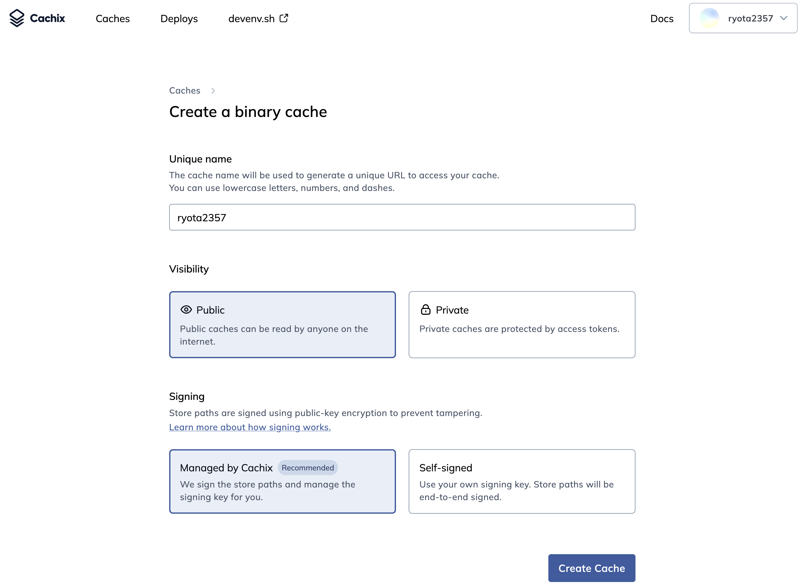
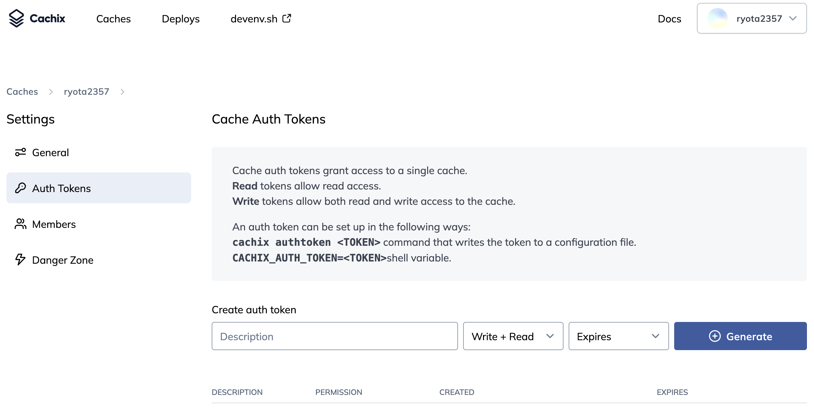
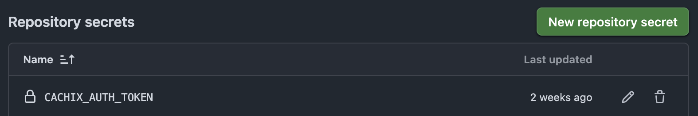
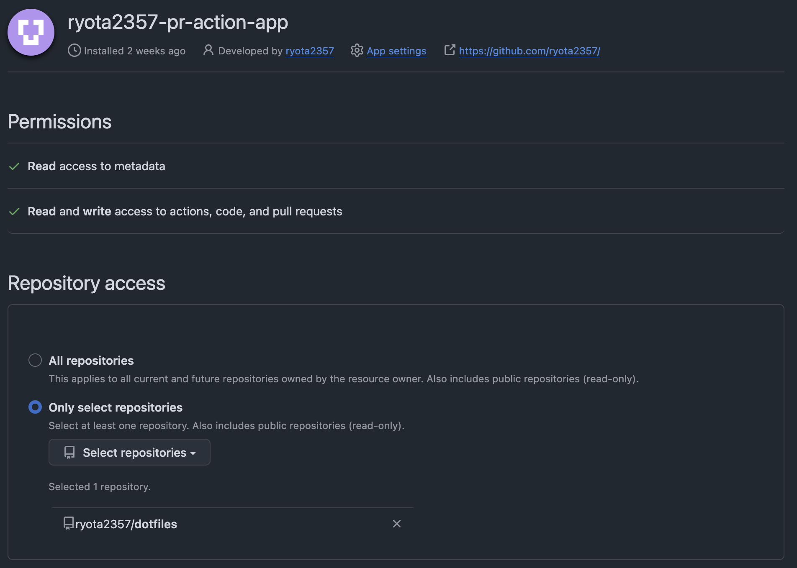
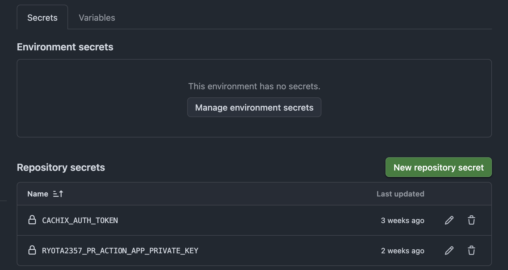
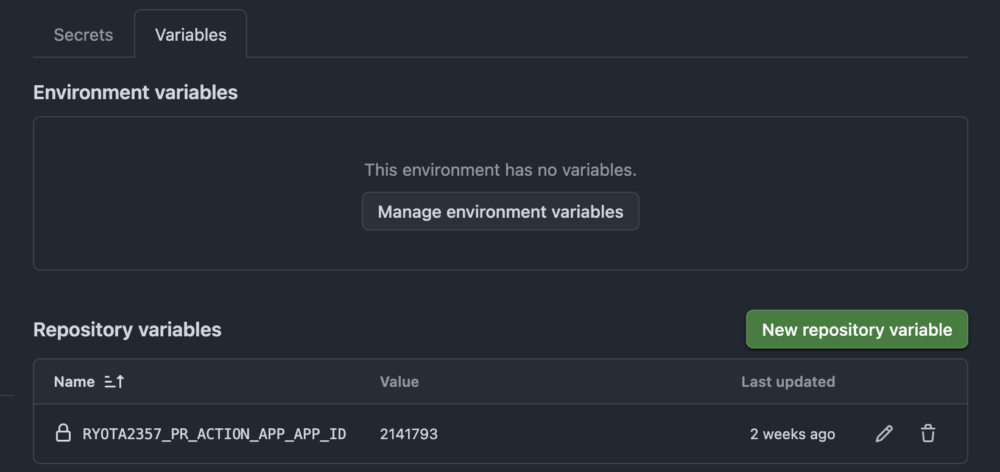
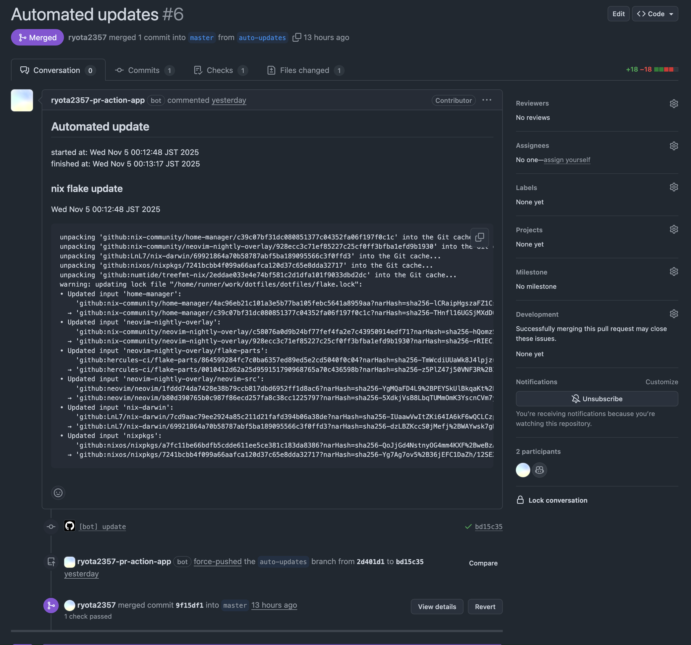

私は Nix を使用して dotfiles を管理している。

dotfiles では overlay を使用していたり、パッチを自分で当てているもの、(執筆現在はないが過去には) 自分で定義したパッケージが存在したりする。
それらは `https://cache.nixos.org` にバイナリキャッシュが存在しないため、ローカルでのビルドが必要となり、これに時間がかかる。

そこで私は [natsukium/dotfiles](https://github.com/natsukium/dotfiles) を参考にして、GitHub Actions で home-manager や nix-darwin の設定をビルドし、そのバイナリキャッシュを cachix に追加する workflow を作成した。
また、GitHub Actions の schedule 機能で cron を指定して、定期的に `nix flake update` を行い Pull Request を作成する workflow も作成した。

これらにより、ローカルでのビルドが不要になり、定期的作成されるに Pull Request をマージすることで、パッケージの更新も自動化できた。
(Pull Request の自動 merge ももちろん可能だが、私は手動で行うことにした。)

私の dotfiles は [ryota2357/dotfiles](https://github.com/ryota2357/dotfiles) に公開している。
現在 (2025/11/05) の HEAD の commit hash は [`992fa65`](https://github.com/ryota2357/dotfiles/tree/992fa65db3e95d375b886045aaf4a4ccf67a5af2) である。

## cachix のセットアップ

[cachix](https://www.cachix.org/) とは Nix のバイナリキャッシュをホスティングするサービスである。

cachix のアカウントを持っていない場合は Sign up してアカウントを作成する。
持っているなら Log in する。

[app.cachix.org](https://app.cachix.org/) にアクセスし、New Cache をクリックしてキャッシュを作成する。
Unique name は dotfiles なら、自分の GitHub ユーザー名で良いだろう。



作成したら、Settings タブに移動し、Auth Tokens セクションにある Generate をクリックしてトークンを生成する。
description は dotfiles とか、適当な名前をつければ良い。expires もお好みで。



生成されたトークンは dotfiles リポジトリの Actions Secrets に `CACHIX_AUTH_TOKEN` などの名前で登録しておく。
(間違っても、yaml ファイルなどに直接書き込まないように。)



ついでに、後でも良いが、作成したキャッシュのトップページから Public Key もメモしておく。
以下の画像なら、`ryota2357.cachix.org-1:1Biai//719bDFSnfV7FK0vKHw9C1b0S4/DQiNdkmWQo=` の部分である。


## GitHub Actions でビルドして cachix にキャッシュを追加する

workflow を作成する前に、setup-nix という composite action を用意しておく。

### setup-nix.yaml

`.github/actions/setup-nix/action.yaml` を作成する。
`cachix/cachix-action` は cachix のセットアップだけでなく、post 処理で cachix への push も行ってくれる。

なお、composite action は Actions Secrets を直接参照できないため、`authToken` を inputs として受け取るようにしている。

```yaml
name: Setup Nix with Cachix
description: Setup Nix with Cachix configuration

inputs:
  authToken:
    description: Cachix auth token
    required: true
  skipPush:
    description: Skip Cachix push configuration
    default: "false"

runs:
  using: composite
  steps:
    - name: Install Nix
      uses: nixbuild/nix-quick-install-action@v34
    - name: Setup Cachix
      uses: cachix/cachix-action@v16
      with:
        name: ryota2357 # ここを自分のキャッシュ名に変更
        authToken: ${{ inputs.authToken }}
        extraPullNames: nix-community
        skipPush: ${{ inputs.skipPush }}
```

補足として、上記 yaml では uses したアクションのバージョンをタグ名で指定しているが、[pinact](https://github.com/suzuki-shunsuke/pinact) などを使用して commit SHA を指定することを推奨する。
`nix run nixpkgs#pinact` で自動で hash に書き換えてくれる。

### build.yaml

次に、`.github/workflows/build.yaml` を作成する。
私は自分の dotfiles を aarch64-darwin でしか使用していないため、`runs-on: macos-15` としているが、複数プラットフォームでビルドしたい場合は、適宜 matrix を組むなどすると良いだろう。

```yaml
name: Build

on:
  push:
    branches:
      - master
    paths:
      - "**.nix"
      - "flake.lock"
  pull_request:
    paths:
      - "**.nix"
      - "flake.lock"
  workflow_dispatch:

jobs:
  build:
    runs-on: macos-15
    steps:
      - name: Checkout
        uses: actions/checkout@v5

      - name: Setup Nix
        uses: ./.github/actions/setup-nix
        with:
          authToken: ${{ secrets.CACHIX_AUTH_TOKEN }}
          skipPush: ${{ github.event_name == 'pull_request' }}

      - name: Build devShell
        run: nix develop --show-trace -c true

      - name: Build homeConfigurations
        # .#homeConfigurations.${自分の定義しているアトリビュート名}.activationPackage に変更
        run: nix build --show-trace --no-link .#homeConfigurations.default.activationPackage

      - name: Build darwinConfigurations
        # .#darwinConfigurations.${自分の定義しているアトリビュート名}.system に変更
        run: nix build --show-trace --no-link .#darwinConfigurations.default.system

      - name: Print disk usage
        run: df -h
```

少し補足すると、`on.push.paths` と `on.pull_request.paths` を指定して、Nix 関連のファイルが変更された場合にのみビルドが走るようにしたり、Pull Request の場合は cachix への push をスキップするようにしている。

## cachix のキャッシュを使えるようにする

ここまで、GitHub Actions で cachix にキャッシュが追加できるようになったが、まだローカルでそのキャッシュを使用できるようになっていない。

まず、flake.nix に以下のような記述を追記する。
`extra-trusted-public-keys` には、「cachix のセットアップ」でメモした Public Key を記入する。
また、自分の cachix だけでなく nix-community のも指定しておくと便利である。
nix-community の Public Key は [ここ](https://app.cachix.org/cache/nix-community) から確認できる。

```nix
{
  inputs = {
    # 省略
  };

  nixConfig = {
    extra-substituters = [
      "https://ryota2357.cachix.org"  # ここを自分のキャッシュ URL に変更
      "https://nix-community.cachix.org" # ついでに nix-community も追加
    ];
    extra-trusted-public-keys = [
      "ryota2357.cachix.org-1:1Biai//719bDFSnfV7FK0vKHw9C1b0S4/DQiNdkmWQo="
      "nix-community.cachix.org-1:mB9FSh9qf2dCimDSUo8Zy7bkq5CX+/rkCWyvRCYg3Fs="
    ];
  };

  outputs = inputs: {
    # 省略
  };
}
```

次に、configuration.nix 相当の場所 (nix-darwin の設定部分など) に以下のような記述を追記する。

```nix
{
  nix.settings = {
    extra-substituters = [
      "https://ryota2357.cachix.org" # ここを自分のキャッシュ URL に変更
      "https://nix-community.cachix.org"
    ];
    extra-trusted-public-keys = [
      "ryota2357.cachix.org-1:1Biai//719bDFSnfV7FK0vKHw9C1b0S4/DQiNdkmWQo="
      "nix-community.cachix.org-1:mB9FSh9qf2dCimDSUo8Zy7bkq5CX+/rkCWyvRCYg3Fs="
    ];
    trusted-users = [
      "root"
      "@wheel"
    ]
    ++ lib.optional pkgs.stdenv.isDarwin "@admin";
  };
}
```

`home-manager switch` や `darwin-rebuild switch` だけで cachix のキャッシュを使用するなら、`nix.settings.extra-{substituters, trusted-public-keys}` の部分を省略しても良い (多分)。
ただ、ここにも書いておくことで、`/etc/nix/nix.conf` にも追記されるため、マシン全体でキャッシュが使用できるようになる。

## cron で自動 update する

最後に、flake.lock を自動で定期的に更新し、Pull Request を作成する workflow を作成する。

その前に準備として、 GitHub App を作成しておく必要がある。
Pull Request を `GITHUB_TOKEN` で作成すると、build workflow が走ってくれない。
GitHub App ではなく PAT を使用する方法もあるが、GitHub App を使用する方法が推奨されているため、そちらを使用する。

### GitHub App の作成

GitHub App の作成方法は色々な記事で紹介されているので、ここでは詳細は省略するが、次の記事が非常に参考になった。

- [GitHub Apps を使って GitHub Actions のワークフローでトークンを生成する](https://blog.beachside.dev/entry/2023/07/18/183000)

私が作成した GitHub App の Permissions 等は以下の通りである。



App Settings というところから、Private Key を生成したり、App ID が確認できる。
なお、Private Key は(おそらく)何度も再生成できるので、GitHub App 作成時に生成や保存を忘れても大丈夫である。

GitHub App の Private Key は GitHub Secrets に登録しておく。
私は `RYOTA2357_PR_ACTION_APP_PRIVATE_KEY` という名前にした。
(`CACHIX_AUTH_TOKEN` と繰り返しになるが、間違っても yaml ファイルなどに直接書き込まないように。)



また、App ID は Repository Variables に登録しておく。



### update.yaml

GitHub Actions で 3 日に 1 回 `nix flake update` を実行し、Pull Request が作成されるようにする。

Pull Request の本文を生成するために (そして flake.lock 以外の更新も今後するときの追加が簡単になるように)、やや長いコードになっているが、流れとしては、

1. `nix flake update` を実行
2. actions/create-github-app-token を使用して GitHub App トークンを生成
3. peter-evans/create-pull-request を使用して Pull Request を作成

である。

````yaml
name: Update

on:
  schedule:
    - cron: "0 15 */3 * *"
  workflow_dispatch:

permissions:
  contents: write
  pull-requests: write

jobs:
  create-pr:
    runs-on: ubuntu-latest
    steps:
      - name: Checkout
        uses: actions/checkout@v5

      - name: Setup Nix
        uses: ./.github/actions/setup-nix
        with:
          authToken: ${{ secrets.CACHIX_AUTH_TOKEN }}
          skipPush: true

      - name: Initialize log files
        run: |
          mkdir ./ci-logs
          TZ=Asia/Tokyo date > ./ci-logs/started_at.txt
          echo '' > ./ci-logs/update.md

      - name: Update Nix Flake
        run: |
          {
            echo '### nix flake update'
            echo ''
            TZ=Asia/Tokyo date
            echo ''
            echo '```'
          } >> ./ci-logs/update.md
          nix flake update |& tee -a ./ci-logs/update.md
          echo '```' >> ./ci-logs/update.md

      - name: Set PR body output
        id: pr-body-output
        run: |
          {
            echo 'body<<EOF'
            echo '## Automated update'
            echo ''
            echo -n 'started at:  '
            cat ./ci-logs/started_at.txt
            echo -n 'finished at: '
            TZ=Asia/Tokyo date
            echo ''
            cat ./ci-logs/update.md
            echo 'EOF'
          } >> "$GITHUB_OUTPUT"
          rm -rf ./ci-logs/

      - name: Create GitHub App Token
        uses: actions/create-github-app-token@v2
        id: app-token
        with:
          app-id: ${{ vars.RYOTA2357_PR_ACTION_APP_APP_ID }}
          private-key: ${{ secrets.RYOTA2357_PR_ACTION_APP_PRIVATE_KEY }}

      - name: Create Pull Request
        uses: peter-evans/create-pull-request@v7
        with:
          title: "Automated updates"
          commit-message: "[bot] update"
          branch: auto-updates
          author: github-actions[bot] <41898282+github-actions[bot]@users.noreply.github.com>
          delete-branch: true
          body: ${{ steps.pr-body-output.outputs.body }}
          token: ${{ steps.app-token.outputs.token }}
````

### 作成された Pull Request

cron が走ると、以下のような Pull Request が自動で作成される。
ちゃんと CI (Checks) が実行されていることも確認できる。


