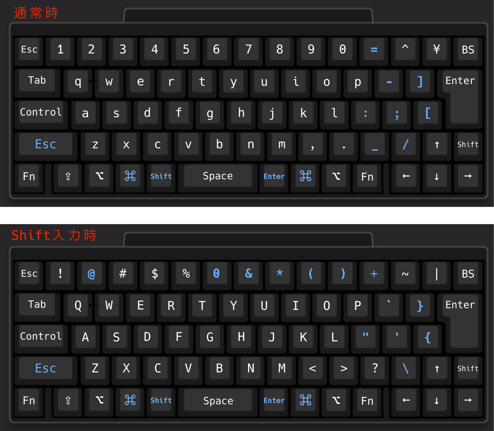
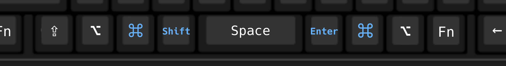
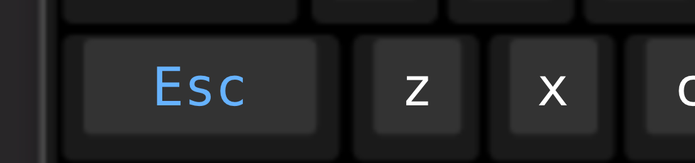

> この記事は [UEC Advent Calendar 2025](https://adventar.org/calendars/11571) 21 日目の記事です(遅刻しました、すみません)。

2025 年も終わりに近づいてきたということで、僕の 2025 年のキーマッピングを残しておこうと思います。

## はじめに

「キーマッピング」や「キー配列」をカスタムしている人たちをみると、自作キーボードを一から設計する方や、Dvorak 配列や新下駄配列といった高度な配列を使う方々を見かけます。

僕は、その人たちと比較すると "ちょっとだけ" キーマッピングをいじっています。

メインで使用しているのは HHKB <small>(HHKB Professional HYBRID Type-S)</small>、外出先では MacBook Pro 本体のキーボードで、配列はどちらも JIS です。
巷でのキーボード配列の議論では JIS 配列より US 配列の方が好きだという声をよく聞く気がします。
しかし僕はあえて JIS 配列を選んでいます。

この記事では、僕の JIS 用キーマッピングを紹介します。
JIS 配列はその物理キーの多さゆえに、キーマッピングカスタマイズとして良い素材なのではないかと僕は考えています。

## キーマッピング全体

早速ですが、キーマッピング全体を載せます。

通常の JIS から変えた部分を青色で示しました。
上は通常時 (Base Layer) 、下がシフトを押している時 (Shift Layer) です。
HHKB を使っていますが、 <key>Fn</key> キーでのマッピング変更は行っていないので省略します。



### 左親指シフト・右親指エンター

JIS 配列では、US 配列に比べエンターキーが小さくなっており、スペースの両隣のキーが多く存在します。
ここを活用します。



親指エンターの良さは他多くの記事で言われている話なので割愛しますが、ホームポジションのままエンターキーを入力できるのは非常に体験が良いです。
JIS 配列の問題点としてよく挙げられる「エンターキーが遠い」問題はこれで解決できます。

親指シフトはスペースキーの隣に配置しています。
通称 SandS と呼ばれる、スペースキー単押しはスペースのままに、他のキーと同時に押した時はシフトキーとするものは採用しませんでした。
理由は単純に誤爆が多かったからです。特に僕の場合 Vim でスペースを `<Leader>` として使っていたため、`<Leader>f` が `F` になる等の誤爆が多く発生したので、やめました。

画像に出ていないものとして、シフト単押しで IME OFF の役割を与えています。
また、(MacBook の) US 配列のカスタムとしてよく知られる左右のコマンドキー単押しを IME ON/OFF にもしています (が、IME OFF はシフト単押し、IME ON は Ctrl + j でやることが多いです)。

### 左小指 ESC

僕は Vimmer (メインエディタが Neovim) です。

Vim では ESC キー (エスケープキー) の代替キーマップをどうするかという話題がありますが、僕は z キーの左、元の左シフトキーに ESC を配置しました。
親指シフトを使用するので、左シフトキーが空いたためです。



僕は Vimmer ですが、macOS ユーザーでもあるので Emacs キーバインドもよく使用します。
そのため、左手小指が a キーと Ctrl キーの間くらいの位置に置かれていることが多いです。
この ESC の位置は小指を少し曲げるだけでアクセスできる位置なので結構押しやすく、馴染みました。

この位置を ESC にする Vim ユーザを私は観測していないのですが、もし ESC の位置で悩んでいる Vimmer の方にはおすすめしたいなと思っています。 (なお、親指シフトしていることが前提...)

### そのほか記号について

記号周りはちょっとずつ変えたりしているので、細かく説明はしませんが、自分がよく書く記号に合わせて押しやすい配置にすると良いです。
ただ、明確に元の JIS マッピングの問題だなと思っている部分はあって、

- `-` は日本語でも伸ばし棒でよく使うのに微妙に遠い
- `_` が snake_case でよく使う癖に微妙に押しにくい位置にある
- 閉じかっこ (`]`, `}`) はエディタでは自動補完することが多いのに、開きかっこ (`[`, `{`)より押しにくい位置にある
- 比較的押しやすい Shift + 0 が `0` (つまり Shift 入力しない状況と同じ) になっていてもったいない

と感じていたので、これらを中心に直しています。

また、僕は手がそこまで大きくない + 左親指シフトにより、Shift + 6 がとても押しづらかったので、Shift + 6 は使用しない方針のマッピングにしています。

## キーマッピングを適用する

このキーマッピングの適用は、[HHKB キーマップ変更ツール](https://happyhackingkb.com/jp/download/)と [Karabiner-Elements](https://karabiner-elements.pqrs.org/) の両方を使って行っています。
シフトやエンターなど、キーを丸ごと変える系は HHKB 側で、それ以外は Karabiner-Elements といった感じです。
両方とも Homebrew でインストールできます。

```bash
brew install --cask hhkb karabiner-elements
```

Windows なら [Change Key](https://forest.watch.impress.co.jp/library/software/changekey/) と [Auto Hot Key](https://www.autohotkey.com/) の 2 つを使うのが良いと思います。
なお、Change Key はおそらく WinGet で入れられないので、窓の杜のページから入れると良さそうです。
Auto Hot Key は WinGet でインストールできます。

```bash
winget install --id=AutoHotkey.AutoHotkey -e
```

Linux は使っていないのでわからないです...
たくさんありそうなので、お好みのを使うと良さそうです。

## おわりに

はじめにでも書きましたが、JIS 配列は物理的にキーがたくさんあるため、キーボードを自作せずとも十分なカスタマイズができます。
特にスペースキーが短く、左右にキーが追加されているのが強いと思っています。

また、この程度のカスタマイズであれば、元の JIS マッピングから少しずつ変えていくこともできるので、移行の負担はかなり小さいです。
親指エンター・親指シフトもやってみれば一日二日ですぐ慣れます。

ちなみに、僕自身、文字部分もカスタマイズしようかなと思いつつも、移行期間に入力速度が大幅に落ちるのが嫌で結局できていません。
AZIK くらいは導入してもいいかなと思いつつも macOS 標準の IME だとできないっぽい？ので導入できていません。
([azookey](https://azookey.com/) がライブ変換に対応しているので良さそう思ったのですが、ターミナル上 (Neovim 上) でうまく動かないという話を聞いていて試せてません)
