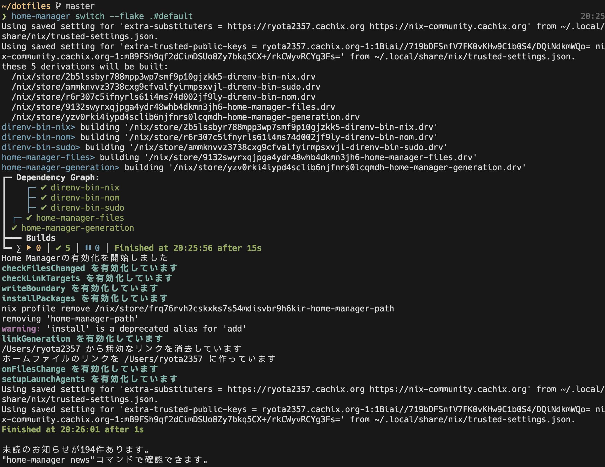

`nix build` だけじゃなく、`home-manager switch` などの内部で `nix build` が使われているケースでも `nom build` を使ってビルドされるようになる。

この手法 (direnv 環境で `nix` をラップして `nom` を差し込む) は [kuuote/nixconf](https://github.com/kuuote/nixconf/) にて行われていた手法を参考にしている。

## nom とは

`nom` とは [nix-output-monitor](https://github.com/maralorn/nix-output-monitor) のことで、Nix のビルド出力をわかりやすくしてくれるツールである。

どのような出力になるかは、[nom の README](https://github.com/maralorn/nix-output-monitor/blob/main/README.md) を見て欲しい。
dependency graph とかをグラフィカルに表示してくれる。

`nom` の使用方法として、2 つあり、README では、「The Easy Way」と「The Flexible Way」として紹介されている。

```bash
# The Easy Way
# nix build/shell/develop の代わりに
nom build [args...]
nom shell [args...]
nom develop [args...]

# The Flexible Way
# nix の JSON 出力を nom に流す
nix build --log-format internal-json -v |& nom --json
```

後者の「The Flexible Way」は、nom のサブコマンドにない、例えば `nix run` などで発生するビルドをグラフィカルに表示するときなどにも使える。
ただ、`nix run` で使うには、run されたコマンドの標準出力・標準エラー出力も `nom --json` に渡されてしまうため、nom に標準エラーだけ渡すようにしたり、コマンドの出力を渡さないようにしたりなど工夫が必要となる。
そのため、単に `nix` を `nix "$@" --log-format internal-json -v |& nom --json` とするのは、あまりよくない。

build/shell/develop 以外のサブコマンドについて、汎用的に nom に渡す良い方法は現状ないようで、nom のリポジトリでも議論がある。
[maralorn/nix-output-monitor#110](https://github.com/maralorn/nix-output-monitor/issues/110) では `nom run` について議論されている。

今回作成した nix のラッパーは、build/shell/develop のときだけ nom に流して、それ以外は nix でそのまま実行するようにした。

## 準備 (nixをラップする前に)

[home-manager](https://github.com/nix-community/home-manager) を使用している前提で話を進める。
ただ私は home-manager の `programs.direnv` を使用していないので、home-manager を使っていなくても、利用できる部分が多いはずである。(参考: [Nix Home Manager をファイル配置ツールとして使用する](../../2024/nix-home-manager-as-a-file-placement-tool/))

まず、スタートとして次が定義されているとする。

```nix
{
  home.packages = with pkgs; [
    direnv
    nix-direnv
  ];

  xdg.configFile = {
    "direnv/lib/nix-direnv.sh".source = "${pkgs.nix-direnv}/share/nix-direnv/direnvrc";

    "direnv/direnvrc".text = ''
      if ! command -v nom > /dev/null; then
        return
      fi
      export DIRENV_ORIGINAL_NIX=$(command -v nix)
      export DIRENV_ORIGINAL_NOM=$(command -v nom)
      export DIRENV_USE_NIX_WRAPPER=1
      export DIRENV_CUSTOM_BIN_DIR="$(dirname ''${BASH_SOURCE:-$0})/bin"
      export PATH="$DIRENV_CUSTOM_BIN_DIR:$PATH"
    '';

    # ここ以降に、ラッパーを書いていく
    ...
  };
}
```

direnv では、.envrc に色々書くだけでなく、設定を `$XDG_CONFIG_HOME/direnv/direnvrc` に記述したり、`$XDG_CONFIG_HOME/direnv/lib/*.sh` で拡張機能を配置したりできる。

`${pkgs.nix-direnv}/share/nix-direnv/direnvrc` は `use flake` や `use nix` を使えるようにしてくれるものである。
(`use_flake` 関数と `use_nix` 関数が定義されている)

direnvrc では `nom` が存在するとき、ラッパーで使用する環境変数の設定と、ラッパーバイナリのパスを `$PATH` に追加している。

- `DIRENV_ORIGINAL_NIX`, `DIRENV_ORIGINAL_NOM`: ラップ前の `nom`, `nix` を保存しておく
- `DIRENV_USE_NIX_WRAPPER`: フラグ。`1` のときだけ `nix` を `nom` に流し、それ以外は元のコマンドを実行する
- `DIRENV_CUSTOM_BIN_DIR`: ラッパーバイナリの配置場所

## nixをラップする

`nix` だけをラップするのでは、実はうまくいかないので、`nix`, `nom`, `sudo` をラップする。

```nix
{
  # ...省略
  xdg.configFile = {
    # ...省略

    "direnv/bin/nix".source = writeShellScript "direnv-bin-nix" ''
      # ...後述
    '';

    "direnv/bin/nom".source = writeShellScript "direnv-bin-nom" ''
      # ...後述
    '';

    "direnv/bin/sudo".source = writeShellScript "direnv-bin-sudo" ''
      # ...後述
    '';
  };
}
```

ここで使用されている `writeShellScript` は、これらラッパーに共通して利用できるユーティリティ関数を `pkgs.writeShellScript` にくっつけたものである。

```nix
let
  writeShellScript =
    name: text:
    pkgs.writeShellScript name ''
      set -e
      fail() {
        echo "Error: $1" >&2
        exit 1
      }
      exec_var_or_fail() {
        local var_name="$1"
        shift
        local var_value="''${!var_name}"
        if [ -z "$var_value" ]; then
          fail "$var_name is not set."
        fi
        exec "$var_value" "$@"
      }
      ${text}
    '';
in
...
```

### nix (direnv-bin-nix)

シンタックスハイライトがないと読みづらいので、nix ではなく、bash として以下に書く。
先ほどあげた nix 式の一部に書かれていると思って読んでほしい。

```bash
# "direnv/bin/nix".source = writeShellScript "direnv-bin-nix" ''
    if [ "$DIRENV_USE_NIX_WRAPPER" = "1" ]; then
      for arg in "$@"; do
        if [ "$arg" = '--help' ]; then
          exec_var_or_fail 'DIRENV_ORIGINAL_NIX' "$@"
        fi
      done
      case "$1" in
        build|shell|develop)
          export DIRENV_USE_NIX_WRAPPER=0  # Prevent recursion
          exec_var_or_fail 'DIRENV_ORIGINAL_NOM' "$@"
          ;;
      esac
    fi
    exec_var_or_fail 'DIRENV_ORIGINAL_NIX' "$@"
# '';
```

サブコマンドが、`build`, `shell`, `develop` のときは、そのまま `nom` に流す。
それ以外の場合や、`--help` が指定されていたときは、もとの nix コマンドを実行する。

`nom` は内部で `nix` を実行する。
`nom` と `nix` で無限ループを起こさないようにするため、`DIRENV_USE_NIX_WRAPPER=0` を export しなければいけないことに注意である。

### nom (direnv-bin-nom)

```bash
# "direnv/bin/nom".source = writeShellScript "direnv-bin-nom" ''
    export DIRENV_USE_NIX_WRAPPER=0  # Prevent recursion
    exec_var_or_fail 'DIRENV_ORIGINAL_NOM' "$@"
# '';
```

`nom build` と実行したとき、この `nom` のラッパーがないと 1. `nom` 2. `nix` (ラッパー) 3. `nom` というように `nom` が 2 回呼び出されてしまう。
これを防止するために `DIRENV_USE_NIX_WRAPPER=0` とした上でもとの `nom` を実行している。

### sudo (direnv-bin-sudo)

`sudo` に関しては、環境変数をどのように引き継ぐ設定になっているかで調整が必要である。
環境変数の引き継ぎ設定は `/etc/sudoers` に書いてある。(`sudo visudo` で見ることができる)

私は現在 macOS (macOS 15.7.1) を使用している。
macOS では `$PATH` や一部環境変数 (`TZ` や `HOME`) が引き継がれる。
重要なことは direnvrc で定義した環境変数が引き継がれないことである。
`sudo -E` などで引き継ぐようにしても良いのだが、今回は `sudo` のときに全てのラッパーを取り除くことにした。

```bash
# "direnv/bin/sudo".source = writeShellScript "direnv-bin-sudo" ''
    if [ -z "$DIRENV_CUSTOM_BIN_DIR" ]; then
      fail 'Error: DIRENV_CUSTOM_BIN_DIR is not set.'
    fi
    if [[ ":$PATH:" != *":$DIRENV_CUSTOM_BIN_DIR:"* ]]; then
      fail "Error: DIRENV_CUSTOM_BIN_DIR ($DIRENV_CUSTOM_BIN_DIR) is not found in PATH."
    fi
    path_remove() {
      local path_i result target="$1"
      declare -a path_array results
      IFS=: read -ra path_array <<< "$PATH"
      for path_i in "''${path_array[@]}"; do
        if [[ "$path_i" != "$target" ]]; then
          results+=("$path_i")
        fi
      done
      result=$(IFS=:; echo "''${results[*]}")
      export PATH="$result"
    }
    path_remove "$DIRENV_CUSTOM_BIN_DIR"
    /usr/bin/sudo "$@"
    export PATH="$DIRENV_CUSTOM_BIN_DIR:$PATH"
# '';
```

`path_remove` については別で記事を書いたので省略する。([$PATHから特定のパスを取り除く方法](../remove-specified-path-from-env-path/))

## どんな感じになるのか

`home-manager switch` でのビルド結果のスクショを載せる。



## nix式全体

`home-manager.lib.homeManagerConfiguration` の `modules` にそのまま突っ込める用の nix 式を折りたたんで置いておく。

<details>
<summary>direnv.nix</summary>

```nix
{ pkgs, ... }:
let
  writeShellScript =
    name: text:
    pkgs.writeShellScript name ''
      set -e
      fail() {
        echo "Error: $1" >&2
        exit 1
      }
      exec_var_or_fail() {
        local var_name="$1"
        shift
        local var_value="''${!var_name}"
        if [ -z "$var_value" ]; then
          fail "$var_name is not set."
        fi
        exec "$var_value" "$@"
      }
      ${text}
    '';
in
{
  home.packages = with pkgs; [
    direnv
    nix-direnv
  ];

  xdg.configFile = {
    "direnv/lib/nix-direnv.sh".source = "${pkgs.nix-direnv}/share/nix-direnv/direnvrc";

    "direnv/direnvrc".text = ''
      if ! command -v nom > /dev/null; then
        return
      fi
      export DIRENV_ORIGINAL_NIX=$(command -v nix)
      export DIRENV_ORIGINAL_NOM=$(command -v nom)
      export DIRENV_USE_NIX_WRAPPER=1
      export DIRENV_CUSTOM_BIN_DIR="$(dirname ''${BASH_SOURCE:-$0})/bin"
      export PATH="$DIRENV_CUSTOM_BIN_DIR:$PATH"
    '';

    "direnv/bin/nix".source = writeShellScript "direnv-bin-nix" ''
      if [ "$DIRENV_USE_NIX_WRAPPER" = "1" ]; then
        for arg in "$@"; do
          if [ "$arg" = '--help' ]; then
            exec_var_or_fail 'DIRENV_ORIGINAL_NIX' "$@"
          fi
        done
        case "$1" in
          build|shell|develop)
            export DIRENV_USE_NIX_WRAPPER=0  # Prevent recursion
            exec_var_or_fail 'DIRENV_ORIGINAL_NOM' "$@"
            ;;
        esac
      fi
      exec_var_or_fail 'DIRENV_ORIGINAL_NIX' "$@"
    '';

    "direnv/bin/nom".source = writeShellScript "direnv-bin-nom" ''
      export DIRENV_USE_NIX_WRAPPER=0  # Prevent recursion
      exec_var_or_fail 'DIRENV_ORIGINAL_NOM' "$@"
    '';

    "direnv/bin/sudo".source = writeShellScript "direnv-bin-sudo" ''
      if [ -z "$DIRENV_CUSTOM_BIN_DIR" ]; then
        fail 'Error: DIRENV_CUSTOM_BIN_DIR is not set.'
      fi
      if [[ ":$PATH:" != *":$DIRENV_CUSTOM_BIN_DIR:"* ]]; then
        fail "Error: DIRENV_CUSTOM_BIN_DIR ($DIRENV_CUSTOM_BIN_DIR) is not found in PATH."
      fi
      path_remove() {
        local path_i result target="$1"
        declare -a path_array results
        IFS=: read -ra path_array <<< "$PATH"
        for path_i in "''${path_array[@]}"; do
          if [[ "$path_i" != "$target" ]]; then
            results+=("$path_i")
          fi
        done
        result=$(IFS=:; echo "''${results[*]}")
        export PATH="$result"
      }
      path_remove "$DIRENV_CUSTOM_BIN_DIR"
      /usr/bin/sudo "$@"
      export PATH="$DIRENV_CUSTOM_BIN_DIR:$PATH"
    '';
  };
}
```

</details>
