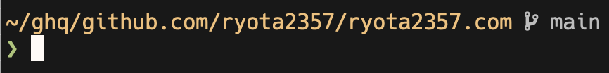
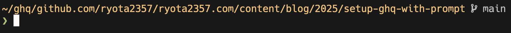
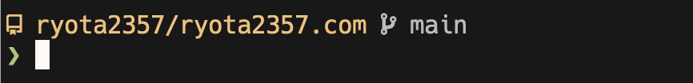
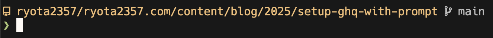
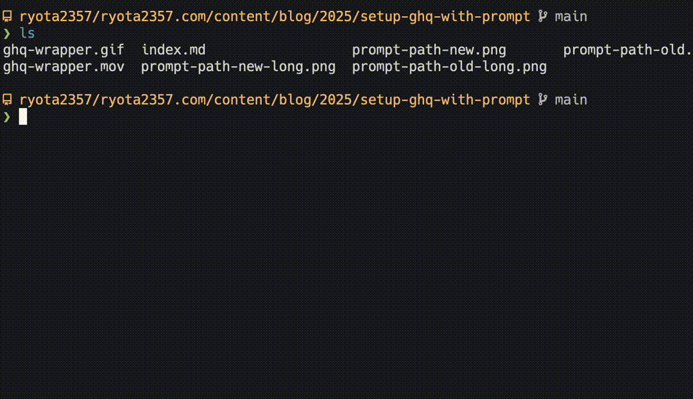

[ghq](https://github.com/x-motemen/ghq) の名前は知っていたけど、そこまで困っていなかったので導入していなかった。
最近、git リポジトリの扱いに困ったというわけではないが、リモート・ローカル含めて一元管理したいなという気持ちが出てきていた。
ghq は「Remote repository management made easy」とあるから、勝手にリモートリポジトリが対象かと思ったいたけど、ローカルも同様に使えることがわかり、導入してみた。

ghq の記事は世の中にすでに大量にありふれているわけだが、シェル周りの連携？は同様の記事を見つけられなかったので、書こうと思う。

コミット: [ryota2357/dotfiles - bf08456](https://github.com/ryota2357/dotfiles/commit/bf08456b5555c33692bfa61306cb2d0a274e83aa)

## ghq のインストールと設定

シェル周りの前に、一応インストールをサラッと書いておく。

ghq 自体は Nix (home-manager) でインストールした。

ghq はシンプルなコマンドのようで、そもそも設定が数える程しかない上に、デフォルトが良いので設定する必要がない。
しかし、後のために `GHQ_ROOT` だけ設定する。

```fish
# fish
set -gx GHQ_ROOT "$HOME/ghq"
```

<br/>

```zsh
# zsh
export GHQ_ROOT="$HOME/ghq"
```

少し古い記事を見ると昔は `ghq.root` のデフォルトが `~/.ghq` だったらしいが、今は `~/ghq` なので、この環境変数を設定したところで、実際の動作が変わることはないだろう。
しかし、README を見る限り、「(略), this value is used as the only root directory regardless of other existing ghq.root settings.」と書いてあるので、`ghq.root` よりも優先されるようである。

## シェルのプロンプトの設定

シェルのプロンプトに現在のパスを表示させるというのはよくある。

私の場合 `ghq get` したリポジトリに移動すると、例えばこのブログ記事のリポジトリだと、



のように、`~/ghq/{host-name}` というプレフィックスがつく。
この程度ならまだ良いのだが、この記事のディレクトリだと、



のようになり、流石に長いなと感じてくる。

そこで、共通する `~/ghq/{host-name}` を特定のアイコンに置き換えることで、このパス表示を短縮できるのでは？と考えた。
<small>(`{host-name}` でアイコンを分けても良いが、私の場合 `{host-name}` はほぼすべて `github.com` なので、すべて同じにした。)</small>



これは(少なくとも僕の作業フローでは)体験がよくて、

- 作業する際は、リポジトリ外に `..` を使用して `cd` することは滅多にない
- 別リポジトリに行く時は `ghq list` と `fzf` を連携させたコマンドを使う
- 完全に別のディレクトリに行く時は `cd ~/...` で移動する

ので、パスを表示させる必要が実はなかったということに気がついた。

ちなみに、先ほどの少し長いパスのもの(この記事のディレクトリ)は以下のようになる。



先ほどよりは、だいぶ良い。

### fish

このプロンプトの設定を乗せておく。私はプロンプトをプラグイン等を使用していないので、`fish_prompt` 関数を定義すれば良い。

```fish
function fish_prompt
  if set -q GHQ_ROOT; and string match -q -r "^$GHQ_ROOT/(?<host>[^/]+)/(?<owner>[^/]+)/(?<repo>[^/]+)(?<subdir>/.*)?" (pwd)
    set -f dir (set_color yellow)" $owner/$repo$subdir"(set_color normal)
  else
    set -f dir (set_color yellow)(string replace "$HOME" '~' (pwd))(set_color normal)
  end
  if test (git rev-parse --is-inside-work-tree 2> /dev/null)
    set -l branch_name (git rev-parse --abbrev-ref HEAD 2> /dev/null)
    set -f branch ' \e[38;5;250m '$branch_name(set_color normal)
  else
    set -f branch ''
  end
  set -l next (set_color brgreen)"❯ "(set_color normal)
  echo -e "\n$dir$branch\n$next"
end
```

ここで、環境変数 `GHQ_ROOT` を使用している。
`ghq root` を使用してもいいのだが、プロンプトではできるだけ builtin コマンド以外の実行を避けたかったため、`GHQ_ROOT` を設定した。

### zsh

fish がメインのシェルだが、zsh も (macOS なので) ログインシェルとして使用しているので、zsh も設定した。

```zsh
__left-prompt() {
  if [[ -n "$GHQ_ROOT" && "$PWD" =~ "^${GHQ_ROOT}/([^/]+)/([^/]+)/([^/]+)(/.*)?" ]]; then
    local owner=${match[2]}
    local repo=${match[3]}
    local subdir=${match[4]}
    local dir="%F{yellow} ${owner}/${repo}${subdir}%f"
  else
    local dir="%F{yellow}%~%f"
  fi
  if [[ $(git rev-parse --is-inside-work-tree 2> /dev/null) ]]; then
    local branch_name=$(git rev-parse --abbrev-ref HEAD 2> /dev/null)
    local branch=" %F{250} $branch_name%f"
  else
    local branch=''
  fi
  local next="%F{47}❯%f "
  echo -e "\n$dir$branch\n$next"
}
precmd() {
  PROMPT=`__left-prompt`
}
```

## fzf との連携

`fzf` または `peco` との連携はすでに多くの人がブログ記事にしている。
そこでは様々な工夫をしている人がいるが、大抵そのコマンドを呼び出す別のコマンドを用意したり、キーバインドを設定している。

私は `ghq` のラッパーコマンドを作り、引数なしで実行された場合に `fzf` と連携してリポジトリへ `cd` するようにした。

```fish
# fish
function ghq --description 'A ghq command wrapper with fzf integration'
  if test (count $argv) -eq 0
    set -l repo_path (ghq list | fzf --height 40% --reverse)
    if test -n "$repo_path"
      cd (ghq root)/$repo_path
    end
  else
    command ghq $argv
  end
end
```

<details>
<summary>zsh版</summary>

```zsh
ghq() {
  if [ $# -eq 0 ]; then
    local repo_path
    repo_path=$(ghq list | fzf --height 40% --reverse)
    if [[ -n "$repo_path" ]]; then
      cd "$(ghq root)/$repo_path"
    fi
  else
    command ghq "$@"
  fi
}
```

</details>

個人的な好みとしては `fzf` には `--reverse` と適当な値の `--height` を与えると、視線の移動が少なくなるので良い。



## 既存リポジトリの移動

既存のリポジトリを \~/ghq 以下に移動させるという作業が最後に残っている。
私は散らばっているリポジトリの数は多いが急いではいないので、`mv` で気が向いた時に少しずつ移動させている。

調べると、[ghq-migrator](https://github.com/astj/ghq-migrator) というのがあるので、使うと良さそうである。
少し古いかもだが、[ローカルに点在するgitリポジトリを一元管理したいアナタに教えたいghq-migrator](https://dev.classmethod.jp/articles/ghq-migrator-for-exists-local-git-repository/) という記事に書いてあった。
