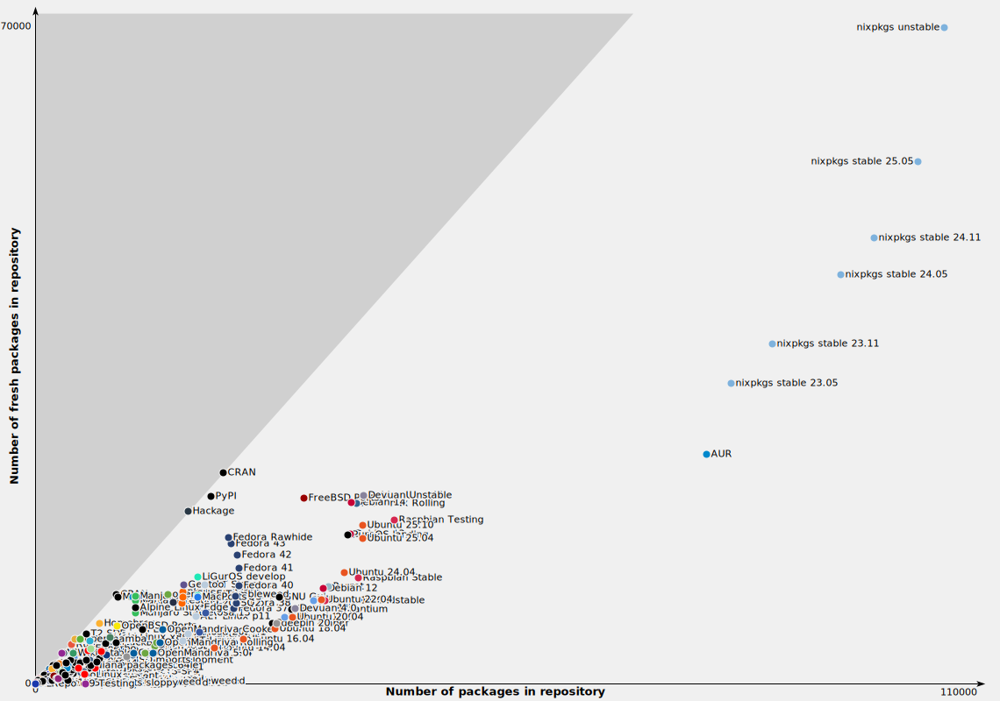
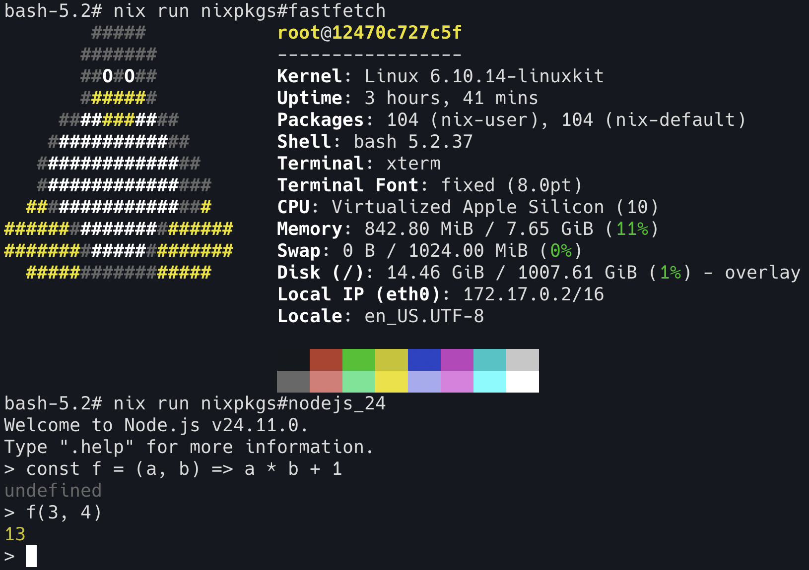
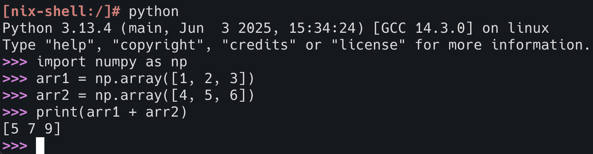
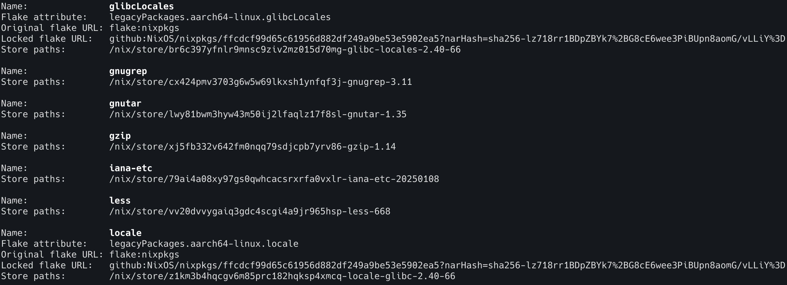

> これは 電気通信大学 MMA 部誌 2025 秋 に投稿した内容です。

こんにちは。4 年の ryota2357 です。

去年は部誌を書いていなかったのですが、今回が学部最後なので、久しぶりに書きました。
今回は、現在開発しているものはあるのですが、紹介するにはまだ未完成なので、普段使っている Nix について紹介をしたいと思います。

Nix は世間的にはあまり知られていませんが、最近 (ここ 1, 2 年) で徐々に注目を集めています。
例えば、1 年ほど前からは [Nix meetup](https://nix-ja.connpass.com/) という Nix に関する勉強会が定期的に開催されたり、月刊誌 [Software Design](https://gihyo.jp/magazine/SD) では 2025 年 9 月号より「パッケージマネージャーNix 入門」という連載が始まったりしています。

ここでは Nix 自体の簡単な説明をしたのちに、コマンドライン上だけで簡単に試せる Nix の簡単な使い方を紹介します。
また、すでに Nix を使っている人向けには、tips 的な内容になればと思っています。

## Nix とは

Nix はパッケージマネージャーです。

パッケージマネージャーと言えば、`apt` や `brew`、 `pip`、`npm`、`uv`、`cargo` など、(ここで挙げたもの以外でも) どれか 1 つは使ったことがあるのではないでしょうか。
これらツールは、パッケージ (= ソフトウェアやライブラリ) をインストール・管理するためのツールです。
また、最近は `npm` の `npx` や `uv` の `uv tool run` のように、パッケージをインストールせずに実行する方法が提供されていることもあります。

Nix も他のパッケージマネージャーと同様に、ソフトウェアやライブラリをインストール・管理したり、`nix run` のように実行したりできます。
ですが、 Nix は他のパッケージマネージャーとは異なる特徴を持っています。

Nix の公式の説明には "Nix, the purely functional package manager" とあり、日本語に訳すと「純粋関数型パッケージマネージャー Nix」となります。

「純粋関数型」という、何やら難しそうな言葉が入っていますが、今回の記事の内容に関してはあまり深く考えなくても大丈夫です。
何か他とは革新的に違う仕組みがあるのだな、くらいに思っておいてください。

<small>
<b>補足:</b>
少しだけ「純粋関数型」という点に関して説明すると、これは Nix のパッケージ管理 (特にそのビルドシステム) の特徴を端的に表したものです。
純粋関数とは、プログラミング言語において、副作用を持たない関数のことを指します。
Nix においては、パッケージのビルドプロセスを純粋関数的に扱います。つまり、同じ入力 (ソースコード、依存関係、ビルドオプションなど) に対しては、常にビット単位で同一の出力 (ビルド成果物) を生成します。
そして、Nix ではこのビルドプロセスなどを宣言的に定義することで、再現可能で信頼性の高い、開発環境・ビルド環境の共有やパッケージの管理を実現しています。
詳しくは <a href="https://zenn.dev/asa1984/books/nix-introduction">Asahi さんの「Nix入門」</a>という Zenn Book が非常に分かりやすいので、おすすめです。
</small>

## Nix を使ってみる

早速 Nix を使ってみましょう。

Nix をインストールしても良いのですが、今回はより手軽に Docker 上で始めていきます。
自分のマシンに Nix をインストールする場合は、[公式のインストール手順](https://nixos.org/download/) または [Determinate Systems が提供しているインストーラ](https://github.com/DeterminateSystems/nix-installer) を使うと良いでしょう。

<small>
<b>補足:</b>
Nix はパッケージマネージャーと紹介しましたが、その性質上、他のパッケージマネージャーと衝突する可能性は低く、また、併用が基本的に可能 (私も Nix を Homebrew や apt と併用しています) なので、安心してインストールできます。
</small>

Nix は公式で Docker イメージが提供されています。

```console
$ docker run -it nixos/nix:2.32.2 /bin/sh -c bash
...

bash-5.2# nix --version
nix (Nix) 2.32.2

bash-5.2# uname -a
Linux b470baa8231c 6.10.14-linuxkit #1 SMP Wed Sep  3 15:35:15 UTC 2025 aarch64 GNU/Linux
```

この記事では、以降このコンテナ内で Nix を使って遊んでいきます。

### 準備

遊ぶ前に、いくつか準備をします。

`/etc/nix/nix.conf` に以下の行を追加します。
`experimental-features` という設定項目ですが、この `nix-command` と `flakes` という機能は、実験的なレベルを超えて広く一般的に使われており、Nix を使う上でほぼ標準の機能になっています。
(なので、個人的には将来的にも破壊的な変更は起きないのではと思っています。起きたとしても非常に丁寧な移行手順が提供されるでしょう。)

```
experimental-features = nix-command flakes
```

Docker コンテナ内で行う場合、このコンテナには vim や nano が入っていないので、`echo` コマンドで追記します。

```
bash-5.2# echo "experimental-features = nix-command flakes" >> /etc/nix/nix.conf

bash-5.2# cat /etc/nix/nix.conf
build-users-group = nixbld
sandbox = false
trusted-public-keys = cache.nixos.org-1:6NCHdD59X431o0gWypbMrAURkbJ16ZPMQFGspcDShjY=
experimental-features = nix-command flakes
```

続いて、ロケール (Locale) の設定をします。
このコンテナはデフォルトでは POSIX ロケールになっており、このままでは期待通り動作しないパッケージがあるためです。
(ここで使用している `nix` コマンドに関しては、少し説明が難しいので、ひとまずコピペして実行してください。)

```bash
nix profile add nixpkgs#glibcLocales
nix profile add nixpkgs#locale
export LOCALE_ARCHIVE="$(nix eval --raw nixpkgs#glibcLocales)/lib/locale/locale-archive"
export LANG=en_US.UTF-8
export LC_ALL=en_US.UTF-8
```

これで準備完了です。

### Hello, world!

早速 Hello world をしましょう。
Nix では `nix run` コマンドで一時的にパッケージを実行できます。

`nix run nixpkgs#hello` というコマンドを実行すると、少しの間ダウンロードが走った後に、 `hello` コマンドが実行されます。

```
bash-5.2# nix run nixpkgs#hello
Hello, world!
```

ここで出てきた、nixpkgs というのは Nix の公式パッケージコレクションです。
登録されているパッケージ数は現在 12 万を超えており [^num-of-nixpkgs-pkg]、最も多くのパッケージが登録されているパッケージコレクションです。



<small>上図は https://repology.org/repositories/graphs より (2025 年 11 月 7 日時点)</small>

## nix run

ここからは、いくつかの nix コマンドとその使い方を紹介していきます。
まず最初は Hello world でも使った `nix run` コマンドです。

`nix run` コマンドは、Nix パッケージを実行するためのコマンドです。
nixpkgs に登録されているパッケージなら `nixpkgs#パッケージ名` という形式で指定できます。
どのようなパッケージが nixpkgs に登録されているかは [https://search.nixos.org/packages](https://search.nixos.org/packages) で調べることができます。
もしくは、`nix search nixpkgs パッケージ名` というコマンドでコマンドライン上からも検索できます (が、Web 上で調べた方が便利です)。

もう少し実用的なパッケージの例として、fastfetch と Node.js v24 を実行してみます。
それぞれ、`nix run nixpkgs#fastfetch` と `nix run nixpkgs#nodejs_24` で実行できます。



他にも `nix run nixpkgs#vim` や `nix run nixpkgs#python3` のようにして、様々なパッケージを実行できるので、ぜひ試してみてください。

実際のソフトウェア開発で私がよく使うのは、[pinact](https://github.com/suzuki-shunsuke/pinact) という GitHub Workflow ファイルの Actions や Reusable Workflows のバージョンを SHA で固定するためのツールを実行するときです。
`nix run nixpkgs#pinact -- run` のようにして使っています。
このように実行するパッケージに引数を渡す場合は、 `--` の後に続けて引数を書くことで渡せます。

### nixpkgs 以外のパッケージを実行する

`nix run` では、nixpkgs 以外のパッケージも実行できます。

GitHub のリポジトリルートに flake.nix というファイルがあり、そのファイルで適切にパッケージが定義されている場合、`nix run github:ユーザー名/リポジトリ名` のようにして実行できます。

実行例として、私が 10 ヶ月ほど前に作成した Lisp 処理系を実行してみます (REPL を起動してみます)。
`nix run github:ryota2357/toy-lisp.hs` を実行します。

<small>
<b>注:</b> 実行すると、数GBのダウンロードの後にビルドも走ります。
ここまで使ってきた nixpkgs に登録されているパッケージはNixの「バイナリキャッシュ」と呼ばれる仕組みによって、自分でビルドせずに実行できていました。
しかし、GitHub リポジトリから実行する場合、そのリポジトリのパッケージは「バイナリキャッシュ」に存在しないため、自分でビルドする必要があります。
この処理系は Haskell で書かれていますが、Nix を使うことで、 Haskell の環境構築をしなくてもパッケージをビルドして実行できます。
</small>

```
bash-5.2# nix run github:ryota2357/toy-lisp.hs
ToyLisp REPL
> (defun f (a b) (+ (* a b) 1))
← <function (A B)>
> (f 3 4)
← 13
>
```

Ctrl + D または Ctrl + C で REPL を抜けられます。

### 少し詳しく: パッケージの場所

ところで、この `nix run` で実行されているパッケージはどこにダウンロード (インストール) されているのでしょうか？  
ここが、Nix の他のパッケージマネージャーと異なる特徴の 1 つで、`/nix/store/` 以下に全てのパッケージが平置きで、かつハッシュ付きの名前でインストールされます。
(.drv という拡張子のファイルは Nix のビルドに関する情報などが入ったファイルです。)

```
bash-5.2# ls /nix/store/ | grep hello
5hbjcc3msic340d91kb1mv81hhmgnmrr-hello-2.12.2.tar.gz.drv
abq6r5qjr7hrfg9gsbjb154cpi7z1lf0-hello-2.12.2
dz4kii8l3h3f02nfvg0fiasigdgyswl2-hello-2.12.2.drv

bash-5.2# ls /nix/store/ | grep nodejs
12qw780l6ipajc7g1rm2d25yaa068f71-nodejs-24.11.0
jkb7jiv8d1ssdcqc3i5ls3gykg1kp2nq-nodejs-24.11.0.drv
pqqw3vri1w6ph85pc0g218kvkbb4w62q-nodejs-configure.drv
```

始めの方で少し述べた「純粋関数型」という点がここに関係しています。
Nix では、パッケージをバージョンで管理するのではなく、ビルド入力 (ソースコード、依存関係、ビルドオプションなど) に基づいて計算されたハッシュ値で管理しています。
Nix のビルドは純粋関数的であるため、同じ入力に対しては常に同じ出力が得られます。
そして、このようにハッシュを名前に含めることで、同じ名前のパッケージでも異なるバージョンやビルドオプションのものを共存させることを可能にしています。

```
bash-5.2# /nix/store/abq6r5qjr7hrfg9gsbjb154cpi7z1lf0-hello-2.12.2/bin/hello
Hello, world!
```

## nix shell

あるコマンドを一時的に複数回利用したい場合は、`nix run` よりも `nix shell` コマンドを使うと便利です。

`nix shell nixpkgs#パッケージ名` という形式で実行します。これにより、あらたにシェルが起動し、そのシェル内で指定したパッケージが利用可能になります。

```
bash-5.2# node --version
bash: node: command not found

bash-5.2# nix shell nixpkgs#nodejs_24

bash-5.2# node --version
v24.11.0

bash-5.2# node
Welcome to Node.js v24.11.0.
Type ".help" for more information.
> console.log("Hello Node.js")
Hello Node.js
undefined
>

bash-5.2# exit
exit

bash-5.2# node --version
bash: node: command not found
```

### 複数のパッケージを利用する

残念ながら `nix shell` では、複数のパッケージを一度に指定できません。
ですが、代わりに `nix-shell` というコマンドを使うことで、複数のパッケージを一度に利用できます。

例として、Python 3.13 と、numpy を一度に利用する例を示します。

```
bash-5.2# nix-shell -p python313 python313Packages.numpy
... (中略) ...
[nix-shell:/]#
```

プロンプトが変わり、`[nix-shell:/]#` のようになりました。
`python` コマンドを使ってみましょう。



`exit` コマンドで nix-shell を抜けられます。

python 以外にも、`nix-shell -p bat gotop jq` のようにして、nixpkgs にある複数のパッケージが利用可能なシェルを起動できます。

### 補足: nix shell でも頑張れば複数パッケージ指定できる

`nix-shell` を使うと、プロンプトが変わり、立ち上がるシェルも bash になってしまいます。
先ほどの python 3.13 + numpy であれば次のようにして、`nix shell` を使うこともできます。

```bash
nix shell --impure --expr '(import (builtins.getFlake "nixpkgs") {}).python3.withPackages (ps: [ ps.numpy ])'
```

このように `--impure` と `--expr` オプションを使うことで、Nix 式を直接書いて複数パッケージを指定できますが、普通なら flake.nix を用意して devShell を定義する方が良いでしょう。
(この記事で Nix 式についてや、devShell の説明は割愛します。)

## nix profile

Nix の Dokcer コンテナの準備にて、ロケール (Locale) の設定のために `nix profile add` コマンドを使ったのを覚えていますでしょうか？
ひとまずコピペして実行してもらっただけなので、ここで再掲します。

```bash
nix profile add nixpkgs#glibcLocales
nix profile add nixpkgs#locale
```

ここまで、`nix run` や `nix shell` でパッケージをグローバルにインストールせず利用してきましたが、`nix profile add` [^nix-profile-install] を使うことで、パッケージをグローバルにインストールできます。

現在どのようなパッケージがインストールされているかは、`nix profile list` コマンドで確認できます。
実行してみると、`bash-interactive` や `coreutils-full` に始まり、色々なパッケージがインストールされていることが分かります。
少し下にスクロールすると、先ほどインストールした `glibcLocales` と `locale` も確認できます。



`nix profile add` で入れたパッケージは、`$HOME/.nix-profile/` 以下の適切なディレクトリに配置されます。
では、先ほどインストールした `locale` コマンドがどこにあるか確認してみましょう。

```
bash-5.2# which locale
/root/.nix-profile/bin/locale

bash-5.2# ls -l /root/.nix-profile/bin/locale
lrwxrwxrwx 1 root root 75 Jan  1  1970 /root/.nix-profile/bin/locale -> /nix/store/z1km3b4hqcgv6m85prc182hqksp4xmcq-locale-glibc-2.40-66/bin/locale
```

`$HOME/.nix-profile` 以下にインストールされていることが分かります。(このコンテナ内では `$HOME` は `/root` です。)
そして、`$HOME/.nix-profile/bin/locale` は `/nix/store/` 以下へのシンボリックリンクになっていることも分かります。

`nix run` のところで軽く説明しましたが、Nix ではパッケージは全て `/nix/store/` 以下に平置きでインストールされます。
`nix profile add` では、このように `/nix/store/` 以下のパッケージへのシンボリックリンクを `$HOME/.nix-profile/` 以下に作成することで、グローバルにパッケージを利用可能にしています。

<small>
<b>補足:</b>
実は、<code>$HOME/.nix-profile</code> 自体も <code>/nix/store/</code> 以下へのシンボリックリンクとなっています。
<code>readlink</code> を何回か実行して辿ると分かります。(もしくは <code>readlink -f $HOME/.nix-profile</code> で一発で辿れます。)
このようにすることで、Nix は<code>$HOME/.nix-profile</code>を不変 (immutable) なものとして扱い、グローバルなパッケージ環境のロールバックやマルチユーザに対応しています。
また、この機能は Profiles と呼ばれ、home-manager や NixOS などの基盤となる仕組みでもあります。
</small>

パッケージをアンインストールする場合は、`nix profile remove パッケージ名` で削除できます。
例として、hello パッケージをインストールしてみて、そのあとアンインストールしてみます。
(`exec $SHELL` はシェルを一旦簡単に再起動する目的で使っています。)

```
bash-5.2# hello
bash: hello: command not found

bash-5.2# nix profile add nixpkgs#hello

bash-5.2# hello
Hello, world!

bash-5.2# nix profile remove hello
removing 'flake:nixpkgs#legacyPackages.aarch64-linux.hello'

bash-5.2# exec $SHELL

bash-5.2# hello
bash: hello: command not found
```

## その他の nix のサブコマンド

この節では、Nix をすでに使っている人向けに、簡単に `nix why-depends` と `nix repl` コマンドを紹介します。

ちなみに、nix のサブコマンドについては、公式リファレンスマニュアル [https://nix.dev/manual/nix/2.32/command-ref/experimental-commands.html](https://nix.dev/manual/nix/2.32/command-ref/experimental-commands.html) に詳しく載っているので、暇な時に眺めてみると良いでしょう。

### nix why-depends

`nix why-depends` は、Nix ストア内の 2 つのパッケージ間の依存関係を調査するためのコマンドです。

リファレンスマニュアルには、nixpkgs に登録されているパッケージ同士の依存を表示していますが、私は次のように使うことが多いです。

```console
$ nix why-depends --all .#my-package nixpkgs#some-dependency
```

このように、自身が flake.nix で定義したパッケージの意図しない依存を見つけたときに、どのような経路で依存しているのかを調査するために使います。
具体例として、私の dotfiles (home-manager) で、`nixpkgs#nodejs` の依存を調査した例を示します。

```console
$ nix why-depends --all .#homeConfigurations.default.activationPackage nixpkgs#nodejs
/nix/store/wqjddc92zglnlkmhv157gl3j937si6n6-home-manager-generation
└───/nix/store/xczpj21vfilrcifg9c6cpdffcsw7iid9-home-manager-path
    ├───/nix/store/127yg7h9j1q6fnc4s7j8ahvfzj05802a-gemini-cli-0.11.3
    │   └───/nix/store/4whakvkkpcgbdzxl1y32vq7rb73k4faq-nodejs-22.20.0
    ├───/nix/store/s5acjbqym41fl8zm049in9k52kh62r7n-svgo-4.0.0
    │   └───/nix/store/4whakvkkpcgbdzxl1y32vq7rb73k4faq-nodejs-22.20.0
    └───/nix/store/whdkyj2kpn9l6fqd2hzbhygv6x1w45x4-github-copilot-cli-0.0.353
        └───/nix/store/4whakvkkpcgbdzxl1y32vq7rb73k4faq-nodejs-22.20.0
```

### nix repl

`nix repl` は、Nix 式を対話的に評価・実行するための REPL (Read-Eval-Print Loop) を起動するコマンドです。

このコマンドはチュートリアルで Nix 式を学習する際によく見かけますが、ちょっとした動作確認やデバッグにも便利です。
`:lf .` と入力することで、現在のディレクトリの flake.nix をロードできるので、flake.nix 内で定義されているパッケージや関数を対話的に試すことができます。

```console
$ nix repl
Nix 2.31.2
Type :? for help.
nix-repl> :lf .
Added 17 variables.
_type, apps, darwinConfigurations, devShells, formatter, homeConfigurations, inputs, lastModified, lastModifiedDate, narHash, outPath, outputs, rev, revCount, shortRev, sourceInfo, submodules

nix-repl> pkgs = inputs.nixpkgs.legacyPackages.aarch64-darwin

nix-repl> pkgs.lib.optional true "Hello!"
[ "Hello!" ]

nix-repl> pkgs.lib.optional false "Hello!"
[ ]

nix-repl> homeConfigurations
{
  default = { ... };
}

nix-repl> homeConfigurations.default
{
  activationPackage = «repeated»;
  config = { ... };
  extendModules = «lambda extendModules @ /nix/store/rdsrrig3firsd4q97y1l7zxc9bbllnyb-source/modules/default.nix:75:23»;
  newsDisplay = "notify";
  newsEntries = [ ... ];
  options = { ... };
  pkgs = { ... };
}
```

nixpkgs を使いたい場合は、上記のように `:lf .` をして、`pkgs = inputs.nixpkgs.legacyPackages.${system}` をしても良いですが、`nix repl nixpkgs` として起動できます。
他にも `nix repl flake-utils` のようにして、flake-utils をロードして起動したり、`nix repl nixpkgs#hello` のようにして、使うこともできます。

もう少しちゃんとデバッグや動作確認をしたい場合は、`nix eval` コマンドを使うと良いでしょう。
これについては、リファレンスマニュアルや `nix help eval` を参照してください。

## おわりに

今回の記事では、Nix の簡単な紹介と、コマンドライン上での簡単な使い方を紹介しました。

この記事を書く上で、私個人の目標として、Nix 式を書かないというものがありました。
普通 Nix の紹介記事といえば、Nix 式を書いているような気がするし、実際 Nix をよく使っていく上では Nix 式は書くことになります。
しかし、別に Nix 式を書かなくても Nix は便利だよねと思っていたので、今回はあえて Nix 式を書かないようにしました。

結果として、Nix 式は (`nix shell --expr` の部分を除けば) 一切書かずに終えられましたが、あまりにも初心者向けにならないようにと補足情報を入れたのが、逆に少し難しくなってしまったかもしれません。

伝えたいこととしては、Nix は簡単に試せて便利なので、ぜひ使ってみてほしいということです。

最近は Nix の日本語情報も増えてきていて、数年前より格段に学びやすくなっているはずです。
過去に Nix を試してみて難しかった人も、ぜひもう一度試してみてほしいです。

最後に、ここまで読んでくださり、ありがとうございました。

[^num-of-nixpkgs-pkg]: https://search.nixos.org/packages (2025 年 11 月 7 日時点) より

[^repology-org-graph]: https://repology.org/repositories/graphs (2025 年 11 月 7 日時点) より

[^nix-profile-install]: `nix profile add` は以前 `nix profile install` という名前でしたが、Nix 2.30.0 から名前が変わり、現在 `install` は deprecated で `add` のエイリアスになっています。(参考: https://github.com/NixOS/nix/blob/master/doc/manual/source/release-notes/rl-2.30.md)
