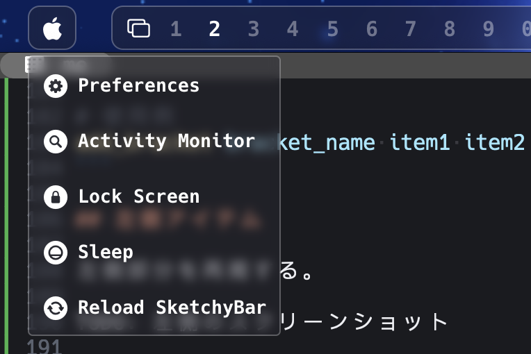

先日、macOS のメニューバーをカスタマイズするため、SketchyBar を導入した。

この記事では私の設定を紹介する。

## セットアップ

公式ドキュメントの [Setup ページ](https://felixkratz.github.io/SketchyBar/setup)の通り進めれば問題ないが、いくつか異なるので、その異なる部分だけを書いておく。

まず、インストールは Homebrew 以外に nixpkgs にも上がっているので、私は Nix (home-manager) で入れた。
Nix で入れた場合、example configuration は brew のように入手できない。
これら example は [SketchyBar の GitHub リポジトリ](https://github.com/FelixKratz/SketchyBar) のルート以下に直接 sketchybarrc や plugins/ ディレクトリがあるので、それらを適当に持ってきて全てのファイルに実行権限を与えれば良い。

Nix で入れると、`brew services start sketchybar` のような自動起動もできないわけだが、[home-manager module]() には launchd の設定もあるようなので、これを使うか参考にすると良さそうである。
私は AeroSpace を使っているので、これの `after-startup-command` を使用した。

```toml
after-startup-command = ['exec-and-forget sketchybar']
```

フォントに関しては Hack Nerd Font だけでなく SF Symbols も使えると便利なので、入れておくと良い。
このことはドキュメントの [Tips & Tricks ページ の Finding Iconsセクション](https://felixkratz.github.io/SketchyBar/config/tricks#finding-icons) に書いてある。

```bash
brew install --cask font-hack-nerd-font
brew install --cask sf-symbols
```

## 設定ファイルについて

SketchyBar の設定ファイルのデフォルトパスは `$HOME/.config/sketchybar/sketchybarrc` である。
変更したい場合は、`sketchybar --config <path>` で指定できるようである。

設定は sketchybarrc という実行可能ファイルに書いていくわけだが、example configuration のようにシェルスクリプトで設定もできるし、SketchyBar には [Lua API](https://github.com/FelixKratz/SbarLua) もあるので、Lua で設定もできる。
私は今回シェルスクリプトで設定したが、[SketchyBar の作者の dotfiles](https://github.com/FelixKratz/dotfiles) を見ると Lua で設定しているので、参考になりそうである。

設定のリロードは `sketchybar --reload [<path>]` でできるので、設定を書いている最中に便利に使った。
(ドキュメントを見ると `sketchybar --hotload <boolean>` でホットリロードもできるらしいが私は使わなかった。)

## 私の SketchyBar

まず、私の SketchyBar のスクリーンショットを載せておく。

<style> .__md_inline__no-max-width img { max-width: none !important; } </style>
<div class="__md_inline__no-max-width">


</div>

```
┌────────────┬───────────┬───────────┬──────────┬──────────────┬────────────────┬─────────┬──────────────┐
│ Apple Logo │ Workspace │ Front App │          │ CPU & Memory │ Volume & Wi-Fi │ Battery │ Date & Time  │
└────────────┴───────────┴───────────┴──────────┴──────────────┴────────────────┴─────────┴──────────────┘
```

このデザインは、[SketchyBar のリポジトリの Share your setups](https://github.com/FelixKratz/SketchyBar/discussions/47?sort=top) を中心に色々な設定を見て決めたものである。
macOS 感を少し残したシンプルなデザインを目指した。

## 基本設定

ここからは sketchybarrc の具体的な内容を解説する。
まず、sketchybarrc の冒頭は以下であるとして、進めていく。

```bash
#!/usr/bin/env bash

PLUGIN_DIR="$CONFIG_DIR/plugins"
```

また、`$PLUGIN_DIR` 以下の各種 bash スクリプトについても、shebang は `#!/usr/bin/env bash` であるとして、省略する。

### バー設定

私のバーは透明なので、位置・高さ・色の 3 つだけ設定した。

```bash
bar=(
  position=top
  height=40
  color=0x00000000
)
sketchybar --bar "${bar[@]}"
```

### デフォルト設定

全てのアイテムに適用されるデフォルトの値を設定する。
私はポップアップも使っているので、それらのデザイン設定もここで行っている。

```bash
default=(
  label.font='PleckJP:Bold:16'
  label.color=0xffffffff
  label.padding_left=4
  label.padding_right=10
  icon.font.size=18
  icon.color=0xffffffff
  icon.padding_left=10
  icon.padding_right=4
  popup.background.color=0x6a282a36
  popup.background.border_width=1
  popup.background.border_color=0x48ffffff
  popup.background.corner_radius=3
  popup.blur_radius=10
)
sketchybar --default "${default[@]}"
```

## アイテム設定用のユーティリティ関数

`sketchybar` コマンドは多機能だが、設定記述においては少し冗長になりがちである。
そこで、設定を書く上で便利なユーティリティ関数をいくつか用意した。

### add_item

アイテムを配置するときには以下のように書くことが多い。

```bash
sketchybar --add item_name position \
           --set item_name \
                 property1=value1 \
                 property2=value2 \
           --subscribe item_name event_name
```

これを簡略化するために、`add_item` 関数を用意した。

```bash
add_item() {
  local name="$1"
  local position="$2"
  shift 2
  local args=("$name")
  while [[ $# -gt 0 ]]; do
    if [[ "$1" == --* ]]; then
      args+=("$1" "$name")
    else
      args+=("$1")
    fi
    shift
  done
  sketchybar --add item "$name" "$position" --set "${args[@]}"
}
```

これを使用することで、以下のように書ける。

```bash
add_item item_name position \
  property1=value1 \
  property2=value2 \
  --subscribe event_name
```

### add_bracket

SketchyBar には [Special Components](https://felixkratz.github.io/SketchyBar/config/components) として Item Bracket があり、任意の数のアイテムに共通の背景を作成できる。

私は全ての Item Bracket で同じ `--set` 設定（背景色や角丸など）を使用するため、これもユーティリティ化した。

```bash
add_bracket() {
  local name="$1"
  shift
  local config=(
    blur_radius=10
    background.height=32
    background.color=0x6a282a36
    background.corner_radius=8
    background.border_width=1
    background.border_color=0x48ffffff
  )
  sketchybar --add bracket "$name" "$@" --set "$name" "${config[@]}"
}

# 使用例
add_bracket bracket_name item1 item2
```

## 左側アイテム

バー左側の設定について解説する。

左側部分を再掲する。


### Apple Logo

一番左には Apple ロゴを配置した。
クリックすると、以下のようなポップアップメニューが表示される。



```bash
add_item apple_logo left \
  icon='􀣺' \
  label.drawing=off \
  icon.padding_left=10 \
  icon.padding_right=11 \
  click_script="sketchybar -m --set \$NAME popup.drawing=toggle"
add_item preferences_button popup.apple_logo \
  icon='􀺽' \
  label="Preferences" \
  click_script="open -a 'System Preferences';
                sketchybar -m --set apple_logo popup.drawing=off"
add_item activity_button popup.apple_logo \
  icon='􀒓' \
  label="Activity Monitor" \
  click_script="open -a 'Activity Monitor';
               sketchybar -m --set apple_logo popup.drawing=off"
add_item lock_button popup.apple_logo \
  icon='􀒳' \
  label="Lock Screen" \
  click_script="pmset displaysleepnow;
                sketchybar -m --set apple_logo popup.drawing=off"
add_item sleep_button popup.apple_logo \
  icon='􀶠' \
  label="Sleep" \
  click_script="pmset sleepnow;
                sketchybar -m --set apple_logo popup.drawing=off"
add_item reload_button popup.apple_logo \
  icon='􀖋' \
  label="Reload SketchyBar" \
  click_script="sketchybar --reload"
add_bracket apple_logo_bracket apple_logo
```

### ワークスペース

AeroSpace と連携し、現在のワークスペース番号を表示・切り替えできるようにしている。

```bash
# AeroSpace からワークスペース変更通知を受け取るためのカスタムイベントを追加
sketchybar --add event aerospace_workspace_change

# ワークスペースアイテムの追加
add_item workspace.icon left \
  icon='􀏧' \
  icon.font.size=14 \
  icon.padding_right=5 \
  label.drawing=off
for sid in {1..9} 0; do
  add_item "workspace.$sid" left \
    icon.drawing=off \
    label="$sid" \
    label.font.size=18 \
    label.padding_right=10 \
    label.padding_left=10 \
    script="$PLUGIN_DIR/workspace.sh" \
    click_script="aerospace workspace $sid" \
    --subscribe aerospace_workspace_change
done

# Bracket に追加するアイテムは正規表現で指定できる
add_bracket workspace_bracket '/workspace\..*/'
```

ここで使用している `workspace.sh` は、現在のワークスペースの強調表示（色を変える）を行うスクリプトだ。

```bash
# workspace.sh
if [ -n "$FOCUSED_WORKSPACE" ]; then
  FOCUSED="$FOCUSED_WORKSPACE"
else
  AEROSPACE="$(brew --prefix)/bin/aerospace"
  FOCUSED=$("$AEROSPACE" list-workspaces --focused 2>/dev/null || echo "?")
fi

if [ "$FOCUSED" = "?" ]; then
  exit 0
fi

SID=${NAME#workspace.}
if [ "$FOCUSED" = "$SID" ]; then
  sketchybar --set "$NAME" label.color=0xffffffff
else
  sketchybar --set "$NAME" label.color=0x60ffffff
fi
```

カスタムイベント `aerospace_workspace_change` を発火させるための AeroSpace 側の設定は以下の通り。
これはほぼ [AeroSpace のドキュメント](https://nikitabobko.github.io/AeroSpace/guide#exec-on-workspace-change-callback)に書いてある設定そのままである。

```toml
exec-on-workspace-change = [
  '/bin/bash',
  '-c',
  'sketchybar --trigger aerospace_workspace_change FOCUSED_WORKSPACE="$AEROSPACE_FOCUSED_WORKSPACE"',
]
```

### フロントアプリ

現在アクティブなアプリケーションを表示させている。
ここで使用している `front_app_switched` イベントは SketchyBar 側で用意されているもので、フロントアプリが切り替わったときに発火する。

```bash
add_item front_app left \
  icon='􀆊' \
  icon.font.size=14 \
  label.padding_left=10 \
  script="$PLUGIN_DIR/front_app.sh" \
  --subscribe front_app_switched
add_bracket front_app_bracket front_app
```

`front_app_switched` イベントでは `$INFO` に新しいフロントアプリの名前が入っているので、これをラベルに設定する。

```bash
# front_app.sh
if [ "$SENDER" = "front_app_switched" ]; then
  sketchybar --set "$NAME" label="$INFO"
fi
```

## 右側アイテム

続いてバー右側の設定だ。

右側部分を再掲する。


### 時刻

秒単位で表示するため `update_freq=1` に設定している。
あとなぜか等幅フォントを使用していても時刻の文字幅が変わってしまうことがあるので、`label.width=80` で幅を固定した。

```bash
add_item time right \
  icon='􀐫' \
  script="$PLUGIN_DIR/time.sh" \
  update_freq=1 \
  label.width=80
```

<p></p>

```bash
# time.sh
TIME=$(date '+%H:%M:%S')
sketchybar --set "$NAME" label="$TIME"
```

### 日付

日時の更新は適当な `update_freq` を設定しても良いが、できるだけ無駄なスクリプト実行を避けたいので、イベントで更新するようにしている。

```bash
add_item date right \
  icon='􀉉' \
  script="$PLUGIN_DIR/date.sh" \
  --subscribe system_woke date_boundary
```

<p></p>

```bash
# date.sh
DATE=$(LC_ALL=C date '+%m/%d %a')
sketchybar --set "$NAME" label="$DATE"
```

ここでは 2 つのイベントを購読している。
1 つ目の `system_woke` は SketchyBar 側で用意されているもので、Mac がスリープから復帰したときに発火される。

2 つ目の `date_boundary` はカスタムイベントで、日付が変わるタイミングで（複数回）発火するように設計した。

```bash
sketchybar --add event date_boundary
```

プラグイン `time.sh` の中でこのイベントを発火させるようにしている。
以下は 1 つ前で出した `time.sh` のコードの続きである。
時刻が 23:59:00 から 00:00:59 の 2 分間の間 `date_boundary` イベントを発火させている。

```bash
# time.sh の続き
[[ "${TIME%:*}" =~ ^(23:59|00:00)$ ]] && sketchybar --trigger date_boundary
```

### バッテリー

現在のバッテリー残量を表示している。
30 秒ごと更新するようにしているが、`power_source_change` イベント (SketchyBar 側で用意されている) も購読しているので、電源接続状態が変わったときにも更新される。

```bash
add_item battery right \
  script="$PLUGIN_DIR/battery.sh" \
  update_freq=30 \
  --subscribe power_source_change
add_bracket battery_bracket battery
```

`battery.sh` では、バッテリー残量によってラベルの色も変えるようにしている。

```bash
# battery.sh
PMSET_OUTPUT=$(pmset -g batt)
PERCENTAGE=$(echo "$PMSET_OUTPUT" | grep -Eo "[0-9]+%" | cut -d% -f1)
CHARGING=$(echo "$PMSET_OUTPUT" | grep 'AC Power')

if [ "$PERCENTAGE" = "" ]; then
  exit 0
fi

case ${PERCENTAGE} in
  100)    ICON="󰁹"; COLOR="0xff4caf50" ;; #4caf50
  9[0-9]) ICON="󰂂"; COLOR="0xff4caf50" ;;
  8[0-9]) ICON="󰂁"; COLOR="0xff80e27e" ;; #80e27e
  7[0-9]) ICON="󰂀"; COLOR="0xff80e27e" ;;
  6[0-9]) ICON="󰁿"; COLOR="0xff80e27e" ;;
  5[0-9]) ICON="󰁾"; COLOR="0xffbef67a" ;; #bef67a
  4[0-9]) ICON="󰁽"; COLOR="0xffbef67a" ;;
  3[0-9]) ICON="󰁼"; COLOR="0xffbef67a" ;;
  2[0-9]) ICON="󰁻"; COLOR="0xffffeb3b" ;; #ffeb3b
  1[1-9]) ICON="󰁺"; COLOR="0xffffeb3b" ;;
  *)      ICON="󰂎"; COLOR="0xffff0000" ;; #ff0000
esac

if [ -n "$CHARGING" ]; then
  ICON=""
fi

sketchybar --set "$NAME" icon="$ICON" label="$PERCENTAGE%" label.color="$COLOR"
```

### Wi-Fi

<!-- textlint-disable ja-technical-writing/no-double-negative-ja -->

macOS 14.4 以前では SSID をコマンドで取れたらしいが、現在は `<redacted>` となってしまう。
一応、やろうと思えば Shortcuts.app で SSID を出すショートカットを作成して (`GetSSID`)、`shortcuts run "GetSSID"` で取れなくはないが、面倒なので私は単に Wi-Fi 接続状態だけ表示するようにしている。

<!-- textlint-enable ja-technical-writing/no-double-negative-ja -->

`wifi_change` イベントは SketchyBar 側で用意されているもので、Wi-Fi 接続状態が変わったときに発火される。
このイベントを購読するので、接続状態だけ表示するには `update_freq` を設定しなくて良い。

```bash
add_item wifi right \
  script="$PLUGIN_DIR/wifi.sh" \
  --subscribe wifi_change
```

`wifi.sh` では macOS のメニューバーと同じく、インターネット共有 (Personal Hotspot) に接続しているかどうかも判定して、アイコンを切り替えている。

```bash
# wifi.sh
if networksetup -getairportpower en0 | grep -q ": Off"; then
  sketchybar --set "$NAME" icon='􀙈' # wifi.slash
elif route -n get default 2>/dev/null | grep -q "gateway: 172.20.10.1"; then
  sketchybar --set "$NAME" icon='􀉤' # personalhotspot
else
  sketchybar --set "$NAME" icon='􀙇' # wifi
fi
```

Personal Hotspot の判定は、デフォルトゲートウェイが `172.20.10.1` かどうかで良いらしい。
この判定方法で本当に良いのか、公式なドキュメントを見つけることができなかったが、いくつかのブログ等で報告されていた情報から良さそうである。
(今のところ、私の環境では問題なく動作している。)

- [iPhoneのテザリングの仕様について - Qiita](https://qiita.com/nikujiro/items/a19cbbcdeb725e6832bc)
- [Apple iOS Personal Hotspot Annoyances — REDELIJKHEID](https://www.redelijkheid.com/blog/2015/7/30/apple-ios-personal-hotspot-annoyances)
- [Change iphone hotspot ip range - Apple Community](https://discussions.apple.com/thread/254221256?sortBy=rank)

### 音量

音量はフロントアプリのように SketchyBar 側で用意されている `volume_change` イベントを購読して更新している。
使用している SF Symbols のアイコン幅が不均一なため、バーのガタつきを防ぐ目的でアイコン幅を固定している。

```bash
add_item volume right \
  script="$PLUGIN_DIR/volume.sh" \
  icon.width=36 \
  --subscribe volume_change
```

`$INFO` に現在の音量が入っているので、それを使ってアイコンとラベルを更新する。

```bash
# volume.sh
if [ "$SENDER" = "volume_change" ]; then
  VOLUME="$INFO"

  case "$VOLUME" in
    [6-9][0-9]|100)   ICON="􀊩" ;; # speaker.wave.3.fill
    [3-5][0-9])       ICON="􀊧" ;; # speaker.wave.2.fill
    [1-9]|[1-2][0-9]) ICON="􀊥" ;; # speaker.wave.1.fill
    *)                ICON="􀊣" ;; # speaker.slash.fill
  esac

  sketchybar --set "$NAME" icon="$ICON" label="$VOLUME%"
fi
```

### メモリ使用率

5 秒ごとにメモリ使用率を更新している。

```bash
add_item memory right \
  icon='􀫦' \
  script="$PLUGIN_DIR/memory.sh" \
  update_freq=5
```

メモリ使用率の取得には [vm_stat2](https://github.com/ryota2357/vm_stat2) という自作のコマンドを使用している。

```bash
# memory.sh
MEMORY=$(vm_stat2 | awk '/Used Memory:/ {gsub(/[()%]/, "", $5); print $5}')
sketchybar --set "$NAME" label="$MEMORY%"
```

`vm_stat2` については以下の別記事に書いているので、そちらを参照してほしい。

- [macOS のメモリ使用状況を Activity Monitor のようにわかりやすく表示させる CLI を作った (vm_stat2)](../vm_stat2-macos-memory-cli/)

### CPU 使用率

メモリ使用率と同様に 5 秒ごとに更新している。

```bash
add_item cpu right \
  icon='􀫥' \
  script="$PLUGIN_DIR/cpu.sh" \
  update_freq=5
```

CPU 使用率の取得には `top` コマンドを使用している。
ただ、`top` コマンドでの CPU 使用率はそこそこブレがあったので、3 回取得して平均を取るようにしている。

```bash
# cpu.sh
CPU=$(top -l 3 -n 0 | awk '/CPU usage/ {sum += $3 + $5} END {printf "%.1f", sum / 3}')
sketchybar --set "$NAME" label="$CPU%"
```

ちなみに、3 回にした理由は [RunCat](https://kyome.io/runcat/) での CPU 使用量の表示と同じくらいの値になったのが 3 回だったからである。

## sketchybarrc 全体コード

長いので折りたたんでおく。

ここまでで紹介していないが、ユーティリティ関数として `add_spacer` というのも用意していて、アイテムの間に広めのスペースを入れたいときに使用している。

<details>
<summary>sketchybarrc</summary>

```bash
#!/usr/bin/env bash

PLUGIN_DIR="$CONFIG_DIR/plugins"

##### Bar Appearance #####
# https://felixkratz.github.io/SketchyBar/config/bar
bar=(
  position=top
  height=40
  color=0x00000000
)
sketchybar --bar "${bar[@]}"

##### Changing Defaults #####
# https://felixkratz.github.io/SketchyBar/config/items
default=(
  label.font='PleckJP:Bold:16' # or 'Osaka:Regular-Mono:16'
  label.color=0xffffffff
  label.padding_left=4
  label.padding_right=10
  icon.font.size=18
  icon.color=0xffffffff
  icon.padding_left=10
  icon.padding_right=4
  popup.background.color=0x6a282a36
  popup.background.border_width=1
  popup.background.border_color=0x48ffffff
  popup.background.corner_radius=3
  popup.blur_radius=10
)
sketchybar --default "${default[@]}"

add_item() {
  local name="$1"
  local position="$2"
  shift 2
  local args=("$name")
  while [[ $# -gt 0 ]]; do
    if [[ "$1" == --* ]]; then
      args+=("$1" "$name")
    else
      args+=("$1")
    fi
    shift
  done
  sketchybar --add item "$name" "$position" --set "${args[@]}"
}
add_bracket() {
  local name="$1"
  shift
  local config=(
    blur_radius=10
    background.height=32
    background.color=0x6a282a36
    background.corner_radius=8
    background.border_width=1
    background.border_color=0x48ffffff
  )
  sketchybar --add bracket "$name" "$@" --set "$name" "${config[@]}"
}
_SPACER_COUNT=0
add_spacer() {
  _SPACER_COUNT=$((_SPACER_COUNT + 1))
  local name="spacer.$_SPACER_COUNT"
  sketchybar --add item "$name" "$1" --set "$name" width=25
}

########## Events ##########

sketchybar --add event aerospace_workspace_change
sketchybar --add event date_boundary

########## Left Items ##########

# Apple Logo
add_item apple_logo left \
  icon='􀣺' \
  label.drawing=off \
  icon.padding_left=10 \
  icon.padding_right=11 \
  click_script="sketchybar -m --set \$NAME popup.drawing=toggle"
add_item preferences_button popup.apple_logo \
  icon='􀺽' \
  label="Preferences" \
  click_script="open -a 'System Preferences';
                sketchybar -m --set apple_logo popup.drawing=off"
add_item activity_button popup.apple_logo \
  icon='􀒓' \
  label="Activity Monitor" \
  click_script="open -a 'Activity Monitor';
               sketchybar -m --set apple_logo popup.drawing=off"
add_item lock_button popup.apple_logo \
  icon='􀒳' \
  label="Lock Screen" \
  click_script="pmset displaysleepnow;
                sketchybar -m --set apple_logo popup.drawing=off"
add_item sleep_button popup.apple_logo \
  icon='􀶠' \
  label="Sleep" \
  click_script="pmset sleepnow;
                sketchybar -m --set apple_logo popup.drawing=off"
add_item reload_button popup.apple_logo \
  icon='􀖋' \
  label="Reload SketchyBar" \
  click_script="sketchybar --reload"
add_bracket apple_logo_bracket apple_logo

# Spacer
add_spacer left

# Workspaces
add_item workspace.icon left \
  icon='􀏧' \
  icon.font.size=14 \
  icon.padding_right=5 \
  label.drawing=off
for sid in {1..9} 0; do
  add_item "workspace.$sid" left \
    icon.drawing=off \
    label="$sid" \
    label.font.size=18 \
    label.padding_right=10 \
    label.padding_left=10 \
    script="$PLUGIN_DIR/workspace.sh" \
    click_script="aerospace workspace $sid" \
    --subscribe aerospace_workspace_change
done
add_bracket workspace_bracket '/workspace\..*/'

# Spacer
add_spacer left

# Front App
add_item front_app left \
  icon='􀆊' \
  icon.font.size=14 \
  label.padding_left=10 \
  script="$PLUGIN_DIR/front_app.sh" \
  --subscribe front_app_switched
add_bracket front_app_bracket front_app

########## Right Items ##########

# Time & Date
add_item time right \
  icon='􀐫' \
  script="$PLUGIN_DIR/time.sh" \
  update_freq=1 \
  label.width=80
add_item date right \
  icon='􀉉' \
  script="$PLUGIN_DIR/date.sh" \
  --subscribe system_woke date_boundary
add_bracket datetime_bracket date time

# Spacer
add_spacer right

# Battery
add_item battery right \
  script="$PLUGIN_DIR/battery.sh" \
  update_freq=5 \
  --subscribe power_source_change
add_bracket battery_bracket battery

# Spacer
add_spacer right

# Wi-Fi & Volume
add_item wifi right \
  script="$PLUGIN_DIR/wifi.sh" \
  --subscribe wifi_change
add_item volume right \
  script="$PLUGIN_DIR/volume.sh" \
  icon.width=36 \
  --subscribe volume_change
add_bracket wifi_volume_bracket volume wifi

# Spacer
add_spacer right

# Memory & CPU
add_item memory right \
  icon='􀫦' \
  script="$PLUGIN_DIR/memory.sh" \
  update_freq=5
add_item cpu right \
  icon='􀫥' \
  script="$PLUGIN_DIR/cpu.sh" \
  update_freq=5
add_bracket sysinfo_bracket memory cpu

##### Force all scripts to run the first time (never do this in a script) #####
sketchybar --update
```

</details>
