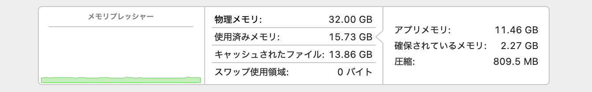

macOS のメモリ使用状況は、GUI であればアクティビティモニタが「アプリメモリ」や「圧縮」といったわかりやすい分類で可視化してくれる。



一方、CLI でこのような情報を得ようとすると、標準の `vm_stat` ではページサイズ（16KB 等）の掛け合わせや、複数の項目を足し引きする計算が必要になる。
（`memory_pressure` は用途が異なり、`top` もプロセス単位の詳細は出るが、全体像を同じ粒度で把握するには不向きだ）

そこで、アクティビティモニタと(おそらく)同じ計算手法を用い、人間が読みやすい形式で統計を出力する CLI ツール `vm_stat2` を作成した。

これにより、ターミナルでの視認性が向上するのはもちろん、[SketchyBar](https://github.com/FelixKratz/SketchyBar) や [tmux](https://github.com/tmux/tmux) のステータスラインへも手軽に組み込めるようになる。

## 使い方

リポジトリは [GitHub - ryota2357/vm_stat2](https://github.com/ryota2357/vm_stat2) にある。
インストール方法は README に記載しているので、そちらを参照してほしい。

`vm_stat2` にはいくつかオプションが用意されているが、まず、オプションなしでは以下のように表示される。

```console
$ vm_stat2
Mach Virtual Memory Statistics 2: (page size: 16.00 KB)
Total Memory:    32.00 GB
Used Memory:     13.72 GB  (42.9%)
  App Memory:     9.72 GB  (30.4%)
  Wired Memory:   2.19 GB  ( 6.8%)
  Compressed:     1.81 GB  ( 5.6%)
Cached Files:     9.88 GB  (30.9%)
Swap Used:         0.00 B
```

アクティビティモニタと同じ分類で、項目の対応は、

- 物理メモリ: Total Memory
- 使用済みメモリ: Used Memory
  - アプリメモリ: App Memory
  - 確保されているメモリ: Wired Memory
  - 圧縮: Compressed
- キャッシュされたファイル: Cached Files
- スワップ使用領域: Swap Used

となっている。

`-b`, `-k`, `-m`, `-g` オプションで、表示形式を変更できる。

```console
$ vm_stat2 -b
Mach Virtual Memory Statistics 2: (page size: 16384 B)
Total Memory:    34359738368 B
Used Memory:     14692958208 B  (42.8%)
  App Memory:    10345267200 B  (30.1%)
  Wired Memory:   2407415808 B  ( 7.0%)
  Compressed:     1940275200 B  ( 5.6%)
Cached Files:    10597122048 B  (30.8%)
Swap Used:                 0 B
```

また、元の `vm_stat` コマンドのように、一定間隔での更新表示も可能だ。
`-c` オプションで回数を指定でき、回数を指定しない場合は、Ctrl+C で終了するまで繰り返す。

```console
$ vm_stat2 1
Mach Virtual Memory Statistics 2: (page size: 16.00 KB)
      Free        App      Wired   Cmprssed      Cache       Swap   PageIn/s  PageOut/s
   7.68 GB    9.67 GB    2.17 GB    1.81 GB    9.88 GB     0.00 B          -          -
   7.68 GB    9.59 GB    2.26 GB    1.81 GB    9.87 GB     0.00 B  448.00 KB     0.00 B
   7.68 GB    9.61 GB    2.24 GB    1.81 GB    9.87 GB     0.00 B  448.00 KB     0.00 B
   7.68 GB    9.63 GB    2.20 GB    1.81 GB    9.88 GB     0.00 B  448.00 KB     0.00 B
   7.69 GB    9.68 GB    2.16 GB    1.81 GB    9.87 GB     0.00 B  224.00 KB     0.00 B
   7.67 GB    9.65 GB    2.21 GB    1.81 GB    9.87 GB     0.00 B  272.00 KB     0.00 B
   7.67 GB    9.68 GB    2.16 GB    1.81 GB    9.87 GB     0.00 B   80.00 KB     0.00 B
```

## メモリ使用状況の計算手法

アクティビティモニタで表示されている「アプリメモリ」や「確保されているメモリ」といった各項目は、`vm_stat` の出力から計算できる。
その計算手法は、`man` 等のドキュメントには記載されておらず、以下 2 つの記事が参考になった。

- [macOSのメモリ使用状況を常に表示する - Qiita](https://qiita.com/hann-solo/items/3ef57d21b004bb66aadd)
- [Macのメモリ利用状況をコマンドラインから取得する(2015年 Yosemite版) | おそらくはそれさえも平凡な日々](https://songmu.jp/riji/entry/2015-05-08-mac-memory.html)

特に 2 つ目の記事では、`vm_stat` では取れない Swap の使用量が `sysctl vm.swapusage` で取得できることも書かれており、参考になった。

`vm_stat` の出力結果は以下のような形式で、主にページ数が表示される。

```console
$ vm_stat
Mach Virtual Memory Statistics: (page size of 16384 bytes)
Pages free:                              454994.
Pages active:                            663277.
Pages inactive:                          654531.
Pages speculative:                        10933.
Pages throttled:                              0.
Pages wired down:                        149470.
Pages purgeable:                          14663.
"Translation faults":                1777508318.
Pages copy-on-write:                  366251359.
Pages zero filled:                    595854971.
Pages reactivated:                      1319005.
Pages purged:                           3506940.
File-backed pages:                       640284.
Anonymous pages:                         688457.
Pages stored in compressor:              306349.
Pages occupied by compressor:            111723.
Decompressions:                          326892.
Compressions:                            634370.
Pageins:                                8369955.
Pageouts:                                 10233.
Swapins:                                      0.
Swapouts:                                     0.
```

2 つの記事から、各項目は以下のように計算すれば良さそうだとわかった。
自分でも実際に計算をしてアクティビティモニタの表示と突き合わせた結果、(ほぼ)同じ値が得られていることを確認した。

```
アプリメモリ = [Pages active] + [Pages inactive] + [Pages speculative] + [Pages throttled] - [Pages purgeable] - [File-backed pages]
確保されているメモリ = [Pages wired down]
圧縮 = [Pages occupied by compressor]
キャッシュされたファイル = [File-backed pages] + [Pages purgeable]
スワップ使用領域 = `sysctl vm.swapusage` の used 値
```

ちなみに、`vm_stat2` では、macOS ビルドインの `vm_stat` が出力する項目を `-a` オプションで表示できるようにしている。
`vm_stat` と異なり、ページ数ではなく、バイト数で表示するようにしている。

```console
$ vm_stat2 -a
Mach Virtual Memory Statistics 2: (page size: 16.00 KB)
Total Memory:    32.00 GB
Used Memory:     13.67 GB  (42.7%)
  App Memory:     9.61 GB  (30.0%)
  Wired Memory:   2.25 GB  ( 7.0%)
  Compressed:     1.81 GB  ( 5.6%)
Cached Files:     9.87 GB  (30.8%)
Swap Used:         0.00 B
Pages free:                       7.66 GB
Pages active:                     9.74 GB
Pages inactive:                   9.64 GB
Pages speculative:               99.11 MB
Pages throttled:                   0.00 B
Pages wired down:                 2.25 GB
Pages purgeable:                203.27 MB
"Translation faults":          1772618954
Pages copy-on-write:            365405320
Pages zero filled:              594396734
Pages reactivated:               20.12 GB
Pages purged:                    52.93 GB
File-backed pages:                9.67 GB
Anonymous pages:                  9.81 GB
Pages stored in compressor:       4.91 GB
Pages occupied by compressor:     1.81 GB
Decompressions:                   4.72 GB
Compressions:                     9.68 GB
Pageins:                        127.51 GB
Pageouts:                       159.89 MB
Swapins:                           0.00 B
Swapouts:                          0.00 B
```

## vm_stat2 の実装

`vm_stat2` は C 言語 (C23) で実装した。
Bash 等で `vm_stat` と `sysctl vm.swapusage` の出力をパースして計算するのでも良いが、C 言語でカーネル API を直接叩くことで、より軽量かつ高速に動作させることができる。
実行速度や軽量さは、ステータスライン等で頻繁に呼び出す用途では重要だからだ。

実装量は 400 行ほどで、非常に短い。
コマンドライン引数を解析し、カーネル API (`host_statistics64` や `sysctlbyname` など) を叩き、前節で説明した計算をして、それを出力しているだけである。

ただ、前節で説明していない計算手法についての部分が 1 つあるので、説明する。

まず、`vm_stat` のようなメモリ統計情報のほとんど (スワップ使用領域と物理メモリ量以外) は次のように `host_statistics64()` を呼ぶことで `vm_statistics64_data_t` 構造体として得られる。

```c
vm_statistics64_data_t get_vm_statistics64(host_t host_port) {
    vm_statistics64_data_t vm_stat;
    auto count = HOST_VM_INFO64_COUNT;
    if (host_statistics64(host_port, HOST_VM_INFO64, (host_info64_t)&vm_stat, &count) != KERN_SUCCESS) {
        fprintf(stderr, "Failed to fetch VM statistics\n");
        exit(EXIT_FAILURE);
    }
    return vm_stat;
}
```

この `vm_statistics64_data_t` 構造体の各フィールドの値を各項目として「ほぼ」そのまま出しているのが `vm_stat` である。

「ほぼ」と言ったのは、`vm_statistics64_data_t` の各フィールドをそのまま出した場合と `vm_stat` の出力を比較して「Pages free」の項目だけ、そのまま出していないように「見えた」からだ。
観察・実験の結果、おそらく `vm_stat` の各項目と `vm_statistics64_data_t` フィールドの対応は次のようになっているのではないかと予測した。

| `vm_stat` の項目名           | `vm_statistics64_data_t` のフィールド名 |
| :--------------------------- | :-------------------------------------- |
| Pages free                   | free_count - speculative_count          |
| Pages active                 | active_count                            |
| Pages inactive               | inactive_count                          |
| Pages speculative            | speculative_count                       |
| Pages throttled              | throttled_count                         |
| Pages wired down             | wire_count                              |
| Pages purgeable              | purgeable_count                         |
| "Translation faults"         | faults                                  |
| Pages copy-on-write          | cow_faults                              |
| Pages zero filled            | zero_fill_count                         |
| Pages reactivated            | reactivations                           |
| Pages purged                 | purges                                  |
| File-backed pages            | external_page_count                     |
| Anonymous pages              | internal_page_count                     |
| Pages stored in compressor   | total_uncompressed_pages_in_compressor  |
| Pages occupied by compressor | compressor_page_count                   |
| Decompressions               | decompressions                          |
| Compressions                 | compressions                            |
| Pageins                      | pageins                                 |
| Pageouts                     | pageouts                                |
| Swapins                      | swapins                                 |
| Swapouts                     | swapouts                                |

なお、これはあくまで `vm_stat` の出力結果と `vm_statistics64_data_t` のフィールドの値を観察し、推測した結果であるので間違っている可能性もある。
正確な情報や間違いであることがわかった場合は [リポジトリ](https://github.com/ryota2357/vm_stat2) の Issue や PR で教えていただけると嬉しい。
(「Pages free」の項目が `free_count - speculative_count` であることはそこまで不自然な計算でもないので、この推測がおそらく正しいのではないかと考えている。)

ちなみに確認には次の bash スクリプト (check.sh) を用意して、fish で `while true; ./check.sh; sleep 0.1; end` のように実行して値の差分を監視した。

```bash
#!/usr/bin/env bash
VM_STAT2=$(./build/vm_stat2 -ab)
VM_STAT=$(vm_stat)
VM_STAT=$(echo "$VM_STAT" | grep 'Pages free' | awk '{ print $3 }' | tr -d .)
VM_STAT2=$(echo "$VM_STAT2" | grep 'Pages free' | awk '{ print $3 }')
echo $(((VM_STAT * 16384) - VM_STAT2))
```
