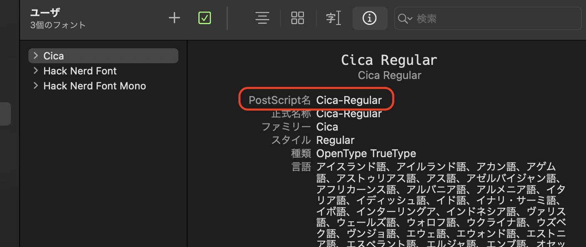

VisualStudio の調子が悪いので VSCode でも Unity 開発できる様にしました。

## はじめに

> Visual Studio Code can be a great companion to Unity for editing and debugging C# files. All of the C# features are supported and more.In the screen below, you can see code colorization, bracket matching, IntelliSense, CodeLens and that's just the start.
>
> 
>
> Read on to find out how to configure Unity and your project to get the best possible experience.

コードシンタックス、インテリセンス、参照の表示などは始まりに過ぎないと。

### 環境

VScode: バージョン: 1.53.2
MacOS: BigSur バージョン 11.2.1

## やること

1. Unity エディタの External Tools の設定
1. .NetCoreSDK、Mono をインストール
1. VSCode 拡張機能のインストール
1. C#補完を有効にする
1. 不要なファイルを非表示にする
1. Font の変更

### Unity エディタの External Tools の設定

Unity エディタの Preference より


を設定します。

これで Unity エディタで C#ファイルをクリックすると VSCode が開くようになりました。

### .NetCoreSDK、Mono をインストール

こいつら入れないと VSCode 色々言われるので入れておきます。

Homebrew を使う場合は以下を実行します。

```sh
$ brew install --cask dotnet-sdk
$ brew install mono
```

手動の場合は以下よりダウンロードします。

- [.NetCoreSDK](https://dotnet.microsoft.com/download)
- [Mono](https://www.mono-project.com/download/stable/)

### VSCode 拡張機能のインストール

Unity 開発に必要な基本的で人気のある拡張機能をインストールします。

よくわからないけど入れておきます。

<div class="bcard-wrapper"><span class="bcard-header"><div class="bcard-site"><a href="https://marketplace.visualstudio.com/items?itemName=Tobiah.unity-tools" rel="nofollow" target="_blank"></a></div><div class="bcard-url"><a href="https://marketplace.visualstudio.com/items?itemName=Tobiah.unity-tools" rel="nofollow" target="_blank">https://marketplace.visualstudio.com/items?itemName=Tobiah.unity-tools</a></div></span><span class="bcard-main withogimg"><div class="bcard-title"><a href="https://marketplace.visualstudio.com/items?itemName=Tobiah.unity-tools" rel="nofollow" target="_blank">Unity Tools - Visual Studio Marketplace</a></div><div class="bcard-description">Extension for Visual Studio Code - Various tools to help with Unity development</div><a href="https://marketplace.visualstudio.com/items?itemName=Tobiah.unity-tools" rel="nofollow" target="_blank"><div class="bcard-img" style="background-image: url(https://tobiah.gallerycdn.vsassets.io/extensions/tobiah/unity-tools/1.2.12/1599087118649/Microsoft.VisualStudio.Services.Icons.Default)"></div></a></span></div>

デバッグができるように。

<div class="bcard-wrapper"><span class="bcard-header"><div class="bcard-site"><a href="https://marketplace.visualstudio.com/items?itemName=Unity.unity-debug" rel="nofollow" target="_blank"></a></div><div class="bcard-url"><a href="https://marketplace.visualstudio.com/items?itemName=Unity.unity-debug" rel="nofollow" target="_blank">https://marketplace.visualstudio.com/items?itemName=Unity.unity-debug</a></div></span><span class="bcard-main withogimg"><div class="bcard-title"><a href="https://marketplace.visualstudio.com/items?itemName=Unity.unity-debug" rel="nofollow" target="_blank">Debugger for Unity - Visual Studio Marketplace</a></div><div class="bcard-description">Extension for Visual Studio Code - Unity debugger extension</div><a href="https://marketplace.visualstudio.com/items?itemName=Unity.unity-debug" rel="nofollow" target="_blank"><div class="bcard-img" style="background-image: url(https://unity.gallerycdn.vsassets.io/extensions/unity/unity-debug/3.0.2/1605217535175/Microsoft.VisualStudio.Services.Icons.Default)"></div></a></span></div>

MonoBehaaiour 関係の関数のスニペットが使えるようにします。
これで、例えば`start`で`void Start(){...}`や、`update`で`void Update(){...}`が挿入されるようになります。

<div class="bcard-wrapper"><span class="bcard-header"><div class="bcard-site"><a href="https://marketplace.visualstudio.com/items?itemName=zrachod.mono-snippets" rel="nofollow" target="_blank"></a></div><div class="bcard-url"><a href="https://marketplace.visualstudio.com/items?itemName=zrachod.mono-snippets" rel="nofollow" target="_blank">https://marketplace.visualstudio.com/items?itemName=zrachod.mono-snippets</a></div></span><span class="bcard-main withogimg"><div class="bcard-title"><a href="https://marketplace.visualstudio.com/items?itemName=zrachod.mono-snippets" rel="nofollow" target="_blank">MonoBehaviour Snippets - Visual Studio Marketplace</a></div><div class="bcard-description">Extension for Visual Studio Code - MonoBehaviour Snippets for Visual Studio Code</div><a href="https://marketplace.visualstudio.com/items?itemName=zrachod.mono-snippets" rel="nofollow" target="_blank"><div class="bcard-img" style="background-image: url(https://zrachod.gallerycdn.vsassets.io/extensions/zrachod/mono-snippets/0.0.2/1500683522677/Microsoft.VisualStudio.Services.Icons.Default)"></div></a></span></div>

C#を書くなら必須。

<div class="bcard-wrapper"><span class="bcard-header"><div class="bcard-site"><a href="https://marketplace.visualstudio.com/items?itemName=ms-dotnettools.csharp" rel="nofollow" target="_blank"></a></div><div class="bcard-url"><a href="https://marketplace.visualstudio.com/items?itemName=ms-dotnettools.csharp" rel="nofollow" target="_blank">https://marketplace.visualstudio.com/items?itemName=ms-dotnettools.csharp</a></div></span><span class="bcard-main withogimg"><div class="bcard-title"><a href="https://marketplace.visualstudio.com/items?itemName=ms-dotnettools.csharp" rel="nofollow" target="_blank">C# - Visual Studio Marketplace</a></div><div class="bcard-description">Extension for Visual Studio Code - C# for Visual Studio Code (powered by OmniSharp).</div><a href="https://marketplace.visualstudio.com/items?itemName=ms-dotnettools.csharp" rel="nofollow" target="_blank"><div class="bcard-img" style="background-image: url(https://ms-dotnettools.gallerycdn.vsassets.io/extensions/ms-dotnettools/csharp/1.23.9/1612367364423/Microsoft.VisualStudio.Services.Icons.Default)"></div></a></span></div>

`///`で xml コメントを挿入できるようになる。

<div class="bcard-wrapper"><span class="bcard-header"><div class="bcard-site"><a href="https://marketplace.visualstudio.com/items?itemName=k--kato.docomment" rel="nofollow" target="_blank"></a></div><div class="bcard-url"><a href="https://marketplace.visualstudio.com/items?itemName=k--kato.docomment" rel="nofollow" target="_blank">https://marketplace.visualstudio.com/items?itemName=k--kato.docomment</a></div></span><span class="bcard-main withogimg"><div class="bcard-title"><a href="https://marketplace.visualstudio.com/items?itemName=k--kato.docomment" rel="nofollow" target="_blank">C# XML Documentation Comments - Visual Studio Marketplace</a></div><div class="bcard-description">Extension for Visual Studio Code - Generate C# XML documentation comments for ///</div><a href="https://marketplace.visualstudio.com/items?itemName=k--kato.docomment" rel="nofollow" target="_blank"><div class="bcard-img" style="background-image: url(https://k--kato.gallerycdn.vsassets.io/extensions/k--kato/docomment/0.1.20/1608301041416/Microsoft.VisualStudio.Services.Icons.Default)"></div></a></span></div>

### C#補完を有効にする

基本設定の`setting.json`に以下を追記します。

```json
"omnisharp.useGlobalMono": "always",
```

always にしないと「.NETFramework のバージョンが見つからない」とか言われます。

### 不要なファイルを非表示にする

meta ファイルや、fbx などの編集しない不必要なファイルを非表示にします。
基本設定またはワークスペースの setting.json に以下を追記します。

```json
"files.exclude": {
    "**/.git": true,
    "**/.DS_Store": true,
    "**/*.meta": true,
    "**/*.*.meta": true,
    "**/*.unity": true,
    "**/*.unityproj": true,
    "**/*.mat": true,
    "**/*.fbx": true,
    "**/*.FBX": true,
    "**/*.tga": true,
    "**/*.cubemap": true,
    "**/*.prefab": true,
    "**/Library": true,
    "**/ProjectSettings": true,
    "**/Temp": true
},
```

### Font の変更

「Font Book」を開いて、 変更したいフォントの「PostScript 名」を取得します。



基本設定の setting.json に以下を追記します。

```json
"editor.fontFamily": "{PostScript名}",
"editor.inlineHints.fontFamily": "{PostScript名}",
"debug.console.fontFamily": "{PostScript名}",
"editor.codeLensFontFamily": "{PostScript名}",
"terminal.integrated.fontFamily": "monospace"
```

ターミナルは`monospace`しかサポートしてないよと言われたので、`terminal.integrated.fontFamily`を設定。

## その他

僕個人の設定について

### Vim 拡張

VisualStudio で Vim 拡張がうまく動かなくなったから VSCode に乗り換えようと思ったので。

<div class="bcard-wrapper"><span class="bcard-header"><div class="bcard-site"><a href="https://marketplace.visualstudio.com/items?itemName=vscodevim.vim" rel="nofollow" target="_blank"></a></div><div class="bcard-url"><a href="https://marketplace.visualstudio.com/items?itemName=vscodevim.vim" rel="nofollow" target="_blank">https://marketplace.visualstudio.com/items?itemName=vscodevim.vim</a></div></span><span class="bcard-main withogimg"><div class="bcard-title"><a href="https://marketplace.visualstudio.com/items?itemName=vscodevim.vim" rel="nofollow" target="_blank">Vim - Visual Studio Marketplace</a></div><div class="bcard-description">Extension for Visual Studio Code - Vim emulation for Visual Studio Code</div><a href="https://marketplace.visualstudio.com/items?itemName=vscodevim.vim" rel="nofollow" target="_blank"><div class="bcard-img" style="background-image: url(https://vscodevim.gallerycdn.vsassets.io/extensions/vscodevim/vim/1.18.9/1612551212003/Microsoft.VisualStudio.Services.Icons.Default)"></div></a></span></div>

`setting.json`に以下を追加します。
こうすることで普通の vim と同じように vimrc ファイルを使える様になります。

```json
"vim.vimrc.enable": true,
"vim.vimrc.path": "~/.vsvimrc"  // ←各自設定
```

vimrc.path ですが普段使っている vim の`.vimrc`でも良いのですがエディタ用の独自のキーバインドがあったりするので僕は分けてます。

### setting.json 公開

他のプラグインの設定も混じってますが...

```json
{
  /* ---------------------------------------------- 基本設定 -------------------------0------------------ */
  "editor.fontSize": 16,
  "terminal.integrated.fontSize": 14,
  "debug.console.fontSize": 14,
  "editor.fontFamily": "Cica-Regular",
  "editor.inlineHints.fontFamily": "Cica-Regular",
  "debug.console.fontFamily": "Cica-Regular",
  "editor.codeLensFontFamily": "Cica-Regular",
  "terminal.integrated.fontFamily": "monospace",
  "workbench.tree.indent": 4,
  "files.trimTrailingWhitespace": true,
  "editor.codeLens": false,
  "editor.suggestSelection": "first",
  "workbench.iconTheme": "material-icon-theme",
  "workbench.colorTheme": "MyTheme-vscode",

  /* --------------------------------- ファイルとフォルダーを除外設定 ----------------------------------- */
  "files.exclude": {
    "**/.git": true,
    "**/.DS_Store": true,
    "**/*.meta": true,
    "**/*.*.meta": true,
    "**/*.unity": true,
    "**/*.unityproj": true,
    "**/*.mat": true,
    "**/*.fbx": true,
    "**/*.FBX": true,
    "**/*.tga": true,
    "**/*.cubemap": true,
    "**/*.prefab": true,
    "**/Library": true,
    "**/ProjectSettings": true,
    "**/Temp": true
  },

  /* ------------------------------- 現在選択している配色テーマの上書き --------------------------------- */
  "workbench.colorCustomizations": {},

  /* ----------------------------------------------- Vim ------------------------------------------------ */
  "vim.vimrc.enable": true,
  "vim.vimrc.path": "~/.vsvimrc",

  /* ------------------------------------------- Unity,  C# --------------------------------------------- */
  "unity-tools.localDocumentationViewer": "chrome",
  "unity-tools.documentationVersion": "2020.2",
  "omnisharp.useGlobalMono": "always",

  /* ----------------------------------------------- HTML ----------------------------------------------- */
  "[html]": {
    "editor.defaultFormatter": "vscode.html-language-features" // 優先フォーマッタ
  },

  /* ------------------------------------------ Flutter,  Dart ------------------------------------------ */
  "[dart]": {
    "editor.formatOnSave": true,
    "editor.formatOnType": true,
    "editor.rulers": [80],
    "editor.selectionHighlight": false,
    "editor.suggest.snippetsPreventQuickSuggestions": false,
    "editor.suggestSelection": "first",
    "editor.tabCompletion": "onlySnippets",
    "editor.wordBasedSuggestions": false
  },

  /* ------------------------ 辞書に追加するユーザーの単語(Code Spell Checker) -------------------------- */
  "cSpell.userWords": ["Behaviour", "Struct"],

  /* --------------------------------------------- その他 ----------------------------------------------- */
  "tabnine.experimentalAutoImports": true,
  "csv-edit.fontSizeInPx": 15,
  "vsintellicode.modify.editor.suggestSelection": "automaticallyOverrodeDefaultValue"

  /* ---------------------------------------------------------------------------------------------------- */
}
```

## 参考

[Unity Development with VS Code](https://code.visualstudio.com/docs/other/unity)  
[VSCode で Unity の補完が効かなくなったときの解決方法（OmniSharp の問題)](https://unity-yuji.xyz/vscode-unity-omnisharp-netframework-mono/)

<style>.bcard-wrapper{display: block;width: 100%;max-width: 500px;margin: 10px 0px;border-radius: 3px;padding: 12px;border: 1px solid #e0e0e0;}.bcard-site,.bcard-url{font-size: 12px;line-height: 1.3;overflow: hidden;max-height: 15px;display: -webkit-box;-webkit-box-orient: vertical;-webkit-line-clamp: 1;}.bcard-header {position: relative;height: 30px;margin-bottom: 5px;display: block;}.withgfav{padding-left: 23px;}.bcard-favicon {position: absolute;top: 0px; left:0px; width:16px; height:16px;}.bcard-main{overflow: hidden;position: relative;display: block;}.withogimg{padding-right: 110px;height: 60px;}.bcard-img {width: 60px;height: 60px;position: absolute;top: 0;right: 0;background-size:cover;background-position:center center;}.bcard-title{font-size: 17px;margin: 0 0 2px;line-height: 1.4;max-height: 20px;overflow: hidden;display: -webkit-box;-webkit-box-orient: vertical;-webkit-line-clamp: 2;font-weight: bold;}.bcard-description {line-height: 1.5;font-size: 12px;max-height: 72px;overflow: hidden;display: -webkit-box;-webkit-box-orient: vertical;-webkit-line-clamp: 3;}.bcard-title a{color:#424242;}.bcard-url a{color:#9e9e9e;}.bcard-title a:hover,.bcard-url a:hover,.bcard-site a:hover{text-decoration:underline;}</style>
