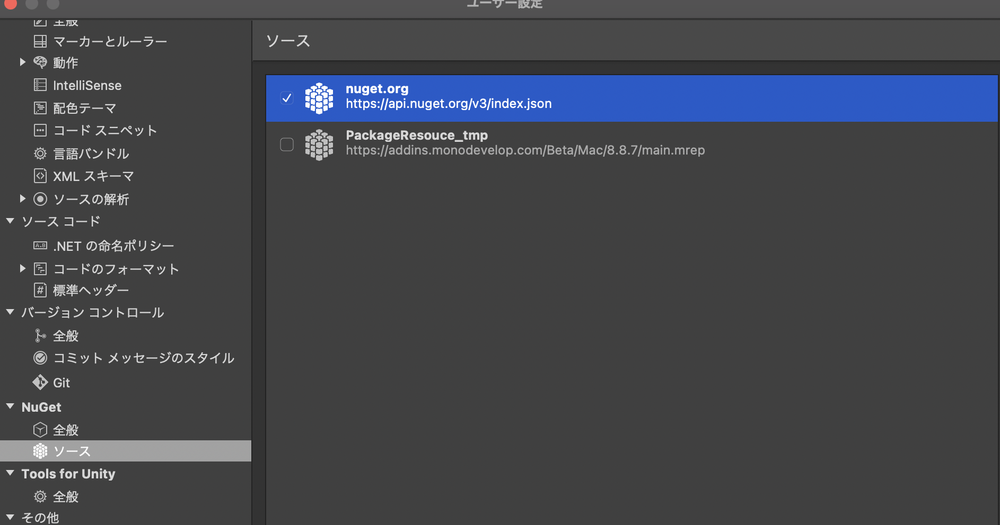

ある時 xUnit テストがしたかったのでテスト用のプロジェクトを作成したところ Nuget パッケージが復元できなくなってました。(もちろん更新もできません)

## 対処法

僕が最終的に解決した方法です。

ユーザー設定 > Nuget > ソース  
より以下のように「nuget.org」以外のチェックボックスを外します。



続いて Nuget を更新します。


少し待つと更新が完了します。  
更新完了後 Nuget を復元すると xUnit が使えるようになりました。

## その他にやったこと

上記の方法に辿り着くまでにやったことを書いておきます。

### キャッシュのクリア

[https://www.fixes.pub/program/37041.html](https://www.fixes.pub/program/37041.html)

```bash
$ nuget locals all -clear
```

### 色々更新

僕は VS 関連は brew で入れてるのでアプデ。  
Cask は brew tap で入れてる便利なやつで。

```bash
$ brew update
$ brew upgrade
$ brew cu -a
```

### Nuget v2 を追加してみる

[https://ranorex.techmatrix.jp/faq/パッケージ管理にて、nuget への接続エラーが発生し/](https://ranorex.techmatrix.jp/faq/%E3%83%91%E3%83%83%E3%82%B1%E3%83%BC%E3%82%B8%E7%AE%A1%E7%90%86%E3%81%AB%E3%81%A6%E3%80%81nuget%E3%81%B8%E3%81%AE%E6%8E%A5%E7%B6%9A%E3%82%A8%E3%83%A9%E3%83%BC%E3%81%8C%E7%99%BA%E7%94%9F%E3%81%97//)

ユーザー設定 > Nuget > ソース  
にて「追加」より

```txt
名前: nuget.org v2
ソース: https://www.nuget.org/api/v2/
```

を追加する
