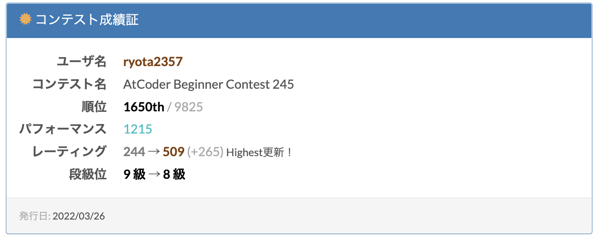
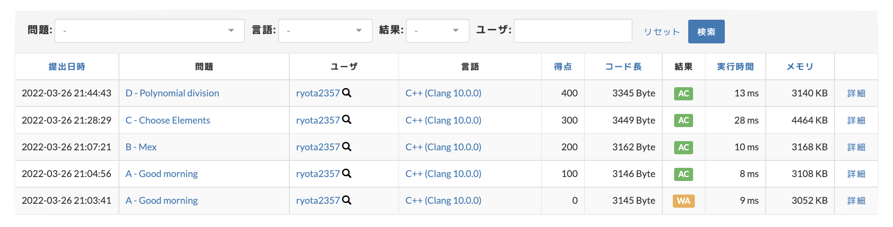

ACB245 に参加しました。

ちょっとした PC のトラブルがあったけど、パフォーマンスはいい感じのが出てよかった。  
A 問で WA してしまった。サンプルはちゃんと試そう。




<blockquote class="twitter-tweet"><p lang="ja" dir="ltr">ABC245<br>ちょっと遅れて急いだらA問からWA出すし(サンプル試さなかった)、VimのLSPが落ちるし、テンプレートヘッダのコピペが一部間違ってたり、PCの電源が切れかけたり、色々大変だった。<br>C問題に21分かけてるのはそうゆうこと。解法は1分もかからず思い付いたのに…<br>E二分探で頑張ったけど、実装が… <a href="https://t.co/ai3AlEEd0Q">pic.twitter.com/ai3AlEEd0Q</a></p>&mdash; 2357 (@95s7k84695a) <a href="https://twitter.com/95s7k84695a/status/1507717130804150273?ref_src=twsrc%5Etfw">March 26, 2022</a></blockquote>

## A - Good morning

[https://atcoder.jp/contests/abc245/tasks/abc245_a](https://atcoder.jp/contests/abc245/tasks/abc245_a)

if で丁寧に分岐をしてあげれば良い。

```cpp
int main(){ _FASTIO_
    int a, b, c, d; IN(a, b, c, d);
    if(a < c) {
        OUT("Takahashi");
    } else if(a == c) {
        if(b <= d) OUT("Takahashi");
        else OUT("Aoki");
    } else {
        OUT("Aoki");
    }
    return 0;
}
```

解説放送で知ったけど、時間を分に直して比較する方法もあったみたい。気が付かなかった。

## B - Mex

[https://atcoder.jp/contests/abc245/tasks/abc245_b](https://atcoder.jp/contests/abc245/tasks/abc245_b)

`seen[k]`が`true`なら`k`は数列 A に含まれる値

というようにして数列 A をループで回し、その後`seen[i]`が`false`になる`i`を小さい方から探して出力する。

```cpp
int main(){ _FASTIO_
    int n = read();
    vector<bool> seen(2020);
    rep(i, 0, n) {
        seen[read()] = true;
    }
    rep(i, 0, 2020) {
        if(seen[i] == false) {
            OUT(i);
            return 0;
        }
    }
    return 0;
}
```

## C - Choose Elements

[https://atcoder.jp/contests/abc245/tasks/abc245_c](https://atcoder.jp/contests/abc245/tasks/abc245_c)

できるかどうかを判定すれば良い。

ひとまず手を動かすなりすれば、`X[1..i]`まで存在する時、`X[1...i+1]`が存在するには`i`と`i+1`番目についての数列 A, B しか関係していないことがわかる。  
(このことから漸化式が立てられるので DP ができる(が、DP という発想がなかったのでループ回して判定してる))

```cpp
int main(){ _FASTIO_
    int n, k; IN(n, k);
    vector<int> a(n), b(n);
    rep(i, 0, n) a[i] = read(); rep(i, 0, n) b[i] = read();

    int aa = a[0], bb = b[0];
    rep(i, 1, n) {
        bool x1 = abs(a[i]-aa) <= k;
        bool x2 = abs(a[i]-bb) <= k;
        bool x3 = abs(b[i]-aa) <= k;
        bool x4 = abs(b[i]-bb) <= k;
        if (x1 || x2) aa = a[i];
        else aa = -INF;
        if (x3 || x4) bb = b[i];
        else bb = -INF;
    }
    if(aa == -INF && bb == -INF) OUT("No");
    else OUT("Yes");
    return 0;
}
```

非常にわかりにくい...  
DP を使うべきであった。

## D - Polynomial division

[https://atcoder.jp/contests/abc245/tasks/abc245_d](https://atcoder.jp/contests/abc245/tasks/abc245_d)

高校 1 年で習う、整式の除算をプログラムに落とし込む。

`reverse`しなくてもできたりするのだが、(個人的に)わかりにくくなるし、ミスらず実装できる気がしなかったので`reverse`した。  
案の定、バグらせた。`debug::Write()`を埋め込んで print debug した。

`n`次式は`n+1`項あることに注意

```cpp
// using namespace debug;

int main(){ _FASTIO_
    int n, m; IN(n, m); n += 1; m += 1;
    vector<ll> a(n), c(n+m-1); cin >> a >> c;
    reverse(ALL(a)); reverse(ALL(c));

    vector<ll> b(m);
    rep(i, 0, m) {
        ll t = c[i] / a[0];
        // Write(c[i], a[i], t);
        b[i] = t;
        rep(j, 0, n) {
            c[i+j] -= a[j]*t;
        }
    }

    reverse(ALL(b));
    rep(i, 0, m) cout << b[i] << ' ';
    cout << '\n';
    return 0;
}
```

## E - Wrapping Chocolate

[https://atcoder.jp/contests/abc245/tasks/abc245_e](https://atcoder.jp/contests/abc245/tasks/abc245_e)

解けなかった。

時直しを後日追記する

## F - Endless Walk

[https://atcoder.jp/contests/abc245/tasks/abc245_f](https://atcoder.jp/contests/abc245/tasks/abc245_f)

解けなかった。

時直しを後日追記する
