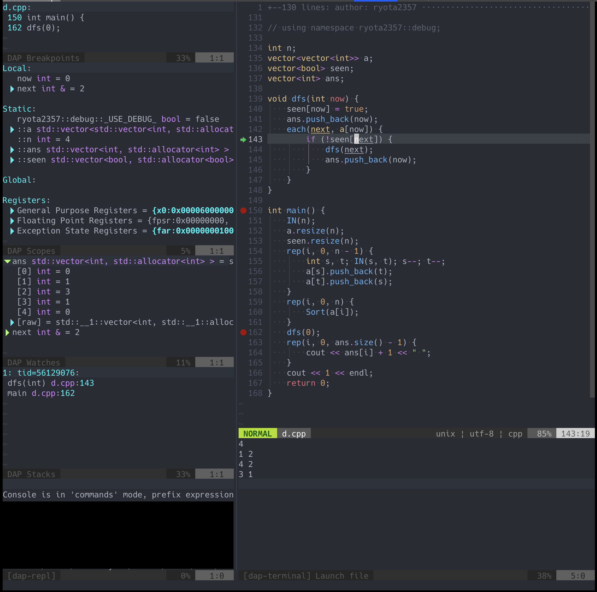
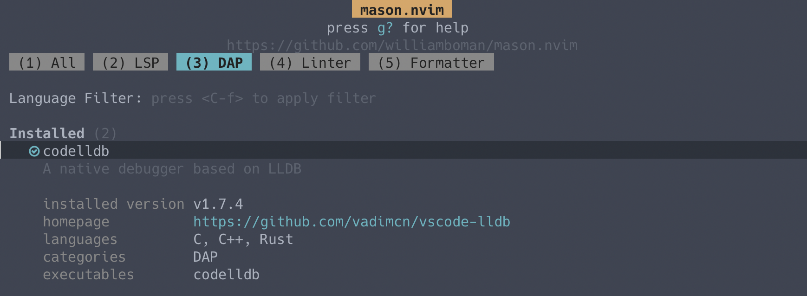

Neovim に C++のデバッグ環境を作った。  
こんな感じのできた。



フローティングなウィンドウも出せた。


## 使ったもの

次の 3 つのプラグインを使った。

- [mfussenegger/nvim-dap](https://github.com/mfussenegger/nvim-dap)
- [rcarriga/nvim-dap-ui](https://github.com/rcarriga/nvim-dap-ui)
- [williamboman/mason.nvim](https://github.com/williamboman/mason.nvim)

nvim-dap は Neovim とデバッガをいい感じに繋いでくれる、nvim-dap-ui は nvim-dap にいい感じの UI を作ってくれるやつ、Mason.nvim は LSP, DAP とかのインストーラ。

## 設定

プラグインマネージャに [dein.vim](https://github.com/Shougo/dein.vim) を使っている。(dein.vim の lua ラッパー [dein-snip.lua](https://github.com/ryota2357/dein-snip.lua) 使ってる)

```toml
[[plugins]]
repo = 'mfussenegger/nvim-dap'
depends = 'nvim-dap-ui'
hook_source = '''
  (後述)
'''
hook_add = '''
  (後述)
'''
```

### codelldb のインストール

Mason.nvim で入れる。



[nvim-dap の Wiki](https://github.com/mfussenegger/nvim-dap/wiki/Debug-Adapter-installation) には「VSCode 拡張ダウンロードして解凍」って書いてあるけど Mason 使えばその必要はない。  
快適だね。

### nvim-dap の の設定

`hook_source` はこんな感じ。  
説明はコメントで。

```vim
" アイコンの色定義
hi DapBreakpointTextHl guifg=#AA0000
hi DapStoppedTextHl guifg=#00c853

lua << EOF
  local dap = require('dap')

  -- アイコン設定
  vim.fn.sign_define('DapBreakpoint', { text='', texthl='DapBreakpointTextHl' })
  vim.fn.sign_define('DapStopped', { text='', texthl='DapStoppedTextHl' })

  -- ここにデバッガの設定
  dap.adapters = {
    codelldb = {
      type = 'server',
      port = '${port}',
      executable = {

        -- Masonはここにデバッガを入れてくれる
        command = vim.fn.stdpath('data') .. '/mason/packages/codelldb/extension/adapter/codelldb',

        -- ポートを自動的に割り振ってくれる
        args = {'--port', '${port}'}
      }
    }
  }

  -- ここにファイルタイプ別の設定
  dap.configurations = {
    cpp = {
      -- 複数指定することもできる
      -- 複数あるとデバッグ開始時にどの設定使うか聞かれる
      {
        -- なくてもいい。複数の設定があるとき、それらを識別するための名前
        name = 'Launch file',

        -- dap.adapters にあるデバッガから、どれを使うか
        type = 'codelldb',

        -- デバッガ起動する
        request = 'launch',

        -- コンパイル時に -g オプションをつけてビルドした実行ファイルを指定する
        -- こんな感じでinputで指定できるようにしておく
        program = function()
          return vim.fn.input('Path to executable: ', vim.fn.getcwd() .. '/a.out', 'file')
        end,

        -- よく分からないけど、nvim-dapのWikiに書いてあったので
        cwd = '${workspaceFolder}',

        -- trueだとバイナリのデバッグになっちゃう(なんで?)
        stopOnEntry = false
      }
    }
  }
EOF
```

nvim-dap の `hook_add` は次のようにした。

`DapBegin` と `DapEnd` ってコマンドを定義してる。  
`DapBegin` でデバッグ開始、`DapEnd` で終了。キーマッピングとオプションを DapBegin ~ DapEnd の間だけに適用したかったのでこんな感じになった。

```vim
command! DapBegin call <SID>DapBegin()
command! DapEnd call <SID>DapEnd()

function! s:DapBegin() abort
  call dein#source('nvim-dap') " 複数回sourceされることはない
  let b:save_laststatus = &laststatus
  setlocal laststatus=2
  nnoremap <silent><F4>  <Cmd>lua require'dap'.toggle_breakpoint()<CR>
  nnoremap <silent><F5>  <Cmd>lua require'dap'.continue()<CR>
  nnoremap <silent><F10> <Cmd>lua require'dap'.step_over()<CR>
  nnoremap <silent><F11> <Cmd>lua require'dap'.step_into()<CR>
  nnoremap <silent><F12> <Cmd>lua require'dap'.step_out()<CR>
  lua require'dapui'.open()
  nnoremap <buffer><buffer><2-LeftMouse> <Cmd>lua require'dapui'.eval()<CR>
endfunction

function! s:DapEnd() abort
  silent! nunmap <F4>
  silent! nunmap <F5>
  silent! nunmap <F10>
  silent! nunmap <F11>
  silent! nunmap <F12>
  silent! nunmap <2-LeftMouse>
  if exists('b:save_laststatus')
    let &laststatus = b:save_laststatus
    unlet b:save_laststatus
  endif
  lua require'dapui'.close()
  lua require'dap'.clear_breakpoints()
  lua require'dap'.disconnect()
endfunction
```

### UI (nvim-dap-ui)

`on_source = 'nvim-dap'`を指定しておくと nvim-dap をソースした時(`DapBegin`コマンドを入力した時)に自動的に nvim-dap-ui をソースしてくれるようになる。

```toml
[[plugins]]
repo = 'rcarriga/nvim-dap-ui'
on_source = 'nvim-dap'
hook_source = '''
  (後述)
'''
```

`hook_source`でデフォルト設定を少し変更する。  
説明はコメントで。

```vim
lua << EOF
  require('dapui').setup {
    -- アイコン (nard font)
    icons = { expanded = '', collapsed = '' },

    -- UIのレイアウトを変更
    layouts = {
      {
        -- 表示するUI要素
        elements = {
          -- それぞれの要素を id で、size に大きさを指定
          { id = 'repl', size = 0.15 },
          { id = 'stacks', size = 0.2 },
          { id = 'watches', size = 0.2 },
          { id = 'scopes', size = 0.35 },
          { id = 'breakpoints', size = 0.1 }
        },

        -- 横幅の40%の大きさ
        size = 0.4,

        -- 画面左側に表示
        position = 'left'
      },

      {
        -- 表示するUI要素、sizeを指定しない場合は文字列だけでok
        elements = { 'console' },

        -- 縦幅の25%の大きさ
        size = 0.25,

        -- 画面下側に表示
        position = 'bottom'
      }
    }
  }
EOF
```

## 全体

上で説明した C++のデバッグ設定に加えて Python の設定(debugpy)もしている。

<details>
  <summary>dap.toml</summary>

```toml
[[plugins]]
repo = 'mfussenegger/nvim-dap'
depends = 'nvim-dap-ui'
hook_source = '''
hi DapBreakpointTextHl guifg=#AA0000
hi DapStoppedTextHl guifg=#00c853
lua << EOF
  local dap = require('dap')
  vim.fn.sign_define('DapBreakpoint', { text='', texthl='DapBreakpointTextHl' })
  vim.fn.sign_define('DapStopped', { text='', texthl='DapStoppedTextHl' })
  dap.adapters = {
    codelldb = {
      type = 'server',
      port = '${port}',
      executable = {
        command = vim.fn.stdpath('data') .. '/mason/packages/codelldb/extension/adapter/codelldb',
        args = {'--port', '${port}'}
      }
    },
    debugpy = {
      type = 'executable',
      command = vim.fn.stdpath('data') .. '/mason/packages/debugpy/venv/bin/python',
      args = { '-m', 'debugpy.adapter' }
    }
  }
  dap.configurations = {
    cpp = {
      {
        name = 'Launch file',
        type = 'codelldb',
        request = 'launch',
        program = function()
          return vim.fn.input('Path to executable: ', vim.fn.getcwd() .. '/a.out', 'file')
        end,
        cwd = '${workspaceFolder}',
        stopOnEntry = false -- trueだとバイナリのデバッグになっちゃう(なんで?)
      }
    },
    python = {
      {
        name = 'Launch file',
        type = 'debugpy',
        request = 'launch',
        program = '${file}',
        pythonPath = vim.fn.fnamemodify('~/.pyenv/shims/python', ':p')
      }
    }
  }
EOF
'''
hook_add = '''
  command! DapBegin call <SID>DapBegin()
  command! DapEnd call <SID>DapEnd()

  function! s:DapBegin() abort
    call dein#source('nvim-dap') " 複数回sourceされることはない
    let b:save_laststatus = &laststatus
    setlocal laststatus=2
    nnoremap <silent><F4>  <Cmd>lua require'dap'.toggle_breakpoint()<CR>
    nnoremap <silent><F5>  <Cmd>lua require'dap'.continue()<CR>
    nnoremap <silent><F10> <Cmd>lua require'dap'.step_over()<CR>
    nnoremap <silent><F11> <Cmd>lua require'dap'.step_into()<CR>
    nnoremap <silent><F12> <Cmd>lua require'dap'.step_out()<CR>
    lua require'dapui'.open()
    nnoremap <buffer><buffer><2-LeftMouse> <Cmd>lua require'dapui'.eval()<CR>
  endfunction

  function! s:DapEnd() abort
    silent! nunmap <F4>
    silent! nunmap <F5>
    silent! nunmap <F10>
    silent! nunmap <F11>
    silent! nunmap <F12>
    silent! nunmap <2-LeftMouse>
    if exists('b:save_laststatus')
      let &laststatus = b:save_laststatus
      unlet b:save_laststatus
    endif
    lua require'dapui'.close()
    lua require'dap'.clear_breakpoints()
    lua require'dap'.disconnect()
  endfunction
'''

[[plugins]]
repo = 'rcarriga/nvim-dap-ui'
on_source = 'nvim-dap'
hook_source = '''
lua << EOF
  require('dapui').setup {
    icons = { expanded = '', collapsed = '' },
    layouts = {
      {
        elements = {
          { id = 'repl', size = 0.15 },
          { id = 'stacks', size = 0.2 },
          { id = 'watches', size = 0.2 },
          { id = 'scopes', size = 0.35 },
          { id = 'breakpoints', size = 0.1 }
        },
        size = 0.4,
        position = 'left'
      },
      {
        elements = { 'console' },
        size = 0.25,
        position = 'bottom'
      }
    }
  }
EOF
'''
```

</details>
