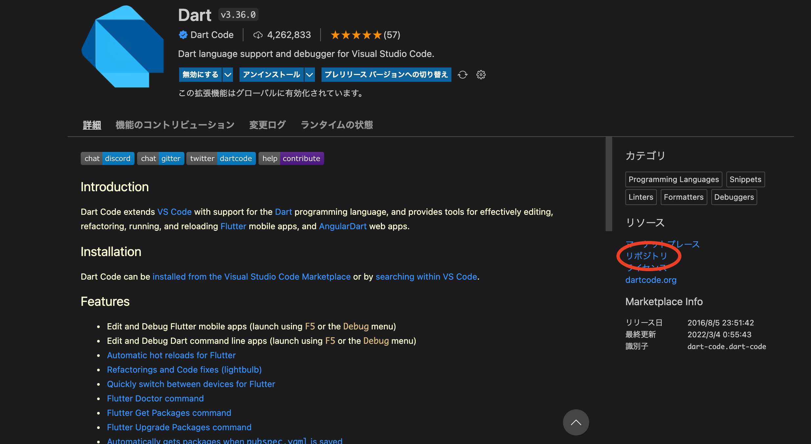
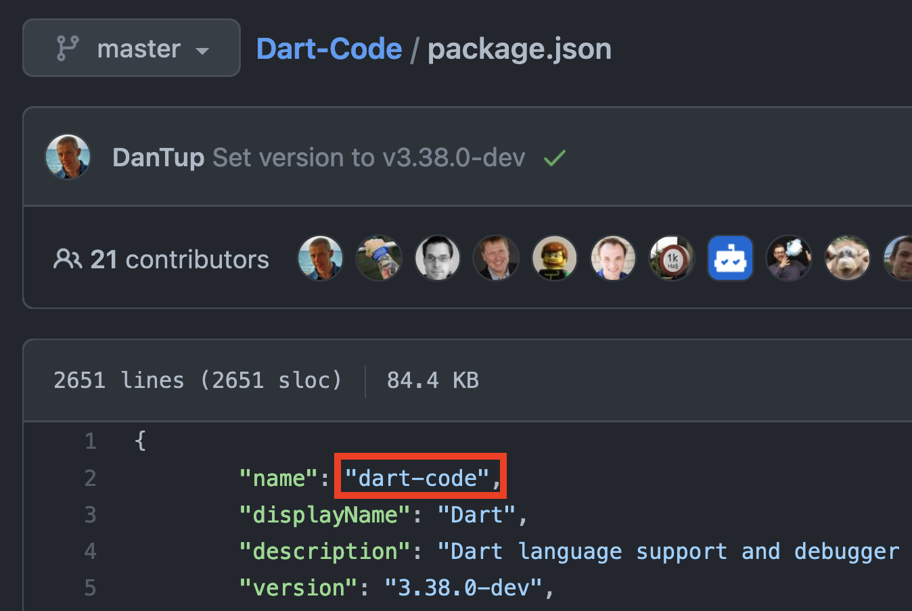

[公式 docs](https://www.gatsbyjs.com/plugins/gatsby-remark-vscode/)に書いてあったのですが、少しわかりにくかったので。  
非常に簡単に追加できました。

例として `.txt` と `.dart` を追加してみます。

## 対応してる言語

gatsby-remark-vscode は 55 の言語のハイライトに対応してます。(2021/3/11 現在)

<details>
  <summary>一覧(docから引用)</summary>

- Batch/CMD
- Clojure
- CoffeeScript
- C
- C++
- C Platform
- C#
- CSS
- Dockerfile
- F#
- Git Commit
- Git Rebase
- Diff
- Ignore
- Go
- Groovy
- Handlebars
- Hlsl
- HTML
- CSHTML
- PHP HTML
- INI
- Java
- JavaScript
- JSX
- JSON
- JSON with Comments
- Less
- Log
- Lua
- Makefile
- Markdown
- Objective-C
- Objective-C++
- Perl
- Perl 6
- PHP
- Powershell
- Pug
- Python
- R
- Ruby
- Rust
- Sass
- SassDoc
- ShaderLab
- Shell
- SQL
- Swift
- TypeScript
- TSX
- ASP VB .NET
- XML
- XML XSL
- YAML

</details>

## .txt に対応させる

これは対応というかエイリアスを設定します。  
`gatsby-config.js` にて `ignore` にすれば期待通りになる。

```jsx
{
  resolve: `gatsby-remark-vscode`,
    options: {
      languageAliases: { txt: 'ignore' },
    },
},
```

## .dart に対応させる

まず、VSCode にて Dart 言語のプラグインを表示させます。



リソースのところにリポジトリとあるのでリクックしてブラウザで開きます。(上画像赤丸)

リポジトリのリンクは `https://github.com/Dart-Code/Dart-Code` なので npm で次のようにインストールします。

```bash
$ npm i Dart-Code/Dart-Code
```

`package.json` の `name` プロパティを確認して、



`gatsby-config.js` に以下のように `extensions` プロパティに書きます。

```jsx
{
  resolve: `gatsby-remark-vscode`,
    options: {
      extensions: ['dart-code'],
    },
},
```

これで対応終了です。

`.txt` も vscode プラグインで何かあるなら、エイリアスを貼るのではなく `.dart` の時と同じような手順で対応するのも良いと思う。

## 参考

[https://github.com/andrewbranch/gatsby-remark-vscode/issues/130](https://github.com/andrewbranch/gatsby-remark-vscode/issues/130)
