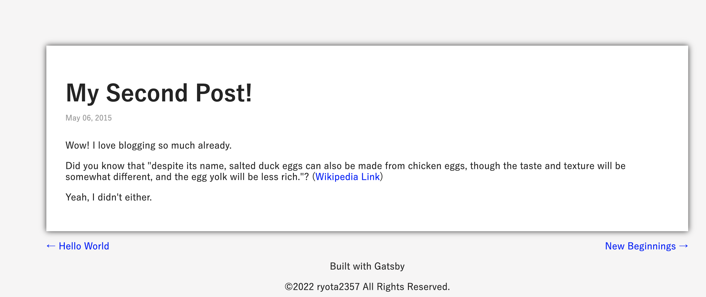
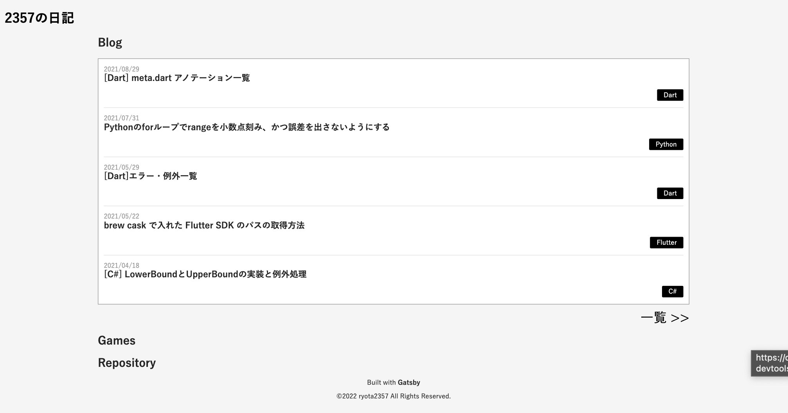
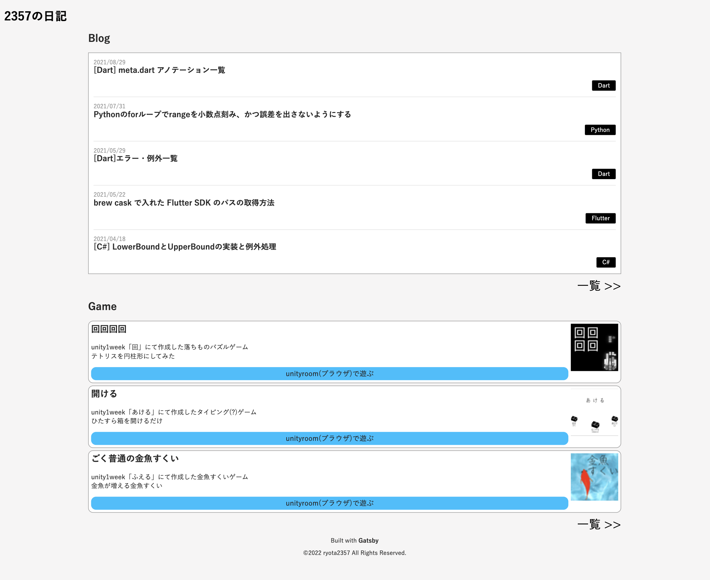
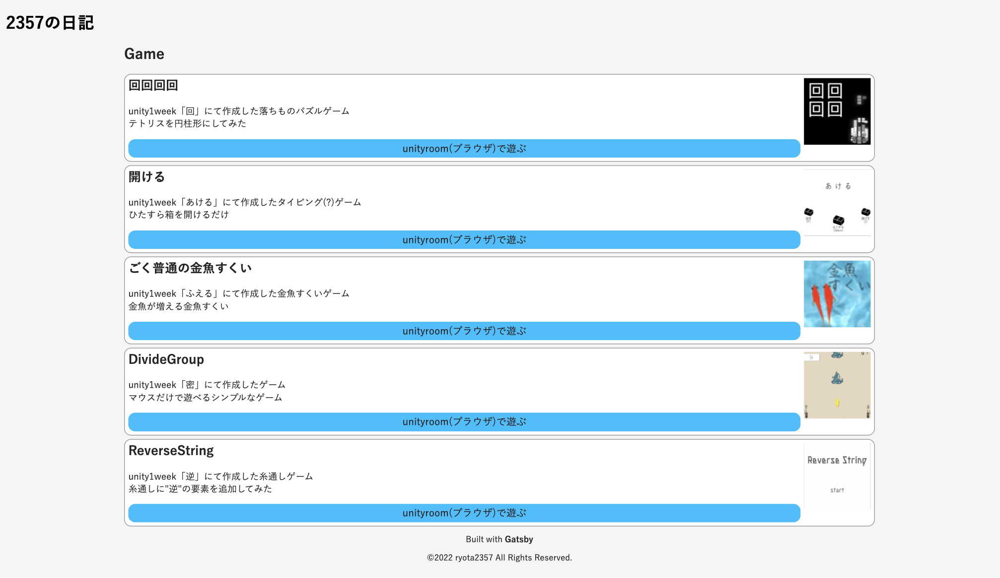
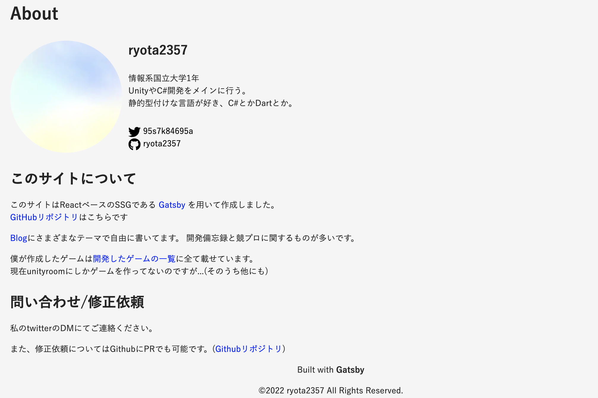
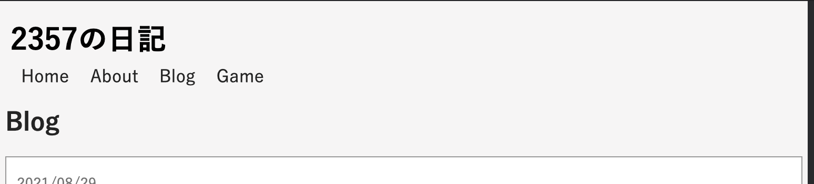

> このサイトを作るまでの記録。(時系列順)  
> 実際に作業を行なったメモに追記、編集して投稿してるので投稿日と作業日は一致しない。
>
> スターターを`gatsby new`したのは 2022 年の 3 月上旬。
> `gatsby`のバージョンは 4.9
>
> [一覧はここ](../gatsby-site-create-log0/)

調整は終わったから、機能追加とかも含めたデザイン変更をする  
今までの blogger+markdown で書いていた記事を以降して、記事数増やしてから始める

## ブログ個別記事の外枠

僕の前のブログと同じ感じにする

`templates/blog-posts.js`に style 追加

```jsx
...
const BlogPostTemplate = ({ data, location }) => {
  const BlogBody = ({ post }) => (
    <article
      className="blog-post"
      itemScope
      itemType="http://schema.org/Article"
      style={{
        backgroundColor: '#ffffff',
        boxShadow: '0 0 10px #323232',
        padding: '2em'
      }}
    >
      <div style={{ marginBottom: '30px' }}>
        <h1 itemProp="headline" style={{
          fontSize: '2.4rem',
          marginBottom: '5px'
        }}>{ post.frontmatter.title }</h1>
        <p style={{
          fontSize: '0.8rem',
          color: '#999999',
        }}>{ post.frontmatter.date }</p>
      </div>
...
```



## index.js のブログ一覧をデザイン

BlogCard コンポーネンをデザインする。

index.js の Index コンポーネント内に書いていたけど長くなったのでファイル分割して、BlogCards コンポーネントとして、一覧を表示するコンポーネントとした。  
引数に count で何個表示するか指定できるようにした。

```jsx
import * as React from "react";

import Layout from "../components/layout";
import Seo from "../components/seo";
import BlogCards from "../components/blogCards";

const Index = ({ location }) => {
  return (
    <Layout location={location}>
      <Seo title="Home" />
      <h2>Blog</h2>
      <BlogCards count={20} />
    </Layout>
  );
};

export default Index;
```

BlogCards コンポーネントはこんな感じ。

<details>
  <summary>components/blogCards.js</summary>

```jsx
import * as React from "react";
import { Link, graphql, useStaticQuery } from "gatsby";

const BlogCards = ({ count }) => {
  const data = useStaticQuery(graphql`
    query {
      allMarkdownRemark(sort: { fields: [frontmatter___date], order: DESC }) {
        nodes {
          excerpt
          fields {
            slug
          }
          frontmatter {
            date(formatString: "YYYY/MM/DD")
            title
            tags
          }
        }
      }
    }
  `);

  const Card = ({ post, style }) => {
    const Date = () => (
      <p style={{ color: "#999999", marginBottom: "0" }}>
        {post.frontmatter.date}
      </p>
    );
    const Title = () => (
      <h3 style={{ margin: "0" }}>
        <Link
          to={`/blog${post.fields.slug}`}
          itemProp="url"
          style={{ color: "#242424" }}
        >
          <span itemProp="headline">
            {post.frontmatter.title || post.fields.slug}
          </span>
        </Link>
      </h3>
    );
    const Tag = () => (
      <p style={{ display: "flex", justifyContent: "flex-end" }}>
        {post.frontmatter.tags &&
          post.frontmatter.tags.map((tag, i) => (
            <span
              style={{
                backgroundColor: "#000000",
                borderRadius: "2px",
                padding: "0.3rem 1rem",
                marginLeft: "0.3rem",
              }}
              key={i}
            >
              <Link to="/" style={{ color: "#ffffff" }}>
                {" "}
                {tag}{" "}
              </Link>
            </span>
          ))}
      </p>
    );
    return (
      <div itemScope itemType="http://schema.org/Article" style={style}>
        <Date />
        <Title />
        <Tag />
      </div>
    );
  };

  return (
    <div
      style={{
        display: "flex",
        flexFlow: "column",
        backgroundColor: "#ffffff",
        border: "solid 1px #999999",
        padding: "0 10px",
      }}
    >
      {data.allMarkdownRemark.nodes.slice(0, count).map((post, i) => {
        // 最後の一個以外ボーダーで区切り線を入れる
        if (i >= count - 1) return <Card post={post} key={i} />;
        return (
          <Card
            post={post}
            style={{ borderBottom: "solid 1px #E3E3E3" }}
            key={i}
          />
        );
      })}
    </div>
  );
};

export default BlogCards;
```

</details>

個数指定、query で行いたかったんだけど、limit に変数を渡す方法がわからなかったので雑に処理してる。  
あと、tags をマークダウンの frontmattar に追加したので、query して適当に処理した。

style.css にて基本のフォントサイズを少し小さくした。

```css
html {
    ...
    font-size: 14px;
}
...
```


## blog 個別ページを作成

`pages/blog.js`を作り以下にする。

```jsx
import * as React from "react";

import Layout from "../components/layout";
import Seo from "../components/seo";
import BlogCards from "../components/blogCards";

const Blog = ({ location }) => {
  return (
    <Layout location={location}>
      <Seo title="Blog List" />
      <h2>Blog</h2>
      <BlogCards count={1000} />
    </Layout>
  );
};

export default Blog;
```

`pages/index.js`の BlogCards コンポーネントの count を 5 にして、blog ページへのリンクを設置して、

<details>
  <summary>pages/index.js</summary>

```jsx
import * as React from "react";
import { Link } from "gatsby";

import Layout from "../components/layout";
import Seo from "../components/seo";
import BlogCards from "../components/blogCards";

const Index = ({ location }) => {
  const ToALl = ({ to }) => (
    <Link
      to={to}
      style={{
        color: "#000000",
        fontSize: "2rem",
        marginTop: "10px",
        display: "flex",
        justifyContent: "flex-end",
      }}
    >
      一覧 &gt;&gt;
    </Link>
  );
  return (
    <Layout location={location}>
      <Seo title="Home" />

      <h2>Blog</h2>
      <BlogCards count={5} />
      <ToALl to="/blog" />

      <h2>Games</h2>

      <h2>Repository</h2>
    </Layout>
  );
};

export default Index;
```

</details>

少しだけ`components/layout.js`を編集

<details>
  <summary>compenets/layout.js</summary>

```jsx
  const Footer = () => (
    ...
    // ↓fontWeight: 'bold'を追加
    <p>Built with <a href="https://www.gatsbyjs.com" style={{color: 'inherit', fontWeight: 'bold'}}>Gatsby</a></p>
    <p>©2022 {site.siteMetadata.author.name} All Rights Reserved.</p>
    </footer>
  )
...
  return (
    <div className="global-layout" data-is-root-path={location.pathname === rootPath}>
    <Header />
      <main style={{
        maxWidth: '1080px',
        margin: 'auto',
        padding: '0 5px' // ←追加
      }}>
        { children }
    ...
```

</details>



## BlogCards と同様に GameCards を作成

↑ の画像にあるように Repository も作ろうと思ったのだけど、公開できるほどのものがないことに気がついたので、RepositoryCards の作成は保留。

Games 配列オブジェクトを作って、map で回して GameCards を作成。

<details>
  <summary>components/gameCards.js</summary>

```jsx
import * as React from "react";
import { StaticImage } from "gatsby-plugin-image";

import hueruGIF from "../images/icon_game_1week_hueru.gif";
import mituGIF from "../images/icon_game_1week_mitu.gif";

const GameCards = ({ count }) => {
  const Games = [
    {
      title: "回回回回",
      description: `unity1week「回」にて作成した落ちものパズルゲーム<br />テトリスを円柱形にしてみた`,
      href: "https://unityroom.com/games/kaikaikaikai",
      img: (
        <StaticImage
          alt="kai_icon"
          src="../images/icon_game_1week_kai.jpg"
          style={{ width: "8rem", height: "8rem" }}
        />
      ),
      posted: "2021/03/04 14:28",
      update: "2021/03/06 11:37",
    },
    {
      title: "開ける",
      description: `unity1week「あける」にて作成したタイピング(?)ゲーム<br />ひたすら箱を開けるだけ`,
      href: "https://unityroom.com/games/open_typing",
      img: (
        <StaticImage
          alt="akeru_icon"
          src="../images/icon_game_1week_akeru.png"
          style={{ width: "8rem", height: "8rem" }}
        />
      ),
      posted: "2020/12/29 22:28",
      update: "2020/12/30 14:06",
    },
    {
      title: "ごく普通の金魚すくい",
      description: `unity1week「ふえる」にて作成した金魚すくいゲーム<br />金魚が増える金魚すくい`,
      href: "https://unityroom.com/games/veryordinary_goldfishscooping",
      img: (
        
      ),
      posted: "2020/08/19 08:22",
      update: "2020/08/19 12:20",
    },
    {
      title: "DivideGroup",
      description: `unity1week「密」にて作成したゲーム<br />マウスだけで遊べるシンプルなゲーム`,
      href: "https://unityroom.com/games/dividegroup",
      img: (
        
      ),
      posted: "2020/05/04 13:33",
      update: "2020/05/09 22:01",
    },
    {
      title: "ReverseString",
      description: `unity1week「逆」にて作成した糸通しゲーム<br />糸通しに"逆"の要素を追加してみた`,
      href: "https://unityroom.com/games/reversestring",
      img: (
        <StaticImage
          alt="gyaku_icon"
          src="../images/icon_game_1week_gyaku.png"
          style={{ width: "8rem", height: "8rem" }}
        />
      ),
      posted: "2020/03/01 19:48",
      update: "2020/03/02 14:41",
    },
  ];
  const Card = ({ aGame }) => (
    <div
      style={{
        backgroundColor: "#ffffff",
        display: "flex",
        border: "solid 1px #999999",
        padding: "5px",
        marginBottom: "5px",
        borderRadius: "10px",
      }}
    >
      <div style={{ width: "100%" }}>
        <h3 style={{ marginTop: "0", fontSize: "1.5rem" }}>{aGame.title}</h3>
        <p
          style={{ fontSize: "1.1rem", lineHeight: "1.5rem" }}
          dangerouslySetInnerHTML={{ __html: aGame.description }}
        />
        <a
          href={aGame.href}
          style={{
            fontSize: "1.2rem",
            textAlign: "center",
            backgroundColor: "#00bfff",
            color: "#242424",
            display: "flex",
            justifyContent: "space-around",
            padding: "5px 0",
            margin: "auto",
            borderRadius: "10px",
          }}
        >
          unityroom(ブラウザ)で遊ぶ
        </a>
      </div>
      <div style={{ marginLeft: "5px" }}>{aGame.img}</div>
    </div>
  );
  return Games.slice(0, count).map((game, i) => <Card aGame={game} key={i} />);
};

export default GameCards;
```

</details>

index.js には 3 つ並べる。

```jsx
...
  return (
    <Layout location={location}>
      <Seo title="Home" />

      <h2>Blog</h2>
      <BlogCards count={5} />
      <ToALl to="/blog" />

      <h2>Game</h2>
      <GameCards count={3}/>
      <ToALl to="/game" />

    </Layout>
  )
...
```



個別ページも作成

<details>
  <summary>pages/game.js</summary>

```jsx
import * as React from "react";

import Layout from "../components/layout";
import Seo from "../components/seo";
import GameCards from "../components/gameCards";

const Game = ({ location }) => {
  return (
    <Layout location={location}>
      <Seo title="Game List" />
      <h2>Game</h2>
      <GameCards count={1000} />
    </Layout>
  );
};

export default Game;
```

</details>



## About ページを作成

と思ったんだけど、game.js と blog.js のタイトルが h2 で作ってることに気がついたので修正

<details>
  <summary>pages/blog.js</summary>

```jsx
...
const Blog = ({ location }) => {
  return (
    <Layout location={location}>
      <Seo title="Blog List" />
      <h1>Blog</h1> {/* h2 -> h1 */ }
      <BlogCards count={1000} />
    </Layout>
  )
}
...
```

</details>

<details>
  <summary>pages/game.js</summary>

```jsx
const Blog = ({ location }) => {
  return (
    <Layout location={location}>
      <Seo title="Game List" />
      <h1>Game</h1> {/* h2 -> h1 */}
      <GameCards count={1000} />
    </Layout>
  );
};
```

</details>

About ページを作るにあたって fontawesome が使いたいので導入する

```bash
$ npm i @fortawesome/fontawesome-svg-core
$ npm i @fortawesome/react-fontawesome
$ npm i @fortawesome/free-brands-svg-icons
$ npm i @fortawesome/free-regular-svg-icons
$ npm i @fortawesome/free-solid-svg-icons
$ npm i gatsby-plugin-fontawesome-css
```

↑ の最後の 1 つは gasby のプラグイン。入れる理由は[この公式の説明](https://www.gatsbyjs.com/plugins/gatsby-plugin-fontawesome-css/?=fontawe)  
`gatsby-config.js`に追加記述するのを忘れずに

```jsx
...
  plugins: [
    ...
    `gatsby-plugin-fontawesome-css`,
  ],
}
```

準備はできたので、`pages/abou.js`を内容は適当で作る

siteMetadata に repository を追加した。

<details>
  <summary>pages/abou.js</summary>

```jsx
import * as React from "react";
import { graphql, Link } from "gatsby";
import { StaticImage } from "gatsby-plugin-image";
import { FontAwesomeIcon } from "@fortawesome/react-fontawesome";
import { faTwitter, faGithub } from "@fortawesome/free-brands-svg-icons";

import Layout from "../components/layout";
import Seo from "../components/seo";

const About = ({ data, location }) => {
  const Profile = ({ metaData }) => {
    const SocialIcon = ({ icon, id, color, baseUrl }) => (
      <div style={{ marginRight: "10px" }}>
        <a href={`${baseUrl}${id}`} style={{ color: color }}>
          <FontAwesomeIcon
            icon={icon}
            style={{
              width: "1.5rem",
              height: "1.5rem",
              color: color,
              verticalAlign: "middle",
            }}
          />
          <span> {id}</span>
        </a>
      </div>
    );
    return (
      <div style={{ display: "flex", margin: "30px 0" }}>
        <div style={{ width: "13.5rem", height: "13.5rem" }}>
          <StaticImage
            src="../images/profile-pic.jpg"
            alt="profile-pic"
            style={{
              width: "100%",
              height: "auto",
              borderRadius: "50%",
            }}
          />
        </div>
        <div style={{ marginLeft: "10px" }}>
          <p style={{ fontSize: "1.5rem", fontWeight: "bold", marginTop: "0" }}>
            {metaData.author.name}
          </p>
          <p dangerouslySetInnerHTML={{ __html: metaData.author.summary }} />
          <div style={{ marginTop: "2rem" }}>
            <SocialIcon
              icon={faTwitter}
              id={metaData.social.twitter}
              color="#000000"
              baseUrl="https://twitter.com/"
            />
            <SocialIcon
              icon={faGithub}
              id={metaData.social.github}
              color="#000000"
              baseUrl="https://github.com/"
            />
          </div>
        </div>
      </div>
    );
  };

  return (
    <Layout location={location}>
      <Seo title="About" />
      <h1>About</h1>

      <Profile metaData={data.site.siteMetadata} />

      <h2 style={{ marginTop: "2rem" }}>このサイトについて</h2>
      <p>
        このサイトはReactベースのSSGである{" "}
        <a href="https://www.gatsbyjs.com">Gatsby</a> を用いて作成しました。
        <br />
        <a href={`https://github.com/${data.site.siteMetadata.social.github}`}>
          GitHubリポジトリ
        </a>
        はこちらです
      </p>
      <p>
        <Link to="/blog">Blog</Link>にさまざまなテーマで自由に書いてます。
        開発備忘録と競プロに関するものが多いです。
      </p>
      <p>
        僕が作成したゲームは<Link to="/game">開発したゲームの一覧</Link>
        に全て載せています。
        <br />
        現在unityroomにしかゲームを作ってないのですが...(そのうち他にも)
      </p>

      <h2 style={{ marginTop: "2rem" }}>問い合わせ/修正依頼</h2>
      <p>私のtwitterのDMにてご連絡ください。</p>
      <p>
        また、修正依頼についてはGithubにPRでも可能です。(
        <a href={`https://github.com/${data.site.siteMetadata.social.github}`}>
          Githubリポジトリ
        </a>)
      </p>
    </Layout>
  );
};

export const pageQuery = graphql`
  query QueryForAboutPage {
    site {
      siteMetadata {
        title
        author {
          name
          summary
        }
        description
        siteUrl
        repository
        social {
          github
          unityroom
          twitter
        }
      }
    }
  }
`;

export default About;
```

</details>



## 色の変更

a タグの色、blue はあれだから変更。  
ついでに Accessibility Insights for Web の Fas Path を実行したらコントラストがダメと言われた。  
指示通り変更した。

```txt
aタグの色      blue    -> #0969da
日付等の薄文字  #999999 -> #747474
```


## Header に各ページへのナビゲーションを追加

Nav を追加した。それに伴って margin をいじった。

<details>
  <summary>components/layout.js</summary>

```jsx
import * as React from "react";
import { Link, useStaticQuery, graphql } from "gatsby";

const Layout = ({ location, children }) => {
  const rootPath = `${__PATH_PREFIX__}/`;
  const { site } = useStaticQuery(graphql`
    query {
      site {
        siteMetadata {
          title
          author {
            name
          }
        }
      }
    }
  `);

  const Header = () => (
    <header style={{ margin: "20px 0 10px 0" }}>
      <span
        to="/"
        style={{
          color: "#000000",
          fontSize: "2rem",
          fontWeight: "bold",
          padding: "0 10px",
          userSelect: "none",
        }}
      >
        {site.siteMetadata.title}
      </span>
    </header>
  );

  const Nav = () => {
    const Li = ({ name, to }) => (
      <li style={{ margin: "0 10px" }}>
        <Link to={to} style={{ color: "#242424" }}>
          {name}
        </Link>
      </li>
    );
    return (
      <nav>
        <ul
          style={{
            fontSize: "1.2rem",
            display: "flex",
            justifyContent: "flex-start",
            listStyle: "none",
            margin: "0 10px 20px 10px",
            padding: "0",
          }}
        >
          <Li name="Home" to="/" key={`/`} />
          <Li name="About" to="/about" key={`about`} />
          <Li name="Blog" to="/blog" key={`blog`} />
          <Li name="Game" to="/game" key={`game`} />
        </ul>
      </nav>
    );
  };

  const Footer = () => (
    <footer
      style={{
        textAlign: "center",
        fontSize: "0.7rem",
      }}
    >
      <p>
        Built with{" "}
        <a
          href="https://www.gatsbyjs.com"
          style={{ color: "inherit", fontWeight: "bold" }}
        >
          Gatsby
        </a>
      </p>
      <p>©2022 {site.siteMetadata.author.name} All Rights Reserved.</p>
    </footer>
  );

  return (
    <div
      className="global-layout"
      data-is-root-path={location.pathname === rootPath}
    >
      <Header />
      <Nav />
      <main
        style={{
          maxWidth: "1080px",
          margin: "auto",
          padding: "0 5px",
        }}
      >
        {children}
      </main>
      <Footer />
    </div>
  );
};

export default Layout;
```

</details>


