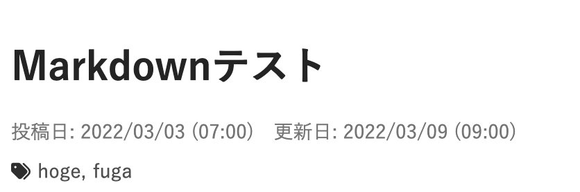

> このサイトを作るまでの記録。(時系列順)  
> 実際に作業を行なったメモに追記、編集して投稿してるので投稿日と作業日は一致しない。
>
> スターターを`gatsby new`したのは 2022 年の 3 月上旬。
> `gatsby-cli`のバージョンは 4.9.0
>
> [一覧はここ](../gatsby-site-create-log0/)

記事の Markdown の`frontmatter`には`date`というプロパティがあるけど、これは投稿日、更新日のどちらかしか表せず不便である。  
そこで、`date`プロパティを廃止して`postdate`と`update`という 2 つのプロパティを設置する。

## `date`の廃止と新しいプロパティの設置

まず、既存の全ての markdown ファイルの`date`を`postdate`に置換。  
`update`をつけたいものにはつける。

### gatsby-node.js

graphql の sort で date を使っているので訂正する。訂正場所は`///!!!`と書いてある行

```jsx
exports.createPages = async ({ graphql, actions, reporter }) => {
...
  const result = await graphql(
    `
      {
        allMarkdownRemark(
          sort: { fields: [frontmatter___postdate], order: ASC } //!!!
          limit: 1000
        ) {
          nodes {
            id
            fields {
              slug
            }
          }
        }
      }
    `
  )
```

また、ここでは`siteMetadata {}` オブジェクトを明示的に定義しているので、`postdate`、`update`を定義する。訂正場所は`///!!!`と書いてある行

```jsx
exports.createSchemaCustomization = ({ actions }) => {
  const { createTypes } = actions

  // siteMetadata {} オブジェクトを明示的に定義します。
  // こうすることで、gatsby-config.jsから削除されても、常に定義されるようになります。

  // Markdown のフロントマターも明示的に定義します。
  // この方法により、"content/blog" 内にブログ記事が格納されていない場合でも、"MarkdownRemark" クエリはエラーを返すのではなく、`null` を返すようになります。
  createTypes(`
....
    type Frontmatter {
      title: String
      description: String
      postdate: Date @dateformat  //!!!
      update: Date @dateformat    //!!!
      tags: [String]
    }

    type Fields {
      slug: String
    }
  `)
}
```

### gatsby-config.js

RSS feed のプラグインで`date`が 4 ヶ所いたので訂正する。

```jsx
    {
      resolve: `gatsby-plugin-feed`,
...
        feeds: [
          {
            serialize: ({ query: { site, allMarkdownRemark } }) => {
              return allMarkdownRemark.nodes.map(node => {
                return Object.assign({}, node.frontmatter, {
                  description: node.excerpt,
                  postdate: node.frontmatter.postdate, //!!!×2
                  url: site.siteMetadata.siteUrl + node.fields.slug,
                  guid: site.siteMetadata.siteUrl + node.fields.slug,
                  custom_elements: [{ "content:encoded": node.html }],
                })
              })
            },
            query: `
              {
                allMarkdownRemark(
                  sort: { order: DESC, fields: [frontmatter___postdate] }, //!!!
                ) {
                  nodes {
                    excerpt
                    html
                    fields {
                      slug
                    }
                    frontmatter {
                      title
                      postdate  //!!!
                    }
                  }
                }
              }
            `,
            output: "/rss.xml",
            title: "ryota2357 RSS Feed", //ついでにここも変えておいた。
          },
        ],
      },
    },
```

## blog 個別記事に投稿日と更新日を追加

日付が`YYYY/MM/DD`の表示だったのを`YYYY/MM/DD (HH:mm)`にして時間もついでに表示するようにも。

あとダグを追加した。タグのリンクはまだ個別ページができてないからひとまずルート。

<details>
  <summary>templates/blog-post.js</summary>

```jsx
import * as React from "react"
import { Link, graphql } from "gatsby"
import { FontAwesomeIcon } from "@fortawesome/react-fontawesome"
import { faTags } from "@fortawesome/free-solid-svg-icons"

import Layout from "../components/layout"
import Seo from "../components/seo"

const BlogPostTemplate = ({ data, location }) => {
  const BlogBody = ({ post }) => {
    const Date = () => (
      <div
        style={{
          display: "flex",
          fontSize: "0.8rem",
          color: "#747474",
        }}
      >
        <p style={{ margin: "0" }}>投稿日: {post.frontmatter.postdate}</p>
        {post.frontmatter.update && (
          <p style={{ margin: "0 0 0 1rem" }}>
            更新日: {post.frontmatter.update}
          </p>
        )}
      </div>
    )
    const Tags = () => (
      <div style={{ marginTop: "10px" }}>
        <FontAwesomeIcon
          icon={faTags}
          style={{ color: "#2E2E2E", marginRight: "5px" }}
        />
        {post.frontmatter.tags &&
          post.frontmatter.tags.map((tag, i) => {
            var t = tag
            if (i < post.frontmatter.tags.length - 1) t += ","
            return (
              <Link
                to="/"
                style={{
                  color: "#505050",
                  marginRight: "5px",
                }}
              >
                {t}
              </Link>
            )
          })}
      </div>
    )

    return (
      <article
        itemScope
        itemType="http://schema.org/Article"
        style={{
          backgroundColor: "#ffffff",
          boxShadow: "0 0 10px #323232",
          padding: "2em",
        }}
      >
        <div style={{ marginBottom: "30px" }}>
          <h1 itemProp="headline">{post.frontmatter.title}</h1>
          <Date />
          <Tags />
        </div>

        <div
          className="markdown"
          itemProp="articleBody"
          dangerouslySetInnerHTML={{ __html: post.html }}
        />
      </article>
    )
  }

  const BlogNav = ({ previous, next }) => (
    <nav>
      <ul
        style={{
          display: `flex`,
          flexWrap: `wrap`,
          justifyContent: `space-between`,
          listStyle: `none`,
          padding: 0,
        }}
      >
        <li>
          {previous && (
            <Link to={`/blog${previous.fields.slug}`} rel="prev">
              ← {previous.frontmatter.title}
            </Link>
          )}
        </li>
        <li>
          {next && (
            <Link to={`/blog${next.fields.slug}`} rel="next">
              {next.frontmatter.title} →
            </Link>
          )}
        </li>
      </ul>
    </nav>
  )

  return (
    <Layout location={location}>
      <Seo
        title={data.markdownRemark.frontmatter.title}
        description={
          data.markdownRemark.frontmatter.description ||
          data.markdownRemark.excerpt
        }
      />
      <BlogBody post={data.markdownRemark} />
      <BlogNav previous={data.previous} next={data.next} />
    </Layout>
  )
}

export default BlogPostTemplate

export const pageQuery = graphql`
  query BlogPostBySlug(
    $id: String!
    $previousPostId: String
    $nextPostId: String
  ) {
    markdownRemark(id: { eq: $id }) {
      id
      excerpt(pruneLength: 160)
      html
      frontmatter {
        title
        postdate(formatString: "YYYY/MM/DD (HH:mm)")
        update(formatString: "YYYY/MM/DD (HH:mm)")
        tags
      }
    }
    previous: markdownRemark(id: { eq: $previousPostId }) {
      fields {
        slug
      }
      frontmatter {
        title
      }
    }
    next: markdownRemark(id: { eq: $nextPostId }) {
      fields {
        slug
      }
      frontmatter {
        title
      }
    }
  }
`
```

</details>


