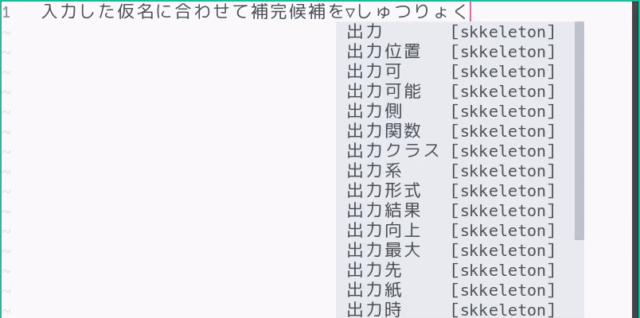
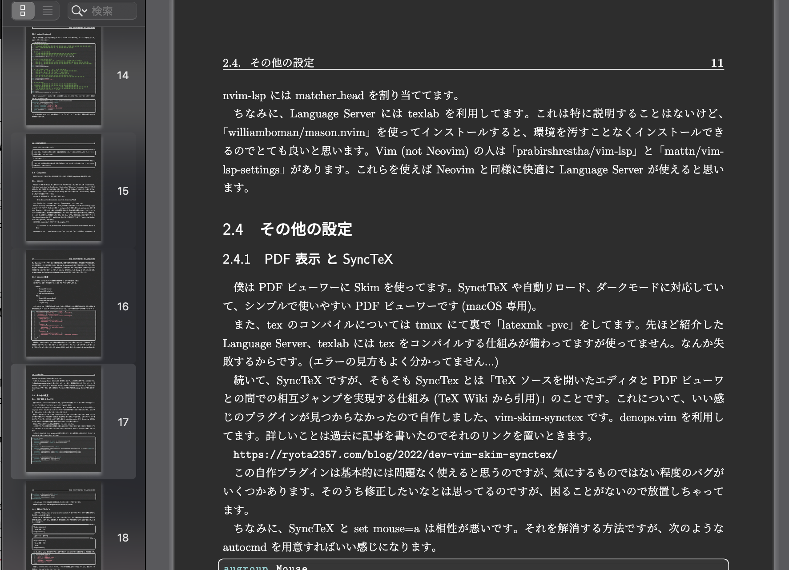
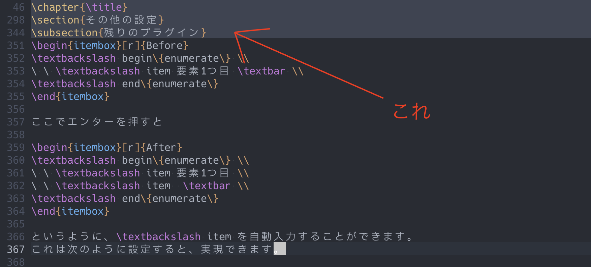

> これは MMA 部誌 2022 秋 に投稿した内容です。
>
> MMA の部誌は[ここ](https://www.mma.club.uec.ac.jp/chofu-festa/index.html)で読めます。

> 1. [はじめに](#1-はじめに)
>    1. [なぜ neovim なのか](#11-なぜ-neovim-なのか)
>    1. [vimtex を使わない / 使用プラグイン紹介](#12-vimtex-を使わない--使用プラグイン紹介)
> 1. [日本語を扱う](#2-日本語を扱う)
>    1. [入力](#21-入力)
>    1. [option と autocmd](#22-option-と-autocmd)
> 1. [completion](#3-completion)
>    1. [ddcvim](#31-ddcvim)
>    1. [ddcvim の設定](#32-ddcvim-の設定)
> 1. [その他の設定](#4-その他の設定)
>    1. [synctex](#41-synctex)
>    1. [残りのプラグイン](#42-残りのプラグイン)
> 1. [おわりに](#5-おわりに)

## 1. はじめに

初めまして、1 年の ryota2357 です。先に書いておくと、これは「Vim・Neovim 入門」の投稿ではありません。
Vim・Noevim の説明から始まりますが、本題は僕の設定を紹介する、自己満足な投稿です。

また、最近では Neovim の設定に Lua を使うことが増えていますが、ここではすべて Vim script で掲載してます。
それと、僕の vimrc(init.lua) は https://github.com/ryota2357/dotfiles/tree/master/vim においてあるので見たい人はどうぞ。

それでは、よろしくお願いします。

<small>
注意: 以降では「Vim」と書いた場合、それは Neovim を含みます。「Neovim」と書いた場合はそれは Vim にはなく Neovim にのみあるものを指します。「Vim (not Neovim)」と書いた場合は Vim のみのものを指します。
</small>

### 1.1 なぜ Neovim なのか

VSCode, Emacs, Atom, ... などたくさんのエディタがある中でなぜ Neovim か、と問われても、具体的な利点は言えません。サックっと環境構築したいなら VSCode を使うことを勧めます。
僕が Neovim を利用する理由はただ「Vim 系 Editor が好きだから」に限ります。じゃあ Vim (not Neovim) ではないの？って言われると、それはそれで色々あるのですが。

それはさておき、Vim の利点を上げましょう。

Vim は非常に柔軟なカスタマイズが可能です。設定ファイルをプログラミング言語(Vim script / Lua)で書きます。
それに日本語版も含めドキュメントが非常に充実してるため、初学者に優しい作りになってます。
また、Vim 系の操作は非常に強力です。
モードという概念、ホームポジションから離れないカーソル移動、独自のキーマッピング、テキストオブジェクトと呼ばれる概念の組み合わせで非常に高速・快適にテキストを編集可能です。
さらに、Vim のプラグインは作りやすく、組み合わせやすいです。初めから高度な知識は必要ありません。Node が必要、なんてこともありません。ファイル１つを適切な場所に置くだけでプラグイン開発を開始できます。
他のエディタではあまりない、UI 自体を作成することも容易です。ちなみに、僕自身が入れているプラグインの数は 60 を超えます。

Vim を使えば、僕がエディタに合わせるのではなく、僕にエディタを合わせることができます。最高ですね。

Vim のどこがいいか、それは人によって異なりますが、僕は Vim の幅広いカスタマイズ性とテキスト編集能力が気に入って使っています。
今回の投稿ではテキスト編集の方には触れず、カスタマイズの方を書いていきます。僕は Vim に詳しいわけではないのでもっと良い方法があるのかもしれませんが、参考になるものがあれば嬉しいです。

### 1.2 VimTeX を使わない / 使用プラグイン紹介

「Vim LaTeX 構築」などと検索すると、多くの記事で紹介されているのは「lervag/vimtex」というプラグインを使う構築です。

vimtex がどのようなプラグインなのかは次の図 lervag/vimtex の README #Features を見れば大体わかるでしょう。


必要な機能をしっかりと備えた素晴らしいプラグインであることがわかると思います。

しかし、僕の好みには合いません。必要な機能のみを入れて使わない機能は入れない。僕はそれが好きです。

では、何を使うか、ですが、次に僕の LaTeX を書く時に使用している主要プラグインを列挙しました。(アルファベット順)

- cohama/lexima.vim
- hrsh7th/vim-vsnip
- neovim/nvim-lspconfig
- nvim-treesitter/nvim-treesitter-context
- ryota2357/vim-skim-synctex
- Shougo/ddc.vim

これらの個々の説明は後に書いてあります。一部は Neovim 専用ですが、Vim (not Neovim) にも同様の機能を提供しているプラグインは存在します。

## 2. 日本語を扱う

ここから本題です。僕の設定について紹介していきます。

### 2.1 入力

ご存じのとおり Vim は日本語の扱いが得意ではありません。それは GVim でもターミナル上の Vim でも同じです。
特にターミナルにおいては、そもそもターミナルが日本語入力に対応していない、なんてこともあり得ます、が、まあ有名どころのターミナルではちゃんと日本語入力できます。

さて、僕の使用しているターミナルですが、iTerm2 です。WezTerm もいいと思いますが ASCII と non-ASCII で違うフォントを割り当てる方法がわからない(なさそう？)ため iTerm2 を使っています。
おそらく iTerm2 において日本語入力は不便しないでしょう。ウィンドウ分割が重いらしいですが、僕は tmux で行っているため、全く気になりません。
それでも iTerm2 での日本語入力はメモ帳に入力するよりは少し不便かもしれません。Emacs のように IME がターミナルに組み込まれているわけではありませんから。
しかし、それも問題ないのです。「vim-skk/skkeleton」というプラグインがあります。SKK という入力システムを提供する Vim プラグインです。

次に「vim-skk/skkeleton」の REAME から画像を引用してきました。



僕はこれを使わず、macOS 標準の IME で入力してます、が、ここで紹介するのに使ったことないのは良くないな、と思って先日少し使ってみました。
結論から言うと、僕には合いませんでした。
skkeleton、SKK の入力は非常に素晴らしいと思います。実際、通常の変換(スペースバー押して変換するやつ)と SKK の変換どちらを使いたいか、と言われれば僕は SKK を選びます。
しかし、僕が普段使っているライブ変換の方が僕は快適だと感じました。
SKK が僕に合わないと感じた最大の理由は「送り仮名」です。僕は送り仮名を考えながら打つのがしんどかったです。慣れれば SKK は非常に快適に入力できると思います。僕はもう少し使ってみようと思ってます。

### 2.2 option と autocmd

続いて日本語を入力する上で設定しておくといいかも？ってやつです。

まず option からです。

```vim
" 行の折り返しを無効
" LaTeX では横に長い表を書いたりするので、無効にしておくとよさそうです。
" あと、描画量が減るからか、少し軽くなるそうです。
set nowrap

" 全角カッコペアの追加
" Vim には標準で対応する括弧をハイライトしてくれます。
" それを日本語にも適用できるよう拡張しておきます。
set matchpairs+=（:）,「:」,『:』,【:】,［:］,＜:＞

" スクロールの余裕を設定
" scrolloff は縦スクロール、sidescrolloff は横スクロールです。
" 縦スクロールは普通のプログラム書く時の設定と同じでいと思いますが、
" 横スクロールは大きめにしておくと良いでしょう。日本語は 1 文字で 2 幅です。
set scrolloff=3
set sidescrolloff=10

" マーカー位置 !!!> ~~~ <!!! で折りたたむ
" これはマーカーで折り畳みを使っている人についてです。
" デフォルトのマーカーは {{{ ~~~ }}} です。
" これは LaTeX 文書中にそこそこの数出てきます。
" そのため意図しない位置で折り畳みが発生します。
" マーカーを LaTeX 文書で現れないようなものに変更すると良いです。
set foldmethod=marker
set foldmarker='!!!>','<!!!'

" 表示文字設定
" extends: 行が画面よりも伸びているときの最終列に表示
" precedes: 行が画面よりも伸びているときの最初の列に表示
" 横に長い表などを書く + nowrap の時、文章が画面外に続いているのか
" 一目でわかりません。このオプションで可視化しておきましょう。
" (詳しくは`h 'listchars'` 参照)
set list
set listchars=extends:>,precedes:<,
```

続いて autocmd です。この投稿で紹介する autocmd は 3 つありますが、ここでは 2 つ。最後の方にもう 1 つ出てきます。
まずは 1 つ目

```vim
autocmd BufWritePre \*.tex :call FixPunctuation()
function! FixPunctuation() abort
  let l:pos = getpos('.')
  silent! execute ':%s/。/. /g'
  silent! execute ':%s/、/, /g'
  silent! execute ':%s/\\\@<!\s\+$//'
  call setpos('.', l:pos)
endfunction
```

この autocmd は tex ファイルを保存時に「、」と「。」を「,」と「.」に変換し、末尾の不要なスペースを削除するものです。

例えば、次のようなテキストがあったとき、

```txt
このような、日本語の文章がある時、句読点を修正します。いい感じに空白も入ります。\\
カーソルの位置が動くこともありません。
```

こうなります。(↓)

```txt
このような, 日本語の文章がある時, 句読点を修正します. いい感じに空白も入ります. \\
カーソルの位置が動くこともありません.
```

続いて 2 つ目は macOS 専用です。

```vim
augroup IME
  autocmd!
  autocmd CmdlineLeave /,? :call system(
    \ 'osascript -e "tell application \"System Events\" to key code 102"'
    \ )
augroup END
```

\ と ? で、検索をした後、IME を off にするものです。
プログラミングの時は検索対象が英語なのでいらないのですが、日本語書いているときは検索で IME on にして `Enter` とかで Cmdline を離れることがあるかと思います。
その時 IME が off になってれば、すぐに `i` や `n` が入力できるので快適になります。

## 3. Completion

LaTeX のコマンドを全て覚えるのは大変です。やはり入力補完(completion)は必須です。

### 3.1 ddc.vim

Vimmer であれば Shougo さんを知っている人は多いでしょう。
知らない人も「deoplete.nvim」「dein.vim」「unite.vim」「neobundle.vim」「denite.nvim」「defx.nvim」「neosnippet.vim」のいずれかは使った、もしくは聞いたことがあるかと思います。
いずれも GitHub で 1000 スターを超える Vim・Neovim プラグインです。
「ddc.vim」はその Shougo さんによって作られた「deoplete.nvim」の後継となる新しい入力補完プラグインです。

ddc.vim の README の 1 行目を見てみましょう。

> Dark deno-powered completion framework for neovim/Vim8

さて、少し逸れますが注目したいのは「deno-powered」です。Deno です。

Deno を知らない人向けに言うと、Deno とは Node.js の反省を踏まえて、Node.js の作者本人が作成している新しい Javascript/Typescript のランタイムのことです。Node.js と異なり、node_modules を生成しませんし、package.json もありません。
詳細は省きますが Deno はその設計のため、インストール・アップデートが容易であり、依存関係が自動解決され、スクリプト言語のような使い心地であり、環境を汚しにくいという、多くの素晴らしい特徴を持っています。
この Deno を Vim でも使えるようにするプラグインが「vim-denops/denops.vim」です。lambdalisue さん中心に開発されています。(lambdalisue さんは「jupyter-vim-binding」「fern.vim」「gina.vim」の作者です。)

次の引用は denops.vim のリポジトリの Description です。

> An ecosystem of Vim/Neovim which allows developers to write cross-platform plugins in Deno

denops.vim によって、Vim プラグインを Typescript で実装できるようになりました。
これの嬉しいことは、より親しみやすい言語で開発ができるのはもちろん、Typescirpt で作られてきた Vim 以外の分野のライブラリ資源も活用できると言うことです。
さらに、Typescript で書かれた部分は別のプロセスで動き、非同期処理も十分に行えるため、Vim への負荷を下げ、 Vim script よりも高速に処理が行えます。
つまり、denops.vim を用いて作成されるプラグインは、実行速度・開発速度の両面で高速化されるのです。

話を戻します、ddc.vim は denops.vim を用いて作成されたプラグインです。
ddc.vim は設定なしでは何も動きません。自分で 1 から設定する必要があります。さらに、他の補完プラグインにはよくあるスニペット展開や floating window によるプレビューといった機能もありません。
純粋に補完機能のみを提供するプラグインです。
しかしそのおかけで、自分が欲しい機能のみを取り入れた自動補完機能を作っていけるようになっています。
より詳しく ddc.vim を知りたい人は Shougo さん本人による記事、https://zenn.dev/shougo/articles/ddc-vim-beta を読んでみるとその設計思想や特養がよくわかると思います。

### 3.2 ddc.vim の設定

これ以降は ddc.vim について最低限の知識がある、という前提になります。

次に僕が tex を書く時に使用している ddc プラグインを列挙しました。

- Source
  - Shougo/ddc-source-around
  - Shougo/ddc-source-nvim-lsp
  - hrsh7th/vim-vsnip-integ
- Filter
  - Shougo/ddc-matcher_head
  - Shougo/matcher_length
  - tani/ddc-fuzzy
- UI
  - Shougo/ddc-ui-pum

また、ddc の tex での設定は次のようにしてます。(実際に書いている設定ではありません。global な設定も追記したり、mark や autoCompleteEvents など、ここでは重要でないものは省いています。)

```vim
call ddc#custom#patch_filetype(['tex'], {
  \   'sources': ['nvim-lsp', 'vsnip', 'around'],
  \   'sorters': ['sorter_fuzzy'],
  \   'converters': ['converter_remove_overlap'],
  \   'sourceOptions': {
  \     'nvim-lsp': {
  \       'minAutoCompleteLength': 3,
  \       'matchers': ['matcher_head']
  \     },
  \     'vsnip': {
  \       'minAutoCompleteLength': 1,
  \       'matchers': ['matcher_fuzzy'],
  \       'dup': 'keep'
  \     },
  \     'around': {
  \       'minAutoCompleteLength': 2,
  \       'matchers': ['matcher_head', 'matcher_length']
  \     }
  \   }
  \ })
```

僕は tex を基本的に、vsnip で書いてます。数式や画像や表のテンプレート挿入だけでなく、「\lambda」などの単純なものまでスニペット化してます。
こうすることでバックスラッシュをタイプせず tex を書くことができるようになります。
このような snippet 主体で tex を書くため、vsnip には matcher_fuzzy を、nvim-lsp には matcher_head を割り当ててます。

ちなみに、Language Server には texlab を利用してます。
これは特に説明することはないけど、「williamboman/mason.nvim」を使ってインストールすると、グローバルに LSP をインストールすることなく利用できるのでとても良い、とだけ触れておきます。
Vim (not Neovim) の人は「prabirshrestha/vim-lsp」と「mattn/vim-lsp-settings」があります。これらを使えば Neovim と同様に快適に Language Server が使えると思います。

## 4. その他の設定

残りの設定を「その他」として書いていきます。まずは、どのセクションに書けばいいかわからなかったやつを 2 つ。ちょっと Vim から離れます。

1 つ目は PDF ビューワーについてです。

僕は Skim を使っています、macOS 専用です。SynctTeX や自動リロード、ダークモードに対応している、シンプルで使いやすい PDF ビューワーです。



2 つ目は tex ファイルのコンパイルについてです。

僕は tmux にて別のウィンドウで「latexmk -pvc」をしてます。
実は先ほど紹介した Language Server、texlab には tex をコンパイルするコマンドが提供されてます、が使ってません、と言うより使い方がよく分かってないです。
なんかビルド失敗しちゃいます。(エラーの見方もよく分かってません...)
どうにかしたいなとは思うけど、tmux 使って直接 latexmk な現状に困ってないので放置してます。

以上です。ここから Vim の話に戻ります。

### 4.1 SyncTeX

SyncTeX とは「TeX ソースを開いたエディタと PDF ビューワとの間での相互ジャンプを実現する仕組み (TeX Wiki から引用)」のことです。
名前は知らなかったけど、使ってる。そんな感じの機能だと思います。

Skim は SyncTeX に対応している PDF ビューワーです。そのため Vim の方で Skim と連携するようにすれば SyncTeX を行えます。
これについては、いい感じのプラグインが見つからなかったので自作しました、「ryota2357/vim-skim-synctex」です。denops.vim を利用してます。vim-skim-synctex は forward-search と backward-search の両方が行えます。
denops.vim を利用したことによって他の SyncTeX 系プラグインが Python や外部コマンドに頼るところを内部で Deno サーバーを立てることと、 AppleScript を使うことで回避してます。
詳しいことは過去に記事を書いたのでそれのリンクを置いときます。

https://ryota2357.com/blog/2022/dev-vim-skim-synctex/

vim-skim-synctex は基本的には問題なく使えると思うのですが、気にするものではない程度のバグがいくつかあります。そのうち修正したいなとは思ってるのですが、困ることがないので放置しちゃってます。

ちなみに、SyncTeX と set mouse=a は相性が悪いです。
SyncTeX の backward-search では PDF ビューワーをクリックする必要があります。その時、ウィンドウのフォーカスは Vim を起動しているターミナルではなく、PDF ビューワーに当てられます。
backward-search の後、Vim で編集を再開するにはターミナルをクリックしてフォーカスを戻す必要があります。この時 mouse=a が設定されていると、せっかく backward-search で移動したマウスカーソルがフォーカスを戻すためにクリックした場所に移動していまします。
これを解決するには、次のような autocmd を用意すればいい感じにできます。

```vim
augroup Mouse
  autocmd!
  autocmd FocusGained _ call s:OnFocusGained()
  autocmd FocusLost _ call s:OnFocusLost()
augroup END

function! s:OnFocusGained() abort
  autocmd CursorMoved,CursorMovedI,ModeChanged,WinScrolled * ++once call s:EnebleLeftMouse()
  noremap <LeftMouse> <Cmd>call <SID>EnebleLeftMouse()<CR>
  inoremap <LeftMouse> <Cmd>call <SID>EnebleLeftMouse()<CR>
endfunction

function! s:EnebleLeftMouse() abort
  noremap <LeftMouse> <LeftMouse>
  inoremap <LeftMouse> <LeftMouse>
endfunction

function! s:OnFocusLost() abort
  noremap <LeftMouse> <nop>
  inoremap <LeftMouse> <nop>
endfunction
```

この autocmd については過去に記事を書いたのでこれもリンク置いときます。

https://ryota2357.com/blog/2022/vim-mouse-on-focus/

### 4.2 残りのプラグイン

ここまでで、節 1.2 で列挙したプラグインのうち「lexima.vim」と「nvim-treesitter-context」について触れてなかったので短めに書きます。

lexima.vim は自動括弧閉じとドットリピートのプラグイン、という説明ですがそれ以外の使い方が非常に強力です。 (もちろん、括弧補完にも使ってますが)
例えばこんなことができます。(| はカーソル位置です)

```tex
\begin{enumerate}
  \item 要素 1 つ目 |
\end{enumerate}
```

ここでエンターを押すと

```tex
\begin{enumerate}
  \item 要素 1 つ目
  \item |
\nd{enumerate}
```

というように、\item を自動入力できます。
これは次のように設定すると、実現できます。

```vim
call lexima#add*rule({
  \ 'char': '<CR>',
  \ 'at': '^ *\\item.\_\%#',
  \ 'input': '<CR>\item ',
  \ 'except': '\\\\\%#',
  \ 'filetype': 'tex'
  \ })
```

これは comments オプションと formatoptions オプションをいい感じに設定することで似たような、またはこれ以上のことができるかもしれません。
しかしおそらく除外設定はできないと思ってます(comments オプションよく分かってない)。
上記の設定では行末が \\\\ で終わっている場合は次の行に \item を自動入力しないよう設定してます。

最後に、nvim-treesitter-context ですが、これは次の画像を見たほうが良いでしょう。現在のネスト位置がよくわかるようになるプラグインです。



これは 1 つのセクションが長い時に役立ちます。今どこのセクションについて書いているのか素早く確認できます。
このプラグインは唯一、僕が節 1.2 で挙げた中で Vim(not Neovim) 代替プラグインがないものです(僕が知らないだけかもですが)。

## 5. おわりに

ここまでで紹介した設定は僕の vimrc (init.lua) の一部です。 vimrc は常に変化し続けます。
今はこの設定を使っていますが、明日には大きく変わってるかもしれません。これがベストではありません。永遠に未完成です。

以上でこの投稿は終わりです。ちょっと長くなってしまいました。(僕だったらこれ、あんまり読む気しないな...)

もし、ここまで読んでくれた人がいたら、本当にありがとうございます。何か 1 つでも参考になるものがあれば良いなと思います。
