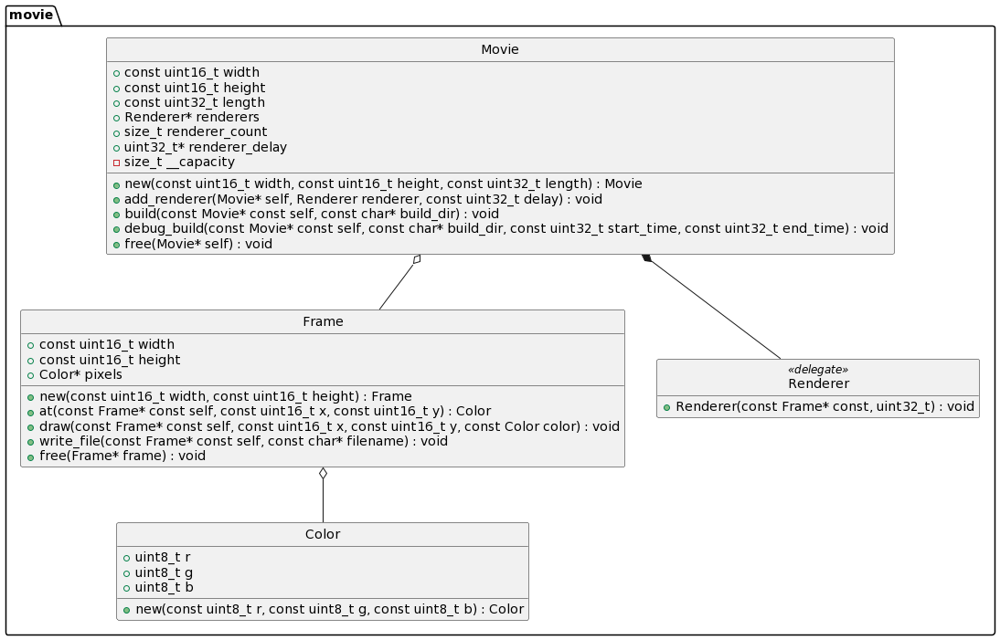
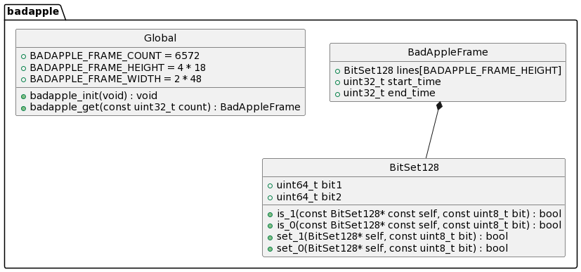
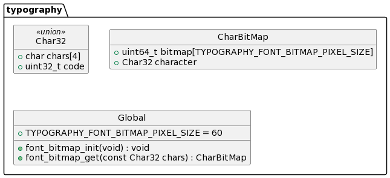
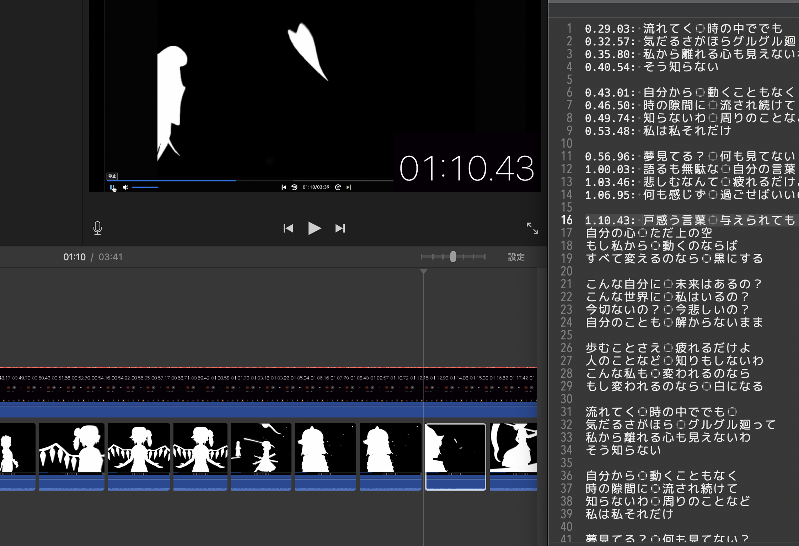

大学の授業「基礎プログラミングおよび演習」で作った動画の開発記録

課題は「C 言語を用いて、PPM ファイル生成するプログラムを作成 → そのプログラムによって作られた PPM ファイルを繋げて動画を作成する」というもの。

Repository: **https://github.com/ryota2357/fp15-project**

<blockquote class="twitter-tweet"><p lang="ja" dir="ltr">大学の授業(基礎プログラミングおよび演習)で、C言語で画像(PPMファイル)を生成するプログラムを作って、それらを繋げて動画を作る、という課題があった<br>ちょっと頑張ってみた<br><br>初めてCMake使った<br>repo: <a href="https://t.co/MwCfVi0ydR">https://t.co/MwCfVi0ydR</a><br>共同作成者: <a href="https://twitter.com/yktr_drm06?ref_src=twsrc%5Etfw">@yktr_drm06</a> <a href="https://t.co/gOSscTrzkk">pic.twitter.com/gOSscTrzkk</a></p>&mdash; ryota2357 (@95s7k84695a) <a href="https://twitter.com/95s7k84695a/status/1623828960265244672?ref_src=twsrc%5Etfw">February 9, 2023</a></blockquote> <script async src="https://platform.twitter.com/widgets.js" charset="utf-8"></script>

このプログラムは[やきとり](https://github.com/darumakka2)くんと共同で作成した。

> 1. [プログラム全体の説明](#プログラム全体の説明)
>    1. [main.c](#mainc)
>    1. [プログラム全体像](#プログラム全体像)
> 1. [各モジュール実装の話](#各モジュール実装の話)
>    1. [movie モジュール](#movie-モジュール)
>    1. [badapple モジュール](#badapple-モジュール)
>    1. [typography モジュール](#typography-モジュール)
> 1. [main.c 実装の話](#main.c-実装の話)
>    1. [badapple_renderer](#badapple_renderer)
>    1. [lyrics_renderer](#lyrics_renderer)
>    1. [draw_char_at](#draw_char_at)
> 1. [最後に](#最後に)

## プログラム全体の説明

まず、全体的な説明をする。

### main.c

[src/main.c](https://github.com/ryota2357/fp15-project/blob/main/src/main.c) は今回のプログラムのエントリーポイントである。

`main()` 関数の実装はシンプルである。重要な部分のみにしたものを次に示す。説明は後ほど行う。

```c
int main(int argc, char* args[]) {
    const char* build_dir = args[1];

    font_bitmap_init();
    badapple_init();

    Movie movie = Movie_new(
        BADAPPLE_FRAME_WIDTH * 4,
        BADAPPLE_FRAME_HEIGHT * 4,
        BADAPPLE_FRAME_COUNT + 30
    );

    Movie_add_renderer(&movie, badapple_renderer, 0);
    // ... (たくさんrenderer追加)
    Movie_add_renderer(&movie, credit_renderer, BADAPPLE_FRAME_COUNT);

    Movie_build(&movie, build_dir);
    Movie_free(&movie);

    return 0;
}
```

今回、動画の作成する過程を次の概念に分割している。

- `Movie`
- `Frame`
- `Renderer`

`Movie` はその名の通り「動画」を表す class である。今回は C 言語を用いた開発なので class ではなく struct であるが、class と呼ばせてもらう。
インスタンスの生成は `Movie_new(width, height, length)`で行える。`width`は動画の幅(ピクセル数)、`height`は動画の高さ(ピクセル数)、`length`は動画の長さ(フレーム数)である。
メソッドは`Movie_.*(&self, ...)`というようにして呼び出す。

2 つ目の`Frame`は動画をパラパラ漫画のようにして捉えた時の 1 枚の画像(1 フレーム)を表す class である(実際は struct であるが`Movie`の時と同様...)。`main()`内では使われているところはない。
これは次に説明する`Renderer`が使用している。
`Frame`も`Movie`と同様、`Frame_new(width, height)`としてインスタンスを生成、`Frame_.*(&self, ...)`でメソッドが呼べる。

最後に`Renderer`であるが、これは`Frame`に色を塗る delegate、関数オプジェクトである(実際は関数ポインタ)。
`void Renderer(frame, time)`という関数であり、引数で受け取った frame (`Frame`のインスタンス)に自由に図形や文字などを塗ることが出来る。引数の time は自身(`Renderer`)が有効になってからの経過フレーム数であり、これを使うことでアニメーション等が実装できるようになっている。

これらを踏まえて先ほどの`main()`を見てみる。

1. `font_bitmap_init()` で歌詞を表示するための文字のビットマップを setup。
1. `badapple_init()` で Bad Apple!! の動画の各フレームデータを setup。
1. `Movie_new()` で動画を 1 つ生成。
1. `Movie_add_renderer()` で`Renderer`をいろいろ追加。第三引数は`delay`であり、追加した renderer をいつ(何フレーム目)から有効にするのかを指定している.
1. `Movie_build()` で動画をビルド。ここで PPM ファイル(1 フレーム 1PPM ファイル)が第二引数に指定したディレクトリに出力される。
1. `Movie_free()` で動画を解放。(動画の生成では内部で多くのアロケーションが発生してるのでそれらを解放してあげる必要がある)

### プログラム全体像

続いて、全体像を説明する。 重要な部分のみを抜き出して次に示した。

このプログラムは CMake を用いて開発されているので実際には CMakeLists.txt などもあるが、省略している。

```txt
.
├── Makefile            // 自動化
└── src
    ├── main.c          // entry、ここに具体的な動画生成プログラムを記述
    ├── badapple        // Bad Apple のフレームデータを管理・取得する関数を提供するモジュール
    │   ├── assets
    │   ├── include
    │   ├── resources
    │   └── src
    ├── movie           // 動画生成のクラス・関数を提供するモジュール
    │   ├── include
    │   └── src
    └── typography      // 文字(歌詞とか)を表示するための関数を提供するモジュール
        ├── font-bitmap
        │   ├── assets
        │   └── resources
        ├── include
        └── src
```

上の通り、1 枚の`main.c`がエントリーポイントで、これは先ほど軽く説明した通りである。
本プログラムはその他に 3 つのモジュール(と僕が勝手に読んでる)が存在する。それぞれのモジュールは次のような構造を持っている。

(クラス図のように書いているが、クラス図ではない)



Global でくくられているのは、グローバル変数(#define されたマクロ)・グローバル関数のことであり、Global というクラスのメンバを表しているものではない。



`<<union>>`は C の union、共用体のことである。



## 各モジュール実装の話

それぞれのモジュールの実装方法について説明する。

### movie モジュール

ディレクトリ構成は次のようになっている。

```txt
src/movie
├── CMakeLists.txt
├── include
│   ├── color.h
│   ├── frame.h
│   ├── free.h
│   ├── movie.h
│   └── renderer.h
└── src
    ├── color.c
    ├── frame.c
    └── movie.c
```

movie モジュールでは先ほどの「プログラム全体の説明」で書いた`Movie`, `Frame`, `Renderer`といったクラスとそのメソッドを実装している。

メソッド`Movie_build()`について追加説明する。[src/movie/src/movie.c](https://github.com/ryota2357/fp15-project/blob/main/src/movie/src/movie.c) の一部を次に載せる。

```c
static void build_for_time(const Movie* const movie, const char* filename, const uint32_t time) {
    ensure_not_freed(movie);
    const size_t count = movie->renderer_count;
    Frame frame = Frame_new(movie->width, movie->height);
    for (size_t i = 0; i < count; ++i) {
        uint32_t delay = movie->renderer_delay[i];
        if (delay > time) continue;
        movie->renderers[i](&frame, time - delay);
    }

    Frame_write_file(&frame, filename);
    Frame_free(&frame);
}

static void show_progress_in_current_line(const uint32_t time, const uint32_t length) {
    printf("\033[2K");
    printf("    %d / %d\n", time, length);
    printf("\033[1F");
    fflush(stdout);
}

void Movie_build(const Movie* const self, const char* build_dir) {
    ensure_not_freed(self);
    const uint32_t length = self->length;
    for (uint32_t time = 0; time < length; ++time) {
        char* name = calloc(strlen(build_dir) + 15, sizeof(char));  // 15 is greater than "/0000.ppm" length
        sprintf(name, "%s/%04d.ppm", build_dir, time);
        build_for_time(self, name, time);
        FREE(name);
        show_progress_in_current_line(time, length);
    }
}
```

非常にシンプルな実装を行っている。`Movie_build()`が呼ばれると、time = 0 から全てのフレーム毎に`Frame`のインスタンスを生成し、登録されている`Renderer`を一つずつ処理させ、その後ファイルに出力、という流れである。

ここで、`show_progress_in_current_line()`関数でプログレスを表示するようにしている。今回作成したアニメーションのフレーム数は 6500 以上あり、ビルド完了までに僕の PC で 80 秒ほどかかる。
いつ終わるのか見えないのはストレスだったので実装した。

`\033[2K` はその行を削除、`\033[1F` はカーソルを 1 行上に移動させる。という ASCII エスケープである。

### badapple モジュール

[プログラム全体像](#プログラム全体像)で示した通り、このモジュールは主に`badapple_init()`と`badapple_get()`という 2 つの関数を提供するモジュールである。

ディレクトリ構成は次のようになっている。

```txt
src/badapple
├── CMakeLists.txt
├── assets
│   ├── README.md
│   ├── converter.ts
│   └── frames.txt
├── include
│   ├── badapple.h
│   ├── bitset128.h
│   └── free.h
├── resources
│   └── frames.txt
└── src
    ├── badapple.c
    └── bitset128.c
```

Bad Apple!! のフレームデータは [Reyansh-Khobragade/bad-apple-nodejs](https://github.com/Reyansh-Khobragade/bad-apple-nodejs) を使わせてもらってい、[src/badapple/assets/frame.txt](https://github.com/ryota2357/fp15-project/blob/main/src/badapple/assets/frames.txt) に配置してある。フレームデータの 1 部を次に示す。

```txt
256
00:00:8,500 --> 00:00:8,533
⣿⣿⣿⣿⣿⣿⣿⣿⣿⣿⣿⣿⣿⣿⣿⣿⣿⣿⣿⣿⣿⣿⣿⣿⣿⣿⣿⣿⡿⠿⣿⣿⣿⣿⣿⣿⣿⣿⣿⣿⣿⣿⣿⣿⣿⣿⣿⣿
⣿⣿⣿⣿⣿⣿⣿⣿⣿⣿⣿⣿⣿⣿⣿⣿⣿⣿⣿⣿⣿⣿⣿⣿⣿⣿⣿⡇⠀⠀⠀⠙⠿⣿⠿⢿⣿⣿⣿⣿⣿⣿⣿⣿⣿⣿⣿⣿
⣿⣿⣿⣿⣿⣿⣿⣿⣿⣿⣿⣿⣿⣿⣿⣿⣿⣿⣿⣿⣿⣿⣿⣿⣿⣿⣿⠇⠀⠀⠀⠀⠀⠀⠀⠀⠈⠻⣿⣿⣿⣿⣿⣿⣿⣿⣿⣿
⣿⣿⣿⣿⣿⣿⣿⣿⣿⣿⣿⣿⣿⣿⣿⣿⣿⣿⣿⣿⣿⣿⣿⣿⡿⠋⠁⠀⠀⠀⠀⠀⠀⠀⠀⠀⠀⠀⢹⣿⣿⣿⣿⣿⣿⣿⣿⣿
⣿⣿⣿⣿⣿⣿⣿⣿⣿⣿⣿⣿⣿⣿⣿⣿⣿⣿⣿⣿⣿⣿⣿⡟⠁⠀⠀⠀⠀⠀⠀⠀⠀⠀⠀⠀⠀⠀⠈⣿⣿⣿⣿⣿⣿⣿⣿⣿
⣿⣿⣿⣿⣿⣿⣿⣿⣿⣿⣿⣿⣿⣿⣿⣿⣿⣿⣿⣿⣿⣿⣿⠇⠀⠀⠀⠀⠀⠀⠀⠀⠀⠀⠀⠀⠀⠀⠀⠘⣿⣿⣿⣿⣿⣿⣿⣿
⣿⣿⣿⣿⣿⣿⣿⣿⣿⣿⣿⣿⣿⣿⣿⣿⣿⣿⣿⣿⣿⣿⣿⡆⠀⠀⠀⠀⠀⠀⠀⠀⠀⠀⠀⠀⠀⠀⠀⠀⢿⣿⣿⣿⣿⣿⣿⣿
⣿⣿⣿⣿⣿⣿⣿⣿⣿⣿⣿⣿⣿⣿⣿⣿⣿⣿⣿⣿⣿⣿⣿⣿⣶⣤⠀⠀⠀⠀⠀⠀⠀⠀⠀⠀⠀⠀⠀⠀⢸⣿⣿⣿⣿⣿⣿⣿
⣿⣿⣿⣿⣿⣿⣿⣿⣿⣿⣿⣿⣿⣿⣿⣿⣿⣿⣿⣿⣿⣿⣿⣿⣿⣧⡀⠀⠀⠀⠀⠀⠀⠀⠀⠀⠀⠀⠀⠀⢸⣿⣿⣿⣿⣿⣿⣿
⣿⣿⣿⣿⣿⣿⣿⣿⣿⣿⣿⣿⣿⣿⣿⣿⣿⣿⣿⣿⣿⣿⣿⣿⣿⣿⣿⡆⠀⠀⡀⠀⠀⠀⠀⠀⠀⠀⠀⠀⢸⣿⣿⣿⣿⣿⣿⣿
⣿⣿⣿⣿⣿⣿⣿⣿⣿⣿⣿⣿⣿⣿⣿⣿⢿⣿⣿⣿⣿⣿⣿⣿⣿⣿⣿⣷⠀⠀⠁⠀⠀⠀⠀⠀⠀⠀⢀⠀⠘⣿⣿⣿⣿⣿⣿⣿
⣿⣿⣿⣿⣿⣿⣿⣿⣿⣿⣿⣿⣿⣿⠋⠁⠀⠀⠀⢹⣿⣿⣿⣿⣿⣿⣿⣿⠄⠀⠀⠀⠀⠀⠀⠀⠀⠀⢀⣧⣷⣿⣿⣿⣿⣿⣿⣿
⣿⣿⣿⣿⣿⣿⣿⣿⣿⣿⣿⣿⣿⣇⠀⠀⠀⠀⠀⠸⣿⣿⣿⣿⣿⡿⠛⠟⠀⠀⠀⠀⠀⠀⠀⠀⠀⣄⢸⣿⣿⣿⣿⣿⣿⣿⣿⣿
⣿⣿⣿⣿⣿⣿⣿⣿⣿⣿⣿⣿⣿⣿⣄⠀⠀⠀⠀⠀⠈⠙⠻⢿⣿⡗⠀⠀⠀⠀⠀⠀⠀⠀⠀⠀⠀⢹⣾⣿⣿⣿⣿⣿⣿⣿⣿⣿
⣿⣿⣿⣿⣿⣿⣿⣿⣿⣿⣿⣿⣿⣿⣿⣷⣦⡄⠀⠀⠀⠀⠀⠀⠉⠀⠀⠀⠀⠀⠀⠀⠀⠀⠀⠀⠀⠘⣿⣿⣿⣿⣿⣿⣿⣿⣿⣿
⣿⣿⣿⣿⣿⣿⣿⣿⣿⣿⣿⣿⣿⣿⣿⣿⣿⡇⠀⠀⠀⠀⠀⠀⠀⠀⠀⠀⠀⠀⠀⠀⠀⠀⠀⠀⠀⠀⣿⡿⠿⢿⣿⣿⣿⣿⣿⣿
⣿⣿⣿⣿⣿⣿⣿⣿⣿⣿⣿⣿⣿⣿⣿⣿⣿⠇⠀⠀⠀⠀⠀⠀⠀⠀⠀⠀⠀⠀⠀⠀⠀⠀⠀⠀⠀⠀⠀⣴⣶⣿⣿⣿⣿⣿⣿⣿
⣿⣿⣿⣿⣿⣿⣿⣿⣿⣿⣿⣿⣿⣿⣿⣿⣿⠀⠀⠀⠀⠀⠀⠀⠀⠀⠀⠀⠀⠀⠀⠀⠀⠀⠀⠀⠀⠀⠀⠹⣿⣿⣿⣿⣿⣿⣿⣿
```

これは 256 フレーム目のデータである。このようなテキストデータがずらっと入っている。

このデータは非常にグラフィカルであり、人間にとっては見やすくて良いのだが、プログラム的には嬉しくない。プログラムが欲しいのはどのピクセルが黒で、どのピクセルが白で、というビットマップデータである。
そこで、このデータをプログラム的にわかりやすいデータへ加工する。このデータを構成している文字`⣿`や`⣇`はマルチバイト文字であるため、C で読むには少し面倒である。そこでデータの加工では TypeScript(Deno)を用いて実装した。[src/badapple/assets/converter.ts](https://github.com/ryota2357/fp15-project/blob/main/src/badapple/assets/converter.ts) である。

メインとなる実装は次である。

```typescript
// ① ⑤
// ② ⑥
// ③ ⑦
// ④ ⑧ に対して、⑧ ⑦ ⑥ ...① のビット列(number) との相互変換
// https://qiita.com/zakuroishikuro/items/15d1a69178895edf9a21#8%E7%82%B9%E7%82%B9%E5%AD%97
function numToBrailleLetter(n: number): string {
  let flags = 0;
  flags += (n & 0b00001000) << 3; //⑦ を左シフト
  flags += (n & 0b01110000) >> 1; //④ ⑤ ⑥ を右シフト
  flags += n & 0b10000111; //① ② ③ ⑧ はそのまま
  return String.fromCodePoint(flags + 0x2800);
}
function brailleLetterToNum(c: string): number {
  const u = c.codePointAt(0);
  if (u == undefined) {
    throw Error(`Invalid character: ${c}`);
  }
  let flags = 0;
  flags += (u & 0b01000000) >> 3;
  flags += (u & 0b00111000) << 1;
  flags += u & 0b10000111;
  return flags;
}
```

コメントに記してある通り、[Unicode の点字でお絵かき#8 点点字](https://qiita.com/zakuroishikuro/items/15d1a69178895edf9a21#8%E7%82%B9%E7%82%B9%E5%AD%97)をほぼそのまま使わせてもらっている。
このスクリプトによって、先ほどのデータは書き換えられ、[src/badapple/resources/frame.txt](https://github.com/ryota2357/fp15-project/blob/main/src/badapple/assets/frames.txt) に配置される。

先ほどの 256 フレーム目のデータは次のように変換される。

```txt
c:0256
t:00:00:8,500 --> 00:00:8,533
b:255,255,255,255,255,255,255,255,255,255,255,255,255,255,255,255,255,255,255,255,255,255,255,255,255,255,255,255,127,119,255,255,255,255,255,255,255,255,255,255,255,255,255,255,255,255,255,255
b:255,255,255,255,255,255,255,255,255,255,255,255,255,255,255,255,255,255,255,255,255,255,255,255,255,255,255,015,000,000,000,049,119,255,119,247,255,255,255,255,255,255,255,255,255,255,255,255
b:255,255,255,255,255,255,255,255,255,255,255,255,255,255,255,255,255,255,255,255,255,255,255,255,255,255,255,007,000,000,000,000,000,000,000,000,016,115,255,255,255,255,255,255,255,255,255,255
b:255,255,255,255,255,255,255,255,255,255,255,255,255,255,255,255,255,255,255,255,255,255,255,255,127,019,001,000,000,000,000,000,000,000,000,000,000,000,241,255,255,255,255,255,255,255,255,255
b:255,255,255,255,255,255,255,255,255,255,255,255,255,255,255,255,255,255,255,255,255,255,255,063,001,000,000,000,000,000,000,000,000,000,000,000,000,000,016,255,255,255,255,255,255,255,255,255
b:255,255,255,255,255,255,255,255,255,255,255,255,255,255,255,255,255,255,255,255,255,255,255,007,000,000,000,000,000,000,000,000,000,000,000,000,000,000,000,048,255,255,255,255,255,255,255,255
b:255,255,255,255,255,255,255,255,255,255,255,255,255,255,255,255,255,255,255,255,255,255,255,014,000,000,000,000,000,000,000,000,000,000,000,000,000,000,000,000,247,255,255,255,255,255,255,255
b:255,255,255,255,255,255,255,255,255,255,255,255,255,255,255,255,255,255,255,255,255,255,255,255,238,204,000,000,000,000,000,000,000,000,000,000,000,000,000,000,240,255,255,255,255,255,255,255
b:255,255,255,255,255,255,255,255,255,255,255,255,255,255,255,255,255,255,255,255,255,255,255,255,255,207,008,000,000,000,000,000,000,000,000,000,000,000,000,000,240,255,255,255,255,255,255,255
b:255,255,255,255,255,255,255,255,255,255,255,255,255,255,255,255,255,255,255,255,255,255,255,255,255,255,255,014,000,000,008,000,000,000,000,000,000,000,000,000,240,255,255,255,255,255,255,255
b:255,255,255,255,255,255,255,255,255,255,255,255,255,255,255,255,247,255,255,255,255,255,255,255,255,255,255,239,000,000,001,000,000,000,000,000,000,000,128,000,048,255,255,255,255,255,255,255
b:255,255,255,255,255,255,255,255,255,255,255,255,255,255,019,001,000,000,000,241,255,255,255,255,255,255,255,255,004,000,000,000,000,000,000,000,000,000,128,207,239,255,255,255,255,255,255,255
b:255,255,255,255,255,255,255,255,255,255,255,255,255,143,000,000,000,000,000,112,255,255,255,255,255,127,051,055,000,000,000,000,000,000,000,000,000,140,240,255,255,255,255,255,255,255,255,255
b:255,255,255,255,255,255,255,255,255,255,255,255,255,255,140,000,000,000,000,000,016,049,115,247,255,047,000,000,000,000,000,000,000,000,000,000,000,241,254,255,255,255,255,255,255,255,255,255
b:255,255,255,255,255,255,255,255,255,255,255,255,255,255,255,239,206,012,000,000,000,000,000,000,017,000,000,000,000,000,000,000,000,000,000,000,000,048,255,255,255,255,255,255,255,255,255,255
b:255,255,255,255,255,255,255,255,255,255,255,255,255,255,255,255,255,015,000,000,000,000,000,000,000,000,000,000,000,000,000,000,000,000,000,000,000,000,255,127,119,247,255,255,255,255,255,255
b:255,255,255,255,255,255,255,255,255,255,255,255,255,255,255,255,255,007,000,000,000,000,000,000,000,000,000,000,000,000,000,000,000,000,000,000,000,000,000,236,238,255,255,255,255,255,255,255
b:255,255,255,255,255,255,255,255,255,255,255,255,255,255,255,255,255,000,000,000,000,000,000,000,000,000,000,000,000,000,000,000,000,000,000,000,000,000,000,113,255,255,255,255,255,255,255,255
```

C 言語側で読み取りやすいように、各行の先頭に`c:`、`t:`、`b:`といった文字をつけ、さらに 0~255 の数字は左を 0 でパディングすることで、C 側では常に 一定の文字数を読んで`atoi()`をすればいいだけにしている。

加工済みのデータを`badapple_init()`にて読み取り配列に格納している。そして`badapple_get(time)` で特定の time のフレームが取得できるようになっている。init する前に get を呼ぶとエラー終了するようになっている。

`badapple_init()`と`badapple_get()`で分けた理由は、デバッグのためである。
get が呼ばれるのは普通 renderer 関数内で呼ばれる。そのため、もし init と get を分けなかった場合(get の時必要であれば init した場合)、init に失敗すると`Movie_build()`のタイミングでエラー終了することになってしまう。

これは非常にわかりにくいし、気がつくのが遅れてしまう。このことから init と get を明確に分けている。

### typography モジュール

[プログラム全体像](#プログラム全体像)で示した通り、このモジュールは主に`font_bitmap_init()`と`font_bitmap_get()`という 2 つの関数を提供するモジュールである。

ディレクトリ構成は次のようになっている。

```txt
src/typography
├── CMakeLists.txt
├── font-bitmap
│   ├── assets
│   │   ├── NotoSansJP-Medium.otf
│   │   └── charset.txt
│   ├── node_modules
│   ├── package-lock.json
│   ├── package.json
│   ├── resources
│   │   └── chardata.txt
│   ├── src
│   │   └── main.ts
│   └── tsconfig.json
├── include
│   ├── font_bitmap.h
│   └── free.h
└── src
    └── font_bitmap.c
```

文字を描画するには、その文字のビットマップが必要になる。
そのビットマップの生成は node-canvas を用いて行った。実装は TypeScript であり、NodeJS のプロジェクトは [src/typography/font-bitmap](https://github.com/ryota2357/fp15-project/tree/main/src/typography/font-bitmap) に配置している。

node-canvas では、1 文字だけ描画した Canvas オプジェクトを作成し、Canvas#toBuffer("raw")を呼ぶことで rgba のデータを取得することができる(詳しくは node-canvas の README 参照)。
ビットマップを生成する文字は、[src/typography/font-bitmap/assets/charset.txt](https://github.com/ryota2357/fp15-project/blob/main/src/typography/font-bitmap/assets/charset.txt) にて指定している。

生成されたビットマップデータの一部を次に示す。

```txt
c:3あ
b:000000000000000000000000000000000000000000000000000000000000000000000000000000000000000000000000000000000000000000000000000000000000000000000000000000000000000000000000000000000000000000000000000000000000000000000000000000000000000000000000000000000000000000000000000000000000000000000000000000000000000000000000000000000000000000000000000000000000000000000000000000000000000000000000000000000000000000000000000000000000000000000000000000000000000000000000000000000000000000000000000000000000000000000000000000000000000000000000000000000000000000000000000000000000000000000000000000000000000000000000000000000000000000000000000000000000000000000000000000000000000000000000000000000000000000000000000000000000000000000000000000000000000000000000000000000000000000000000000000000000000000000000000000000000000000000000000000000000000000000000000000000000000000000000010000000000000000000000000000000000000000000000000000000000011110000000000000000000000000000000000000000000000000000000011110000000000000000000000000000000000000000000000000000000011110000000000000000000000000000000000000000000000000000000011100000000001111100000000000000000000000000000000111111100111111111111111111100000000000000000000000000000000111111111111111111111111111100000000000000000000000000000000111111111111111111111111111000000000000000000000000000000000111111111111111111000000000000000000000000000000000000000000000000000111100000000000000000000000000000000000000000000000000000000111100000000110000000000000000000000000000000000000000000000111100000000111100000000000000000000000000000000000000000000111000000001111000000000000000000000000000000000000000000000111111111111111100000000000000000000000000000000000000000000111111111111111111000000000000000000000000000000000000000001111111111111111111100000000000000000000000000000000000000111111110000011111111111000000000000000000000000000000000011111111000000011100011111000000000000000000000000000000000111111111000000111100001111100000000000000000000000000000001111100111000000111000000111100000000000000000000000000000011111000111000001111000000011110000000000000000000000000000011110000111000011110000000011110000000000000000000000000000111100000111000011110000000011110000000000000000000000000000111100000111100111100000000011110000000000000000000000000001111000000111101111100000000011110000000000000000000000000001111000000111111111000000000011110000000000000000000000000001110000000111111110000000000011110000000000000000000000000011110000000111111100000000000111110000000000000000000000000011110000000111111000000000001111100000000000000000000000000011111000011111110000000000011111100000000000000000000000000001111111111111110000000000111111000000000000000000000000000001111111111111110000000011111110000000000000000000000000000000111111111111111000011111111100000000000000000000000000000000011111100001100001111111111000000000000000000000000000000000000000000000000001111111100000000000000000000000000000000000000000000000000000111100000000000000000000000000000000000000000000000000000000000000000000000000000000000000000000000000000000000000000000000000000000000000000000000000000000000000000000000000000000000000000000000000000000000000000000000000000000000000000000000000000000000000000000000000000000000000000000000000000000000000000000000000000000000000000000000000000000000000000000000000000000000000000000000000000000000000000000000000000000000000000000000000000000000000000000000000000000000000000000000000000000000000000000000000000000000000000000000000000000000000000000000000000000000000000000000000000000000000000000000000000000000000000000000
```

badapple モジュールでの加工済み frame.txt と同様に行頭に`c:`や`b:`をつけている。このデータは`あ`のビットマップデータである。`c:3あ`の`3`とは`あ`が 3 バイト文字であることを示している。
この情報があることで、C 側でマルチバイト文字を適切に読み込めるようにしている。

なお、詳細は実装コード([src/typography/src/font_bitmap.c](https://github.com/ryota2357/fp15-project/blob/main/src/typography/src/font_bitmap.c))を見てもらいたいのだが、C 側で読み込んだマルチバイト文字は`Char32`という共用体を用いることでいい感じに数値としても扱えるようにしている。
数値として扱い、適当な素数で数値を圧縮することで、文字とその文字のビットマップの key-value テープルを配列を用いて実現している。

`font_bitmap_init()`と`font_bitmap_get()`で分けた理由は badapple モジュールと同じく、デバッグしやすいように、が理由である。

## main.c 実装の話

ここまでに説明したモジュールを用いて、動画を作成するのが [src/main.c](https://github.com/ryota2357/fp15-project/blob/main/src/main.c) である。

### badapple_renderer

Bad Apple!! の映像を描画する Renderer である。

今回使っている[Reyansh-Khobragade/bad-apple-nodejs](https://github.com/Reyansh-Khobragade/bad-apple-nodejs)より作成したビットマップでは解像度が小さいので 4 倍に拡大して表示するようにしている。そのため、この renderer では各ピクセル間の間を補完して描画する必要がある。
この補完アルゴリズムの実装はペアのやきとりくんにお願いしたので理解してない。

### lyrics_renderer

lyrics_renderer00 ~ lyrics_renderer47 まである。歌詞を描画する renderer である。

`Movie_add_renderer()`するときの delay(第三引数)の調整は僕が人力で行った。。。



こんな感じで気合いで、どの歌詞が何秒目に始まるかメモって、awk 使ってフレーム数に直して、vim マクロ使って C ソースに変換、動画をビルドして微調整。これは疲れた。

### draw_char_at

引数に与えられた文字を、引数に与えられたフレームの、引数に与えられた位置に、引数に与えられた縮小割合で描画する関数である。

これは lyrics_renderer や credit_renderer から使われている。縮小アルゴリズム、というとこでやきとりくんにお願いして書いてもらった。理解してない。

badapple_renderer もそうだが、こうゆうところをペアの方にやってもらうことができて楽だった。

## 最後に

[YouTube に今回作成した動画に音声をくっつけたもの](https://youtu.be/lrWVL6Da3GM)をアップロードしてある。

今回の開発は、大学の授業の課題というより僕個人の趣味開発みたいな感じになった。

C 言語での開発はしたことがなく、普段の開発では C よりも言語機能が強い言語を使ってるのもあって苦労する点もあり、一部は NodeJS や Deno に頼るところもあったがほぼ C だけで実装できたのは良かったと思う。勉強になったし楽しかった。
