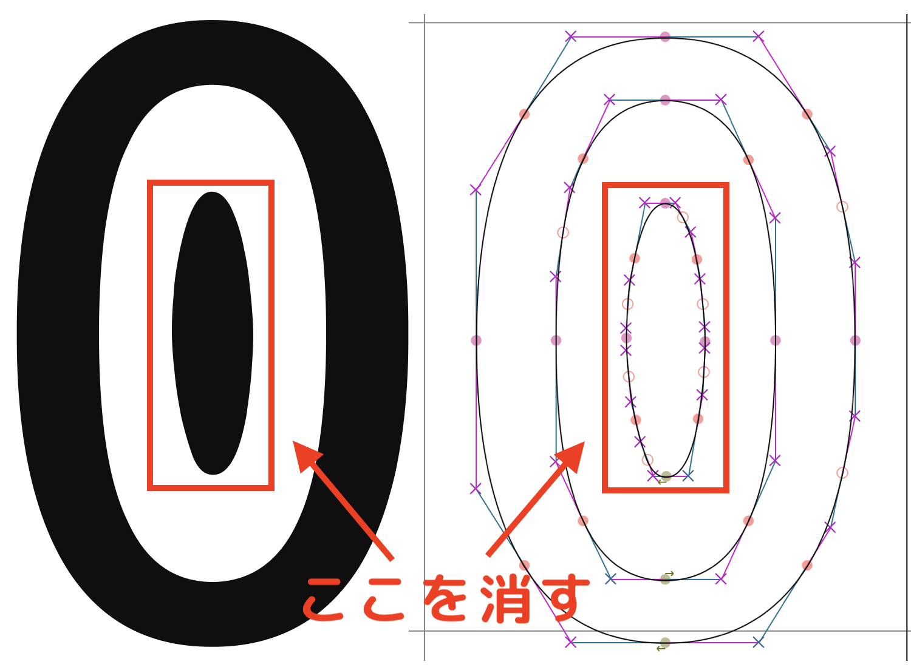
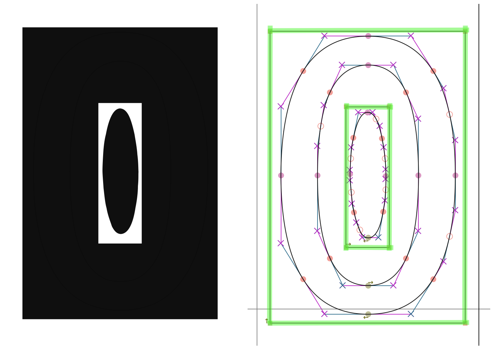
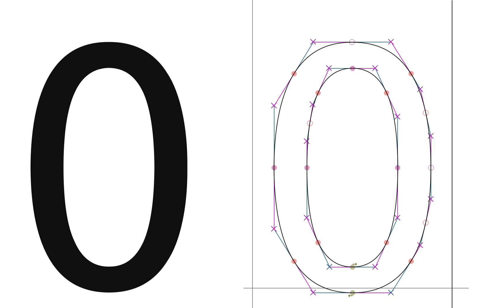
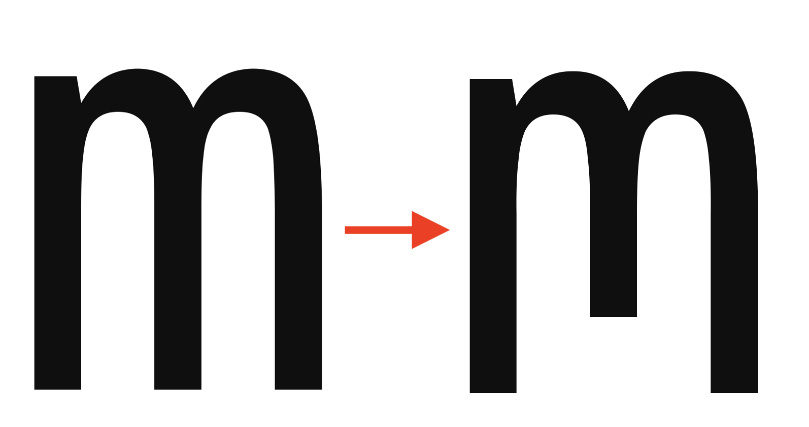

FontForge にて、Glyph 追加・削除を行うには「Glyph Pen」を用いると直感的にできるかと思う。

「削除」に関してはもっといい方法があるかもしれない。僕は見つけられなかった。

## Glyph Pen

[ドキュメント](https://fontforge.org/docs/scripting/python/fontforge.html#glyph-pen)

Glyph Pen は [glyph.glyphPen()](https://fontforge.org/docs/scripting/python/fontforge.html#fontforge.glyph.glyphPen) を使うと取得できる。

> **glyph.glyphPen([replace=False])**  
> Creates a new glyphPen which will draw into the current glyph. By default the pen will replace any existing contours and references, but setting the optional keyword argument, replace to false will retain the old contents.

ドキュメントのシグネクチャには引数の`replace`のデフォルト値が`False`であるかのように書いてあるが、実際はドキュメントの説明にある通り、`True`である。注意しなければならない。

Glyph Pen を取得するサンプルコードを次に示す。

```python
# key は 数値か文字列
glyphPen = font[key].glyphPen(replace=False)
```

ちなみに`font[key]`については次の通りである。`font[0x30]`などどしてあげれば良い。

> **font.\_\_getitem\_\_(key)**  
> If key is an integer, then returns the glyph at that encoding. If a string then returns the glyph with that name. May not be assigned to.

## 追加

数字の 0 (`0x30`)のグリフの左下に四角形を追加してみる。

```python
import fontforge

font = fontforge.open("example.ttf")
glyphPen = font[0x30].glyphPen(replace=False)

# 時計回りに線を書かなければいけないことに注意
glyphPen.moveTo((100,100))
glyphPen.lineTo((100,200))
glyphPen.lineTo((200,200))
glyphPen.lineTo((200,100))
glyphPen.closePath()

# Glaph Pen を使い終わったことを FontForge に伝える
# UI 使ってないので必要ないかもだけど一応やっておく
glyphPen = None

font.generate("modified-example.ttf")
```

それぞれドキュメントを引用しておく。

> **glyphPen.moveTo((x, y))**  
> With one exception this call begins every contor and creates an on curve point at (x,y) as the start point of that contour. This should be the first call after a pen has been created and the call that follows a glyphPen.closePath(), glyphPen.endPath().

> **glyphPen.lineTo((x, y))**  
> Draws a line from the last point to (x,y) and adds that to the contour.

> **glyphPen.closePath()**  
> Closes the contour (connects the last point to the first point to make a loop) and ends it.

線を追加するメソッドはこれら以外にもいくつかある。[ドキュメント](https://fontforge.org/docs/scripting/python/fontforge.html#glyph-pen)参照。

## 削除

削除は、「削除」としての関数を見つけることはできなかったが、`intersect()`を用いて削除を行う方法は見つけられた。次の記事で行なっていた方法を用いるといいだろう。

[SF Mono を使って最高のプログラミング用フォントを作った話#全角空白を可視化する](https://qiita.com/delphinus/items/f472eb04ff91daf44274#3-%E5%85%A8%E8%A7%92%E7%A9%BA%E7%99%BD%E3%82%92%E5%8F%AF%E8%A6%96%E5%8C%96%E3%81%99%E3%82%8B)

ここでは例として、Hack フォントの数字の 0(`0x30`)の中の楕円を削除を行う。



### Utility 関数

Glyph Pen を使って長方形描く関数を作っておく。

```python
def draw_square(glyphPen, center, width, height, clockwise=True):
    dx = width // 2
    dy = height // 2
    glyphPen.moveTo((center[0] - dx, center[1] - dy))
    if clockwise:
        glyphPen.lineTo((center[0] - dx, center[1] + dy))
        glyphPen.lineTo((center[0] + dx, center[1] + dy))
        glyphPen.lineTo((center[0] + dx, center[1] - dy))
    else:
        glyphPen.lineTo((center[0] + dx, center[1] - dy))
        glyphPen.lineTo((center[0] + dx, center[1] + dy))
        glyphPen.lineTo((center[0] - dx, center[1] + dy))
    glyphPen.closePath()
```

`center`は(x, y)のタプル、`width`, `height`は数値を受け取る。`clockwise`は線を描く方向で、ドーナツ型のような形を描く時の内側の線を作るときに`False`を設定するものである。

### 残す部分を長方形でおおう

フォントの`open()`とかは省略する。

```python
glyphPen = font[0x30].glyphPen(replace=False)
draw_square(glyphPen, (510, 610), 900, 1350)
draw_square(glyphPen, (510, 610), 200, 650, clockwise=False)
glyphPen = None
```

次のようになる。追加したところを緑でなぞってみた。



### 消す

`font.intersect()`を使うと、重なり合った部分のみを残してそれ以外を削除することができる。

> **font.intersect()**  
> Leaves only areas in the intersection of contours in all selected glyphs.

```python
font.selection.select(0x30)
font.intersect()
font.selection.none()
```

これで、目的の部分を消すことができた。



### 応用(?)

`font.copy()`, `font.paste()`, `font.pasteInto()`, `font.correctDirection()` も使えば、より柔軟に削除を行うこともできる。

次のスクリプトは小文字の「m」の真ん中の縦棒を短くする処理を行う関数である。

```python
def modify_m(font):
    # Hold original 「m」
    font.selection.select(0x6D)
    font.copy()

    # Extract where to remove
    glyph = font[0x6D]
    pen = glyph.glyphPen(replace=False)
    util.draw_square(pen, (512, 100), 300, 250)
    font.intersect()

    # Create a cover that has a hole
    util.draw_square(pen, (512, 512), 2000, 2000)
    pen = None
    font.correctDirection()

    # Add the cover to original 「m」then remove.
    font.pasteInto()
    font.intersect()
    font.selection.none()
```

これを適用すると、次のようになる。


