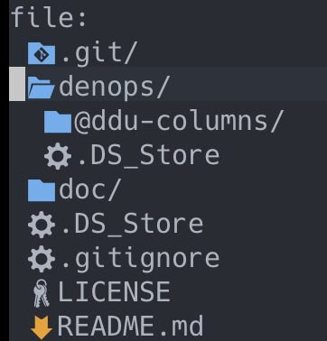
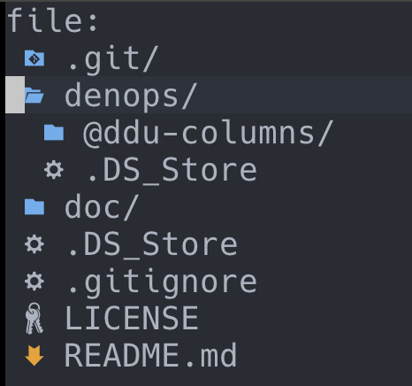
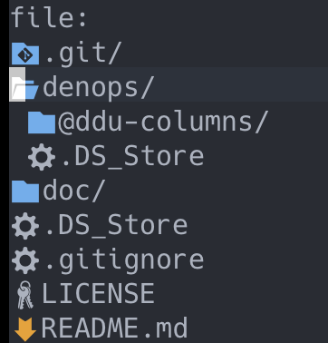

python 依存をなくすため、defx から ddu-ui-filer に乗り換えをした。

アイコン表示がないのは寂しいし、ファイルタイプを一目で確認できないのはひょっと不便なので作って見た。  
[defx-icons](https://github.com/kristijanhusak/defx-icons)を参考に作成している。

**https://github.com/ryota2357/ddu-column-icon_filename**

## 導入

ddu-column-filename と同じように、

```vim
call ddu#custom#patch_global({
    \   'columns': ['icon_filename'],
    \ })
```

としてあげれば良い。

詳しくは[help](https://github.com/ryota2357/ddu-column-icon_filename/blob/main/doc/ddu-column-icon_filename.txt)を。

## columParam について

デファクトスタンダード(?)colum である[ddu-column-filename](https://github.com/Shougo/ddu-column-filename)とは異なる Param を用意した。その中でも filename にはなかった空白を制御する 2 つの Param について。

### span

filename ではアイコンとファイル名の間のサイズを変更できず、空白 1 個というようになっている。

アイコンを表示する場合、これをコントロールする必要がある。これはアイコン表示幅が使用しているフォントによって異なることがあるから。(strwidth()では 1 幅になるけど表示は 2 幅になるとかがある)

次の画像は空白を 1 個つけているけど空白があるようには見えない。アイコン表示幅が 2 であるために空白が消えているように見えてしまう。(フォントは Cica を使用)



例えば hack nerd font mono とかでは次のようにちゃんと空白の存在を確認できる。



これに対処するため `span` という Param を作った。  
`iconWidth` という名前の Param で空白を追加することでコントロールしてもよかったのだが、今変更したいものはアイコンの幅ではなく、「アイコンとファイル名の間隔」なのではと思い `span` という名前で「アイコンとファイル名の間隔」を指定することにした。

### padding

見た方がわかりやすいと思う。

先ほどの `span` の説明では `padding` は 1(default)が指定されていた。例えばこれを 0 にすると次のようになる。



カーソルとアイコンが重なっている。これを修正するため左端にスペースを入れるのが `padding` である。

## アイコン選びについて

defx-icons とは異なるアイコンを使用しているものがある。

<!-- textlint-disable ja-technical-writing/no-doubled-joshi -->

僕の使用しているフォント Cica では一部アイコンフォントが表示されない、または別のものが表示されることがある。そのようなアイコンは異なるアイコンを当てている。  
そのほかにも僕の好みが反映されていたり、複数のフォントアイコンの選択肢がある場合は Devicons 由来のものを選んだりした。

<!-- textlint-enable ja-technical-writing/no-doubled-joshi -->

対応しているファイルタイプは[ここの下の方](https://github.com/ryota2357/ddu-column-icon_filename/blob/main/denops/%40ddu-columns/icon_filename.ts)に定義してある。主要なものは対応するようにしたつもり。対応していないものに気がついた時は随時追加していく。

## 最後に

初めて ddu プラグインを作成した。

typescript しか書いてない。とても簡単に作れた。ddu すごいね。
