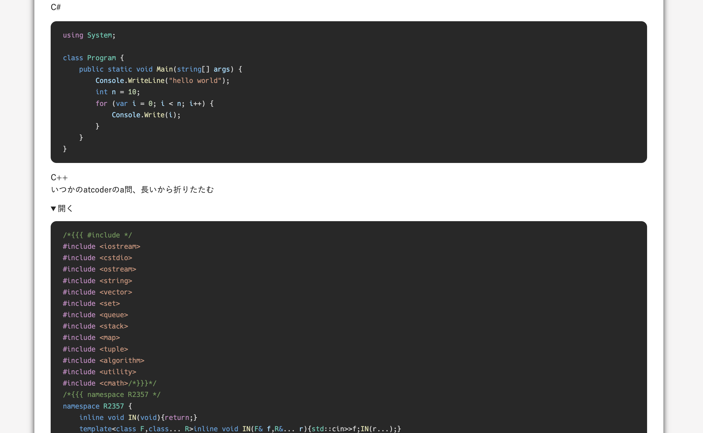

> このサイトを作るまでの記録。(時系列順)  
> 実際に作業を行なったメモに追記、編集して投稿してるので投稿日と作業日は一致しない。
>
> スターターを `gatsby new` したのは 2022 年の 3 月上旬。
> `gatsby` のバージョンは 4.9
>
> [一覧はここ](../gatsby-site-create-log0/)

blog 記事のレイアウトを整えていく。

## scss を使う

今までに scss 使ったことないけど、便利そうなので使ってみたかった。  
プラグインを追加して使えるようにする。

```bash
$ npm i sass gatsby-plugin-sass
```

```jsx
...
  plugins: [
    ...
    `gatsby-plugin-sass`,
  ],
}
```

`style.css` → `style.scss` にして階層構造に変更  
`src/normalize.css`,`src/style.scss` を `src/style` 下に移動。

<details>
  <summary>style/style.scss</summary>

```scss
html {
  font-family: YuGothic, "Yu Gothic", "Hiragino Kaku Gothic ProN",
    "ヒラギノ角ゴ ProN W3", "ＭＳ ゴシック", sans-serif;
  background-color: #f6f5f5;
  color: #242424;
  font-size: 14px;
  h1 {
    font-size: 2rem;
    font-weight: bold;
  }
  h2 {
    font-size: 1.7rem;
    font-weight: bold;
  }
  h3 {
    font-size: 1.3rem;
    font-weight: bold;
  }
  h4 {
    font-size: 1.1rem;
    font-weight: bold;
  }
  p {
    font-size: 1rem;
    line-height: 1.5;
  }
  a {
    color: #3a71af;
    text-decoration: none;
    &:hover {
      text-decoration: underline;
    }
  }
}
```

</details>

`gastby-browser.js` の import パスを修正  
ついでに typeface-\*は使ってないから削除、npm uninstall しておく。

```js {diff}
-// custom typefaces
-import "typeface-montserrat"
-import "typeface-merriweather"
// normalize CSS across browsers
-import "./src/normalize.css"
+import "./src/style/normalize.css"
// custom CSS styles
-import "./src/style.css"
+import "./src/style/style.scss"
```

## blog 個別記事の css を作る

`templates/blog-post.js` の本文部分に className=”markdown”を設置  
ついでに h1 タグになんか style つけてたので全部取り除いた。

```jsx
const BlogPostTemplate = ({ data, location }) => {
  const BlogBody = ({ post }) => (
     ...
      <div style={{ marginBottom: '30px' }}>
        <h1 itemProp="headline">{ post.frontmatter.title }</h1>
        <p style={{
          fontSize: '0.8rem',
          color: '#747474',
        }}>{ post.frontmatter.date }</p>
      </div>

      <div className="markdown" itemProp="articleBody"
        dangerouslySetInnerHTML={{ __html: post.html }}
      />
    </article>
  )
...
```

`style/markdown.scss` を作って、`gatsby-browser.js` にこの scss を読み込むように追記。

```jsx
...
import "./src/style/markdown.scss"
```

`style/markdown.scss` の内容はこんな感じ、[github マークダウンの css](https://github.com/sindresorhus/github-markdown-css/blob/main/github-markdown-light.css)を参考にしてる。

<details>
  <summary>style/markdown.scss</summary>

```scss
.markdown {
  h2 {
    border-bottom: solid 2.5px #e3e3e3;
  }
  pre {
    border-radius: 10px;
  }
  blockquote {
    margin: 0;
    padding: 0 1rem;
    color: #57606a;
    border-left: 0.25em solid #d0d7de;
  }
  details {
    summary {
      cursor: pointer;
    }
  }
  table {
    border-spacing: 0;
    border-collapse: collapse;
    white-space: nowrap;
    display: block;
    width: max-content;
    max-width: 100%;
    overflow: auto;
    tr {
      background-color: #ffffff;
      border-top: 1px solid #d5dbe2;
      &:nth-child(2n) {
        background-color: #f6f8fa;
      }
    }
    th {
      font-weight: bold;
      padding: 0.5rem;
      border: 1px solid #d0d7de;
    }
    td {
      padding: 0.5rem;
      border: 1px solid #d0d7de;
    }
  }
}
```

</details>

## コードのハイライトプラグインの変更

gatsby-remark-prismjs から gatsby-remark-vscode にする。

```bash
$ npm i gatsby-remark-vscode
```

で導入。  
gatsby-remark-prismjs を `gatsby-config.js` とか `package.json` とかから削除。

gatsby-remark-vscode のオプションはこんな感じ。

```js
...
{
  resolve: `gatsby-remark-vscode`,
  options: {
    theme: 'Default Dark+',
    languageAliases: { txt: 'ignore' },
    extensions: ['dart-code'],
  },
},
...
```

gatsby-remark-vscode は dart に対応してないので対応させてる。  
詳しくは[gatsby-remark-vscode にハイライト可能な言語を追加する](../gatsby-hilight-vscode-add/)を参照。

続いてスタイルを調整する。  
`style/code-highlight.scss` を作って以下のようにする。もちろん、`gatsby-brower.js` に import しておく。

```scss
// gatsby-remark-vscode
:root {
  --grvsc-border-radius: 10px;
}

.markdown {
  p {
    code {
      font-size: 1rem;
      background-color: #e6e6e6;
      border-radius: 6px;
      padding: 0.2em 0.4em;
    }
  }
  pre {
    background-color: #282828;
    font-size: 85%;
  }
}
```

### こんな感じになる


