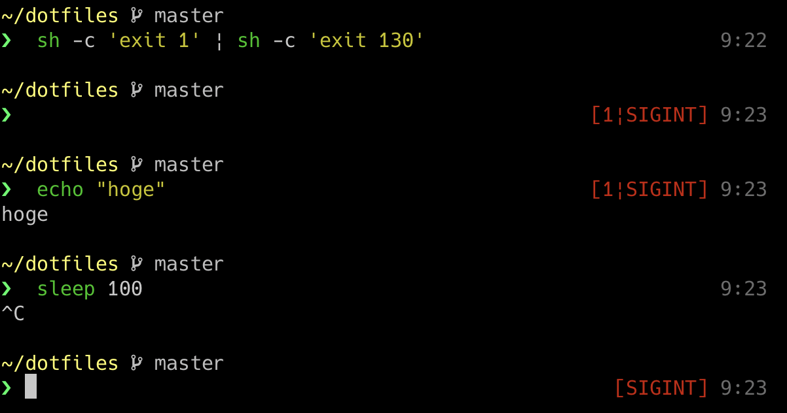

こんな感じで右プロンプトに直前のコマンドの結果を出力する(0 の時以外)ようにした。



## スクリプトとその説明

スクリプト全体を折りたたんで載せておく。

<details>
<summary>zshスクリプト</summary>

```zsh
__signal_code_string() {
    local ret=""
    for STATUS in $__save_pipestatus;
    do
        # man signal
        case $STATUS in
            0  ) ;;
            129) ret="${ret}|SIGHUP"   ;;   # terminate process    terminal line hangup
            130) ret="${ret}|SIGINT"   ;;   # terminate process    interrupt program
            131) ret="${ret}|SIGQUIT"  ;;   # create core image    quit program
            132) ret="${ret}|SIGILL"   ;;   # create core image    illegal instruction
            133) ret="${ret}|SIGTRAP"  ;;   # create core image    trace trap
            134) ret="${ret}|SIGABRT"  ;;   # create core image    abort program (formerly SIGIOT)
            135) ret="${ret}|SIGEMT"   ;;   # create core image    emulate instruction executed
            136) ret="${ret}|SIGFPE"   ;;   # create core image    floating-point exception
            137) ret="${ret}|SIGKILL"  ;;   # terminate process    kill program
            138) ret="${ret}|SIGBUS"   ;;   # create core image    bus error
            139) ret="${ret}|SIGSEGV"  ;;   # create core image    segmentation violation
            140) ret="${ret}|SIGSYS"   ;;   # create core image    non-existent system call invoked
            141) ret="${ret}|SIGPIPE"  ;;   # terminate process    write on a pipe with no reader
            142) ret="${ret}|SIGALRM"  ;;   # terminate process    real-time timer expired
            143) ret="${ret}|SIGTERM"  ;;   # terminate process    software termination signal
            144) ret="${ret}|SIGURG"   ;;   # discard signal       urgent condition present on socket
            145) ret="${ret}|SIGSTOP"  ;;   # stop process         stop (cannot be caught or ignored)
            146) ret="${ret}|SIGTSTP"  ;;   # stop process         stop signal generated from keyboard
            147) ret="${ret}|SIGCONT"  ;;   # discard signal       continue after stop
            148) ret="${ret}|SIGCHLD"  ;;   # discard signal       child status has changed
            149) ret="${ret}|SIGTTIN"  ;;   # stop process         background read attempted from control terminal
            150) ret="${ret}|SIGTTOU"  ;;   # stop process         background write attempted to control terminal
            151) ret="${ret}|SIGIO"    ;;   # discard signal       I/O is possible on a descriptor (see fcntl(2))
            152) ret="${ret}|SIGXCPU"  ;;   # terminate process    cpu time limit exceeded (see setrlimit(2))
            153) ret="${ret}|SIGXFSZ"  ;;   # terminate process    file size limit exceeded (see setrlimit(2))
            154) ret="${ret}|SIGVTALRM";;   # terminate process    virtual time alarm (see setitimer(2))
            155) ret="${ret}|SIGPROF"  ;;   # terminate process    profiling timer alarm (see setitimer(2))
            156) ret="${ret}|SIGWINCH" ;;   # discard signal       Window size change
            157) ret="${ret}|SIGINFO"  ;;   # discard signal       status request from keyboard
            158) ret="${ret}|SIGUSR1"  ;;   # terminate process    User defined signal 1
            159) ret="${ret}|SIGUSR2"  ;;   # terminate process    User defined signal 2
            *  ) ret="${ret}|${STATUS}";;
        esac
    done

    if [ ${#ret} -eq 0 ]; then
        echo ""
    else
        echo "[${ret[2,-1]}]"
    fi
}

__left-prompt() {
  local dir="%F{11}%~%f"
  local next="%F{47}❯%f "

  if [ `git rev-parse --is-inside-work-tree 2> /dev/null` ]; then
    local branch_name=`git rev-parse --abbrev-ref HEAD 2> /dev/null`
    local branch="%F{250} ${branch_name}%f"
    echo -e "\n${dir} ${branch}\n${next}"
  else
    echo -e "\n${dir}\n${next}"
  fi
}
__right-prompt() {
  local time="%F{242}%T%f"
  local cmd_status="%F{1}`__signal_code_string`%f"
  echo "${cmd_status} ${time}"
}

precmd() {
  __save_pipestatus=("${pipestatus[@]}")
  PROMPT=`__left-prompt`
  RPROMPT=`__right-prompt`
}
```

</details>

初歩的なプロンプト作成の方法は[zsh プロンプトをカスタマイズする](../zsh-prompt-custom)に書いたので省略する。

### \_\_signal_code_string()

`$pipestatus` の情報が保存された配列 `$save_pipestatus` に基づいて、いい感じの文字列を生成してる。

実装については後述。

### \_\_left-prompt()

左のプロンプトを作成する関数。

現在ディレクトリ `dir`、git のブランチ情報 `branch` の情報の文字列を作成してる。

### \_\_right-prompt()

右のプロンプトを作成する関数。

現在時刻 `time`、pipestatus`cmd_status` の情報の文字列を作成してる。

### precmd()

プロンプトを生成する。

**`$pipestatus` の内容はスクリプト内のコマンドでも書き変わってしまうので `__save_pipestatus` に保存しておく。**
僕は最初これに気が付かないで「あれー」ってやってた...

ちなみに、この保存方法だけど、

```zsh
__save_pipestatus=$pipestatus
```

にしちゃうと `__save_pipestatus` が配列として保存できないので、

```zsh
__save_pipestatus=("${pipestatus[@]}")
```

にする必要があった。

## $pipestatus の情報の加工

`__signal_code_string()` が行ってるのもの。

まず、終了ステータスについてだが、これらは[Wikipedia/終了ステータス#bash](https://ja.wikipedia.org/wiki/%E7%B5%82%E4%BA%86%E3%82%B9%E3%83%86%E3%83%BC%E3%82%BF%E3%82%B9#bash)から引用すると、

| 終了ステータス | 意味                                             |
| :------------- | :----------------------------------------------- |
| 1              | 一般的なエラー                                   |
| 2              | ビルトインコマンドの誤用                         |
| 126            | コマンドを実行できなかった（実行権限がなかった） |
| 127            | コマンドが見つからなかった                       |
| 128            | exit に不正な値を渡した（例えば浮動小数点数）    |
| 128+n          | シグナル n で終了                                |
| 255            | 範囲外の終了ステータス                           |

どこまで同じかわからないけど、少なくとも `128+n = シグナル n で終了` は zsh でも同じだった。

シグナルについては `man signal` でそれぞれの数値がどのような意味を持つのか確認できる。

一部を抜粋するとこんな感じである。

```txt
...
     are simply discarded if the process has not requested otherwise.  Except for the SIGKILL
     and SIGSTOP signals, the signal() function allows for a signal to be caught, to be ignored,
     or to generate an interrupt.  These signals are defined in the file <signal.h>:

           Name             Default Action       Description
     1     SIGHUP           terminate process    terminal line hangup
     2     SIGINT           terminate process    interrupt program
     3     SIGQUIT          create core image    quit program
...
```

僕の実装ではシグナル n は対応する `Name` に、それ以外の終了コードは数値として文字列にして結合している。

最後に、作った文字列を返すところ、

```zsh
    if [ ${#ret} -eq 0 ]; then
        echo ""
    else
        echo "[${ret[2,-1]}]"
    fi
```

について。

zsh は文字列も配列と同じように長さの取得やインデックスアクセスができた。

`${#ret}` で文字列 `ret` の長さを取得して処理を分岐、`${ret[2,-1]}` で `ret` から 1 文字目を取り除いた文字列を `echo` してる。
