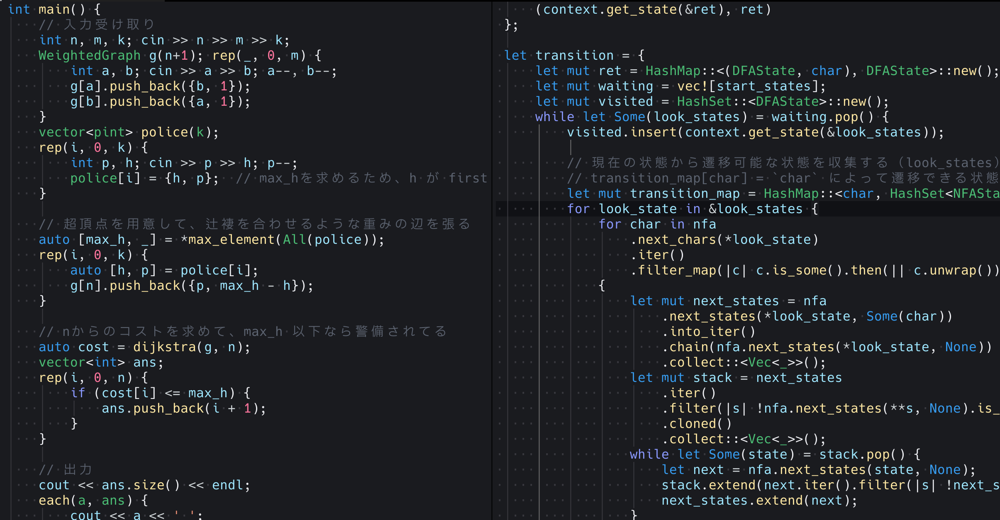
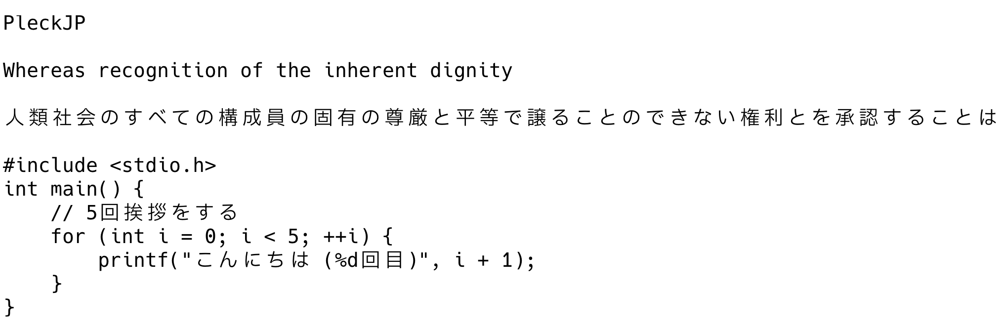
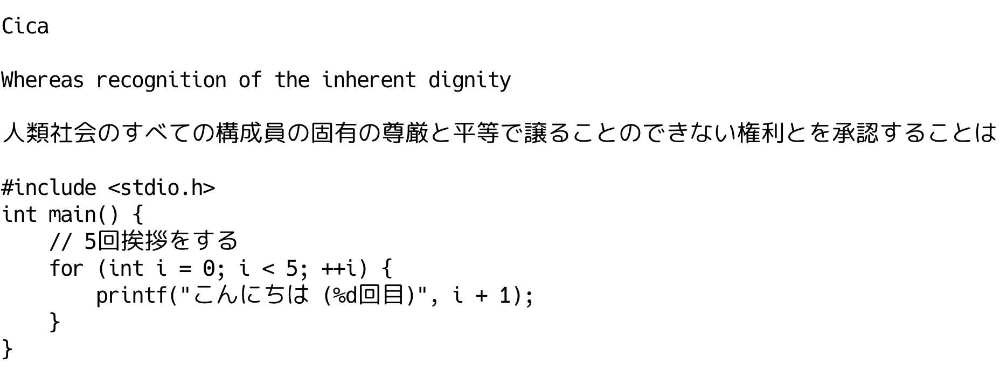
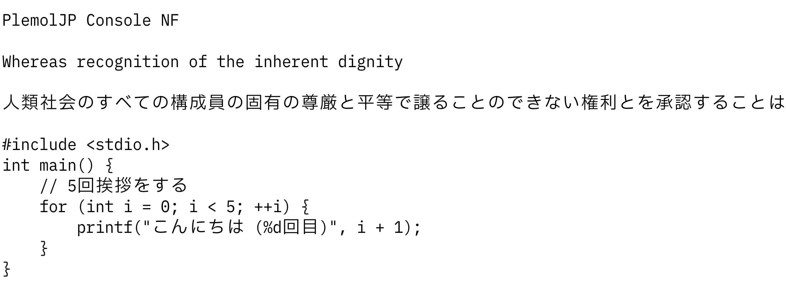
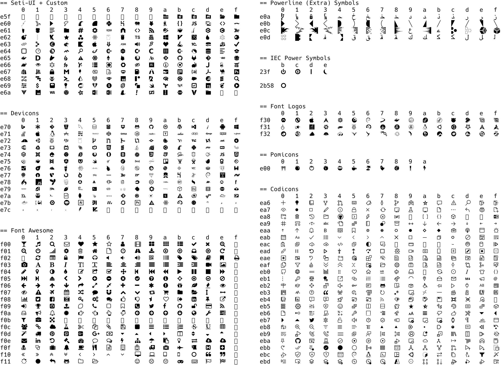
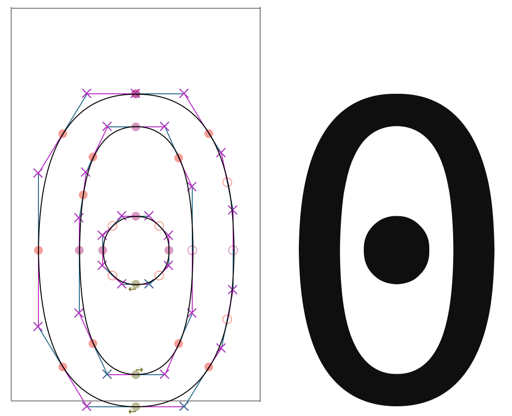
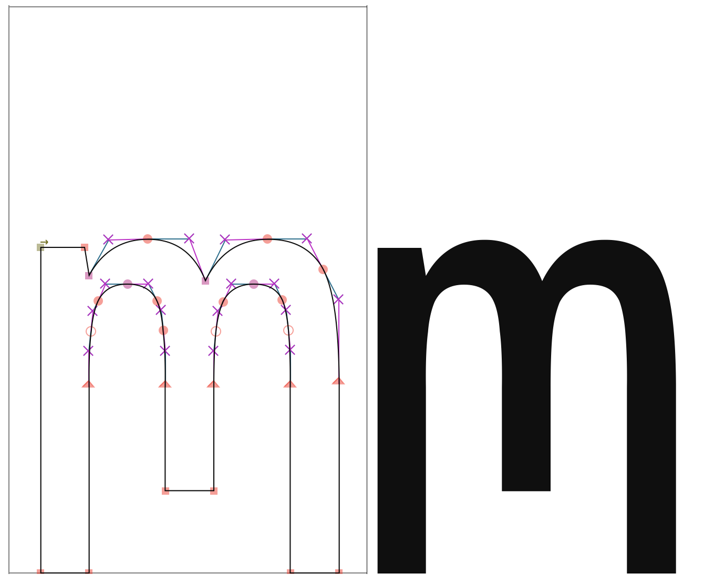
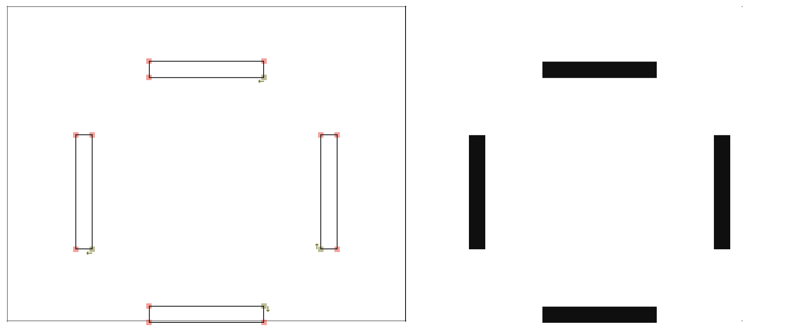

## PleckJP

「IBM Plex Sans JP」と「Hack」を合成したプログラミング用合成フォント「PleckJP」を作成した。  
本稿では PleckJP を作成した理由やその特徴を書く。

合成スクリプト(FontForge with Python)の解説は[プログラミング用合成フォント PleckJP の合成スクリプトの実装解説](../pleck-jp-impl-exp/)に書いた。

[**https://github.com/ryota2357/PleckJP**](https://github.com/ryota2357/PleckJP)

## 比較

いくつか有名な日本語プログラミングフォントと PleckJP の比較スクリーンショットを並べる。

### HackGen

[https://github.com/yuru7/HackGen](https://github.com/yuru7/HackGen)

### Cica

[https://github.com/miiton/Cica](https://github.com/miiton/Cica)

### PlemolJP

[https://github.com/yuru7/PlemolJP](https://github.com/yuru7/PlemolJP)

## 目的と経緯

元々僕は Cica フォントを長らく利用していた。
Cica は優れたフォントであり大きな不満点があった訳ではないのだが、次の点が気になっていた。

- Cica は Nerd Font の周りに独自の対応がされていて、そこを自分で制御したいなという気持ちがあった。
- 日本語は画数が多いためか密度が高く見えてしまい、英語と並べた時に日本語がやや目立つように感じる。そのためコード内のコメントなどで日本語が使用されるとその部分が（目立つ必要がないのに）目立っいるように感じる。

ある日、何となく iTerm2 の「Use a different font for non-ASCII text」の機能を利用して Cica を ASCII に、PlemolJP を non-ASCII に設定してみた。
この時、僕は上記 2 つの問題が解決されたように感じられた。

iTerm2 上で Cica と PlemolJP を混ぜて利用するのを何ヶ月か続けたのだが、ある日 iTerm2 をやめ、Alactirry に移行したいなと思うようになった。
Alacritty では設定でフォントを混ぜることができない。そこで僕は合成フォントを作ることを決めた。

今回作成した合成フォント PleckJP は、Cica がベースとして利用している Hack、PlemolJP がベースとしている IBM Plex Sans JP を合成元とした。（もちろん他のフォントも検討したが、最終的にこの 2 つを混ぜることにした）

## Nerd Fonts の合成

アイコンフォントはターミナルで生活するには僕にとって必須である。なので、PleckJP にも NerdFonts を合成した。

NerdFonts の合成には公式 FontPatcher を利用する方法が多いのかもしれないが、僕は FontPatcher 以上の細かな調節を自分で行いたかったため独自の合成スクリプトで合成している。

## グリフの編集

PleckJP は 2 つのフォントをただ合成しただけではない。幾つかの変更を加えている。それらについて説明する。

### 日本語のサイズ

日本語のサイズは少しだけ小さくなっている。これは「目的」のところに書いたが、日本語と英語を並べた時日本語が目立ちやすいという問題を解消するためである。

英語・日本語グリフのサイズのバランスが少し悪く見えるかもしれないが、PleckJP はプログラミングフォントであり、ソースコード上の文字はほとんどが英数字である。
フォントとして良いバランスを取るよりも、ソースコード全体のバランス（日本語が目立たない）を僕は取ったつもりである。

### 0 (数字のゼロ)

これは僕が長らく Cica を使っていたことに影響されているのだと思うのだが、0 の中心に打たれるドットは Hack フォントの楕円ではなく、真円でないと違和感があったので変更した。

### m (小文字のエム)

Cica が取り入れている変更と同じである。

Cica では「独自の調整として m の真ん中の棒を短く（rn と m を区別しやすく＆ちょっと可愛らしく）」という変更がされている。
PleckJP でも同様の調整を入れた。しかし Cica よりも m の真ん中の棒は長くした。

### 全角スペース

プログラミングフォントにおいて全角スペースの可視化は必須であると僕は思っている。

グリフの形は僕の好み、かつ、作りやすい（コード上で作成しやすい）のでこの形となった。

## 感想

初めての合成フォント作成であったが、個人的にはなかなか良いものが作れたなと感じている。

今後も PleckJP をメンテナンス・改善していき、より良いフォントにしていく。
