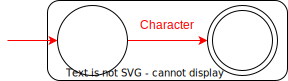
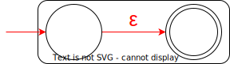
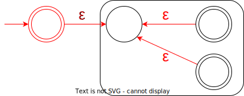
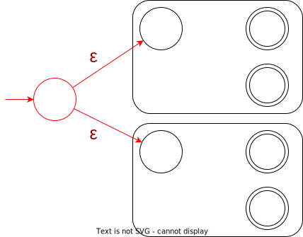
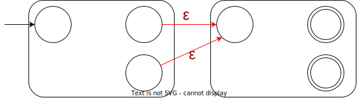

書いてたら思いの他長くなったので分割した。

[シンプルな DFA 型の正規表現エンジンを Rust で作成する #0](../dfa-regex-with-rust-0/)

このページでは Parser より得られた構文木から NFA を、その NFA から DFA を構築し、Regex を作成する。

## Automaton

オートマトンと正規表現の関連付けイメージは「[オートマトンは正規表現の夢を見るか(見るし、夢というかそのものですらある)](https://zenn.dev/canalun/articles/regexp_and_automaton)」がわかりやすかった。
実際に正規表現から NFA, DFA を構築することはないのだが、変換の流れがなんとなく想像できるようになる。

Rust での実装に入る。

まず、`src/automaton.rs` を次のようにする。

```rust
mod dfa;
mod nfa;

pub use crate::automaton::dfa::*;
pub use crate::automaton::nfa::*;
```

このコードからもわかるように、`src/automaton/nfa.rs` に NFA を、`src/automaton/dfa.rs` に DFA を実装する。

ここからは [#0](../dfa-regex-with-rust-0/) の参考記事にあげた[正規表現エンジンを作ろう 1 ~ 6](https://codezine.jp/article/detail/3039)とクラス構造が大きく変わる。

## NFA (非決定性有限オートマトン)

実装は `src/automaton/nfa.rs` に行う。

### NFAState

NFA において、状態を表す数値などが必要である。`u32` などでも良いのだが、今後 DFA でも同様に状態を表す数値が必要となるため、`u32` を用いてしまうと、「型」でその数値が NFA のものか DFA のものか区別ができない。
そこでタプル構造体を用いると良いだろう。  
<small>
(C#などでは Cysharp/UnitGenerator などを用いて、型を付けつつ柔軟な操作を可能にできるのだが、Rust にはオーバーロードや暗黙の型変換の機能がないので、タプル構造体を用いる。)
</small>

```rust
#[derive(Clone, Copy, Debug, Eq, Hash, PartialEq, PartialOrd, Ord)]
pub struct NFAState(pub u32);
```

この状態を生成する構造体として、`Context` を導入する。

```rust
struct Context {
    state_count: u32,
}

impl Context {
    fn new() -> Self {
        Context { state_count: 0 }
    }

    fn new_state(&mut self) -> NFAState {
        let id = self.state_count;
        self.state_count += 1;
        NFAState(id)
    }
}
```

次のように順に整数をカウントアップする。

```rust
#[test]
fn context() {
    let mut context = Context::new();
    assert_eq!(context.new_state(), NFAState(0));
    assert_eq!(context.new_state(), NFAState(1));
    assert_eq!(context.new_state(), NFAState(2));
}
```

### NondeterministicFiniteAutomaton

NFA を表す構造体を作る。

```rust
pub struct NondeterministicFiniteAutomaton {
    pub start: NFAState,
    pub accepts: HashSet<NFAState>,
    transition: HashMap<NFAState, HashMap<Option<char>, HashSet<NFAState>>>,
}
impl NondeterministicFiniteAutomaton {
    pub fn new(start: NFAState, accepts: HashSet<NFAState>) -> Self {
        NondeterministicFiniteAutomaton {
            start,
            accepts,
            transition: HashMap::new(),
        }
    }
}
```

`start` は開始状態、`accepts` は受理状態、`transition` が遷移テーブルである。

遷移テーブル `transition` の構造は `transition[from_state][char] = [next_state]` のような感じで、「状態 `from_state` において、文字 `char` により、状態(集合)`[next_state]` に遷移する」というものである。  
つまり、次に示す `new_state()` メソッドによって、次の状態を取得できる。

```rust
impl NondeterministicFiniteAutomaton {
    pub fn next_states(&self, state: NFAState, char: Option<char>) -> HashSet<NFAState> {
        self.transition
            .get(&state)
            .and_then(|table| table.get(&char))
            .cloned()
            .unwrap_or(HashSet::new())
    }
}
```

遷移テーブル `transition` の構造は少し複雑なので、`transition` を操作するメソッドを作っておく。

```rust
impl NondeterministicFiniteAutomaton {
    pub fn add_transition(mut self, from: NFAState, char: char, to: NFAState) -> Self {
        self._insert_transition(from, to, Some(char));
        self
    }

    pub fn add_empty_transition(mut self, from: NFAState, to: NFAState) -> Self {
        self._insert_transition(from, to, None);
        self
    }

    fn merge_transition(mut self, other: &Self) -> Self {
        for (from_state, trans) in &other.transition {
            for (char, to_states) in trans {
                self.transition
                    .entry(*from_state)
                    .or_insert(HashMap::new())
                    .entry(*char)
                    .or_insert(HashSet::new())
                    .extend(to_states);
            }
        }
        self
    }

    fn _insert_transition(&mut self, from: NFAState, to: NFAState, char: Option<char>) {
        let to_states = self
            .transition
            .entry(from)
            .or_insert(HashMap::new())
            .entry(char)
            .or_insert(HashSet::new());
        to_states.insert(to);
    }
}
```

### 構文木から NFA を構築

構文木は `Node` 構造体で表されている。

```rust
#[derive(Debug, PartialEq, Eq, Hash)]
pub enum Node {
    Character(char),
    Empty,
    Star(Box<Node>),
    Union(Box<Node>, Box<Node>),
    Concat(Box<Node>, Box<Node>),
}
```

`NondeterministicFiniteAutomaton` 構造体に、`from_node()` メソッドを実装してして、構文木から構築できるようにする。  
また、`Node` に `assemble()` メソッドを実装して、再帰的に `NondeterministicFiniteAutomaton` 構造体を構築する。

```rust
impl NondeterministicFiniteAutomaton {
    pub fn from_node(node: Node) -> Self {
        node.assemble(&mut Context::new())
    }
}

impl Node {
    fn assemble(&self, context: &mut Context) -> NondeterministicFiniteAutomaton {
        match self {
            Node::Character(char) => todo!()
            Node::Empty => todo!()
            Node::Star(node) => todo!()
            Node::Union(node1, node2) => todo!()
            Node::Concat(node1, node2) => todo!()
        }
    }
}
```

`assemble()` メソッドの match 式のそれぞれのアームを埋めて(実装して)いく。

#### Node::Character

任意の 1 文字にマッチする正規表現である。以下のような NFA とすれば良い。



これを実装すると次のようになる。

```rust
fn assemble(&self, context: &mut Context) -> NondeterministicFiniteAutomaton {
    match self {
        Node::Character(char) => {
            let start = context.new_state();
            let accept = context.new_state();
            NondeterministicFiniteAutomaton::new(start, [accept].into())
                .add_transition(start, *char, accept)
        }
    }
}
```

#### Node::Empty

空文字にマッチする正規表現である。`Node::Character` の時と同じような感じで実装する。



```rust
fn assemble(&self, context: &mut Context) -> NondeterministicFiniteAutomaton {
    match self {
        Node::Empty => {
            let start = context.new_state();
            let accept = context.new_state();
            NondeterministicFiniteAutomaton::new(start, [accept].into())
                .add_empty_transition(start, accept)
        }
    }
}
```

#### Node::Star(node)

`A*` などの繰り返しにマッチする正規表現である。空文字遷移を用いることで表現できる。



```rust
fn assemble(&self, context: &mut Context) -> NondeterministicFiniteAutomaton {
    match self {
        Node::Star(node) => {
            let frag = node.assemble(context);
            let start = context.new_state();
            let accepts = frag.accepts.union(&[start].into()).cloned().collect();
            let mut nfa = NondeterministicFiniteAutomaton::new(start, accepts)
                .merge_transition(&frag)
                .add_empty_transition(start, frag.start);
            for accept in &frag.accepts {
                nfa = nfa.add_empty_transition(*accept, frag.start);
            }
            nfa
        }
    }
}
```

#### Node::Union(node1, node2)

`A|B` のようなものにマッチする正規表現である。`Node::Star` と同様、空文字遷移を用いることで表現できる。  
新たな状態を生成し、それを開始地点を生成する。遷移テーブルは元の 2 つのものを、そのままマージすれば良い。



```rust
fn assemble(&self, context: &mut Context) -> NondeterministicFiniteAutomaton {
    match self {
        Node::Union(node1, node2) => {
            let frag1 = node1.assemble(context);
            let frag2 = node2.assemble(context);
            let start = context.new_state();
            let accepts = frag1.accepts.union(&frag2.accepts).cloned().collect();
            NondeterministicFiniteAutomaton::new(start, accepts)
                .merge_transition(&frag1)
                .merge_transition(&frag2)
                .add_empty_transition(start, frag1.start)
                .add_empty_transition(start, frag2.start)
        }
    }
}
```

#### Node::Concat(node1, node2)

`AB` のように 2 つの文字列を並べたものにマッチする正規表現である。  
遷移テーブルをマージした後、1 文字目の受理状態から 2 文字めの開始状態へ空文字遷移を追加すれば良い。



```rust
fn assemble(&self, context: &mut Context) -> NondeterministicFiniteAutomaton {
    match self {
        Node::Concat(node1, node2) => {
            let frag1 = node1.assemble(context);
            let frag2 = node2.assemble(context);
            let mut fragment =
                NondeterministicFiniteAutomaton::new(frag1.start, frag2.accepts.clone())
                    .merge_transition(&frag1)
                    .merge_transition(&frag2);
            for accept1 in &frag1.accepts {
                fragment = fragment.add_empty_transition(*accept1, frag2.start);
            }
            fragment
        }
    }
}
```

### テスト

Node::assemble()が正しく実装できているか確認する。自分で構文木(`Node`)を構築し、それを `NondeterministicFiniteAutomaton::from_node()` に与えて期待する NFA が生成されているか `assert_eq!()` する。

長いので折りたたんだ。

<details>
<summary>テストコード</summary>

```rust
#[cfg(test)]
mod tests {
    use super::*;

    #[test]
    fn from_character_node() {
        let nfa = NondeterministicFiniteAutomaton::from_node(Node::Character('a'));

        // -> 0 --a--> 1
        // accept: 1
        assert_eq!(nfa.start, NFAState(0));
        assert_eq!(nfa.accepts, [NFAState(1)].into());
        assert_eq!(
            nfa.transition,
            [(NFAState(0), [(Some('a'), [NFAState(1)].into())].into())].into()
        );
    }

    #[test]
    fn from_empty_node() {
        let nfa = NondeterministicFiniteAutomaton::from_node(Node::Empty);

        // -> 0 --ε--> 1
        // accept: 1
        assert_eq!(nfa.start, NFAState(0));
        assert_eq!(nfa.accepts, [NFAState(1)].into());
        assert_eq!(
            nfa.transition,
            [(NFAState(0), [(None, [NFAState(1)].into())].into())].into()
        );
    }

    #[test]
    fn from_star_node() {
        let nfa =
            NondeterministicFiniteAutomaton::from_node(Node::Star(Box::new(Node::Character('a'))));

        //              /<--ε--\
        // -> 2 --ε--> 0 --a--> 1
        // accept: 2, 1
        assert_eq!(nfa.start, NFAState(2));
        assert_eq!(nfa.accepts, [NFAState(2), NFAState(1)].into());
        assert_eq!(
            nfa.transition,
            [
                (NFAState(2), [(None, [NFAState(0)].into())].into()),
                (NFAState(0), [(Some('a'), [NFAState(1)].into())].into()),
                (NFAState(1), [(None, [NFAState(0)].into())].into())
            ]
            .into()
        );
    }

    #[test]
    fn from_union_node() {
        let nfa = NondeterministicFiniteAutomaton::from_node(Node::Union(
            Box::new(Node::Character('a')),
            Box::new(Node::Character('b')),
        ));

        //     /--ε--> 0 --a--> 1
        // -> 4
        //     \--ε--> 2 --b--> 3
        // accept: 1, 3
        assert_eq!(nfa.start, NFAState(4));
        assert_eq!(nfa.accepts, [NFAState(1), NFAState(3)].into());
        assert_eq!(
            nfa.transition,
            [
                (
                    NFAState(4),
                    [(None, [NFAState(0), NFAState(2)].into())].into()
                ),
                (NFAState(0), [(Some('a'), [NFAState(1)].into())].into()),
                (NFAState(2), [(Some('b'), [NFAState(3)].into())].into())
            ]
            .into()
        );
    }

    #[test]
    fn from_concat_node() {
        let nfa = NondeterministicFiniteAutomaton::from_node(Node::Concat(
            Box::new(Node::Character('a')),
            Box::new(Node::Character('b')),
        ));

        // -> 0 --a--> 1 --ε--> 2 --b--> 3
        // accept: 3
        assert_eq!(nfa.start, NFAState(0));
        assert_eq!(nfa.accepts, [NFAState(3)].into());
        assert_eq!(
            nfa.transition,
            [
                (NFAState(0), [(Some('a'), [NFAState(1)].into())].into()),
                (NFAState(1), [(None, [NFAState(2)].into())].into()),
                (NFAState(2), [(Some('b'), [NFAState(3)].into())].into())
            ]
            .into()
        );
    }
}
```

</details>

## DFA (決定性有限オートマトン)

実装は `src/automaton/dfa.rs` に行う。

### DFAState

`NFAState` と同様に、DFA の状態を表すタプル構造体 `DFAState` と、それを生成する構造体 `Context` を作成する。

```rust
#[derive(Clone, Copy, Debug, Eq, Hash, PartialEq, PartialOrd, Ord)]
pub struct DFAState(u32);
```

NFA の時の `Context` は `pub` にせずファイルローカルな構造体であった。なので NFA の時と同じ名前を使うことができる。(DFA の `Context` もファイルローカルである)

NFA の `Context` とは実装しているメソッドが異なる。  
`get_state()` メソッドは引数に `NFAState` の配列をとり、その配列に対して一意の状態 `DFAState` を返す (必要であれば新しい状態を作る)。

```rust
struct Context {
    state_count: u32,
    state_map: HashMap<Vec<NFAState>, DFAState>,
}

impl Context {
    fn new() -> Context {
        Context {
            state_count: 0,
            state_map: HashMap::new(),
        }
    }

    fn get_state(&mut self, states: &[NFAState]) -> DFAState {
        let mut sorted_states = states.to_vec();
        sorted_states.sort();
        match self.state_map.get(&sorted_states) {
            Some(state) => *state,
            None => {
                let id = self.state_count;
                self.state_count += 1;
                self.state_map.insert(sorted_states, DFAState(id));
                DFAState(id)
            }
        }
    }
}
```

次のように、`[NFAState]` から `DFAState` を取得(生成)する。

```rust
#[test]
#[rustfmt::skip]
fn dfa_context() {
    let mut context = Context::new();
    assert_eq!(context.get_state(&[NFAState(0)]),                           DFAState(0));
    assert_eq!(context.get_state(&[NFAState(0), NFAState(1)]),              DFAState(1));
    assert_eq!(context.get_state(&[NFAState(1), NFAState(2), NFAState(3)]), DFAState(2));
    assert_eq!(context.get_state(&[]),                                      DFAState(3));
    assert_eq!(context.get_state(&[NFAState(0)]),                           DFAState(0));
    assert_eq!(context.get_state(&[NFAState(2), NFAState(1), NFAState(3)]), DFAState(2));
    assert_eq!(context.get_state(&[NFAState(4)]),                           DFAState(4));
}
```

### DeterministicFiniteAutomaton

DFA を表す構造体を作る。

```rust
pub struct DeterministicFiniteAutomaton {
    pub start: DFAState,
    pub accepts: HashSet<DFAState>,
    transition: HashMap<(DFAState, char), DFAState>,
}
```

フィールドは NFA の時と同様、 `start` は開始状態、`accepts` は受理状態、`transition` が遷移テーブルである。

遷移テーブル `transition` の構造が NFA の時とは異なっていることがわかると思う。

遷移テーブルの構造は `transition[(from_state, char)] = next_state]` のような感じで、「状態 `from_state` において、文字 `char` により、状態 `next_state` に遷移する」というものである。  
NFA の時と表しているテーブル構造自体に変化は `next_state` か、`[next_state]` かの違いだが、`from_state` と `char` をタプルとすることでスッキリしたものになっている。

`NondeterministicFiniteAutomaton` の時と同じように、次の状態を取得するメソッド `next_state()` を実装する。

```rust
impl DeterministicFiniteAutomaton {
    pub fn next_state(&self, state: DFAState, char: char) -> Option<DFAState> {
        self.transition.get(&(state, char)).cloned()
    }
}
```

### NFA から DFA を構築

`NondeterministicFiniteAutomaton` から `DeterministicFiniteAutomaton` を構築するメソッド `from_nfa()` を実装する。

次のように、開始状態 `start`、 遷移テーブル `transition`、受理状態 `accepts`、これらをそれぞれ別々に求める。

```rust
impl DeterministicFiniteAutomaton {
    pub fn from_nfa(nfa: NondeterministicFiniteAutomaton) -> Self {
        let mut context = Context::new();

        // start: DFAの開始状態 (DFAState)
        // start_states: NFAとしての開始状態集合 (Vec<NFAState>)
        let (start, start_states) = {
            todo!()
        };

        // 遷移テーブル
        let transition = {
            todo!()
        };

        // 受理状態 (HashSet<DFAState>)
        let accepts = {
            todo!()
        };

        DeterministicFiniteAutomaton {
            start,
            accepts,
            transition,
        }
    }
}
```

#### 開始状態 (`start`, `start_states`)

`start_states` は `transition` を求めるときに必要なので求めておく。

NFA の開始状態 `nfa.start` から空文字で遷移可能な状態を全て列挙し `ret` に格納する (`ret` は**NFA**の状態集合である)。  
`context.get_state(&ret)` で `ret` に対応した**DFA**の状態を取得する。

```rust
pub fn from_nfa(nfa: NondeterministicFiniteAutomaton) -> Self {
    let mut context = Context::new();

    let (start, start_states) = {
        let mut ret = vec![nfa.start];
        let mut stack = nfa
            .next_states(nfa.start, None)
            .iter()
            .cloned()
            .collect::<Vec<_>>();
        while let Some(state) = stack.pop() {
            ret.push(state);
            let next = nfa.next_states(state, None);
            stack.extend(next.iter().filter(|s| !ret.contains(s)).cloned());
        }
        (context.get_state(&ret), ret)
    };
}
```

#### 遷移テーブル (`transition`)

ここの実装が一番複雑になる。  
NFA, DFA の状態を `u32` ではなく、`NFAState` と `DFAState` という別の型をつけた利点をここで一番感じられるであろう。

深さ優先探索(DFS)を用いて、適当に NFA の状態を辿って、遷移テーブルを構築している。ここで DFS はスタック(`Vec`)を用いて書いている。  
DFS のスタックを表す変数は `waiting`、すでに訪れた状態(頂点)集合を表す変数は `visited` である。

`stack` という変数があり少しややこしいのだが、この変数 `stack` は DFS のスタックではなく、開始状態 `start` を求めた時のように、空文字で遷移できる状態を取得するための変数である。

```rust
pub fn from_nfa(nfa: NondeterministicFiniteAutomaton) -> Self {
    let mut context = Context::new();

    let transition = {
        let mut ret = HashMap::<(DFAState, char), DFAState>::new();
        let mut waiting = vec![start_states];
        let mut visited = HashSet::<DFAState>::new();
        while let Some(look_states) = waiting.pop() {
            visited.insert(context.get_state(&look_states));

            // Collect states that can be transitioned from the current state (look_states).
            // transition_map[char] = The set of states that can be transitioned by `char`.
            let mut transition_map = HashMap::<char, HashSet<NFAState>>::new();
            for look_state in &look_states {
                for char in nfa
                    .next_chars(*look_state)
                    .iter()
                    .filter_map(|c| c.is_some().then(|| c.unwrap()))
                {
                    let mut next_states = nfa
                        .next_states(*look_state, Some(char))
                        .into_iter()
                        .chain(nfa.next_states(*look_state, None))
                        .collect::<Vec<_>>();
                    let mut stack = next_states
                        .iter()
                        .filter(|s| !nfa.next_states(**s, None).is_empty())
                        .cloned()
                        .collect::<Vec<_>>();
                    while let Some(state) = stack.pop() {
                        let next = nfa.next_states(state, None);
                        stack.extend(next.iter().filter(|s| !next_states.contains(s)).cloned());
                        next_states.extend(next);
                    }
                    transition_map
                        .entry(char)
                        .or_insert(HashSet::new())
                        .extend(next_states);
                }
            }

            let form_state = context.get_state(&look_states);
            for (char, next_states) in transition_map {
                let next_states_vec: Vec<_> = next_states.iter().cloned().collect();
                let to_state = context.get_state(&next_states_vec);
                if !visited.contains(&to_state) {
                    waiting.push(next_states.into_iter().collect());
                }
                ret.insert((form_state, char), to_state);
            }
        }
        ret
    };
}
```

#### 受理状態 (`accepts`)

受理状態の集合を求める。

`concat.state_map` にアクセスすることで、`context` が生成した DFA の状態一覧と、その各状態に対応した NFA の状態集合の組み合わせを取得できる。  
これを利用して `accepts` を求める。

```rust
pub fn from_nfa(nfa: NondeterministicFiniteAutomaton) -> Self {
    let mut context = Context::new();

    let accepts = {
        let mut ret = HashSet::<DFAState>::new();
        for (nfa_states, dfa_state) in context.state_map {
            if nfa_states.iter().any(|s| nfa.accepts.contains(s)) {
                ret.insert(dfa_state);
            }
        }
        ret
    };
}
```

### テスト

NFA から DFA の変換が正しく実装できているか確認する。  
自分で `NondeterministicFiniteAutomaton` を構築し、それを `DeterministicFiniteAutomaton::from_nfa()` に与えて期待する DFA が構築されているか `assert_eq!()` する。

長いので折りたたんだ。

<details>
<summary>テストコード</summary>

```rust
#[cfg(test)]
mod tests {
    use super::*;

    #[test]
    fn dfa_from_nfa_simple() {
        // -> 0 --a--> 1
        // accept: 1
        let dfa =
            DeterministicFiniteAutomaton::from_nfa(
                NondeterministicFiniteAutomaton::new(NFAState(0), [NFAState(1)].into())
                    .add_transition(NFAState(0), 'a', NFAState(1)),
            );

        // -> 0 --a--> 1
        // accept: 1
        assert_eq!(dfa.start, DFAState(0));
        assert_eq!(dfa.accepts, [DFAState(1)].into());
        assert_eq!(dfa.transition.len(), 1);
        assert_eq!(dfa.transition[&(DFAState(0), 'a')], DFAState(1));
    }

    #[test]
    fn dfa_from_nfa_simple_concat() {
        // -> 0 --a--> 1 --b--> 2
        // accept: 2
        let dfa = DeterministicFiniteAutomaton::from_nfa(
            NondeterministicFiniteAutomaton::new(NFAState(0), [NFAState(2)].into())
                .add_transition(NFAState(0), 'a', NFAState(1))
                .add_transition(NFAState(1), 'b', NFAState(2)),
        );

        // -> 0 --a--> 1 --b--> 2
        // accept: 2
        assert_eq!(dfa.start, DFAState(0));
        assert_eq!(dfa.accepts, [DFAState(2)].into());
        assert_eq!(dfa.transition.len(), 2);
        assert_eq!(dfa.transition[&(DFAState(0), 'a')], DFAState(1));
        assert_eq!(dfa.transition[&(DFAState(1), 'b')], DFAState(2));
    }

    #[test]
    fn dfa_from_nfa_simple_union() {
        //     /--ε--> 1 --a--> 2
        // -> 0
        //     \--ε--> 3 --b--> 4
        // accept: 2, 4
        let dfa = DeterministicFiniteAutomaton::from_nfa(
            NondeterministicFiniteAutomaton::new(NFAState(0), [NFAState(2), NFAState(4)].into())
                .add_empty_transition(NFAState(0), NFAState(1))
                .add_empty_transition(NFAState(0), NFAState(3))
                .add_transition(NFAState(1), 'a', NFAState(2))
                .add_transition(NFAState(3), 'b', NFAState(4)),
        );

        //     /--a--> 1 (or 2)
        // -> 0
        //     \--b--> 2 (or 1)
        // accept: 1, 2
        assert_eq!(dfa.start, DFAState(0));
        assert_eq!(dfa.accepts, [DFAState(1), DFAState(2)].into());
        assert_eq!(dfa.transition.len(), 2);
        if dfa.transition[&(DFAState(0), 'a')] == DFAState(1) {
            assert_eq!(dfa.transition[&(DFAState(0), 'b')], DFAState(2));
        } else {
            assert_eq!(dfa.transition[&(DFAState(0), 'a')], DFAState(2));
            assert_eq!(dfa.transition[&(DFAState(0), 'b')], DFAState(1));
        }
    }

    #[test]
    fn dfa_from_nfa_simple_star() {
        // -> 0 --ε--> 1 --a--> 2
        //              \<--ε--/
        // accept: 0, 2
        let dfa = DeterministicFiniteAutomaton::from_nfa(
            NondeterministicFiniteAutomaton::new(NFAState(0), [NFAState(0), NFAState(2)].into())
                .add_empty_transition(NFAState(0), NFAState(1))
                .add_transition(NFAState(1), 'a', NFAState(2))
                .add_empty_transition(NFAState(2), NFAState(1)),
        );

        // -> 0 --a--> 1
        //            / \
        //           /   \
        //           <-a-/
        // accept: 0, 1
        assert_eq!(dfa.start, DFAState(0));
        assert_eq!(dfa.accepts, [DFAState(0), DFAState(1)].into());
        assert_eq!(dfa.transition.len(), 2);
        assert_eq!(dfa.transition[&(DFAState(0), 'a')], DFAState(1));
        assert_eq!(dfa.transition[&(DFAState(1), 'a')], DFAState(1));
    }

    #[test]
    fn dfa_from_nfa_complex() {
        // -> 0 --x--> 1
        //            /
        //    /<--ε---
        //    |         /<--ε--\
        //    4 --ε--> 2 --y--> 3
        //    \                /
        //     \        /<--ε--
        //      --ε--> 5 --z--> 6
        // accept: 6
        let dfa = DeterministicFiniteAutomaton::from_nfa(
            NondeterministicFiniteAutomaton::new(NFAState(0), [NFAState(6)].into())
                .add_transition(NFAState(0), 'x', NFAState(1))
                .add_empty_transition(NFAState(1), NFAState(2))
                .add_empty_transition(NFAState(1), NFAState(5))
                .add_transition(NFAState(2), 'y', NFAState(3))
                .add_transition(NFAState(5), 'z', NFAState(6))
                .add_empty_transition(NFAState(3), NFAState(2))
                .add_empty_transition(NFAState(3), NFAState(5)),
        );

        // -> 0 --x--> 1
        //            / \
        //    /<--y---   ---z-->\
        //    |                 |
        //    2 -------z------> 3
        //   / \
        //  /   \
        //  <-y-/
        // accept: 3
        // NOTE: 2 and 3 can be swapped
        assert_eq!(dfa.start, DFAState(0));
        assert_eq!(dfa.transition.len(), 5);
        let (s2, s3) = if dfa.accepts == [DFAState(3)].into() {
            (2, 3)
        } else {
            (3, 2)
        };
        assert_eq!(dfa.transition[&(DFAState(0), 'x')], DFAState(1));
        assert_eq!(dfa.transition[&(DFAState(1), 'y')], DFAState(s2));
        assert_eq!(dfa.transition[&(DFAState(1), 'z')], DFAState(s3));
        assert_eq!(dfa.transition[&(DFAState(s2), 'z')], DFAState(s3));
        assert_eq!(dfa.transition[&(DFAState(s2), 'y')], DFAState(s2));
    }
}
```

</details>

## Regex

構造体 `Regex` を作成する。`Regex` は DFA に変換された正規表現を表すものである。

実装は `src/lib.rs` に行う。

```rust
pub struct Regex {
    dfa: DeterministicFiniteAutomaton,
}
```

コンストラクタ `Regex::new()` と文字列が正規表現にマッチしているか判定する `Regex::matches()` を実装する。

```rust
impl Regex {
    pub fn new(pattern: &str) -> Result<Regex, String> {
        let parser = &mut Parser::new(Lexer::new(pattern));
        let node = parser.parse()?;
        let nfa = NondeterministicFiniteAutomaton::from_node(node);
        let dfa = DeterministicFiniteAutomaton::from_nfa(nfa);
        Ok(Regex { dfa })
    }

    pub fn matches(&self, text: &str) -> bool {
        let mut current_state = self.dfa.start;
        for char in text.chars() {
            if let Some(state) = self.dfa.next_state(current_state, char) {
                current_state = state;
            } else {
                return false;
            }
        }
        self.dfa.accepts.contains(&current_state)
    }
}
```

`Regex::new()` では与えられた正規表現(`pattern`)を Lexer に与え、Lexer を Parser に与えてパースし、Parser から得られた構文木を NFA、そして DFA に変換している。

`Regex::matches()` では DFA の状態を引数 `text` を用いて遷移させているだけである。

### テスト

[正規表現エンジンを作ろう(6)](https://codezine.jp/article/detail/3188)にてダウンロードできる DFA エンジンのソースコードにあったテストケースを借りた。

<details>
<summary>テストコード</summary>

```rust
#[cfg(test)]
mod tests {
    use super::*;

    #[test]
    fn matches_case1() {
        let regex = Regex::new(r"(p(erl|ython|hp)|ruby)").unwrap();
        assert!(regex.matches("python"));
        assert!(regex.matches("ruby"));
        assert!(!regex.matches("VB"));
    }

    #[test]
    fn matches_case2() {
        let regex = Regex::new(r"山田(太|一|次|三)郎").unwrap();
        assert!(regex.matches("山田太郎"));
        assert!(regex.matches("山田三郎"));
        assert!(!regex.matches("山田郎"));
    }

    #[test]
    fn matches_case3() {
        let regex = Regex::new(r"ｗｗ*|\(笑\)").unwrap();
        assert!(regex.matches("(笑)"));
        assert!(regex.matches("ｗｗｗ"));
        assert!(!regex.matches("笑"));
    }

    #[test]
    fn matches_case4() {
        let regex = Regex::new(r"a\c").unwrap();
        assert!(regex.matches(r"ac"));
        assert!(!regex.matches(r"a\c"));
    }

    #[test]
    fn matches_case5() {
        let regex = Regex::new(r"a\\c").unwrap();
        assert!(regex.matches(r"a\c"));
        assert!(!regex.matches(r"ac"));
    }

    #[test]
    fn matches_case6() {
        let regex = Regex::new(r"a(b|)").unwrap();
        assert!(regex.matches(r"ab"));
        assert!(regex.matches(r"a"));
        assert!(!regex.matches(r"abb"));
    }

    #[test]
    fn syntax_error() {
        for test in [r"ab(cd", r"e(*)f", r")h", r"i|*", r"*"] {
            let regex = Regex::new(test);
            assert!(regex.is_err());
        }
    }
}
```

</details>

## 最後に

`Regex` まで実装できた。僕が書いたコードは [ryota2357/dfa-regex](https://github.com/ryota2357/dfa-regex)にあげてある。

この記事には書いていないが、[`+` 演算子による「1 回以上の繰り返し」にも対応](https://github.com/ryota2357/dfa-regex/commit/899ef987e01add64023df58a0404d4c486713d2f)させてみた。
`A+` を `AA*` に変換するという雑な対応だけど、期待通りの動作はする。

今回の `Regex` の実装を通してオートマトンと少し仲良くなれたと思う。もしこの記事を読んで間違いなどを見つけた際は報告していだだけると僕はとても喜ぶ。
