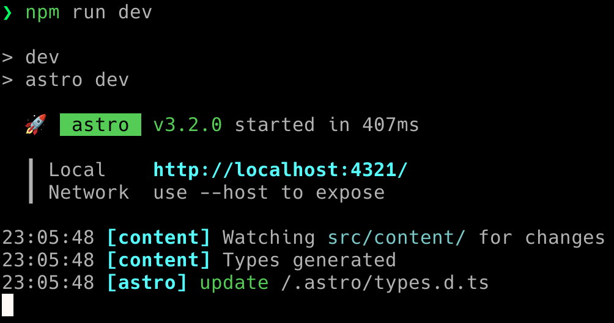

僕のホームページ兼ブログ([ryota2357.com](https://ryota2357.com/))を Gatsby.js から Astro.js に移行した。

Gatsby に特段不満を持っていたわけではないのだが、少し前から Astro に興味があった。
Astro.js v1, v2 の頃は、後述するが、blog コンテンツの管理が少し機能不十分だなと感じていて移行していなかった。v3 が先日リリースされ確認したところ色々改善されていてとても良さそうだったので移行してみた。

移行した感想と、移行に際していくつか残しておきたい技術的点があるので書く。

## 移行した感想

移行して非常に良かったなと感じている。

一番良かったと感じる点はローカルでのビルド速度である。
Gatsby では `npm run develop` の際、GraphQL のクエリとか色々走って遅くはないが時間がかかっていた。Astro は爆速である。`npm run dev` して 1 秒も経たずローカルサーバーが建ち表示の確認ができる。とても良い。



また、これは良い点であり悪い点でもあるのだが、Astro は設定項目が少く、カスタマイズ性が高くはなかった。
Astro セットアップや初期構築は Gatsby よりはるかに簡単かつ素早く行えるし、変なことをしなければ目的とする web ページを簡単に構築できる。
しかし、Gatsby のような GraphQL を用いて色々ゴニョゴニョしたり gatsby-node をいじくり回したりというようなことは Astro で行うには少し苦労すると思われる。これはプラグインシステムを採用した Gatsby の利点であったのだろう。

Astro は非常に多くの機能が標準で搭載されており、インテグレーションも充実している。
僕のホームページ・ブログでは複雑なことはしていなかったので非常に快適に Astro でサイトを構築できた。

## v3で移行した理由

先ほど「blog コンテンツの管理が少し機能不十分」と書いたがこれは v2 の ContentCollection、v3 での画像の取り扱いの強化で僕が欲しかった機能は全て揃ったので移行した。

v2 の ContentCollection に関してはここでは省略する、これがないと Astro.glob で頑張る感じとなり結構しんどい。

v3 での画像の取り扱いの強化については、Astro は v2 までは markdown ファイル内での画像の相対パスでの指定が標準では出来なかった。(もしかしたら v2 の後半では出来たのかもだけど)

[RFC: Support Markdown images relative path (withastro/roadmap#376)](https://github.com/withastro/roadmap/discussions/376)

これは A plan for a core image story という issue に挙げられていた proposal の 1 つであり、これが merge されないと Astro 移行は出来ないなと思っていた。

v3 になってこの issue を見に来てみればいつの間にか final stage まで挙げられて merge されていた。

[RFC: A plan for a core image story (withastro/roadmap#500)](https://github.com/withastro/roadmap/pull/500)

おー、これは移行できるぞ！と思い移行した次第である。

## tsxからastroへの書き換え

ここからは技術的点について書いていく。

まずはコンポーネントや各ページの tsx から astro への書き換えであるが、これは躓くことなくサクッと行えた。

`pnpm astro add tailwind` で tailwind を入れて、tsx のコンポーネントの `className` を `class` に変えたら完成って感じだった。

scss は `pnpm install sass` するだけで `<style lang="scss">` が使えるようになりとても良かった。

あと、パス文字列操作を自分でやるのに抵抗があったので、`import path from "path";` が astro ファイルでできるのが嬉しかった。
（これに関しては僕の Gatsby の設定の問題な可能性があるが..）

## ContentCollection について

僕はブログを `blog/2023/blog-slug/index.md` に本文を、`blog/2023/blog-slug/some-image.png` に画像を置いて管理している。
先ほど、v3 で移行した理由で markdown ファイル内での画像の相対パスが....と言っていたのはこれが理由である。

あと、僕は[ryota2357.com/works](https://ryota2357.com/works/)に作ったものを書いてあるのだが、これのデータも `works/game/index.yaml` に文字情報や画像へのパスを、`works/game/some-image.gif` のように画像を配置している。

Astro では ContetCollection でこれら全てを簡単に収集 + 型付け(schema)まで行えた。

僕の執筆現在の `src/content/config.ts` は次のようになっている。

```ts
import { z, defineCollection } from "astro:content";

const blogCollection = defineCollection({
  type: "content",
  schema: z.object({
    title: z.string(),
    postdate: z.coerce.date(),
    update: z.coerce.date(),
    tags: z.array(z.string()),
  }),
});

const worksCollection = defineCollection({
  type: "data",
  schema: ({ image }) =>
    z.object({
      name: z.string(),
      data: z.array(
        z.object({
          title: z.string(),
          description: z.string(),
          url: z.string().url(),
          image: image(),
          created: z.coerce.date(),
          update: z.coerce.date(),
        }),
      ),
    }),
});

export const collections = {
  blog: blogCollection,
  works: worksCollection,
};
```

zod なので、`z.coerce.date()` で文字列を Date オブジェクトに変換できるため astro ファイル内で `new Date` する必要がなくなり快適である。

また、画像のパスを解決したいときは `worksCollection` で行っているように `schema` に `({ image }) => ...` のように関数を渡してあげれば勝手に最適化まで行ってくれる。素晴らしい。

### シンボリックリンク

1 つ残念なことなのだが、`src/content` をシンボリックリンクとするとエラーが発生する。

`src/content` をシンボリックリンクとしたい理由は、Gatsby のように `content` ディレクトリを `src` に置かず（`src/content/` とせず）、`src` と同列に置きたいからである。

Astro の ContentCollection は `src/content` に対してのみ使うことができる（というか、`src/content` に置いたものを ContentCollection で扱える）。
けど、何となくブログ等のコンテンツを src 下に起きたくなかったので、`src/content` をシンボリックリンクとしたかったのである。

この問題はすでに issue として上がっている。

[UnknownContentCollectionError when Soft Links Used in Content Collections (withastro/astro#8262)](https://github.com/withastro/astro/issues/8262)

これは Astro の問題ではなく、Vite の問題のようである。

## ページの末尾スラッシュの取り扱い

Astro のデフォルト設定では URL の末尾スラッシュ(trailing slash)の有無は無視することとなっている。
そのためローカルでの開発(`npm run dev` や `npm run preview` ) では、例えば localhost:4321/blog と localhost:4321/blog/ では同一のページを表示する。

**TODO: 文章修正**

この末尾スラッシュの取り扱いは、使用するホスティングサービスごとに対応が異なり、少しめんどくさい。
Gatsby の時は gh-pages プラグインをしようしていたため Github Pages の挙動と同様の末尾スラッシュの取り扱いを `npm run develop` などのローカル開発でも行ってくれていた。しかし Astro では gh-pages プラグインに相当するものがないため、何からの方法でローカルとデプロイ先での挙動の統一や整理する必要がある。

なお、末尾スラッシュについては config の trailingSlash オプションで変更可能である。

> #### trailingSlash
>
> Type: `'always' | 'never' | 'ignore'`  
> Default: `'ignore'`
>
> - `'always'` - Only match URLs that include a trailing slash (ex: “/foo/“)
> - `'never'` - Never match URLs that include a trailing slash (ex: “/foo”)
> - `'ignore`' - Match URLs regardless of whether a trailing ”/” exists
>
> [https://docs.astro.build/en/reference/configuration-reference/#trailingslash](https://docs.astro.build/en/reference/configuration-reference/#trailingslash)

各ホスティングサービスがどのように末尾スラッシュを取り扱っているかは [slorber/trailing-slash-guide](https://github.com/slorber/trailing-slash-guide/) でまとめてくれている方がいた。

Github Pages は次のように末尾スラッシュを扱うようである。

**TODO: gh-pagesの表を貼る**

### 対応する

ホスティングサービスごとに末尾スラッシュの挙動を確認して対応するのは面倒である。 [slorber/trailing-slash-guide/docs/Solutions.md](https://github.com/slorber/trailing-slash-guide/blob/main/docs/Solutions.md) に解決策がいくつか提示されていた。

Astro で末尾スラッシュリダイレクトの方法がわからないし、Github Pages では末尾スラッシュの取り扱い方法変更の設定がないので、「Post-process your static site generator output before deployment」の対応をとった。`/foo/index.html` があったら、そのコピーを `/foo.html` に作成する、という方法である。

package.json の script では任意のスクリプトの実行の前後に hook してコマンドを実行する仕組みが用意されている。なので `npm run build` に post hook で実行すれば良い。

package.json の scripts に `postbuild` という項目を追加する。`postbuild` は `build` が終わったら自動的に実行される。

**TODO: pnpm では postbuild 動かないことを追記**

```json
{
  ...
  "scripts": {
    ...
    "build": "astro build",
    "postbuild": "sh ./util/generate_simple_html_files.sh",
  },
...
```

`./util/generate_simple_html_files.sh` は次の通りである。  
このシェルスクリプトは Deno が使えるかどうか確認し、使えるなら、`./util/generate_simple_html_files/main.ts` を実行する。

```sh
#!/bin/sh

if type deno > /dev/null 2>&1; then
    cd "$(dirname "$0")/generate_simple_html_files" || exit 1
    deno run --allow-read --allow-write main.ts
else
    echo "deno is not installed."
    exit 1
fi
```

`./util/generate_simple_html_files/main.ts` は次の通りである。

```ts
import {
  copy,
  exists,
  expandGlob,
} from "https://deno.land/std@0.203.0/fs/mod.ts";
import { dirname, join } from "https://deno.land/std@0.203.0/path/mod.ts";

// /myPath/index.html => /myPath.html
async function generateSimpleHtmlFiles(outDir: URL) {
  const pattern = join(outDir.pathname, "/**/index.html");

  const fileEntries = [];
  for await (const entry of expandGlob(pattern)) {
    if (dirname(entry.path) === outDir.pathname) {
      continue;
    }
    fileEntries.push(entry);
  }

  await Promise.all(
    fileEntries.map(async (entry) => {
      if (entry.isDirectory || entry.isSymlink) {
        return;
      }
      const copyPath = `${dirname(entry.path)}.html`;
      if (await exists(copyPath)) {
        const yellow = "\u001b[33m";
        const reset = "\u001b[0m";
        console.warn(
          [
            `${yellow}[WARN: generate_simple_html_files]${reset}`,
            `Skip generatimg because the file already exists: ${copyPath}`,
          ].join(" "),
        );
        return;
      }
      await copy(entry.path, copyPath);
    }),
  );
}

await generateSimpleHtmlFiles(new URL(import.meta.resolve("./../../dist")));
```

これで、ローカルとデプロイ先とで挙動を揃えることができた。

### canonicalURL

末尾スラッシュ対応にて、同一のページが複数（2 つ）存在することとなってしまった。
なので、どちらが正規のページとするか指定する必要が出てきた。つまり canonicalURL を設定する必要がある。

末尾スラッシュ付きを正規の URL として指定することとした。

末尾スラッシュ付きの URL は次のコードで生成できる。([withastro/docs, src/layouts/BaseLayout.astro#L29](https://github.com/withastro/docs/blob/5ade626f3ed6f429f45ddde9c833e91c41c5c4bf/src/layouts/BaseLayout.astro#L29) より)

```ts
const canonicalURL = new URL(
  Astro.url.pathname.replace(/([^/])$/, "$1/"),
  Astro.site,
);
```

これを Layout コンポーネント等で指定すれば良い。

```tsx
<link rel="canonical" href={canonicalURL} />
```

### Markdown内の相対パス

この末尾スラッシュの問題は ContentCollection ブログ Markdown 内での相対パスにも影響がある。

例として次のようにブログコンテンツが配置されてあったとしよう。

```
src/blog/
  ├── blog-slug-1
  │   └── index.md
  └── blog-slug-2
      ├── index.md
      └── image.png
```

ここで、`blog-slug-2/index.md` の内容が次であったとする。

<!-- prettier-ignore -->
```md
<!-- ① -->


<!-- ② -->


<!-- ③ -->
これは[blog-slug-1への相対パス](../blog-slug-1/)

<!-- ④ -->
これは[末尾スラッシュのないblog-slug-1への相対パス](../blog-slug-1)
```

Gatsby ではどれも期待通りのリンクに変換される。しかし Astro では Gatsby と異なる挙動を示す。

①は期待通り画像（最適化済み、img タグ）に変換される。しかし②は無効なリンクとなってしまう。②は Astro が内部で適切にリンクを展開できないようだ。僕の既存のブログ Markdown には②の形式で画像リンクしているものが 71 ヶ所あった（git のコミット差分より）。

②への対応は ripgrep を使って一括で変換した。

```sh
$ rg '^!\[.*]\(\w' -l | xargs sed -i '' -e 's/^!\[\(.*\)\](\(.*\))//'
```

そして③、④についてだが、これは単純に `<a href="../blog-slug-1">...</a>`、`<a href="../blog-slug-2/">...</a>` に変換されるため期待通りページ移動しない場合が発生してしまう。

例えば `/blog/blog-slug-2/` にいる時、③のリンクを踏むと `/blog/blog-slug-1/` へ正しく飛んでくれる。
しかし `/blog/blog-slug-2` (末尾スラッシュがないページ)にいる時、③のリンクを踏むと `/blog-slug-1/` となってしまう。  
④のリンクを使用した場合も同様に、意図しないページに移動する場合が考えられる。

これを解決するため、remark を拡張（remark プラグインを作成する）して、ページ間の相対パスのリンクを絶対パスに置き換えることとした。

次のコードを `plugins/remark-resolve-relative-page-link.ts` に書いて、

```ts
import type { Node } from "unist";
import { VFile } from "vfile";
import { CONTINUE, visit } from "unist-util-visit";
import { convert, type Check } from "unist-util-is";
import { ensure, is } from "unknownutil";
import path from "path";

type Option = {
  rootDirName: string;
};

export default function resolveRelativePageLink(option: Option) {
  const isRelativePageLink: Check = (node) => {
    const isLink = convert("link");
    if (isLink(node) && "url" in node) {
      const url = ensure(node.url, is.String);
      return url.startsWith("../") && path.extname(url) === "";
    }
    return false;
  };

  return (tree: Node, vfile: VFile) => {
    const rootPath = (() => {
      const currentFileDir = vfile.history.at(-1)?.split(path.sep).slice(0, -1);
      if (!currentFileDir) {
        throw new Error("vfile.history is empty");
      }
      const lastIndex = currentFileDir.lastIndexOf(option.rootDirName);
      if (lastIndex === -1) {
        const yellow = "\u001b[33m";
        const reset = "\u001b[0m";
        console.warn(
          [
            `${yellow}[WARN: remark-resolve-relative-page-link]${reset}`,
            `option.rootDirName: '${option.rootDirName}' is not found.`,
            `(${path.join("/", ...currentFileDir, "/")})`,
          ].join(" "),
        );
        return undefined;
      }
      return path.join(...currentFileDir.slice(lastIndex));
    })();

    if (!rootPath) {
      return;
    }

    visit(tree, isRelativePageLink, (node) => {
      if (!("url" in node)) return CONTINUE;
      node.url = path.join(
        path.resolve("/", rootPath, node.url as string),
        "/",
      );
      return CONTINUE;
    });
  };
}
```

`astro.config.ts` で読み込ませる。

```ts
import { defineConfig } from "astro/config";

import remarkResolveRelativePageLink from "./plugins/remark-resolve-relative-page-link";

export default defineConfig({
  // ..省略
  markdown: {
    // ..省略
    remarkPlugins: [[remarkResolveRelativePageLink, { rootDirName: "blog" }]],
  },
});
```

これで③、④は両方とも `<a href="/blog/blog-slug-1/">...</a>` へ変換されるようになり、問題を解決できた。
