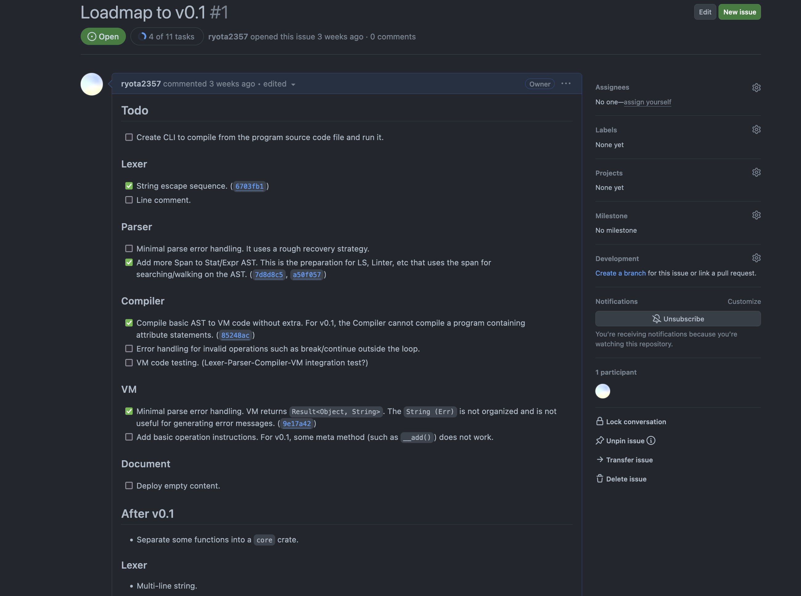
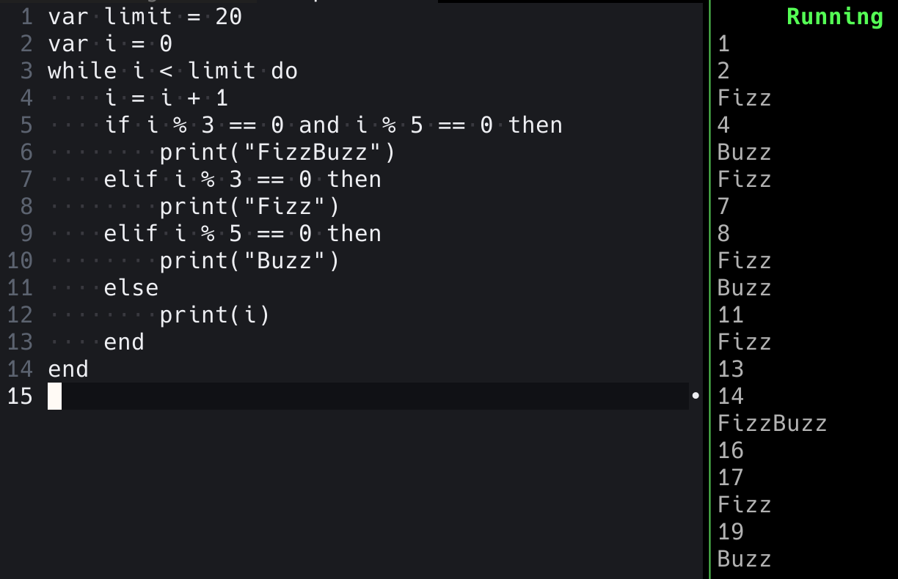

> これは MMA 部誌 2023 秋 に投稿した内容です。

こんにちは。2 年の ryota2357 です。

最近 Rust でプログラミング言語を作ってます。

今回の部誌で、その作ってるプログラミング言語について書きたかったのですが、あまりにも開発が遅れていて「こんな言語作ってるよー」って言えるものがありません。
そこで、「こんなこと頑張ってるよー」ってことを書きます。

## はじめに

タイトルに書いた通り僕は「プログラミング言語初心者」です。

「プログラミング言語初心者　#とは」って感じですが、意味は「何かの言語の仕様を詳しく知っている」や「色んな言語の特徴を知っていて書いたことがある」とか、そうゆうプログラミング言語への理解が少ない、と言う意味で僕が勝手につけました。

<!-- textlint-disable ja-technical-writing/max-comma -->

僕が書いたことある言語（1 ヶ月以上の何かの開発・学習等で利用した）は「C, C++, C#, Dart, JavaScript, Lua, Python, Rust, Swift, TypeScript, Vim script」だけです。
その中でも最低限は使えると自分で思ってるのは C#だけで、これも Unity で長く使ってたからと言うかなり限定された理由です。
(Swift 至っては本当に一瞬書いてただけってレベルだし...)

<!-- textlint-enable ja-technical-writing/max-comma -->

さて、この言語の並びから気がついた方もいるかと思いますが、僕は関数型言語に触れたことがありません。
ちょっとこれは僕自身もどうなのかな？と思っていて、ちょくちょく F#を見たりしてはいるのですが、全く馴染めてません。
なので、現在開発している言語も関数型言語ではなく、手続き型言語です。

あと僕は型とか良くわからない（TypeScript とか雰囲気で書いてる）ので、型推論を最悪しなくても良い動的型付け言語を作ってます。

さて、そろそろ本題に入りましょうか。ここからは、この僕レベルの初心者がプログラミング言語を作るとどうなるのか、何をしてるのか、を書いていこうと思います。

## 作り始める前に

自作のプログラミング言語で書かれたスクリプト(テキストファイル)はどうやったら動くのか、そもそも僕はここからあんまり良く分かってませんでした。

<small>
(僕) なんかTokenにしてー、良くわからん木構造にいい感じにしてー（ASTって言うんでしょ、聞いたことあるよ！）、その木をいい感じにコンパイルなりしてー...
</small>

これに関して僕は非常に運がよかったです。

僕はたまたまちょうど、「正規表現エンジンって DFA っていうオートマトンで作れてね...」って話を 1 年の後期くらいで教えてくれた先輩がいました(mado さんありがとう)。
それで、僕は正規表現エンジン作ってみたいなーと思ってました。そして今年の 5 月に作りました。

これがまず、初期段階においていい経験となりました。

この時作った DFA 型正規表現エンジンの実装では、Lexer と Parser も書きました。(Lexer はエスケープ処理のみ、Parser は再帰降下法と言う非常にシンプルなもの)
これらを書いて、あれ、「意外と構文木作るのって簡単なのでは？」ってなりプログラミング言語を作る上で直近にあった難しさをだいぶ感じなくなってました。

<small>
あと、時期は忘れてしまったけど、madoさん(さっきも出てきたね)にchumskyって言うパーサーコンビネーターを紹介してもらって、意外とできそう！？なんて思ったりもしてた。
</small>

[シンプルなDFA型の正規表現エンジンをRustで作成する #0](../dfa-regex-with-rust-0)

ちなみに、この正規表現エンジンは僕が初めて Rust で自分で実装したプロジェクトとなりました。

## 開発

開発記録を雑に書きます。

### 〜3ヶ月前

何はともあれ、プログラミング言語作ってみようと適当に chumsky（Rust 製のパーサーコンビネーター）をいじり回し始めました。

もう、ここには書ききれない苦労がありました。

そもそも Rust を僕は良く分かってなくて、「trait？、C#の interface みたいなものか...」「スライス？、C#の Span<\T>みたいなやつね」「所有権？、C++で move とかあったね」みたいに雑な思考で書いていたのでずっとコンパイラに怒られまくってました。

Lexer、Parser、構文木の直接実行機（これは結局使いませんでした）、VM（Compiler で独自の VM コード列吐いてそれを読む）、を色んな方法で作っては、「この実装じゃだめだ。1 からやり直し！」を繰り返してました。（どれも 5 回以上...）

<small>
ちなみに少し後のことなのですが、Compiler は作り直し 0 回でできました。これは VM の実装のために人間 Compiler やってたからです...
</small>

そろそろ作り方決まったかな？と言うタイミングで GitHub にリポジトリを作りました。

[**https://github.com/ryota2357/lico**](https://github.com/ryota2357/lico)

現状名前は「Lico」と名付けてます。名前の由来は書きませんが、3〜4 文字で 2 音と言う制約の元で考えました。

### 〜1ヶ月前

作り方決まったはずだったのにちょっと難航して、1 ヶ月前くらいにやっと、最低限動く何かが見え始めました。

僕は最低限動くものができたらそれを v0.1 として「できた！」って言おうと決めています。（そうじゃないと永遠に完成しないので）

そこで v0.1 までの TODO と v0.1 まではやらないこと書き出しました。

### 〜2週間前

FizzBuzz が動きました！

もう、なんかめっちゃ嬉しかったです。
こんな素人でも動くプログラミング言語が作れるのか！ってなりました。

この FizzBuzz ですが見ての通り while 文で実装されてます。今まさに for 文でかけるように VM 側に実装を色々足してます。

あと、少しだけこの言語の仕様に触れると、この言語は Lua に大きく影響された言語です。関数などのインターフェースは C#や Ruby に影響されたものとなる予定です。内部実装（VM の実装）は高レベルな機能を持ったスタックマシーンベースの何か、と言う感じです。

これ以降の開発の記録は僕の「しずかなインターネット」に流していく予定なので、気になった人は Lico のリポジトリと「しずかなインターネット」見てもらえたらな、と思います。

## 感想？

いやー、Rust っていい言語だな、と言うのをプログラミング言語作って、しみじみ感じています。

<!-- textlint-disable ja-technical-writing/sentence-length-->

Rust で作ると設計をだいぶ考えさせられます。これは僕がオブジェクト指向な方針を取りやすいと言うのもあって本当に大変でした。
クラスやインターフェースを用いた抽象化は直感的で雑に作れるのですが（もちろん綺麗な設計は難しいけど、規模が小さいうちは少し雑でも良さげな感じになる）、Rust でそれをやると Clone なり dyn なりが大量に出てきたり、そもそも実現不能（ライフタイム制約）だったりして色々な実装方法を試しては失敗してを繰り返しました。

<!-- textlint-enable ja-technical-writing/sentence-length-->

まだまだこのプログラミング言語 Lico の開発は初期段階です。これからも開発は長く続きます。また何かの機会で僕の言語について紹介できたらいいなと思っています。

最後に、ここまで読んでくださりありがとうございました。
