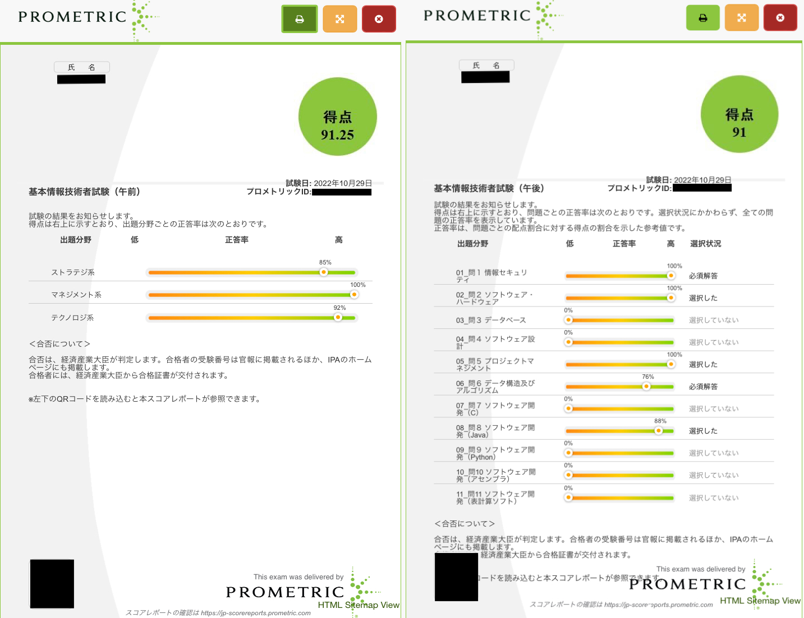
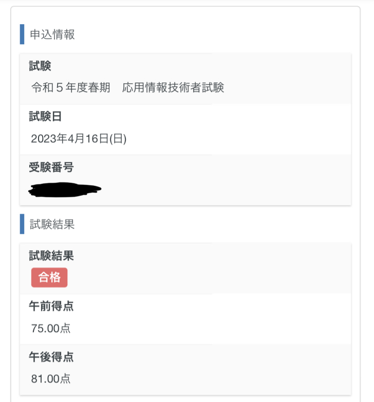

<!-- textlint-disable ja-technical-writing/max-kanji-continuous-len -->

基本情報技術者試験（2022 年秋）に合格した。
応用情報技術者試験（2023 年春）に合格した。

ちょっと時間が空いてしまったのだけど、FE・AP に合格したの少し書いておこうと思う。

## FE (基本情報)

午前 91.25 点、午後 91 点だった。

### 勉強

参考書は「イメージ&クレバー方式でよくわかる栢木先生の基本情報技術者教室」を使った。

勉強開始は試験日から 1 ヶ月半前くらいからだった。

最初は本(参考書)を 1 日 1 章のペースで読んでいった。勉強時間は 1 日あたり 2〜3 時間だった。
適宜前日や数日前の範囲を読むのもやって 15 日くらいで本を読み切った。

本を読んでる時は過去問道場などで過去問演習は行わなかった。
本に問題がついているのでそれを 4 割くらいやってた。読んで、調べて、理解することに集中した。

本を読みきったらなんか少し満足してしまって一週間くらい勉強してなかった。

その後は過去問道場で午前問題を解いた。
試験 6, 7 回分を解いた。そのうち半分くらいは 2 周してるので、
結構な量の問題を解いていたと思う。

午後は 3 回分くらいやった。試験日 5 日前くらいから始めた。

### 試験の感想

過去問からの出題が多くて、結構サクサク解けた。

確か、午前は 60 分で、午後は 90 分くらいで問題 1 週時終わった（わからなくて飛ばしたところあり）。
あまりにも早く 1 週終わってしまってびっくりした記憶がある。

午前午後両方で試験時間 30 分くらい残して退出した。

> なんか令和5年(2023年)から試験が科目A・Bになって試験時間も短くなったみたいだけど、僕の時(令和4年)は午前午後それぞれ150分だった。

## AP (応用情報)

午前 75 点、午後 81 点だった。

### 勉強

参考書は「応用情報技術者合格教本」を使った。

勉強期間は試験日から 2 週間前くらいからだった。

4 月入ってから勉強を始めた。3 月までは別のことで時間が取られていて勉強する時間が取れていなかった。

本(参考書)を結構急いで読んだ。
FE の頃の記憶があったので多少は早く読めたけど、量が多くて大変だった。
勉強時間は FE の時と同様、1 日あたり 2〜3 時間だった。

けど流石に勉強開始が遅くて、過去問演習は午前 3 回分（1 周のみ）で、午後に関しては 1 回分。
その 1 回分も解いたのは 3 問で他は「見た」だけだった。

### 試験の感想

午前は終わった時「ギリギリだなー」って思ったけど落ちた感じはなかった。「あれ？意外と FE の知識＋αでどうにかなったな」という感想だった。

午後は 8 割越えとそこそこ良い点数なのだが、これは問題に救われた感じがあった。

午後の選択は「問 3 プログラミング」「問 4 システムアーキテクチャ」「問 7 組み込みシステム開発」「問 8 情報システム開発」を選んだ。

プログラミングは「競プロ力」で時間は少しかかったけど、すんなり解けた。
情報システム開発は「Git 知ってますか？」な問題ですぐ終わった。

他もそんなに難しい、という訳ではなく、わからないなーというところももちろんあったが、最後まで解くことができた。

## 最後に

FE・AP ともに 1 回で合格できてよかった。

IT 周りの基本知識を浅くしれた感じがして、勉強は楽しかった。

もうだいぶ勉強した内容を忘れてきている気がするけど、大学の授業で FE・AP の勉強でやったことが出てきたりして、その時に付近を復習したりしてる。
1 度ある程度やったことを再度勉強する(思い出す)のは初めて勉強するよりだいぶ楽なことなので、FE・AP を通じて基礎・基本知識を学べたのはよかったなと感じている。
