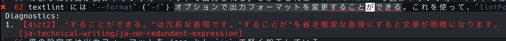

> この記事は [Vim 駅伝](https://vim-jp.org/ekiden/) 2023-09-29 の記事です。

2 ヶ月ほど前、自分のブログ記事を textlint で lint することにした。

lint エラーを neovim からもリアルタイムで確認したいので textlint の結果を Diagnostic に流したいと思った。
最も最初に出てきたのは null-ls だったのだが、残念ながら当時ちょうど null-ls のメンテ終了がアナウンスされた頃だったので他の方法を取る必要があった。そこで efm-langserver を使うこととした。

efm-langserver は過去の Vim 駅伝でも紹介されている: [null-ls.nvimがアーカイブされちゃったので移行先としてefm-langserver(+nvim-lsp)を検討してみる)](https://zenn.dev/koralle/articles/c7f20d24904fa1)

## 設定

efm-langserver は Mason を使ってインストールした。
textlint は npx を使う。

efm-langserver の設定は、nvim-lsp を使用する場合、config.yaml を配置する必要はない。
nvim-lsp の `setup()` で設定すれば、ちゃんと適用され動作する。

markdown で textlint を動作させるには `require('lspconfig').efm.setup()` に次のテーブルを渡した。

```lua
{
    init_options = { documentFormatting = true },
    single_file_support = true,
    filetypes = { 'markdown' },
    settings = {
        rootMarkers = { ".git/" },
        languages = {
            markdown = { {
                lintIgnoreExitCode = true,
                lintCommand = [[npx textlint -f json ${INPUT} | jq -r '.[] | .filePath as $filePath | .messages[] | "1;\($filePath):\(.line):\(.column):\n2;\(.message | split("\n")[0])\n3;[\(.ruleId)]"']],
                lintFormats = { '%E1;%E%f:%l:%c:', '%C2;%m', '%C3;%m%Z' },
            } }

        }
    }
}
```

`settings.languages.markdown` には **配列** を渡さなければならない。
lua だとテーブルを渡しがちなので注意が必要である。

### lintCommand と lintFormats

`settings.languages.markdown.lintCommand` と `settings.languages.markdown.lintFormats` について。

efm-langserver は `lintcommand` で指定されたコマンドを実行し、その標準出力を `lintFormats` に従って解析し、Diagnostic に流す。
なお、`lintFormats` は [`:h error-file-format`](https://vim-jp.org/vimdoc-en/quickfix.html#error-file-format)の構文が使えるようである。

`lintcommand` についてなのだが、単に textlint を実行すると、


のように人間が読みやすいフォーマットで出力される。しかしこれは `lintFormats` で読みやすいフォーマットではない。
textlint には `--format` (`-f`) オプションで出力フォーマットを変更できる。これを使って、`lintFormats` で読みやすいフォーマットにする。

手軽に `lintFormats` で読みやすいフォーマットにするならば `unix` を指定すると良い。仮に `unix` とした場合は `lintFormats` を `'%f:%l%c: %m'` とすると良いであろう。

僕の設定では出力フォーマットを json とし `jq` で軽く加工している。
ちなみに `lintCommand` を実行すると次のような出力が得られる。（`${INPUT}` は適当なファイルパスに変更して実行）

```txt
1;/Users/*略*/blog/2023/textlint-with-efm-nvimlsp/index.md:62:48:
2;【dict2】 "することができる。"は冗長な表現です。"することが"を省き簡潔な表現にすると文章が明瞭になります。
3;[ja-technical-writing/ja-no-redundant-expression]
```

この出力は複数行で 1 つのエラー内容となっているが、[`:h errorformat-multi-line`](https://vim-jp.org/vimdoc-en/quickfix.html#errorformat-multi-line) の構文を使うことで複数行を 1 つのエラーとして扱えるよう設定できる。

エディタ上の表示は次のようになる。



### lintIgnoreExitCode

`settings.languages.markdown.lintIgnoreExitCode` について。

efm-langserver は `lintCommand` の終了コードが 0 だと「エラーなし」として lint 結果を破棄するようである。

textlint はエラーがある時は 0 以外、ないときは 0 を返してくれるので問題ないのだが、jq を通してしまうと 0 になってしまう。
`lintIgnoreExitCode = true` とすることで終了コードが 0 でも lint 結果を表示してくれるようになる。

## 最後に

- efm-langserver の設定は、コマンドの実行(`lintCommand`)と、その実行結果のフォーマットを指定する(`lintFormats`)、というシンプルなものだけでいい感じにエラーを表示してくれるのでとても良いなと思った。
- textlint の fix を CodeAction でやりたいんだけど、方法あるのかな？`textlint -f json` からは修正するための情報流れてくるからできたら良いいなとは思ったけどわからず。
