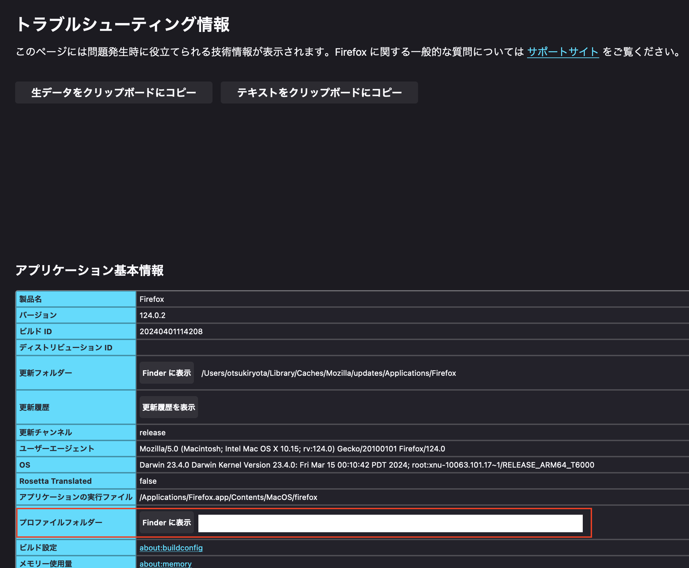

個人メモです。動作の保証はしません。MacOS 版の Firefox です。

まず、`about:config` より `toolkit.legacyUserProfileCustomizations.stylesheets` を true にする。


次に、`about:support` よりプロファイルフォルダーを確認し、そこを開く。



最後に、 `{プロファイルフォルダー}/chrome/userChrome.css` に次の内容を記載する。

```css
#titlebar {
  visibility: collapse !important;
}
```

以上で、こんな感じになる。


